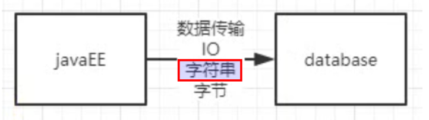
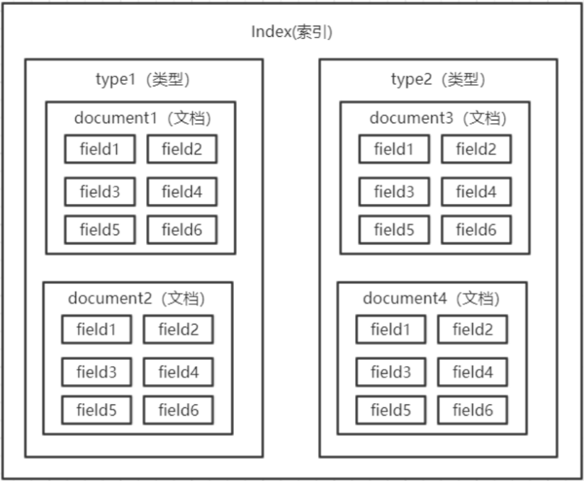

# Elasticsearch_03_ElasticSearch数据存储方式

----

## 存储方式

### 面向文档

Elasticsearch是面向文档(document oriented)的，这意味着它可以存储整个对象或文档(document)。然而它不仅仅是存储,还会索引(index)每个文档的内容使之可以被搜索。在Elasticsearch中，你可以对文档(而非成行成列的数据)进行索引、搜索、排序、过滤。这种理解数据的方式与以往完全不同，这也是Elasticsearch能够执行复杂的全文搜索的原因之一。

### JSON

ELasticsearch使用Javascript对象符号(JavaScript Object Notation),`也就是JSON,作为文档序列化格式`。JSON现在已经被大多语言所支持，而且已经成为NoSQL领域的标准格式。它简洁、简单且容易阅读。



## 存储结构

之前版本的结构



`es6.0 之后：一个索引中只有一个 type`

## 基本术语

### 文档 document

*   用户存储在 es 中的数据文档
*   元数据
    -   `_index`:文档所在索引名称
    -   `_type`:文档所在类型名称
    -   `_id`:文档唯一 id
    -   `_uid`:组合 id，由_type 和_id 组成（6.x 后，`_type` 不再起作用，同`_id`）
    -   `_source`:文档的原始 Json 数据，包括每个字段的内容
    -   `_all`:将所有字段内容整合起来，默认禁用（用于对所有字段内容检索）

某一次查询结果如下,为了理解后面的基本属于

```
{
  "took" : 8,
  "timed_out" : false,
  "_shards" : {
    "total" : 1,
    "successful" : 1,
    "skipped" : 0,
    "failed" : 0
  },
  "hits" : {
    "total" : {
      "value" : 52,
      "relation" : "eq"
    },
    "max_score" : 1.0254835,
    "hits" : [
      {
        "_index" : "bus_service_manage3",
        "_type" : "_doc",
        "_id" : "68d61ab6-d89e-473a-8557-da67d8f8c215",
        "_score" : 1.0254835,
        "_source" : {

        },
        "sort" : [
          999999,
          1.0254835,
          0,
          1643349073000
        ]
      },
      {
        "_index" : "bus_service_manage3",
        "_type" : "_doc",
        "_id" : "d8eb22d5-69ed-4ecd-81f0-d27d1acf414a",
        "_score" : 1.0254835,
        "_source" : {

        },
        "sort" : [
          999999,
          1.0254835,
          0,
          1643348929000
        ]
      }
    ]
  }
}
```

### 索引 Index

由具有相同字段的文档列表组成，用于定义字段名和字段值，一个集群elasticsearch 由多个索引组成，例如可以按照日期生成多个索引，方便数据搜索

### 类型 Type

具有相同特征文档的集合（ES6 之后一个索引中只能定义一个 type）

### 字段 Field

具有相同特性数据名称