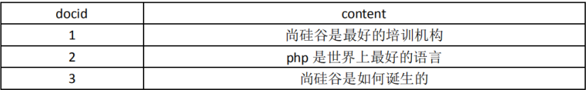

# Elasticsearch_04_ElasticSearch正排索引和倒排索引

----

## 正排索引

记录文档 Id 到文档内容、单词的关联关系



## 倒排索引

>   扩展说明
>
>   英文原名Inverted index，大概因为 Invert 有颠倒的意思，就被翻译成了倒排。
>   但是倒排这个名称很容易让人理解为从A-Z颠倒成Z-A。
>   个人认为翻译成”反向索引”可能比较合适,或者意译为”分词索引”。
>   一个未经处理的数据库中，一般是以文档ID作为索引，以文档内容作为记录。而Inverted index 指的是将单词或记录作为索引，将文档ID作为记录，这样便可以方便地通过单词或记录查找到其所在的文档

记录单词到文档 id 的关联关系，包含：

+   单词词典（Term DicTionary）：记录所有文档的单词，一般比较大
+   倒排索引（Posting List）：记录单词倒排列表的关联信息

例如：尚硅谷

1.  Term Dictionary:尚硅谷

2.  Posting List


+   DocId：文档 id，文档的原始信息
+   TF：单词频率，记录该词再文档中出现的次数，用于后续相关性算分
+   Position：位置，记录 Field 分词后，单词所在的位置，从 0 开始
+   Offset：偏移量，记录单词在文档中开始和结束位置，用于高亮显示等

## 内存结构

B+Tree


+   每个文档字段都有自己的倒排索引 (根据文档构成分倒排索引步骤如下)
    -   文档分词
    -   分词(字符串)构成B+Tree索引
    -   B+Tree在树的最底层链表有所有分词,每个分词对应一个Posting List,记录这个词在文档中的信息

## 分词

`分词是指将文本转换成一系列单词（term or token）的过程`，也可以叫做文本分析，`在 es 里面称为 Analysis`


## 分词机制

|     分词过程     |          说明          |                   举例                  |
|------------------|------------------------|-----------------------------------------|
| Character Filter | 对原始文本进行处理     | 例:去除html标签、特殊字符等             |
| Tokenizer        | 将原始文本进行分词     | 例:培训机构-->培训，机构                |
| Token Filters    | 分词后的关键字进行加工 | 例:转小写、删除语气词、近义词和同义词等 |


### Character Filters

在进行 Tokenizer 之前对原始文本进行处理，如增加、删除或替换字符等


注意：进行处理后，会影响后续 tokenizer 解析的 position 和 offset

```
POST _analyze
{
 "tokenizer": "keyword",
 "char_filter": ["html_strip"],
 "text":"<div><h1>B<sup>+</sup>Trees</h1></div>"
}

===============================================================================

{
    "tokens":[
        {
            "token":"B+Trees",
            "start_offset":0,
            "end_offset":38,
            "type":"word",
            "position":0
        }
    ]
}
```

### Tokenizer (分词)

Elasticsearch 自带的分词器

|  分词器(Analyzer)  |                  特点                  |
|--------------------|----------------------------------------|
| Standard (es 默认) | 支持多语言，按词切分并做小写处理       |
| Simple             | 按照非字母切分，小写处理               |
| Whitespace         | 按照空格来切分                         |
| Stop               | 去除语气助词，如the、an、的、这等      |
| Keyword            | 不分词                                 |
| Pattern            | 正则分词，默认\w+,即非字词符号做分割符 |
| Language           | 常见语言的分词器(30+)                  |

中文分词

| 分词器名称 |                  介绍                  |                特点                |                           地址                          |
|------------|----------------------------------------|------------------------------------|---------------------------------------------------------|
| IK         | 实现中英文单词切分                     | 自定义词库                         | https://github.com/medcl/elasticsearch-analysis-ik      |
| Jieba      | python流行分词系统，支持分词和词性标注 | 支持繁体、自定义、并行分词         | http://github.com/sing1ee/elasticsearch-jieba-plugin    |
| Hanlp      | 由一系列模型于算法组成的java工具包     | 普及自然语言处理在生产环境中的应用 | https://github.com/hankcs/HanLP                         |
| THULAC     | 清华大学中文词法分析工具包             | 具有中文分词和词性标注功能         | https://github.com/microbun/elasticsearch-thulac-plugin |


使用

```
Request:
POST _analyze
{
 "analyzer": "standard",
 "text":"hello 1111"
}

===============================================================================

Response:
{
 "tokens": [
 {
 "token": "hello", #分词
 "start_offset": 0, #开始偏移
 "end_offset": 5, #结束偏移
 "type": "<ALPHANUM>", #单词类型
 "position": 0 #位置
 },
 {
 "token": "world",
 "start_offset": 6,
 "end_offset": 11,
 "type": "<NUM>",
 "position": 1
 }
 ]
}
```

自定义分词器

```
PUT my_analyzer
{
  "settings": {
    "analysis": {
      "analyzer": {   # 主分词器
        "my": {   # 分词器名
          "tokenizer": "punctuation",
          "type": "custom",
          "char_filter": [
            "emoticons"
          ],
          "filter": [
            "lowercase",
            "english_stop"
          ]
        }
      },
      "tokenizer": {
        "punctuation": {
          "type": "pattern",
          "pattern": "[.,!?]"
        }
      },
      "char_filter": {
        "emoticons": {
          "type": "mapping",
          "mappings": [
            ":)=>_happy_",
            ":(=>_sad_"
          ]
        }
      },
      "filter": {
        "english_stop": {
          "type": "stop",
          "stopwords": "_english_"
        }
      }
    }
  }
}

===============================================================================

// 使用自定义分词器
{
  "analyzer": "my",
  "text": "l'm a :) person,and you?"
}

===============================================================================

//返回
{
  "tokens": [
    {
      "token": "l'm a _happy_ person",
      "start_offset": 0,
      "end_offset": 15,
      "type": "word",
      "position": 0
    },
    {
      "token": "and you",
      "start_offset": 16,
      "end_offset": 23,
      "type": "word",
      "position": 1
    }
  ]
}
```

### Token Filter

对输出的单词（term）进行增加、删除、修改等操作


```
POST _analyze
{
  "tokenizer": "standard",
  "text": "a Hello World",
  "filter": [
    "stop",
    "lowercase",
    {
      "type": "ngram",
      "min_gram": 3,
      "max_gram": 4
    }
  ]
}

===============================================================================

{
  "tokens": [
    {
      "token": "hel",
      "start_offset": 2,
      "end_offset": 7,
      "type": "<ALPHANUM>",
      "position": 1
    },
    {
      "token": "hell",
      "start_offset": 2,
      "end_offset": 7,
      "type": "<ALPHANUM>",
      "position": 1
    },
    {
      "token": "ell",
      "start_offset": 2,
      "end_offset": 7,
      "type": "<ALPHANUM>",
      "position": 1
    },
    {
      "token": "ello",
      "start_offset": 2,
      "end_offset": 7,
      "type": "<ALPHANUM>",
      "position": 1
    },
    {
      "token": "llo",
      "start_offset": 2,
      "end_offset": 7,
      "type": "<ALPHANUM>",
      "position": 1
    },
    {
      "token": "wor",
      "start_offset": 8,
      "end_offset": 13,
      "type": "<ALPHANUM>",
      "position": 2
    },
    {
      "token": "worl",
      "start_offset": 8,
      "end_offset": 13,
      "type": "<ALPHANUM>",
      "position": 2
    },
    {
      "token": "orl",
      "start_offset": 8,
      "end_offset": 13,
      "type": "<ALPHANUM>",
      "position": 2
    },
    {
      "token": "orld",
      "start_offset": 8,
      "end_offset": 13,
      "type": "<ALPHANUM>",
      "position": 2
    },
    {
      "token": "rld",
      "start_offset": 8,
      "end_offset": 13,
      "type": "<ALPHANUM>",
      "position": 2
    }
  ]
}
```

## 分词使用场景

### 索引时分词

创建或更新文档时，会对相应得文档进行分词(指定字段分词)

```
PUT my_test
{
  "mappings": {
    "doc": {
      "properties": {
        "title": {
          "type": "text",
          "analyzer": "whitespace"
        }
      }
    }
  }
}
```

### 查询时分词

查询时会对查询语句进行分词

```
POST my_test/_search
{
  "query": {
    "match": {
      "message": {
        "query": "hello",
        "analyzer": "standard"
      }
    }
  }
}

PUT my_test
{
  "mappings": {
    "doc": {
      "properties": {
        "title": {
          "type": "text",
          "analyzer": "whitespace",
          "search_analyzer": "standard"   #查询指定分词器
        }
      }
    }
  }
}
```

`一般不需要特别指定查询时分词器，直接使用索引时分词器即可`，否则会出现无法匹配得情况，如果不需要分词将字段 type 设置成 keyword，可以节省空间


