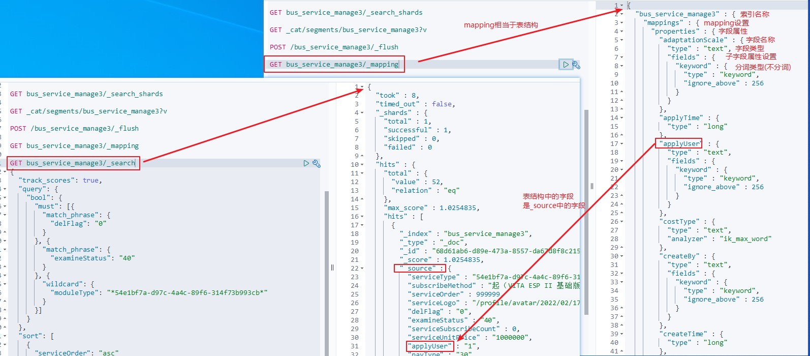

# Elasticsearch_05_Mapping

相当于表结构

---

## 作用

Mapping类似于数据库中的表结构定义，主要作用如下：

+   定义Index下字段名（Field Name）
+   定义字段的类型，比如数值型，字符串型、布尔型等
+   定义倒排索引的相关配置，比如是否索引、记录postion等

Mapping完整的内容可以分为四部分内容：

+   字段类型(Field datatypes)
+   元字段(Meta-Fields)
+   Mapping参数配置(Mapping parameters)
+   动态Mapping(Dynamic Mapping)

## 获取索引 mapping

不进行配置时，自动创建的 mapping

```
请求：
GET /atguigu/_mapping

响应：
{
  "atguigu": {  #索引名称
    "mappings": {   #mapping 设置
      "student": {  #type 名称
        "properties": { #字段属性
          "clazz": {
            "type": "text", #字段类型，字符串默认类型
            "fields": {     #子字段属性设置
              "keyword": {  #分词类型（不分词）
                "type": "keyword",
                "ignore_above": 256
              }
            }
          },
          "description": {
            "type": "text",
            "fields": {
              "keyword": {
                "type": "keyword",
                "ignore_above": 256
              }
            }
          },
          "name": {
            "type": "text",
            "fields": {
              "keyword": {
                "type": "keyword",
                "ignore_above": 256
              }
            }
          }
        }
      }
    }
  }
}
```




## 自定义 mapping

```
请求：
PUT my_index #索引名称
{
  "mappings": {
    "doc": {    #类型名称
      "dynamic": false,
      "properties": {
        "title": {
          "type": "text"    #字段类型
        },
        "name": {
          "type": "keyword"
        },
        "age": {
          "type": "integer"
        }
      }
    }
  }
}

响应：
{
  "acknowledged": true,
  "shards_acknowledged": true,
  "index": "my_index"
}
```

## Dynamic Mapping(动态映射)

es 依靠 json 文档字段类型来实现自动识别字段类型，支持的类型


| JSON类型 |                                                       es类型                                                       |
|----------|--------------------------------------------------------------------------------------------------------------------|
| null     | 忽略                                                                                                               |
| boolean  | boolean                                                                                                            |
| 浮点类型 | float                                                                                                              |
| 整数     | long                                                                                                               |
| object   | object                                                                                                             |
| array    | 由第一个非null 值的类型决定                                                                                        |
| string   | 匹配为日期则设为data类型(默认开启)；匹配为数字的话设为float或long类型(默认关闭)；设为text类型，并附带keyword的子字段 |

!>  注意：`mapping 中的字段类型一旦设定后，禁止修改`

原因：Lucene 实现的倒排索引生成后不允许修改(提高效率),如果要修改字段的类型，需要从新建立索引，然后做 reindex 操作

### dynamic 设置


### cope_to -- 将字段的值赋值到目标字段

`将字段的值赋值到目标字段`，实现类似_all 的作用

例如：

1.  创建 mapping，包含 copy_to 字段

```
PUT my_index
{
  "mappings":
  {
    "doc":
    {
      "properties":
      {
        "frist_name":
        {
          "type": "text",
          "copy_to": "full_name"
        },
        "last_name":
        {
          "type": "text",
          "copy_to": "full_name"
        },
        "full_name":
        {
          "type": "text"
        }
      }
    }
  }
}
```

2.  创建文档

```
PUT my_index/doc/1
{
  "frist_name": "John",
  "last_name": "Smith"
}
```

3.  查询文档

```
GET my_index/_search
{
  "query":
  {
    "match":
    {
      "full_name":
      {
        "query": "John Smith",
        "operator": "and"
      }
    }
  }
}
```


### Index 属性 -- 控制当前字段是否索引

Index 属性，`控制当前字段是否索引`，默认为 true，即记录索引，false 不记录，即不可以搜索，`比如：手机号、身份证号等敏感信息，不希望被检索`

例如：

1.  创建 mapping

```
PUT my_index
{
  "mappings":
  {
    "doc":
    {
      "properties":
      {
        "cookie":
        {
          "type": "text",
          "index": false
        }
      }
    }
  }
}
```

2.  创建文档

```
PUT my_index/doc/1
{
  "cookie": "123",
  "name": "home"
}
```

3.  查询

```
GET my_index/_search
{
  "query":
  {
    "match":
    {
      "cookie": "123"
    }
  }
}
#报错

GET my_index/_search
{
  "query":
  {
    "match":
    {
      "name": "home"
    }
  }
}
#有结果
```

### index_option

用于记录倒排索引记录的内容，有一下 4 种配置

1.  docs 只记录 doc id
2.  freqs 记录 docid 和 term frequencies
3.  positions 记录 docid、term frequencies 和 term position
4.  offsets 记录 docid、term frequencies、term position 和 character offsets

Text 类型默认配置为 positions，其他默认为 docs

记录的内容越多暂用的空间越大

```
PUT my_index
{
  "doc":
  {
    "properties":
    {
      "cookie":
      {
        "type": "text",
        "index_option": "offsets"
      }
    }
  }
}
```

### null_value

当字段遇到 null 值时，默认为 null，即空值，此时而社会忽略该值。可以通过设定该值

设定字段的默认值


