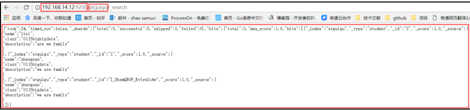
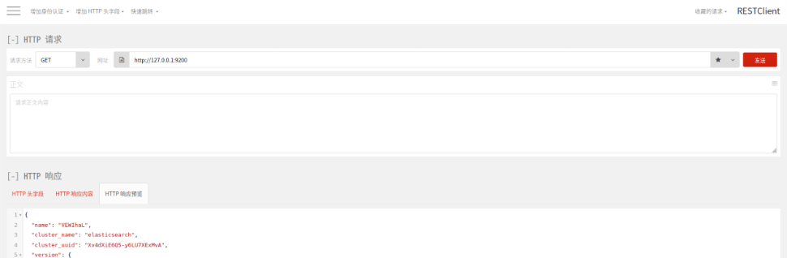
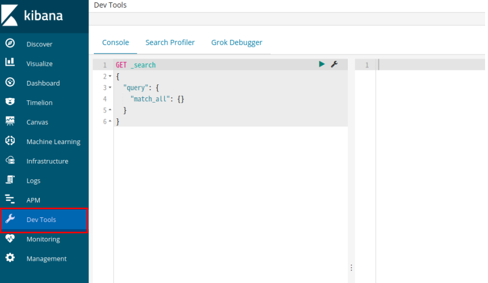
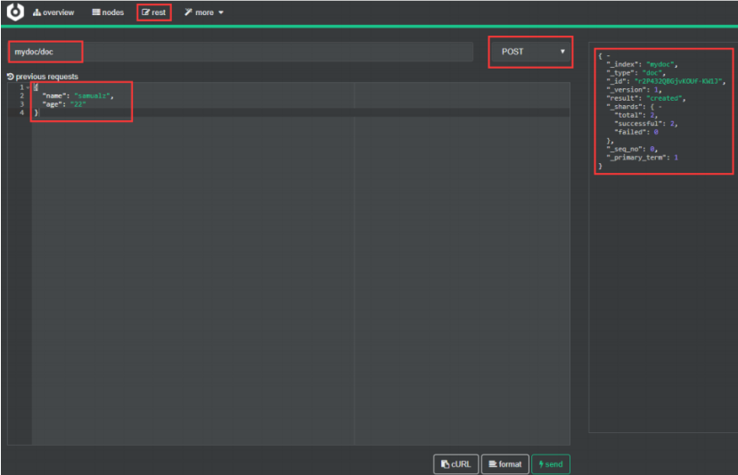

# Elasticsearch_06_Elasticsearch的RestAPI

----

## REST 访问 ES 方式

1.  浏览器（postman）



2.  firefox安装RESTClient



3.  Linux 命令行

请求：

```
[root@localcurl -XPOST 'http://192.168.14.12:9200/atguig/doc'
-i -H
"Content-Type:application/json"
-d
'{"name":"haha","age":"10"}'
```

响应：

```
HTTP/1.1 201 Created
Location: /atguig/doc/KF_t32QBxRaDZXTftAxg
content-type: application/json; charset=UTF-8
content-length: 172

{"_index":"atguig","_type":"doc","_id":"KF_t32QBxRaDZXTftAxg","_version":1,"result":
"created","_shards":{"total":2,"successful":1,"failed":0},"_seq_no":0,"_primary_term":
1}
```

4.  Kibana 的 Dev Tools



5.  Cerebro 插件




## ES 状态查看命令

语法：`ip:post/_cat/[args](?v|?format=json&pretty)`

（?v 表示显示字段说明,?format=json&pretty 表示显示成 json 格式）

1.  查看所有索引

```
GET _cat/indices?v
```

2.  查看 es 集群状态

```
GET _cat/health?v
```

3.  集群节点健康查看

```
GET _cat/nodes?v
```

4.  列出倒叙索引

```
GET _cat/segment?v
```

## 查看集群的状态

语法：`GET _cluster/(args][?v | ?format=json&pretty)`

（?v 表示显示字段说明,?format=json&pretty 表示显示成 json 格式）

## 索引操作

1.  添加
```
语法：PUT index 名称
```

2.  查看索引信息
```
语法：GET index 名称
```

3.  删除索引

```
语法：DELETE index 名称
```

4.  查看索引状态

```
语法：HEAD index 名称
语法：GET index 名称/_status
```