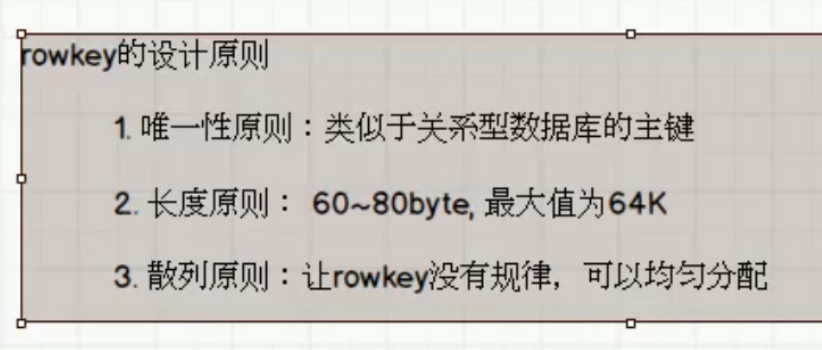
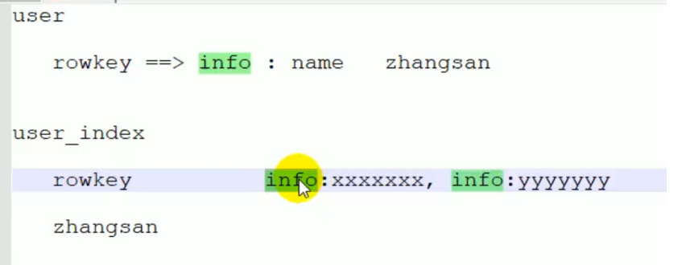

# HBase系列_09_HBase优化

----

## 高可用

在HBase中Hmaster负责监控RegionServer的生命周期，均衡RegionServer的负载，如果Hmaster挂掉了，那么整个HBase集群将陷入不健康的状态(此时仍旧能够插入数据，也就是说，Hmaster不具体管数据的插入等)，并且此时的工作状态并不会维持太久。所以HBase支持对Hmaster的高可用配置。

1.  关闭HBase集群（如果没有开启则跳过此步）

```
[atguigu@hadoop102 hbase]$ bin/stop-hbase.sh
```

2.  在conf目录下创建backup-masters文件

```
[atguigu@hadoop102 hbase]$ touch conf/backup-masters
```

3.  在backup-masters文件中配置高可用HMaster节点

```
[atguigu@hadoop102 hbase]$ echo hadoop103 > conf/backup-masters
```

4.  将整个conf目录scp到其他节点

```
[atguigu@hadoop102 hbase]$ scp -r conf/ hadoop103:/opt/module/hbase/
[atguigu@hadoop102 hbase]$ scp -r conf/ hadoop104:/opt/module/hbase/
```

5.  打开页面测试查看

http://hadooo102:16010

## 预分区

每一个region维护着startRow与endRowKey，如果加入的数据符合某个region维护的rowKey范围，则该数据交给这个region维护。那么依照这个原则，我们可以将数据所要投放的分区提前大致的规划好，以提高HBase性能。

1.  手动设定预分区

```
hbase> create 'staff1','info','partition1',SPLITS => ['1000','2000','3000','4000']
```

2.  生成16进制序列预分区

```
create 'staff2','info','partition2',{NUMREGIONS => 15, SPLITALGO => 'HexStringSplit'}
```

3.  按照文件中设置的规则预分区

创建splits.txt文件内容如下：
```
aaaa
bbbb
cccc
dddd
```
然后执行：

```
create 'staff3','partition3',SPLITS_FILE => 'splits.txt'
```

4.  使用JavaAPI创建预分区

```
//自定义算法，产生一系列Hash散列值存储在二维数组中
byte[][] splitKeys = 某个散列值函数
//创建HBaseAdmin实例
HBaseAdmin hAdmin = new HBaseAdmin(HBaseConfiguration.create());
//创建HTableDescriptor实例
HTableDescriptor tableDesc = new HTableDescriptor(tableName);
//通过HTableDescriptor实例和散列值二维数组创建带有预分区的HBase表
hAdmin.createTable(tableDesc, splitKeys);
```

## RowKey设计



一条数据的唯一标识就是rowkey，那么这条数据存储于哪个分区，取决于rowkey处于哪个一个预分区的区间内，设计rowkey的主要目的，就是让数据均匀的分布于所有的region中，在一定程度上防止数据倾斜。接下来我们就谈一谈rowkey常用的设计方案。

1.  生成随机数、hash、散列值

```
比如：
原本rowKey为1001的，SHA1后变成：dd01903921ea24941c26a48f2cec24e0bb0e8cc7
原本rowKey为3001的，SHA1后变成：49042c54de64a1e9bf0b33e00245660ef92dc7bd
原本rowKey为5001的，SHA1后变成：7b61dec07e02c188790670af43e717f0f46e8913
在做此操作之前，一般我们会选择从数据集中抽取样本，来决定什么样的rowKey来Hash后作为每个分区的临界值。
```

2.  字符串反转

```
20170524000001转成10000042507102
20170524000002转成20000042507102
这样也可以在一定程度上散列逐步put进来的数据。
```

3.  字符串拼接

```
20170524000001_a12e
20170524000001_93i7
```

## 内存优化

HBase操作过程中需要大量的内存开销，毕竟Table是可以缓存在内存中的，一般会分配整个可用内存的70%给HBase的Java堆。但是不建议分配非常大的堆内存，因为GC过程持续太久会导致RegionServer处于长期不可用状态，一般16~48G内存就可以了，如果因为框架占用内存过高导致系统内存不足，框架一样会被系统服务拖死。

## 基础优化
1.  允许在HDFS的文件中追加内容
    *   hdfs-site.xml、hbase-site.xml
    *   属性：dfs.support.append
    *   解释：开启HDFS追加同步，可以优秀的配合HBase的数据同步和持久化。默认值为true。
2.  优化DataNode允许的最大文件打开数
    *   hdfs-site.xml
    *   属性：dfs.datanode.max.transfer.threads
    *   解释：HBase一般都会同一时间操作大量的文件，根据集群的数量和规模以及数据动作，设置为4096或者更高。默认值：4096
3.  优化延迟高的数据操作的等待时间
    *   hdfs-site.xml
    *   属性：dfs.image.transfer.timeout
    *   解释：如果对于某一次数据操作来讲，延迟非常高，socket需要等待更长的时间，建议把该值设置为更大的值（默认60000毫秒），以确保socket不会被timeout掉。
4.  优化数据的写入效率
    *   mapred-site.xml
    *   属性： mapreduce.map.output.compress  mapreduce.map.output.compress.codec
    *   解释：开启这两个数据可以大大提高文件的写入效率，减少写入时间。第一个属性值修改为true，第二个属性值修改为：org.apache.hadoop.io.compress.GzipCodec或者其他压缩方式。
5.  设置RPC监听数量
    *   hbase-site.xml
    *   属性：hbase.regionserver.handler.count
    *   解释：默认值为30，用于指定RPC监听的数量，可以根据客户端的请求数进行调整，读写请求较多时，增加此值。
6.  优化HStore文件大小
    *   hbase-site.xml
    *   属性：hbase.hregion.max.filesize
    *   解释：默认值10737418240（10GB），如果需要运行HBase的MR任务，可以减小此值，因为一个region对应一个map任务，如果单个region过大，会导致map任务执行时间过长。该值的意思就是，如果HFile的大小达到这个数值，则这个region会被切分为两个Hfile。
7.  优化hbase客户端缓存
    *   hbase-site.xml
    *   属性：hbase.client.write.buffer
    *   解释：用于指定HBase客户端缓存，增大该值可以减少RPC调用次数，但是会消耗更多内存，反之则反之。一般我们需要设定一定的缓存大小，以达到减少RPC次数的目的。
8.  指定scan.next扫描HBase所获取的行数
    *   hbase-site.xml
    *   属性：hbase.client.scanner.caching
    *   解释：用于指定scan.next方法获取的默认行数，值越大，消耗内存越大。
9.  flush、compact、split机制
    *   当MemStore达到阈值，将Memstore中的数据Flush进Storefile；compact机制则是把flush出来的小文件合并成大的Storefile文件。split则是当Region达到阈值，会把过大的Region一分为二。
    *   涉及属性：
    *   即：128M就是Memstore的默认阈值
        -   hbase.hregion.memstore.flush.size：134217728
    *   即：这个参数的作用是当单个HRegion内所有的Memstore大小总和超过指定值时，flush该HRegion的所有memstore。RegionServer的flush是通过将请求添加一个队列，模拟生产消费模型来异步处理的。那这里就有一个问题，当队列来不及消费，产生大量积压请求时，可能会导致内存陡增，最坏的情况是触发OOM。
        -   hbase.regionserver.global.memstore.upperLimit：0.4
        -   hbase.regionserver.global.memstore.lowerLimit：0.38
    *   即：当MemStore使用内存总量达到hbase.regionserver.global.memstore.upperLimit指定值时，将会有多个MemStores flush到文件中，MemStore flush 顺序是按照大小降序执行的，直到刷新到MemStore使用内存略小于lowerLimit

## 将需要查询的内容变为rowkey



