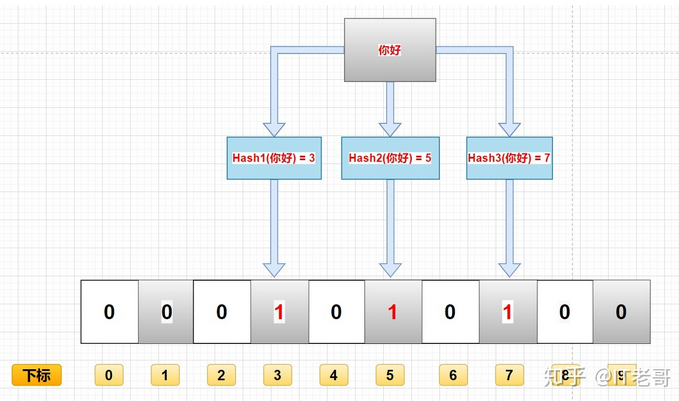

# 布隆过滤器

---

# 什么是布隆过滤器

在日常生活中，包括在设计计算机软件时，我们经常要判断一个元素是否在一个集合中。比如在字处理软件中，需要检查一个英语单词是否拼写正确（也就是要判断它是否在已知的字典中）；在 FBI，一个嫌疑人的名字是否已经在嫌疑名单上；在网络爬虫里，一个网址是否被访问过等等。最直接的方法就是将集合中全部的元素存在计算机中，遇到一个新元素时，将它和集合中的元素直接比较即可。一般来讲，计算机中的集合是用哈希表（hash table）来存储的。它的好处是快速准确，缺点是费存储空间。当集合比较小时，这个问题不显著，但是当集合巨大时，哈希表存储效率低的问题就显现出来了。比如说，一个像 Yahoo,Hotmail 和 Gmai 那样的公众电子邮件（email）提供商，总是需要过滤来自发送垃圾邮件的人（spamer）的垃圾邮件。一个办法就是记录下那些发垃圾邮件的 email 地址。由于那些发送者不停地在注册新的地址，全世界少说也有几十亿个发垃圾邮件的地址，将他们都存起来则需要大量的网络服务器。如果用哈希表，每存储一亿个 email 地址， 就需要 1.6GB 的内存（用哈希表实现的具体办法是将每一个 email 地址对应成一个八字节的信息指纹googlechinablog.com/2006/08/blog-post.html，然后将这些信息指纹存入哈希表，由于哈希表的存储效率一般只有 50%，因此一个 email 地址需要占用十六个字节。一亿个地址大约要 1.6GB， 即十六亿字节的内存）。因此存贮几十亿个邮件地址可能需要上百 GB 的内存。除非是超级计算机，一般服务器是无法存储的。

`布隆过滤器只需要哈希表 1/8 到 1/4 的大小就能解决同样的问题`。

Bloom Filter是一种空间效率很高的随机数据结构，它利用位数组很简洁地表示一个集合，并能判断一个元素是否属于这个集合。Bloom Filter的这种高效是`有一定代价的：在判断一个元素是否属于某个集合时，有可能会把不属于这个集合的元素误认为属于这个集合（false positive）`。因此，Bloom Filter`不适合那些“零错误”的应用场合`。而在能容忍低错误率的应用场合下，`Bloom Filter通过极少的错误换取了存储空间的极大节省`。

# 布隆过滤器原理

## 存入过程

布隆过滤器上面说了，就是一个二进制数据的集合。当一个数据加入这个集合时，经历如下洗礼（这里有缺点，下面会讲）：

+   通过K个哈希函数计算该数据，返回K个计算出的hash值
+   这些K个hash值映射到对应的K个二进制的数组下标
+   将K个下标对应的二进制数据改成1。

例如，第一个哈希函数返回x，第二个第三个哈希函数返回y与z，那么： X、Y、Z对应的二进制改成1。

如图所示：

## 查询过程

布隆过滤器主要作用就是查询一个数据，在不在这个二进制的集合中，查询过程如下：

+   通过K个哈希函数计算该数据，对应计算出的K个hash值
+   通过hash值找到对应的二进制的数组下标
+   判断：如果存在一处位置的二进制数据是0，那么该数据不存在。如果都是1，该数据存在集合中。（这里有缺点，下面会讲）

# 参考

+   [Bloom Filter概念和原理](http://blog.csdn.net/jiaomeng/article/details/1495500)
+   [最牛一篇布隆过滤器详解，布隆过滤器使用原理](https://zhuanlan.zhihu.com/p/264369062)