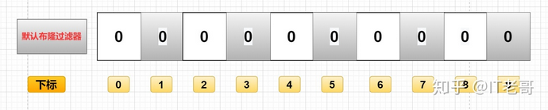
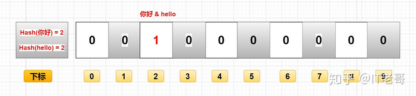
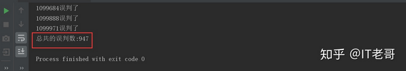
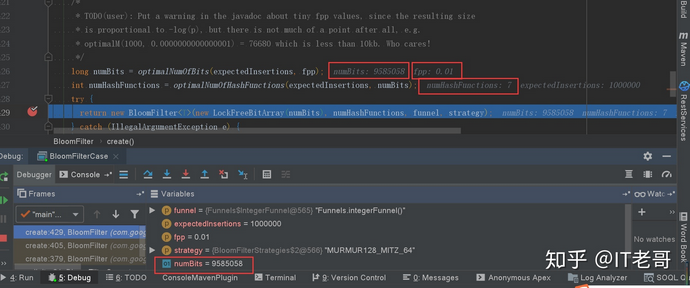
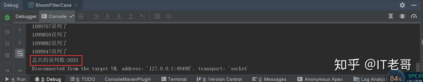
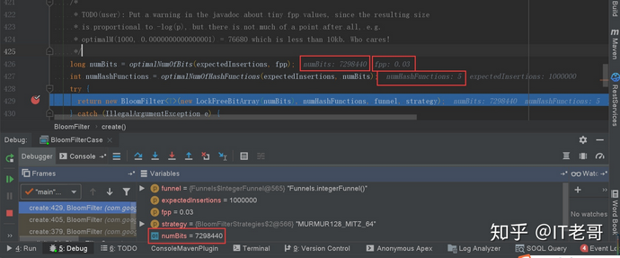

# 布隆过滤器

---

?>  使用场景:如果布隆过滤器判断出某个key存在，可能出现误判。如果判断某个key不存在，则它在数据库中一定不存在

# 什么是布隆过滤器

在日常生活中，包括在设计计算机软件时，我们经常要判断一个元素是否在一个集合中。比如在字处理软件中，需要检查一个英语单词是否拼写正确（也就是要判断它是否在已知的字典中）；在 FBI，一个嫌疑人的名字是否已经在嫌疑名单上；在网络爬虫里，一个网址是否被访问过等等。最直接的方法就是将集合中全部的元素存在计算机中，遇到一个新元素时，将它和集合中的元素直接比较即可。一般来讲，计算机中的集合是用哈希表（hash table）来存储的。它的好处是快速准确，缺点是费存储空间。当集合比较小时，这个问题不显著，但是当集合巨大时，哈希表存储效率低的问题就显现出来了。比如说，一个像 Yahoo,Hotmail 和 Gmai 那样的公众电子邮件（email）提供商，总是需要过滤来自发送垃圾邮件的人（spamer）的垃圾邮件。一个办法就是记录下那些发垃圾邮件的 email 地址。由于那些发送者不停地在注册新的地址，全世界少说也有几十亿个发垃圾邮件的地址，将他们都存起来则需要大量的网络服务器。如果用哈希表，每存储一亿个 email 地址， 就需要 1.6GB 的内存（用哈希表实现的具体办法是将每一个 email 地址对应成一个八字节的信息指纹googlechinablog.com/2006/08/blog-post.html，然后将这些信息指纹存入哈希表，由于哈希表的存储效率一般只有 50%，因此一个 email 地址需要占用十六个字节。一亿个地址大约要 1.6GB， 即十六亿字节的内存）。因此存贮几十亿个邮件地址可能需要上百 GB 的内存。除非是超级计算机，一般服务器是无法存储的。

`布隆过滤器只需要哈希表 1/8 到 1/4 的大小就能解决同样的问题`。

Bloom Filter是一种空间效率很高的随机数据结构，它利用位数组很简洁地表示一个集合，并能判断一个元素是否属于这个集合。Bloom Filter的这种高效是`有一定代价的：在判断一个元素是否属于某个集合时，有可能会把不属于这个集合的元素误认为属于这个集合（false positive）`。因此，Bloom Filter`不适合那些“零错误”的应用场合`。而在能容忍低错误率的应用场合下，`Bloom Filter通过极少的错误换取了存储空间的极大节省`。

它实际上是一个很长的二进制向量和一系列随机映射函数，二进制大家应该都清楚，存储的数据不是0就是1，默认是0。

主要用于判断一个元素是否在一个集合中，0代表不存在某个数据，1代表存在某个数据



# 布隆过滤器用途

+   解决Redis缓存穿透（今天重点讲解）
+   在爬虫时，对爬虫网址进行过滤，已经存在布隆中的网址，不在爬取。
+   垃圾邮件过滤，对每一个发送邮件的地址进行判断是否在布隆的黑名单中，如果在就判断为垃圾邮件。

以上只是简单的用途举例，大家可以举一反三，灵活运用在工作中。

# 布隆过滤器原理

## 存入过程

布隆过滤器上面说了，就是一个二进制数据的集合。当一个数据加入这个集合时，经历如下洗礼（这里有缺点，下面会讲）：

+   通过K个哈希函数计算该数据，返回K个计算出的hash值
+   这些K个hash值映射到对应的K个二进制的数组下标
+   将K个下标对应的二进制数据改成1。

例如，第一个哈希函数返回x，第二个第三个哈希函数返回y与z，那么： X、Y、Z对应的二进制改成1。

如图所示：


## 查询过程

布隆过滤器主要作用就是查询一个数据，在不在这个二进制的集合中，查询过程如下：

+   通过K个哈希函数计算该数据，对应计算出的K个hash值
+   通过hash值找到对应的二进制的数组下标
+   判断：如果存在一处位置的二进制数据是0，那么该数据不存在。如果都是1，该数据存在集合中。（这里有缺点，下面会讲）

## 删除过程

一般不能删除布隆过滤器里的数据，这是一个缺点之一，我们下面会分析。


# 布隆过滤器的优缺点

优点

+   由于存储的是二进制数据，所以占用的空间很小
+   它的插入和查询速度是非常快的，时间复杂度是O（K），可以联想一下HashMap的过程
+   保密性很好，因为本身不存储任何原始数据，只有二进制数据

缺点

这就要回到我们上面所说的那些缺点了。

添加数据是通过计算数据的hash值，那么很有可能存在这种情况：两个不同的数据计算得到相同的hash值。



例如图中的“你好”和“hello”，假如最终算出hash值相同，那么他们会将同一个下标的二进制数据改为1。

这个时候，你就不知道下标为2的二进制，到底是代表“你好”还是“hello”。

由此得出如下缺点：

## 存在误判

假如上面的图没有存"hello"，只存了"你好"，那么用"hello"来查询的时候，会判断"hello"存在集合中。

因为“你好”和“hello”的hash值是相同的，通过相同的hash值，找到的二进制数据也是一样的，都是1。

## 删除困难

还是用上面的举例，因为“你好”和“hello”的hash值相同，对应的数组下标也是一样的。

这时候老哥想去删除“你好”，将下标为2里的二进制数据，由1改成了0。

那么我们是不是连“hello”都一起删了呀。（0代表有这个数据，1代表没有这个数据）

# 实现布隆过滤器

## 使用Guava提供的实现方式
有很多种实现方式，其中一种就是Guava提供的实现方式。

一、引入Guava pom配置

```xml
<dependency>
  <groupId>com.google.guava</groupId>
  <artifactId>guava</artifactId>
  <version>29.0-jre</version>
</dependency>
```

二、代码实现

这里我们顺便测一下它的误判率。

```java
import com.google.common.hash.BloomFilter;
import com.google.common.hash.Funnels;

public class BloomFilterCase {

  /**
   * 预计要插入多少数据
   */
  private static int size = 1000000;

  /**
   * 期望的误判率
   */
  private static double fpp = 0.01;

  /**
   * 布隆过滤器
   */
  private static BloomFilter<Integer> bloomFilter = BloomFilter.create(Funnels.integerFunnel(), size, fpp);


  public static void main(String[] args) {
    // 插入10万样本数据
    for (int i = 0; i < size; i++) {
      bloomFilter.put(i);
    }

    // 用另外十万测试数据，测试误判率
    int count = 0;
    for (int i = size; i < size + 100000; i++) {
      if (bloomFilter.mightContain(i)) {
        count++;
        System.out.println(i + "误判了");
      }
    }
    System.out.println("总共的误判数:" + count);
  }
}
```

运行结果：



10万数据里有947个误判，约等于0.01%，也就是我们代码里设置的误判率：fpp = 0.01。

## 深入分析代码

核心BloomFilter.create方法

```java
@VisibleForTesting
static <T> BloomFilter<T> create(Funnel<? super T> funnel, long expectedInsertions, double fpp, Strategy strategy) {
    // ...
}
```

这里有四个参数：

+   funnel：数据类型(一般是调用Funnels工具类中的)
+   expectedInsertions：期望插入的值的个数
+   fpp：误判率(默认值为0.03)
+   strategy：哈希算法

我们重点讲一下fpp参数

## fpp误判率

情景一：fpp = 0.01

误判个数：947


占内存大小：9585058位数



情景二：fpp = 0.03（默认参数）

误判个数：3033



占内存大小：7298440位数



情景总结

+   误判率可以通过fpp参数进行调节
+   fpp越小，需要的内存空间就越大：0.01需要900多万位数，0.03需要700多万位数。
+   fpp越小，集合添加数据时，就需要更多的hash函数运算更多的hash值，去存储到对应的数组下标里。（忘了去看上面的布隆过滤存入数据的过程）

上面的numBits，表示存一百万个int类型数字，需要的位数为7298440，700多万位。理论上存一百万个数，一个int是4字节32位，需要481000000=3200万位。如果使用HashMap去存，按HashMap50%的存储效率，需要6400万位。可以看出BloomFilter的存储空间很小，只有HashMap的1/10左右

上面的numHashFunctions表示需要几个hash函数运算，去映射不同的下标存这些数字是否存在（0 or 1）。

# 解决Redis缓存雪崩

上面使用Guava实现的布隆过滤器是把数据放在了本地内存中。分布式的场景中就不合适了，无法共享内存。

我们还可以用Redis来实现布隆过滤器，这里使用Redis封装好的客户端工具Redisson。

其底层是使用数据结构bitMap，大家就把它理解成上面说的二进制结构，由于篇幅原因，bitmap不在这篇文章里讲，我们之后写一篇文章介绍。

代码实现

pom配置：

```xml
<dependency>
  <groupId>org.redisson</groupId>
  <artifactId>redisson-spring-boot-starter</artifactId>
  <version>3.13.4</version>
</dependency>
```

java代码：

```java
public class RedissonBloomFilter {

  public static void main(String[] args) {
    Config config = new Config();
    config.useSingleServer().setAddress("redis://127.0.0.1:6379");
    config.useSingleServer().setPassword("1234");
    //构造Redisson
    RedissonClient redisson = Redisson.create(config);

    RBloomFilter<String> bloomFilter = redisson.getBloomFilter("phoneList");
    //初始化布隆过滤器：预计元素为100000000L,误差率为3%
    bloomFilter.tryInit(100000000L,0.03);
    //将号码10086插入到布隆过滤器中
    bloomFilter.add("10086");

    //判断下面号码是否在布隆过滤器中
    //输出false
    System.out.println(bloomFilter.contains("123456"));
    //输出true
    System.out.println(bloomFilter.contains("10086"));
  }
}
```

由于Guava那个版本，我们已经很详细的讲了布隆过滤器的那些参数，这里就不重复赘述了。

# 参考

+   [Bloom Filter概念和原理](http://blog.csdn.net/jiaomeng/article/details/1495500)
+   [最牛一篇布隆过滤器详解，布隆过滤器使用原理](https://zhuanlan.zhihu.com/p/264369062)