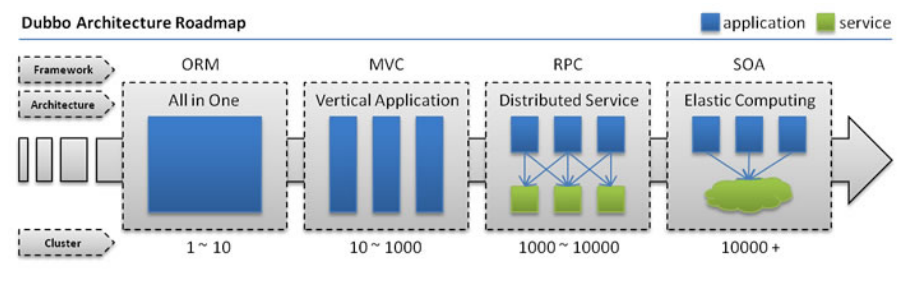
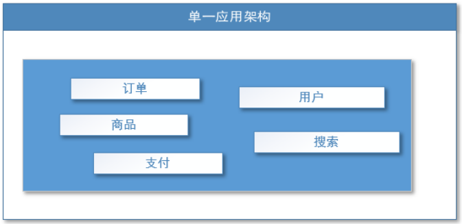
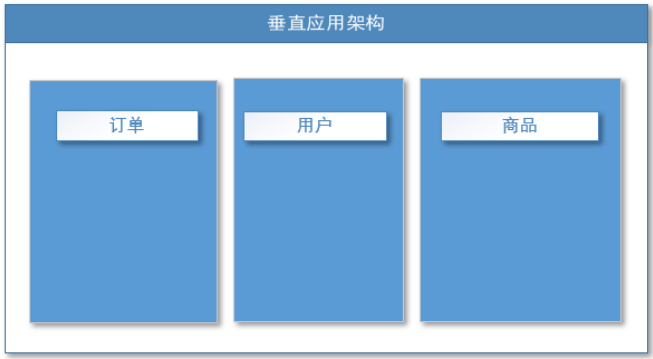
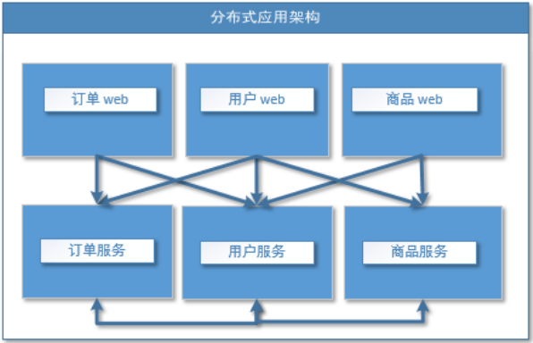
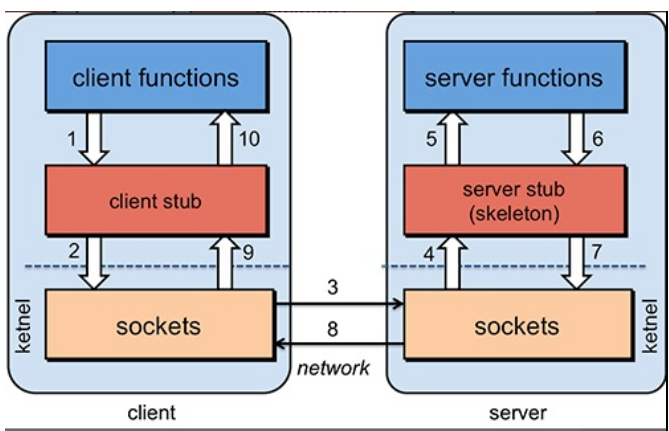
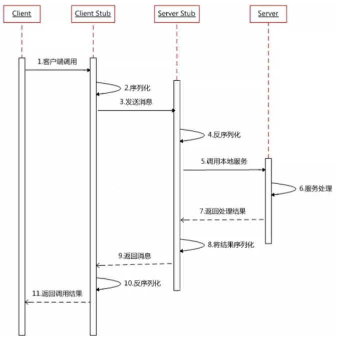

# Dubbo_分布式基础理论

----

## 什么是分布式系统？

《分布式系统原理与范型》定义：

`“分布式系统是若干独立计算机的集合，这些计算机对于用户来说就像单个相关系统”`

分布式系统（distributed system）是建立在网络之上的软件系统。

随着互联网的发展，网站应用的规模不断扩大，常规的垂直应用架构已无法应对，分布式服务架构以及流动计算架构势在必行，亟需`一个治理系统`确保架构有条不紊的演进。

## 发展演变

### 单一应用架构

当网站流量很小时，只需一个应用，将所有功能都部署在一起，以减少部署节点和成本。此时，用于简化增删改查工作量的数据访问框架(ORM)是关键。

适用于小型网站，小型管理系统，将所有功能都部署到一个功能里，简单易用。

缺点：

+   性能扩展比较难
+   协同开发问题
+   不利于升级维护

### 垂直应用架构

当访问量逐渐增大，单一应用增加机器带来的加速度越来越小，将应用拆成互不相干的几个应用，以提升效率。此时，用于加速前端页面开发的Web框架(MVC)是关键。

通过切分业务来实现各个模块独立部署，降低了维护和部署的难度，团队各司其职更易管理，性能扩展也更方便，更有针对性。

缺点： 公用模块无法重复利用，开发性的浪费

### 分布式服务架构

当垂直应用越来越多，应用之间交互不可避免，将核心业务抽取出来，作为独立的服务，逐渐形成稳定的服务中心，使前端应用能更快速的响应多变的市场需求。此时，用于提高业务复用及整合的分布式服务框架(RPC)是关键。

### 流动计算架构

当服务越来越多，容量的评估，小服务资源的浪费等问题逐渐显现，此时需增加一个调度中心基于访问压力实时管理集群容量，提高集群利用率。此时，用于`提高机器利用率的资源调度和治理中心(SOA)[ Service Oriented Architecture]`是关键。

## RPC

### 什么叫RPC

RPC【Remote Procedure Call】是指`远程过程调用`，是一种进程间通信方式，他`是一种技术的思想，而不是规范`。它允许程序调用另一个地址空间（通常是共享网络的另一台机器上）的过程或函数，而不用程序员显式编码这个远程调用的细节。即`程序员无论是调用本地的还是远程的函数，本质上编写的调用代码基本相同`。

### RPC基本原理

RPC两个核心模块：通讯，序列化。

