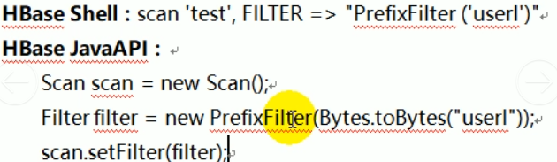
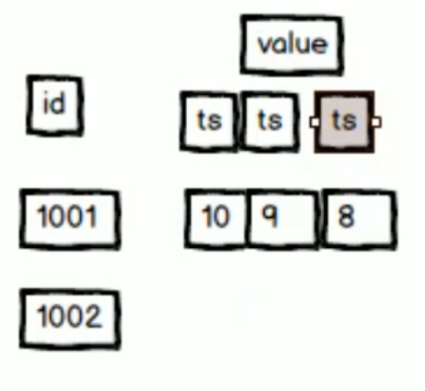

# HBase系列_12_HBase面试题

----

## HBase的region划分,每次划分大小都一样吗?
不都一样大:涉及到middleKey查询
因为一个rowKey所代表的数据不能从中间切开,那么middleKey要么属于上一块,要么属于下一块,这就会让数据稍微有点不一样大小

## HBase热点问题(就是数据倾斜问题):读写请求会集中到某一个RegionServer上如何处理

产生热点问题的原因:
1.hbase中的数据是按照字典排序的,当大量连续的rowkey集中写在个别的region,各个region之间数据分布不均衡
2.创建表时没有提前预分区,创建的表默认只有一个region,大量的数据写入当前region
3.创建表已经提前预分区,但是设计的rowkey没有规律可循
热点问题的解决方案
1.随机数+业务主键,如果想让最近的数据快速get到,可以将时间戳加上
2.rowkey设计越短越好,不要超过10~100个字节
3.映射regionNo(分区号),这样既可以让数据均匀分布到各个region上,同时可以根据startkey和endkey可以get到同一批数据

## hbase查询一条记录的方法是什么?hbase写入一条记录的方法是什么?
Hbase查询单一数据采用的是get方法,写入数据的方法为put

题目简单时,可以在回答问题时,稍微深入的讲解实现思路

## hbase的rowkey的设计原则(原理)
rowkey设计时要遵循三大原则
+   唯一性原则
    *   rowkey在设计上保证其唯一性.rowkey是按照字典顺序排序存储的,因此,设计rowkey的时候,要充分利用这个排序的特点,将经常读取的数据存储到一块,将最近可能被访问的数据放到一块
+   长度原则
    *   rowkey是一个二进制码流,可以是任意字符串,最大长度64kb,实际应用中一般为10-100bytes,以`byte[]`形式保存,一般设计成定长.建议越短越好,不要超过16个字节,原因如下:数据的持久化文件HFile中是按照keyValue存储的,如果rowkey过长,比如超过100字节,1000w行数据,光rowkey就要占用`100*1000w=10亿`个字节,将近1G数据,这样会极大影响HFile的存储效率;MemStore将缓存部分数据到内存,如果rowkey字段过长,内存的有效利用率就会降低,系统不能缓存更多的数据,这样会降低检索效率.目前操作系统都是64位系统,内存8字节对齐,控制在16个字节,8字节的整数倍利用了操作系统的最佳特性
+   散列原则
    *   如果rowkey按照时间戳的方式递增,不要将时间放在二进制码的前面,建议将rowkey的高位作为散列字段,由程序随机生成,低位放时间字段,这样将提高数据均衡分布在每个RegionServer,以实现负载均衡的几率.如果没有散列字段,首字段直接是时间信息,所有的数据都会集中在个别的RegionServer上,造成热点问题,会降低查询效率.
    *   加盐:这里所说的加盐不是密码学中的加盐,而是在rowkey的前面增加随机数,具体就是给rowkey分配一个随机前缀是的它和之前的rowkey的开头不同.分配的前缀种类数量应该和你想使用数据分散到不同的region的数量一直.加盐之后的rowkey就会根据随机生成的前缀分散到各个region上,以避免热点
    *   哈希:哈希会使同一行永远用一个前缀加盐.哈系也可以使负载分散到整个集群,但是读确实可以预测的.使用确定的哈系可以放用户重构完整的rowkey,可以使用get操作准确获取某一行数据
    *   反转:第三种防止热点的方法是反转固定长度或数字格式的rowkey.这样可以使得rowkey中经常改变的部分(最没有意义的部分)放在前面.这样可以有效的随机rowkey,但是牺牲了rowkey的有序性.反转rowkey的例子以手机号为rowkey,可以将手机号反转后的字符串作为rowkey,这样就避免了以手机号那样比较固定开头导致热点问题

## hbase中的compact(合并压缩)的用途是什么,什么时候触发,分为哪两种,有什么区别
在 HBase中，每当 memstore的数据 flush到磁盘后，就形成一个 storefile，当 storefile的数量越来越大时，会严重影响 HBase的读性能， HBase内部的 compact处理流程是为了解决 MemStore Flush之后，文件数目太多，导致读数据性能大大下降的一种自我调节手段，它会将文件按照某种策略进行合并,大大提升 HBase的数据读性能。

主要起到如下几个作用:

+   合并文件
+   清除删除、过期、多余版本的数据
+   提高读写数据的效率

HBase中实现了两种 compaction的方式

minor and major. Minor compactions will usually pick up a couple of the smaller adjacent StoreFiles and rewrite them as one. Minors do not drop deletes or expired cells, only major compactions do this. Sometimes a minor compaction will pick up all th e StoreFiles in the Store and in this case it actually promotes itself to being a major compaction.

这两种 compaction方的区别是:
+   Minor操作只用来做部分文件的合并操作以及包括 minVersion=0并且设置ttl的过期版本清理,不做任何删除数据、多版本数据的清理工作。
+   Major操作是对 Region下的 HStore下的所有 StoreFile执行合并操作,最终的结果是整理合并出一个文件。

compaction触发时机:
+   Memstore刷写后,判断是否 compaction
+   CompactionChecker线程,周期轮询

## Hbase的原理 regionserver挂了如何恢复数据？新的数据从Hlog里读出来是如何恢复的

引起 RegionServer宕机的原因各种各样，有因为 Full GC导致、网络异常导致、官方Bug导致（close wait端口未关闭）以及 DataNode异常导致等等

HBase检测宕机是通过 Zookeeper实现的，正常情况下 RegionServer会周期性向 Zookeeper发送心跳，一旦发生宕机，心跳就会停止，超过一定时间（Session Timeout） Zookeeper就会认为 RegionServer宕机离线，并将该消息通知给 Master

一旦 RegionServer发生机， HBase都会马检测到这种宕机，并且在检测到宕机之后会将宕机 RegionServer上的所有 Region重新分配到集群中其他正常 RegionServer上去，再根据Hog进行丢失数据恢复，恢复完成之后就可以对外提供服务，整个过程都是自动完成的，并不需要人工介入

## 讲一下 Hbase， Hbase二级索引用过吗
默认情况下， Hbase只支持 rowkey的查询，对多条件的组合查询的应用场景，不够给力。
如果将多条件组合查询的字段都拼接在 RowKey中显然又不太可能全表扫描再结合过滤器筛选出目标数据（太低效）所以通过设计 HBase的二级索引来解决这个问题。这里所谓的二级索引其实就是创建新的表，并建立各列值（family: column）与行键（rowkey）之间的映射关系。这种方式需要额外的存储空间，属于一种以空间换时间的方式

后期会有相应的课程介绍(Phoenix框架)

## HBase是如何优化的

内存优化

+   垃圾回收优化:CMS，G1（Region）
+   JVM启动:-Xms（1/64）-Xmx（1/4）

Region优化

+   预分区
+   禁用 major合并，手动合并

客户端优化

+   批处理
+   Hbase配置优化: 参考前文
+   HDFS优化: 参考前文

## hbase查询表名为test,rowkey为userl开头的

## hbase表的设计有哪些注意点

题目主要考核hbase表的设计要素: rowkey, family, column, cell, value, timestamp

设计hbase表时需要了解:

+   行键的结构是什么的并且要包含什么内容。
+   表有多少个列族?
+   列族中都要放什么数据?
+   每个列族中有多少个列?
+   列名是什么?尽管列名在创建表时不需要指定，你读写数据是需要用到它们。
+   单元数据需要包含哪些信息?
+   每个单元数据需要存储的版本数量是多少?

## HBase与Mysql的区别

+   数据存储的方式
    *   Mysql面向行存储数据，整个行的数据是一个整体，存储在一起
    *   HBase面向列存储数据，整个列的数据是一个整体，存储在一起，有利于压缩和统计
+   数据之间的关系
    *   Mysql存储关系型数据，结构化数据~
    *   Hbase存储的非关系型数据，存储结构化和非结构化数据
+   事务处理
    *   Mysql数据库存在事务，因为着重于计算(算法)。
    *   Hbase数据库侧重于海量数据的存储,所以没有事务的概念。
+   储存容量
    *   Hbase依托于Hadoop,容量非常大，一般都以 PB级为单位存储。
    *   Mysql存储数据依赖于所在的硬件设备。

## HBase有put方法,那如何批量put数据进hbase里,用什么方法

`put( List<Put> puts )`

问题不复杂，就需要说明的更加详细。

## HBase源码

## HBase构建二级索引如何保证索引与数据一致

## HBase 数据存储，客户需要存储三个字段的数据（ID：：VALUE：：TIMESTAMP），为了满足统计需求，客户希望将100万个测试点的数据在Hbase中存储，每个测试点一年中每五分钟的数据作为一行存储，请确认这要定义存储格式是否合理，请给出最佳的解决方案

可以采用测试点作为rowkey，每5分钟的测试点数据作为列存储

## HBase,Hive和Redis的区别

处理方式

+   Hive基于MR程序,将HQL转换为MR执行。效率比较低,不适合实时数据访问。
+   Hbase基于Hadoop数据存储，存储海量数据，而且拥有自己的查询操作。

应用场景

+   Hive,主要是MapReduce不好写
+   Redis缓存
+   HBase就是数据库

## 浅谈一下HBase的读写原理

见前面文章

## HBase预分区的作用及原理

作用:

+   防止数据热点以及数据倾斜
+   提高数据读写效率。

## rowkey的大小范围

负无穷到正无穷

## rowkey怎么创建比较好,列族怎么创建比较好

## 描述hbase的scan和get功能以及实现的异同

get:单一查询(主键查询)
scan:默认是全查,但是可以加条件
