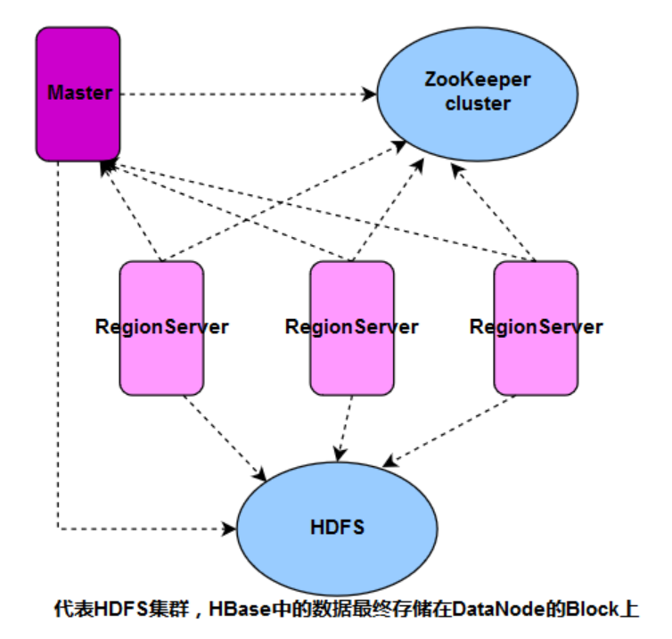
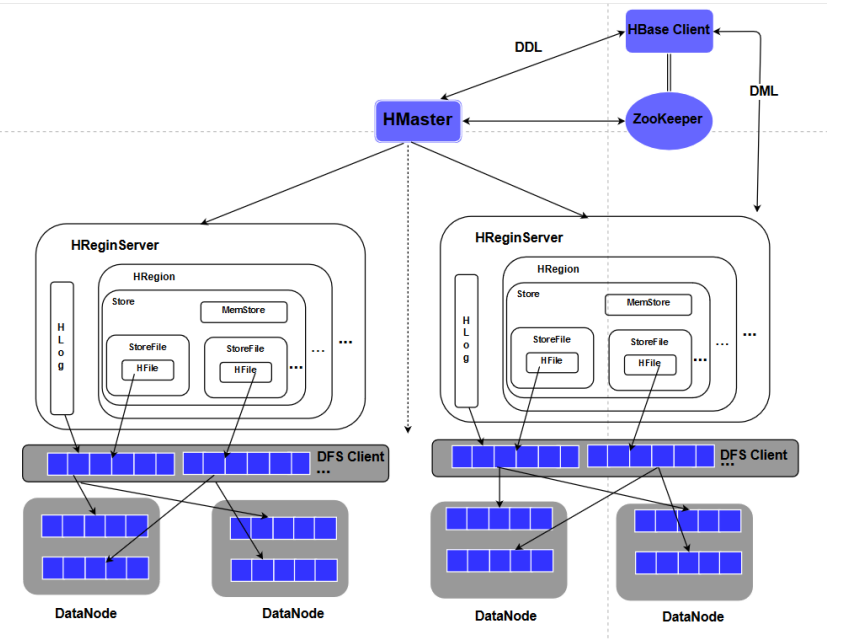
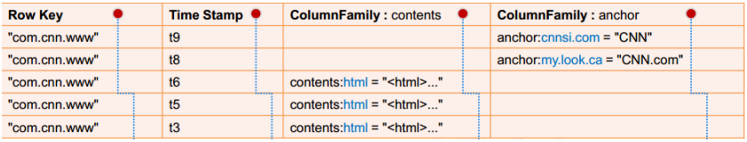

# HBase系列_13_HBase总结

-----

## HBase在Hadoop中的位置

HBase(Hadoop Database)是一个开源的、面向列(Column-Oriented)、适合存储海量非结构化数据或半结构化数据的、具备高可靠性、高性能、可灵活扩展伸缩的、支持实时数据读写的分布式存储系统。
存储在HBase中的表的典型特征：

+   大表(BigTable)：一个表可以有上亿行，上百万列
+   面向列：面向列的存储、检索与权限控制
+   稀疏：表中为空(null)的列不占用存储空间

## HBase集群典型部署组网

+   Master：又叫HMaster，负责HBase中Table和Region的管理，包括表的增删改查；Region Server的负载均衡，Region分布调整；Region分裂以及分裂后的Region分配；Region Server失效后的Region迁移等。
+   ZooKeeper cluster：Zookeeper集群存储-ROOT-表的地址和Master地址，Region Server主动向Zookeeper注册，使得Master可随时感知各Region Server的健康状态。 Zookeeper另一个重要作用是避免Master 单点故障（SPOF）。
+   RegionServer:负责数据路由、数据读写和数据持久化，是HBase 的数据处理和计算单元，同时还负责区域的分割（即Region Split）。 RegionServer要求和HDFS的DataNode一起部署。

## HBase系统架构

+   HBase Client：Client使用HBase的RPC机制与HMaster、HRegionServer 进行通信。 Client与HMaster进行管理类通信，与HRegion Server进行数据操作类通信。
+   HRegionServer:HRegionServer内部管理了一系列HRegion对象，每个HRegion对应Table中的一个Region。HRegion由多个Store组成。每个Store对应Table中的一个ColumnFamily的存储，即一个Store管理一个Region上的一个列族（CF）。每个Store包含一个MemStore和0到多个StoreFile。 Store是HBase的存储核心，由MemStore 和 StoreFile组成。
+   HLog:数据在写入时，首先写入预写日志（Write AheadLog），每个HRegionServer服务的所有Region的写操作日志都存储在同一个日志文件中。数据并非直接写入HDFS，而是等缓存到一定数量再批量写入，写入完成后在日志中做标记。
+   MemStore and StoreFile:MemStore是 一个有序的内存缓存区，用户写入的数据首先放入MemStore，当MemStore满了以后Flush成一个StoreFile（存储时对应为HFile）， 当StoreFile数量增到一定阈值，触发Compact合并，将多个StoreFiles合并成一个StoreFile。StoreFiles 合并后逐步形成越来越大的StoreFile，当Region内所有StoreFiles（Hfile）的总大小超过阈值（hbase.hregion.max.filesize）即触发分裂Split，把当前的Region Split成2个Region，父Region下线，新Split出的2个孩子Region被HMaster分配到合适的HRegionServer 上，使得原先1个Region的压力得以分流到2个Region上。

## HBase数据模型
存储在HBase表每一行数据都有可排序的关键字（Row Key）和任意列项（Column &Column Family）。在HBase中，仅能通过主键（Row Key）和主键版本号来检索数据，仅支持单行事务。下面以HBase存储搜索引擎的网页为例：

+   Row Key：行键，相当于关系表的主键，每一行数据的唯一标识。字符串、整数、二进制串都可以作为RowKey。所有记录按照RowKey排序后存储。
+   Time Stamp：每次数据操作对应的时间戳，数据按时间戳区分版本，每个Cell的多个版本的数据按时间倒序存储。
+   ColumnFamily：Column Family，列簇，一个表在水平方向上由一个或多个CF组成。一个CF可以由任意多个Column组成。Column是CF下的一个标签，可以在写入数据时任意添加，因此CF支持动态扩展，无需预先定义Column的数量和类型。 HBase中表的列非常稀疏，不同行的列的个数和类型都可以不同。此外，每个CF都有独立的TTL（生存周期）。可以只对行上锁，对行的操作始终是原始的。

## HBase的物理存储结构

建表时默认只有一个Region，如果指定Split Key，就会有多个Region。当表的记录行超过阈值，表按水平方向分割成2个Region，可把Region理解为子表。当Region的行数超过阈值，Region继续分裂。不同的Region被HMaster分配给合适的HRegionServer管理。每个Region都包含一个随机ID，Region内的数据按照Row Key有序存储。

20220304115052.png

HBase在进行数据存储时，物理上将同“列簇”的数据存储在一起，不同“列簇”的数据分开存储。例如这里的Store1-1对应存储表Region1上的CF1的所有数据，底层实际存储时为一个HFile。

20220304115105.png

## HBase文件目录讲解
+   HDFS在文件系统根目录下为HBase建立专用存储目录。
+   在HBase目录下按照表名创建子目录
+   在表名子目录下存放HBase Region块目录
+   Region块目录下按照所存放表的CF建立子目录，同时该目录下有一个固定的文件regioninfo目录
+   regioninfo目录下建立的文件用来存放表的Scheme信息
+   Column Family下放置的是该CF的HFile文件