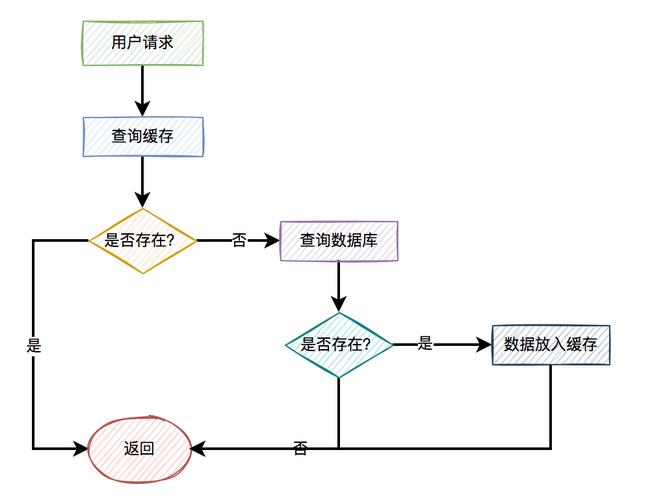
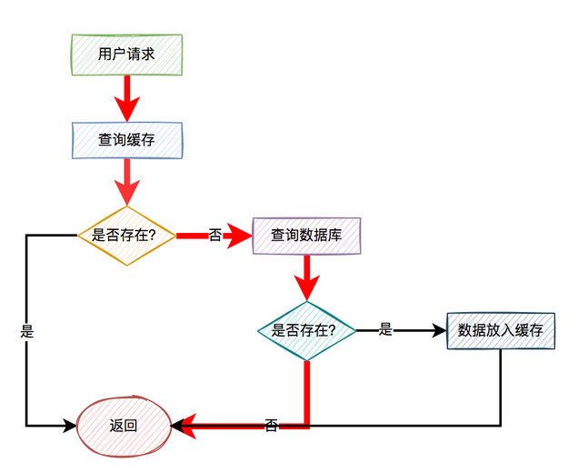
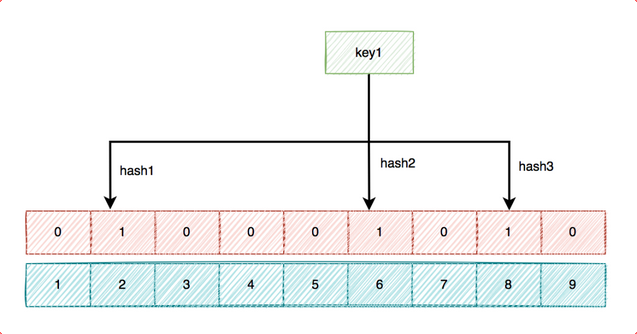
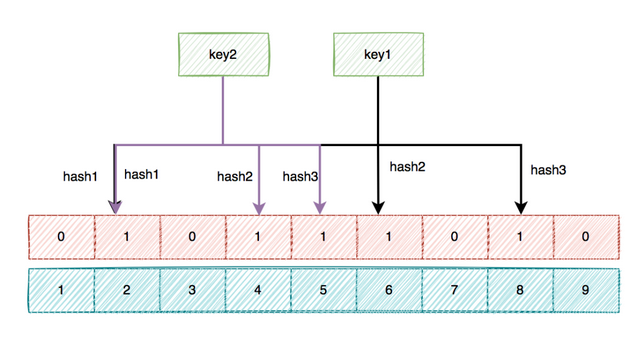
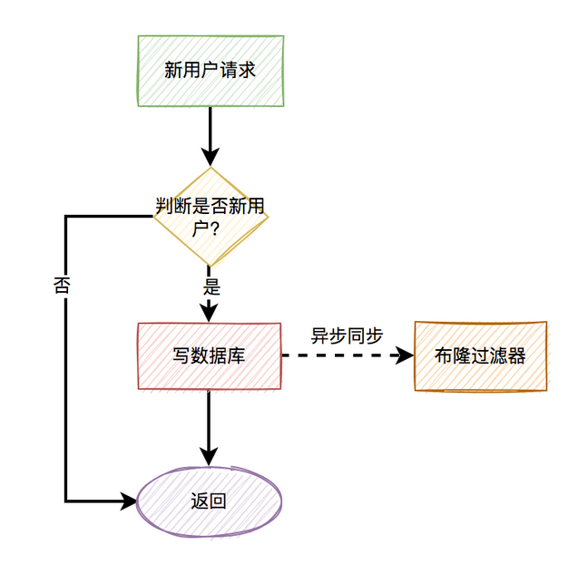
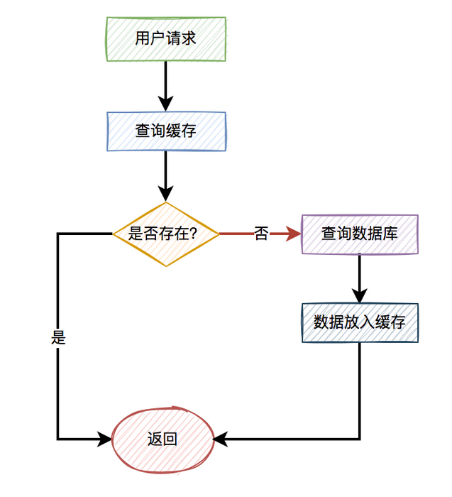
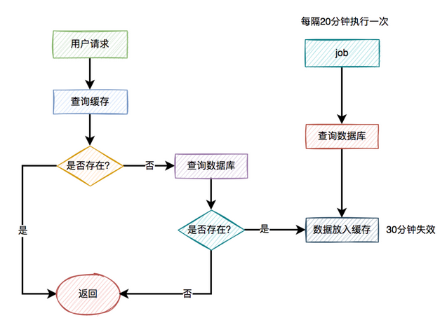
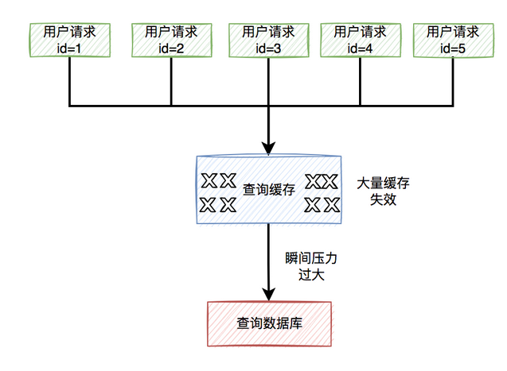
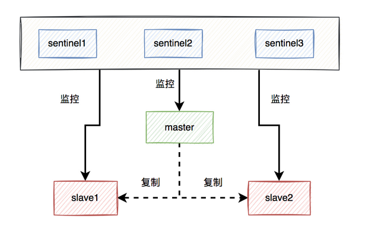

# Redis_缓存穿透缓存击穿和缓存雪崩

----

## 缓存穿透问题

大部分情况下，加缓存的目的是：为了减轻数据库的压力，提升系统的性能。

我们是如何用缓存的？

一般情况下，如果有用户请求过来，先查缓存，如果缓存中存在数据，则直接返回。如果缓存中不存在，则再查数据库，如果数据库中存在，则将数据放入缓存，然后返回。如果数据库中也不存在，则直接返回失败。

流程图如下：



上面的这张图小伙们肯定再熟悉不过了，因为大部分缓存都是这样用的。

### 什么是缓存穿透？

但如果出现以下这两种特殊情况，比如：

+   用户请求的id在缓存中不存在。
+   恶意用户伪造不存在的id发起请求。

这样的用户请求导致的结果是：每次从缓存中都查不到数据，而需要查询数据库，同时数据库中也没有查到该数据，也没法放入缓存。也就是说，每次这个用户请求过来的时候，都要查询一次数据库。



图中标红的箭头表示每次走的路线。

很显然，缓存根本没起作用，好像被穿透了一样，每次都会去访问数据库。

这就是我们所说的：缓存穿透问题。

如果此时穿透了缓存，而直接数据库的请求数量非常多，数据库可能因为扛不住压力而挂掉。呜呜呜。

那么问题来了，如何解决这个问题呢？

### 校验参数

?>  就是id是有一定规则的,不满足规则的id直接过滤

我们可以对用户id做检验。

比如你的合法id是15xxxxxx，以15开头的。如果用户传入了16开头的id，比如：16232323，则参数校验失败，直接把相关请求拦截掉。这样可以过滤掉一部分恶意伪造的用户id。

### [布隆过滤器](/2022/20220302-布隆过滤器)

?>  如果布隆过滤器判断出某个key存在，可能出现误判。如果判断某个key不存在，则它在数据库中一定不存在。即`判断某个key不存在时可以使用`

如果数据比较少，我们可以把数据库中的数据，全部放到内存的一个map中。

这样能够非常快速的识别，数据在缓存中是否存在。如果存在，则让其访问缓存。如果不存在，则直接拒绝该请求。

但如果数据量太多了，有数千万或者上亿的数据，全都放到内存中，很显然会占用太多的内存空间。

那么，有没有办法减少内存空间呢？

答：这就需要使用布隆过滤器了。

布隆过滤器底层使用bit数组存储数据，该数组中的元素默认值是0。

布隆过滤器第一次初始化的时候，会把数据库中所有已存在的key，经过一些列的hash算法（比如：三次hash算法）计算，每个key都会计算出多个位置，然后把这些位置上的元素值设置成1。



之后，有用户key请求过来的时候，再用相同的hash算法计算位置。

+   如果多个位置中的元素值都是1，则说明该key在数据库中已存在。这时允许继续往后面操作。
+   如果有1个以上的位置上的元素值是0，则说明该key在数据库中不存在。这时可以拒绝该请求，而直接返回。

使用布隆过滤器确实可以解决缓存穿透问题，但同时也带来了两个问题：

+   存在误判的情况。
+   存在数据更新问题。

先看看为什么会存在误判呢？

上面我已经说过，初始化数据时，针对每个key都是通过多次hash算法，计算出一些位置，然后把这些位置上的元素值设置成1。

但我们都知道hash算法是会出现hash冲突的，也就是说不通的key，可能会计算出相同的位置。



上图中的下标为2的位置就出现了hash冲突，key1和key2计算出了一个相同的位置。

如果有几千万或者上亿的数据，布隆过滤器中的hash冲突会非常明显。

如果某个用户key，经过多次hash计算出的位置，其元素值，恰好都被其他的key初始化成了1。此时，就出现了误判，原本这个key在数据库中是不存在的，但布隆过滤器确认为存在。

`如果布隆过滤器判断出某个key存在，可能出现误判。如果判断某个key不存在，则它在数据库中一定不存在。`

通常情况下，布隆过滤器的误判率还是比较少的。即使有少部分误判的请求，直接访问了数据库，但如果访问量并不大，对数据库影响也不大。

此外，如果想减少误判率，可以适当增加hash函数，图中用的3次hash，可以增加到5次。

其实，布隆过滤器最致命的问题是：如果数据库中的数据更新了，需要同步更新布隆过滤器。但它跟数据库是两个数据源，就可能存在数据不一致的情况。

比如：数据库中新增了一个用户，该用户数据需要实时同步到布隆过滤。但由于网络异常，同步失败了。



这时刚好该用户请求过来了，由于布隆过滤器没有该key的数据，所以直接拒绝了该请求。但这个是正常的用户，也被拦截了。

很显然，如果出现了这种正常用户被拦截了情况，有些业务是无法容忍的。所以，布隆过滤器要看实际业务场景再决定是否使用，它帮我们解决了缓存穿透问题，但同时了带来了新的问题。

### 缓存空值

?>  去数据库取数据,不管有没有取到,都要在redis生成对应id的值(没取到就是空值)

上面使用布隆过滤器，虽说可以过滤掉很多不存在的用户id请求。但它除了增加系统的复杂度之外，会带来两个问题：

+   布隆过滤器存在误杀的情况，可能会把少部分正常用户的请求也过滤了。
+   如果用户信息有变化，需要实时同步到布隆过滤器，不然会有问题。

所以，通常情况下，我们很少用布隆过滤器解决缓存穿透问题。其实，还有另外一种更简单的方案，即：缓存空值。

`当某个用户id在缓存中查不到，在数据库中也查不到时，也需要将该用户id缓存起来，只不过值是空的。`

这样后面的请求，再拿相同的用户id发起请求时，就能从缓存中获取空数据，直接返回了，而无需再去查一次数据库。

优化之后的流程图如下：



关键点是不管从数据库有没有查到数据，都将结果放入缓存中，只是如果没有查到数据，缓存中的值是空的罢了。

## 缓存击穿问题

有时候，我们在访问热点数据时。比如：我们在某个商城购买某个热门商品。

为了保证访问速度，通常情况下，商城系统会把商品信息放到缓存中。但如果某个时刻，该商品到了过期时间失效了。

此时，如果有大量的用户请求同一个商品，但该商品在缓存中失效了，一下子这些用户请求都直接怼到数据库，可能会造成瞬间数据库压力过大，而直接挂掉。

流程图如下：


那么，如何解决这个问题呢？

### 加锁

数据库压力过大的根源是，因为同一时刻太多的请求访问了数据库。

如果我们能够限制，同一时刻只有一个请求才能访问某个productId的数据库商品信息，不就能解决问题了？

答：没错，我们可以用加锁的方式，实现上面的功能。

伪代码如下：

```java
try {
  String result = jedis.set(productId, requestId, "NX", "PX", expireTime);
  if ("OK".equals(result)) {
    return queryProductFromDbById(productId);
  }
} finally{
    unlock(productId,requestId);
}
return null;
```

在访问数据库时加锁，防止多个相同productId的请求同时访问数据库。

然后，还需要一段代码，把从数据库中查询到的结果，又重新放入缓存中。办法挺多的，在这里我就不展开了。

### 自动续期

出现缓存击穿问题是由于key过期了导致的。那么，我们换一种思路，在key快要过期之前，就自动给它续期，不就OK了？

答：没错，我们可以用job给指定key自动续期。

比如说，我们有个分类功能，设置的缓存过期时间是30分钟。但有个job每隔20分钟执行一次，自动更新缓存，重新设置过期时间为30分钟。



这样就能保证，分类缓存不会失效。

此外，在很多请求第三方平台接口时，我们往往需要先调用一个获取token的接口，然后用这个token作为参数，请求真正的业务接口。一般获取到的token是有有效期的，比如24小时之后失效。

如果我们每次请求对方的业务接口，都要先调用一次获取token接口，显然比较麻烦，而且性能不太好。

这时候，我们可以把第一次获取到的token缓存起来，请求对方业务接口时从缓存中获取token。

同时，有一个job每隔一段时间，比如每隔12个小时请求一次获取token接口，不停刷新token，重新设置token的过期时间。

### 缓存不失效

此外，对于很多热门key，其实是可以不用设置过期时间，让其永久有效的。

比如参与秒杀活动的热门商品，由于这类商品id并不多，在缓存中我们可以不设置过期时间。

在秒杀活动开始前，我们先用一个程序提前从数据库中查询出商品的数据，然后同步到缓存中，提前做预热。

等秒杀活动结束一段时间之后，我们再手动删除这些无用的缓存即可。


## 缓存雪崩问题

什么是缓存雪崩？

前面已经聊过缓存击穿问题了。

而缓存雪崩是缓存击穿的升级版，缓存击穿说的是某一个热门key失效了，而缓存雪崩说的是有多个热门key同时失效。看起来，如果发生缓存雪崩，问题更严重。

缓存雪崩目前有两种：

+   有大量的热门缓存，同时失效。会导致大量的请求，访问数据库。而数据库很有可能因为扛不住压力，而直接挂掉。
+   缓存服务器down机了，可能是机器硬件问题，或者机房网络问题。总之，造成了整个缓存的不可用。

归根结底都是有大量的请求，透过缓存，而直接访问数据库了。



那么，要如何解决这个问题呢？

### 过期时间加随机数

为了解决缓存雪崩问题，我们首先要尽量避免缓存同时失效的情况发生。

这就要求我们不要设置相同的过期时间。

可以在设置的过期时间基础上，再加个1~60秒的随机数。

```
实际过期时间 = 过期时间 + 1~60秒的随机数
```

这样即使在高并发的情况下，多个请求同时设置过期时间，由于有随机数的存在，也不会出现太多相同的过期key。

### 高可用

针对缓存服务器down机的情况，在前期做系统设计时，可以做一些高可用架构。

比如：如果使用了redis，可以使用哨兵模式，或者集群模式，避免出现单节点故障导致整个redis服务不可用的情况。



使用哨兵模式之后，当某个master服务下线时，自动将该master下的某个slave服务升级为master服务，替代已下线的master服务继续处理请求。

### 服务降级

如果做了高可用架构，redis服务还是挂了，该怎么办呢？

这时候，就需要做服务降级了。

我们需要配置一些默认的兜底数据。

程序中有个全局开关，比如有10个请求在最近一分钟内，从redis中获取数据失败，则全局开关打开。后面的新请求，就直接从配置中心中获取默认的数据。


当然，还需要有个job，每隔一定时间去从redis中获取数据，如果在最近一分钟内可以获取到两次数据（这个参数可以自己定），则把全局开关关闭。后面来的请求，又可以正常从redis中获取数据了。

需要特别说一句，该方案并非所有的场景都适用，需要根据实际业务场景决定。

## 来源
[烂大街的缓存穿透、缓存击穿和缓存雪崩，你真的懂了？ ](https://mp.weixin.qq.com/s/3cdOcSlkbyCZs40ZkDFL_Q)