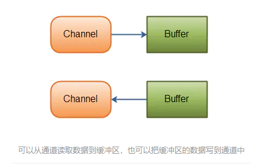

# Netty_Java_NIO编程

-----

## 怎么理解IO是面向流的、阻塞的

java1.4以前的io模型，一连接对一个线程。

+   原始的IO是面向流的，不存在缓存的概念。
    *   Java IO面向流意味着`每次从流中读一个或多个字节，直至读取所有字节，它们没有被缓存在任何地方`。
    *   此外，它`不能前后移动流中的数据`。如果需要前后移动从流中读取的数据，需要先将它缓存到一个缓冲区

Java IO的各种流是阻塞的，这意味着当一个线程调用read或 write方法时，该线程被阻塞，直到有一些数据被读取，或数据完全写入，该线程在此期间不能再干任何事情了。


# Java NIO 基本介绍

+   Java NIO 全称 `Java non-blocking IO`，是指 JDK 提供的新 API。从 JDK1.4 开始，Java 提供了一系列改进的输入/输出的新特性，被统称为 NIO（即 NewIO），是同步非阻塞的。
+   NIO 相关类都被放在 `java.nio` 包及子包下，并且对原 java.io 包中的很多类进行改写。【基本案例】
+   NIO 有三大核心部分
    *   Channel（通道）
    *   Buffer（缓冲区）
    *   Selector（选择器） 。
+   怎么理解NIO是面向块的、非阻塞的
    *   NIO 是面向缓冲区，或者面向块编程的。将数据`读取到一个它稍后处理的缓冲区`，需要时`可在缓冲区中前后移动`，这就增加了处理过程中的灵活性，使用它可以提供非阻塞式的高伸缩性网络。
    *   读 => 使一个线程从某通道发送请求或者读取数据，但是它仅能得到目前可用的数据，如果目前没有数据可用时，就什么都不会获取，而不是保持线程阻塞，所以直至数据变的可以读取之前，该线程可以继续做其他的事情。
    *   写 => 一个线程请求写入一些数据到某通道，但不需要等待它完全写入，这个线程同时可以去做别的事情。【后面有案例说明】
+   通俗理解：NIO 是可以做到用一个线程来处理多个操作的。假设有 10000 个请求过来,根据实际情况，可以分配 50 或者 100 个线程来处理。不像之前的阻塞 IO 那样，非得分配 10000 个。
+   HTTP 2.0 使用了多路复用的技术，做到同一个连接并发处理多个请求，而且并发请求的数量比 HTTP 1.1 大了好几个数量级。

案例说明 NIO 的 Buffer

```java
package com.atguigu.nio;

import java.nio.IntBuffer;

public class BasicBuffer {

    public static void main(String[] args) {

        //举例说明 Buffer 的使用(简单说明)
        //创建一个 Buffer，大小为 5，即可以存放 5 个 int
        IntBuffer intBuffer = IntBuffer.allocate(5);

        //向buffer存放数据
        //intBuffer.put(10);
        //intBuffer.put(11);
        //intBuffer.put(12);
        //intBuffer.put(13);
        //intBuffer.put(14);
        for (int i = 0; i < intBuffer.capacity(); i++) {
            intBuffer.put(i * 2);
        }
        //如何从 buffer 读取数据
        //将 buffer 转换，读写切换(!!!)
        intBuffer.flip();
        while (intBuffer.hasRemaining()) {
            System.out.println(intBuffer.get());
        }
    }
}
```

## NIO 和 BIO 的比较

+   BIO 以流的方式处理数据，而 NIO 以块的方式处理数据，块 I/O 的效率比流 I/O 高很多。
+   BIO 是阻塞的，NIO 则是非阻塞的。
+   BIO 基于字节流和字符流进行操作，而 NIO 基于 Channel（通道）和 Buffer（缓冲区）进行操作，数据总是从通道读取到缓冲区中，或者从缓冲区写入到通道中。Selector（选择器）用于监听多个通道的事件（比如：连接请求，数据到达等），因此使用单个线程就可以监听多个客户端通道。
+   Buffer和Channel之间的数据流向是双向的

# NIO的核心实现

在标准IO API中，你可以操作字节流和字符流，但在新IO中，你可以操作通道和缓冲，数据总是从通道被读取到缓冲中或者从缓冲写入到通道中。NIO核心API Channel, Buffer, Selector

一张图描述 NIO 的 Selector 、 Channel 和 Buffer 的关系

Selector 、 Channel 和 Buffer 的关系图(简单版)


关系图的说明:

+   每个 Channel 都会对应一个 Buffer。
+   Selector 对应一个线程，一个线程对应多个 Channel（连接）。
+   该图反应了有三个 Channel 注册到该 Selector //程序
+   程序切换到哪个 Channel 是由事件决定的，Event 就是一个重要的概念。
+   Selector 会根据不同的事件，在各个通道上切换。
+   Buffer 就是一个内存块，底层是有一个数组。
数据的读取写入是通过 Buffer，这个和 BIO是不同的，BIO 中要么是输入流，或者是输出流，不能双向，但是 NIO 的 Buffer 是可以读也可以写，需要 flip 方法切换 Channel 是双向的，可以返回底层操作系统的情况，比如 Linux，底层的操作系统通道就是双向的。


## 通道Channel

NIO的通道类似于流，但有些区别如下：

1. 通道可以同时进行读写，而流只能读或者只能写
2. 通道可以实现异步读写数据
3. 通道可以从缓冲读数据，也可以写数据到缓冲:



## 缓存Buffer

缓冲区本质上是一个`可以写入数据的内存块`，然后可以再次读取，该对象提供了一组方法，可以更轻松地使用内存块，使用缓冲区读取和写入数据通常遵循以下四个步骤：

1. 写数据到缓冲区；

2. 调用buffer.flip()方法；

3. 从缓冲区中读取数据；

4. 调用buffer.clear()或buffer.compat()方法；

当向buffer写入数据时，buffer会记录下写了多少数据，一旦要读取数据，需要通过flip()方法将Buffer从写模式切换到读模式，在读模式下可以读取之前写入到buffer的所有数据，一旦读完了所有的数据，就需要清空缓冲区，让它可以再次被写入。