# Netty_Java_NIO编程

-----

## 怎么理解IO是面向流的、阻塞的

java1.4以前的io模型，一连接对一个线程。

+   原始的IO是面向流的，不存在缓存的概念。
    *   Java IO面向流意味着`每次从流中读一个或多个字节，直至读取所有字节，它们没有被缓存在任何地方`。
    *   此外，它`不能前后移动流中的数据`。如果需要前后移动从流中读取的数据，需要先将它缓存到一个缓冲区

Java IO的各种流是阻塞的，这意味着当一个线程调用read或 write方法时，该线程被阻塞，直到有一些数据被读取，或数据完全写入，该线程在此期间不能再干任何事情了。

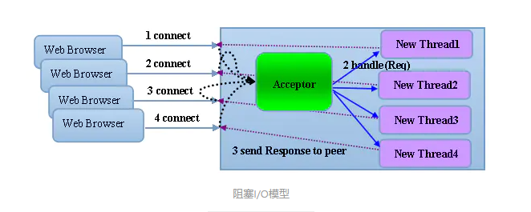

# Java NIO 基本介绍

+   Java NIO 全称 `Java non-blocking IO`，是指 JDK 提供的新 API。从 JDK1.4 开始，Java 提供了一系列改进的输入/输出的新特性，被统称为 NIO（即 NewIO），是同步非阻塞的。
+   NIO 相关类都被放在 `java.nio` 包及子包下，并且对原 java.io 包中的很多类进行改写。【基本案例】
+   NIO 有三大核心部分
    *   Channel（通道）
    *   Buffer（缓冲区）
    *   Selector（选择器） 。
+   怎么理解NIO是面向块的、非阻塞的
    *   NIO 是面向缓冲区，或者面向块编程的。将数据`读取到一个它稍后处理的缓冲区`，需要时`可在缓冲区中前后移动`，这就增加了处理过程中的灵活性，使用它可以提供非阻塞式的高伸缩性网络。
    *   读 => 使一个线程从某通道发送请求或者读取数据，但是它仅能得到目前可用的数据，如果目前没有数据可用时，就什么都不会获取，而不是保持线程阻塞，所以直至数据变的可以读取之前，该线程可以继续做其他的事情。
    *   写 => 一个线程请求写入一些数据到某通道，但不需要等待它完全写入，这个线程同时可以去做别的事情。【后面有案例说明】
+   通俗理解：NIO 是可以做到用一个线程来处理多个操作的。假设有 10000 个请求过来,根据实际情况，可以分配 50 或者 100 个线程来处理。不像之前的阻塞 IO 那样，非得分配 10000 个。
+   HTTP 2.0 使用了多路复用的技术，做到同一个连接并发处理多个请求，而且并发请求的数量比 HTTP 1.1 大了好几个数量级。

案例说明 NIO 的 Buffer

```java
package com.atguigu.nio;

import java.nio.IntBuffer;

public class BasicBuffer {

    public static void main(String[] args) {

        //举例说明 Buffer 的使用(简单说明)
        //创建一个 Buffer，大小为 5，即可以存放 5 个 int
        IntBuffer intBuffer = IntBuffer.allocate(5);

        //向buffer存放数据
        //intBuffer.put(10);
        //intBuffer.put(11);
        //intBuffer.put(12);
        //intBuffer.put(13);
        //intBuffer.put(14);
        for (int i = 0; i < intBuffer.capacity(); i++) {
            intBuffer.put(i * 2);
        }
        //如何从 buffer 读取数据
        //将 buffer 转换，读写切换(!!!)
        intBuffer.flip();
        while (intBuffer.hasRemaining()) {
            System.out.println(intBuffer.get());
        }
    }
}
```

## NIO 和 BIO 的比较

+   BIO 以流的方式处理数据，而 NIO 以块的方式处理数据，块 I/O 的效率比流 I/O 高很多。
+   BIO 是阻塞的，NIO 则是非阻塞的。
+   BIO 基于字节流和字符流进行操作，而 NIO 基于 Channel（通道）和 Buffer（缓冲区）进行操作，数据总是从通道读取到缓冲区中，或者从缓冲区写入到通道中。Selector（选择器）用于监听多个通道的事件（比如：连接请求，数据到达等），因此使用单个线程就可以监听多个客户端通道。
+   Buffer和Channel之间的数据流向是双向的

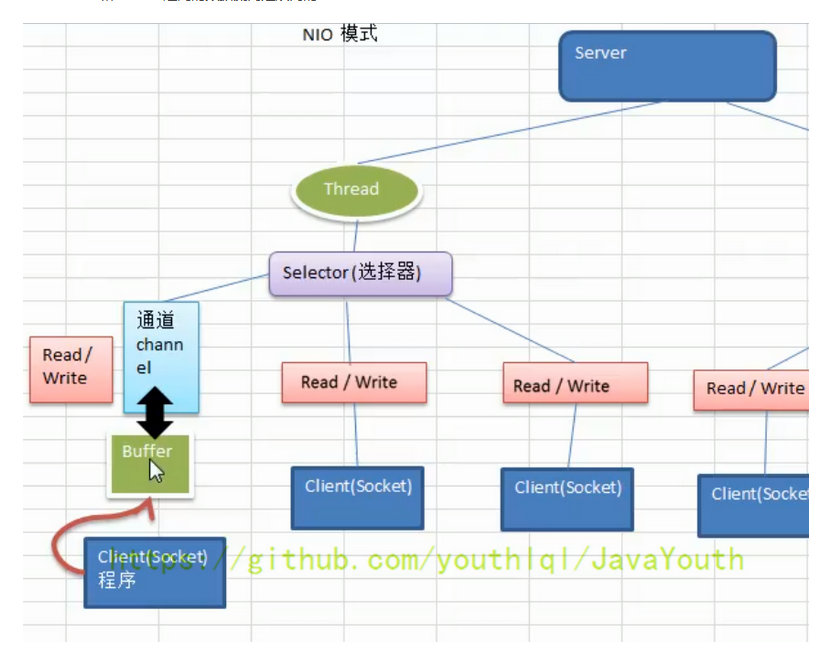

# NIO的核心实现

在标准IO API中，你可以操作字节流和字符流，但在新IO中，你可以操作通道和缓冲，数据总是从通道被读取到缓冲中或者从缓冲写入到通道中。NIO核心API Channel, Buffer, Selector

一张图描述 NIO 的 Selector 、 Channel 和 Buffer 的关系

Selector 、 Channel 和 Buffer 的关系图(简单版)

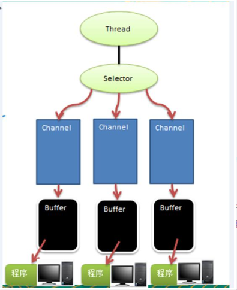

关系图的说明:

+   每个 Channel 都会对应一个 Buffer。
+   Selector 对应一个线程，一个线程对应多个 Channel（连接）。
+   该图反应了有三个 Channel 注册到该 Selector //程序
+   程序切换到哪个 Channel 是由事件决定的，Event 就是一个重要的概念。
+   Selector 会根据不同的事件，在各个通道上切换。
+   Buffer 就是一个内存块，底层是有一个数组。
+   数据的读取写入是通过 Buffer，这个和 BIO是不同的，BIO 中要么是输入流，或者是输出流，不能双向，但是 NIO 的 Buffer 是可以读也可以写，需要 flip 方法切换 Channel 是双向的，可以返回底层操作系统的情况，比如 Linux，底层的操作系统通道就是双向的。


## 缓存Buffer

### 基本介绍

缓冲区（Buffer）：
+   缓冲区本质上是一个`可以读写数据的内存块`，可以理解成是一个容器对象（含数组）
+   该对象提供了一组方法，可以更轻松地使用内存块
+   缓冲区对象内置了一些机制，能够跟踪和记录缓冲区的状态变化情况。
+   Channel 提供从文件、网络读取数据的渠道，但是读取或写入的数据都必须经由 Buffer
+   如图:【后面举例说明】

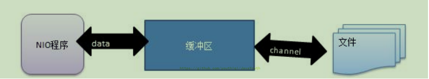

使用缓冲区读取和写入数据通常遵循以下四个步骤：

1. 写数据到缓冲区；
2. 调用buffer.flip()方法；
3. 从缓冲区中读取数据；
4. 调用buffer.clear()或buffer.compat()方法；

当向buffer写入数据时，buffer会记录下写了多少数据，一旦要读取数据，需要通过flip()方法将Buffer从写模式切换到读模式，在读模式下可以读取之前写入到buffer的所有数据，一旦读完了所有的数据，就需要清空缓冲区，让它可以再次被写入。

### Buffer类及其子类

+   在 NIO 中，Buffer 是一个顶层父类，它是一个抽象类，类的层级关系图：

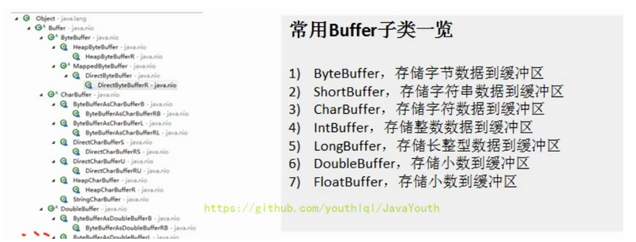

+   Buffer 类定义了所有的缓冲区都具有的四个属性来提供关于其所包含的数据元素的信息：

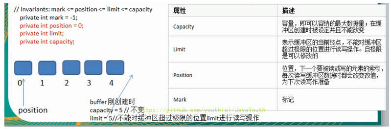

+   Buffer 类相关方法一览

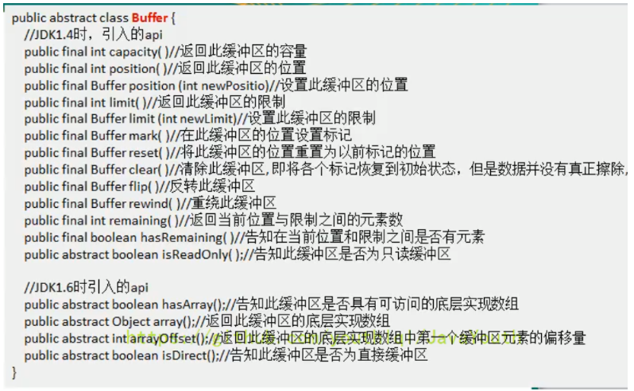

+   ByteBuffer

从前面可以看出对于 Java 中的基本数据类型（boolean 除外），都有一个 Buffer 类型与之相对应，最常用的自然是 ByteBuffer 类（二进制数据），该类的主要方法如下：

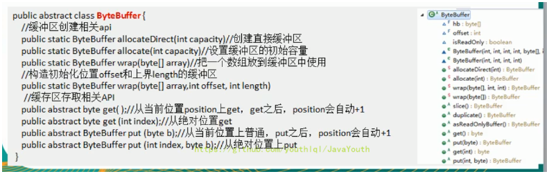

## 通道Channel

### 基本介绍

+   NIO 的通道类似于流，但有些区别如下：
    *   通道可以同时进行读写，而流只能读或者只能写
    *   通道可以实现异步读写数据
    *   通道可以从缓冲读数据，也可以写数据到缓冲:
+   BIO 中的 Stream 是单向的，例如 FileInputStream 对象只能进行读取数据的操作，而 NIO 中的通道（Channel）是双向的，可以读操作，也可以写操作。
+   Channel 在 NIO 中是一个接口 public interface Channel extends Closeable{}
+   常用的 Channel 类有
    *   FileChannel:用于文件的数据读写
    *   DatagramChannel:用于 UDP 的数据读写
    *   ServerSocketChannel 和 SocketChannel:ServerSocketChannel 和 SocketChannel 用于 TCP 的数据读写 【ServerSocketChanne 类似 ServerSocket、SocketChannel 类似 Socket】
+   图示

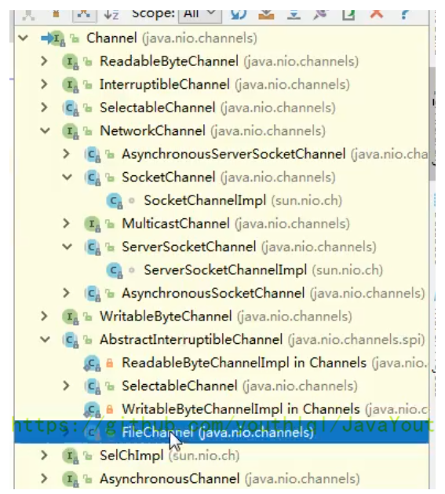

### FileChannel 类

FileChannel 主要用来对本地文件进行 IO 操作，常见的方法有

+   public int read(ByteBuffer dst)，从通道读取数据并放到缓冲区中
+   public int write(ByteBuffer src)，把缓冲区的数据写到通道中
+   public long transferFrom(ReadableByteChannel src, long position, long count)，从目标通道中复制数据到当前通道
+   public long transferTo(long position, long count, WritableByteChannel target)，把数据从当前通道复制给目标通道

### 应用实例1 - 本地文件写数据

实例要求：

+   使用前面学习后的 ByteBuffer（缓冲）和 FileChannel（通道），将 “hello,尚硅谷” 写入到 file01.txt 中
+   文件不存在就创建
+   代码演示

```java
package com.atguigu.nio;

import java.io.FileOutputStream;
import java.nio.ByteBuffer;
import java.nio.channels.FileChannel;

public class NIOFileChannel01 {

    public static void main(String[] args) throws Exception {
        String str = "hello,尚硅谷";
        //创建一个输出流 -> channel
        FileOutputStream fileOutputStream = new FileOutputStream("d:\\file01.txt");

        //通过 fileOutputStream 获取对应的 FileChannel
        //这个 fileChannel 真实类型是 FileChannelImpl
        FileChannel fileChannel = fileOutputStream.getChannel();

        //创建一个缓冲区 ByteBuffer
        ByteBuffer byteBuffer = ByteBuffer.allocate(1024);

        //将 str 放入 byteBuffer
        byteBuffer.put(str.getBytes());

        //对 byteBuffer 进行 flip
        byteBuffer.flip();

        //将 byteBuffer 数据写入到 fileChannel
        fileChannel.write(byteBuffer);
        fileOutputStream.close();
    }
}
```

### 应用实例2 - 本地文件读数据

实例要求：

+   使用前面学习后的 ByteBuffer（缓冲）和 FileChannel（通道），将 file01.txt 中的数据读入到程序，并显示在控制台屏幕
+   假定文件已经存在
+   代码演示

```java
package com.atguigu.nio;

import java.io.File;
import java.io.FileInputStream;
import java.nio.ByteBuffer;
import java.nio.channels.FileChannel;

public class NIOFileChannel02 {

    public static void main(String[] args) throws Exception {

        //创建文件的输入流
        File file = new File("d:\\file01.txt");
        FileInputStream fileInputStream = new FileInputStream(file);

        //通过 fileInputStream 获取对应的 FileChannel -> 实际类型 FileChannelImpl
        FileChannel fileChannel = fileInputStream.getChannel();

        //创建缓冲区
        ByteBuffer byteBuffer = ByteBuffer.allocate((int)file.length());

        //将通道的数据读入到 Buffer
        fileChannel.read(byteBuffer);

        //将 byteBuffer 的字节数据转成 String
        System.out.println(new String(byteBuffer.array()));
        fileInputStream.close();
    }
}
```

### 应用实例3 - 使用一个 Buffer 完成文件读取、写入

实例要求：

+   使用 FileChannel（通道）和方法 read、write，完成文件的拷贝
+   拷贝一个文本文件 1.txt，放在项目下即可
+   代码演示


```java
package com.atguigu.nio;

import java.io.FileInputStream;
import java.io.FileOutputStream;
import java.nio.ByteBuffer;
import java.nio.channels.FileChannel;

public class NIOFileChannel03 {

    public static void main(String[] args) throws Exception {

        FileInputStream fileInputStream = new FileInputStream("1.txt");
        FileChannel fileChannel01 = fileInputStream.getChannel();
        FileOutputStream fileOutputStream = new FileOutputStream("2.txt");
        FileChannel fileChannel02 = fileOutputStream.getChannel();

        ByteBuffer byteBuffer = ByteBuffer.allocate(512);

        while (true) { //循环读取

            //这里有一个重要的操作，一定不要忘了
            /*
            public final Buffer clear() {
                position = 0;
                limit = capacity;
                mark = -1;
                return this;
            }
            */
            byteBuffer.clear(); //清空 buffer
            int read = fileChannel01.read(byteBuffer);
            System.out.println("read = " + read);
            if (read == -1) { //表示读完
                break;
            }

            //将 buffer 中的数据写入到 fileChannel02--2.txt
            byteBuffer.flip();
            fileChannel02.write(byteBuffer);
        }

        //关闭相关的流
        fileInputStream.close();
        fileOutputStream.close();
    }
}
```

### 应用实例4 - 拷贝文件 transferFrom 方法

实例要求：

+   使用 FileChannel（通道）和方法 transferFrom，完成文件的拷贝
+   拷贝一张图片
+   代码演示

```java
package com.atguigu.nio;

import java.io.FileInputStream;
import java.io.FileOutputStream;
import java.nio.channels.FileChannel;

public class NIOFileChannel04 {

    public static void main(String[] args) throws Exception {

        //创建相关流
        FileInputStream fileInputStream = new FileInputStream("d:\\a.jpg");
        FileOutputStream fileOutputStream = new FileOutputStream("d:\\a2.jpg");

        //获取各个流对应的 FileChannel
        FileChannel sourceCh = fileInputStream.getChannel();
        FileChannel destCh = fileOutputStream.getChannel();

        //使用 transferForm 完成拷贝
        destCh.transferFrom(sourceCh, 0, sourceCh.size());

        //关闭相关通道和流
        sourceCh.close();
        destCh.close();
        fileInputStream.close();
        fileOutputStream.close();
    }
}
```

### 关于 Buffer 和 Channel 的注意事项和细节

+   ByteBuffer 支持类型化的 put 和 get，`put 放入的是什么数据类型，get 就应该使用相应的数据类型来取出`，否则可能有 BufferUnderflowException 异常。【举例说明】

```java
package com.atguigu.nio;

import java.nio.ByteBuffer;

public class NIOByteBufferPutGet {

    public static void main(String[] args) {

        //创建一个 Buffer
        ByteBuffer buffer = ByteBuffer.allocate(64);

        //类型化方式放入数据
        buffer.putInt(100);
        buffer.putLong(9);
        buffer.putChar('尚');
        buffer.putShort((short) 4);

        //取出
        buffer.flip();

        System.out.println();

        System.out.println(buffer.getInt());
        System.out.println(buffer.getLong());
        System.out.println(buffer.getChar());
        System.out.println(buffer.getShort());
    }
}
```

+   可以将一个普通 Buffer `转成只读 Buffer`【举例说明】

```java
package com.atguigu.nio;

import java.nio.ByteBuffer;

public class ReadOnlyBuffer {

    public static void main(String[] args) {

        //创建一个 buffer
        ByteBuffer buffer = ByteBuffer.allocate(64);

        for (int i = 0; i < 64; i++) {
            buffer.put((byte) i);
        }

        //读取
        buffer.flip();

        //得到一个只读的 Buffer
        ByteBuffer readOnlyBuffer = buffer.asReadOnlyBuffer();
        System.out.println(readOnlyBuffer.getClass());

        //读取
        while (readOnlyBuffer.hasRemaining()) {
            System.out.println(readOnlyBuffer.get());
        }

        readOnlyBuffer.put((byte) 100); //ReadOnlyBufferException
    }
}
```

+   NIO 还提供了 MappedByteBuffer，可以让文件`直接在内存（堆外的内存）中进行修改`，而如何同步到文件由 NIO 来完成。【举例说明】

```java
package com.atguigu.nio;

import java.io.RandomAccessFile;
import java.nio.MappedByteBuffer;
import java.nio.channels.FileChannel;

/**
 * 说明 1.MappedByteBuffer 可让文件直接在内存（堆外内存）修改,操作系统不需要拷贝一次
 */
public class MappedByteBufferTest {

    public static void main(String[] args) throws Exception {

        RandomAccessFile randomAccessFile = new RandomAccessFile("1.txt", "rw");
        //获取对应的通道
        FileChannel channel = randomAccessFile.getChannel();

        /**
         * 参数 1:FileChannel.MapMode.READ_WRITE 使用的读写模式
         * 参数 2：0：可以直接修改的起始位置
         * 参数 3:5: 是映射到内存的大小（不是索引位置），即将 1.txt 的多少个字节映射到内存
         * 可以直接修改的范围就是 0-5
         * 实际类型 DirectByteBuffer
         */
        MappedByteBuffer mappedByteBuffer = channel.map(FileChannel.MapMode.READ_WRITE, 0, 5);

        mappedByteBuffer.put(0, (byte) 'H');
        mappedByteBuffer.put(3, (byte) '9');
        mappedByteBuffer.put(5, (byte) 'Y');//IndexOutOfBoundsException

        randomAccessFile.close();
        System.out.println("修改成功~~");
    }
}
```

+   前面我们讲的读写操作，都是通过一个 Buffer 完成的，`NIO 还支持通过多个 Buffer（即 Buffer数组）完成读写操作`，即 Scattering 和 Gathering【举例说明】
    *   Scaterring 撒开,分散,将来自于一个Channel的数据分散到多个Buffer当中,`一个满了就用下一个`,可以实现数据的分门别类.
    *   这样就省去了解析的时间,比如一个消息有三个部分,第一部分是头信息,第二部分是协议信息,第三部分是消息体.可以吧这三个消息分别放到不同的Ｂuffer当中，
    *   Gatering 把多个汇总成一个,将要写到Channel的数据,

```java
package com.atguigu.nio;

import java.net.InetSocketAddress;
import java.nio.ByteBuffer;
import java.nio.channels.ServerSocketChannel;
import java.nio.channels.SocketChannel;
import java.util.Arrays;

/**
 * Scattering：将数据写入到 buffer 时，可以采用 buffer 数组，依次写入 [分散]
 * Gathering：从 buffer 读取数据时，可以采用 buffer 数组，依次读
 */
public class ScatteringAndGatheringTest {

    public static void main(String[] args) throws Exception {

        //使用 ServerSocketChannel 和 SocketChannel 网络
        ServerSocketChannel serverSocketChannel = ServerSocketChannel.open();
        InetSocketAddress inetSocketAddress = new InetSocketAddress(7000);

        //绑定端口到 socket，并启动
        serverSocketChannel.socket().bind(inetSocketAddress);

        //创建 buffer 数组
        ByteBuffer[] byteBuffers = new ByteBuffer[2];
        byteBuffers[0] = ByteBuffer.allocate(5);
        byteBuffers[1] = ByteBuffer.allocate(3);

        //等客户端连接 (telnet)
        SocketChannel socketChannel = serverSocketChannel.accept();

        int messageLength = 8; //假定从客户端接收 8 个字节

        //循环的读取
        while (true) {
            int byteRead = 0;

            while (byteRead < messageLength) {
                long l = socketChannel.read(byteBuffers);
                byteRead += l; //累计读取的字节数
                System.out.println("byteRead = " + byteRead);
                //使用流打印,看看当前的这个 buffer 的 position 和 limit
                Arrays.asList(byteBuffers).stream().map(buffer -> "position = " + buffer.position() + ", limit = " + buffer.limit()).forEach(System.out::println);
            }

            //将所有的 buffer 进行 flip
            Arrays.asList(byteBuffers).forEach(buffer -> buffer.flip());
            //将数据读出显示到客户端
            long byteWirte = 0;
            while (byteWirte < messageLength) {
                long l = socketChannel.write(byteBuffers);//
                byteWirte += l;
            }

            //将所有的buffer进行clear
            Arrays.asList(byteBuffers).forEach(buffer -> {
                buffer.clear();
            });

            System.out.println("byteRead = " + byteRead + ", byteWrite = " + byteWirte + ", messagelength = " + messageLength);
        }
    }
}
```

## Selector（选择器）

### 基本介绍

+   Java 的 NIO，用非阻塞的 IO 方式。可以用一个线程，处理多个的客户端连接，就会使用到 Selector（选择器）。
+   Selector 能够检测多个注册的通道上是否有事件发生（注意：`多个 Channel 以事件的方式可以注册到同一个 Selector`），如果有事件发生，便获取事件然后针对每个事件进行相应的处理。这样就可以只用一个单线程去管理多个通道，也就是管理多个连接和请求。
+   `只有在连接/通道真正有读写事件发生时，才会进行读写`，就大大地减少了系统开销，并且不必为每个连接都创建一个线程，不用去维护多个线程。
+   避免了多线程之间的上下文切换导致的开销。

### Selector 示意图和特点说明

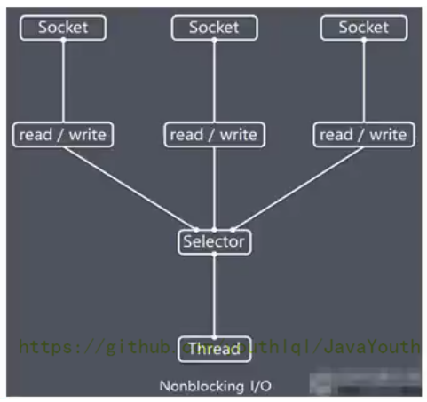

说明如下：

+   Netty 的 IO 线程 NioEventLoop 聚合了 Selector（选择器，也叫多路复用器），可以同时并发处理成百上千个客户端连接。
+   当线程从某客户端 Socket 通道进行读写数据时，若没有数据可用时，该线程可以进行其他任务。
+   线程通常将非阻塞 IO 的空闲时间用于在其他通道上执行 IO 操作，所以单独的线程可以管理多个输入和输出通道。
+   由于读写操作都是非阻塞的，这就可以充分提升 IO 线程的运行效率，避免由于频繁 I/O 阻塞导致的线程挂起。
+   一个 I/O 线程可以并发处理 N 个客户端连接和读写操作，这从根本上解决了传统同步阻塞 I/O 一连接一线程模型，架构的性能、弹性伸缩能力和可靠性都得到了极大的提升。

### Selector 类相关方法

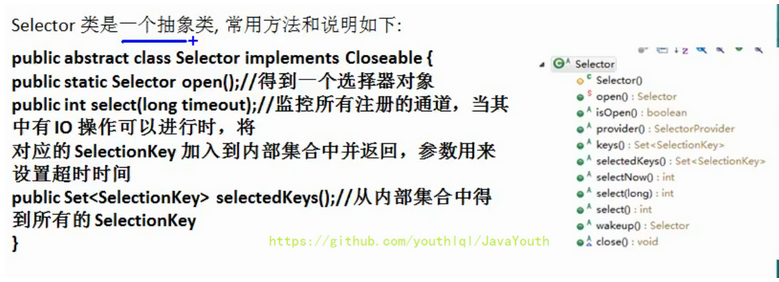

注意事项

+   NIO 中的 ServerSocketChannel 功能类似 ServerSocket、SocketChannel 功能类似 Socket。
+   Selector 相关方法说明
    *   selector.select(); //阻塞
    *   selector.select(1000); //阻塞 1000 毫秒，在 1000 毫秒后返回
    *   selector.wakeup(); //唤醒 selector
    *   selector.selectNow(); //不阻塞，立马返还

## NIO 非阻塞网络编程原理分析图

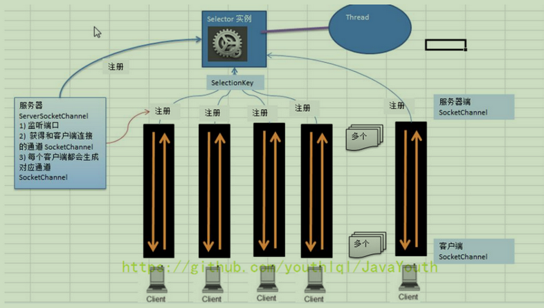

对上图的说明：

+   当客户端连接时，会通过 ServerSocketChannel 得到 SocketChannel。
+   Selector 进行监听 select 方法，返回有事件发生的通道的个数。
+   将 socketChannel 注册到 Selector 上，register(Selector sel, int ops)，一个 Selector 上可以注册多个 SocketChannel。
+   注册后返回一个 SelectionKey，会和该 Selector 关联（集合）。
+   进一步得到各个 SelectionKey（有事件发生）。
+   在通过 SelectionKey 反向获取 SocketChannel，方法 channel()。
+   可以通过得到的 channel，完成业务处理。
+   直接看后面代码吧

## NIO 非阻塞网络编程快速入门

案例：

+   编写一个 NIO 入门案例，实现服务器端和客户端之间的数据简单通讯（非阻塞）
+   目的：理解 NIO 非阻塞网络编程机制

```java
package com.atguigu.nio;

import java.net.InetSocketAddress;
import java.nio.ByteBuffer;
import java.nio.channels.*;
import java.util.Iterator;
import java.util.Set;

public class NIOServer {
    public static void main(String[] args) throws Exception{

        //得到一个Selecor对象
        Selector selector = Selector.open();

        //创建ServerSocketChannel -> ServerSocket
        ServerSocketChannel serverSocketChannel = ServerSocketChannel.open();

        //绑定一个端口6666, 在服务器端监听
        serverSocketChannel.socket().bind(new InetSocketAddress(6666));
        //设置为非阻塞
        serverSocketChannel.configureBlocking(false);

        //把 serverSocketChannel 注册到  selector 关心 事件为 OP_ACCEPT       pos_1
        serverSocketChannel.register(selector, SelectionKey.OP_ACCEPT);

        System.out.println("注册后的selectionkey 数量=" + selector.keys().size()); // 1


        //循环等待客户端连接
        while (true) {
            //这里我们等待1秒，如果没有事件发生, 返回
            if(selector.select(1000) == 0) { //没有事件发生
                System.out.println("服务器等待了1秒，无连接");
                continue;
            }

            //如果返回的>0, 就获取到相关的 selectionKey集合
            //1.如果返回的>0， 表示已经获取到关注的事件
            //2. selector.selectedKeys() 返回关注事件的集合
            //   通过 selectionKeys 反向获取通道
            Set<SelectionKey> selectionKeys = selector.selectedKeys();
            System.out.println("selectionKeys 数量 = " + selectionKeys.size());

            //遍历 Set<SelectionKey>, 使用迭代器遍历
            Iterator<SelectionKey> keyIterator = selectionKeys.iterator();

            while (keyIterator.hasNext()) {
                //获取到SelectionKey
                SelectionKey key = keyIterator.next();
                //根据key 对应的通道发生的事件做相应处理
                if(key.isAcceptable()) { //如果是 OP_ACCEPT, 有新的客户端连接
                    //该该客户端生成一个 SocketChannel
                    SocketChannel socketChannel = serverSocketChannel.accept();
                    System.out.println("客户端连接成功 生成了一个 socketChannel " + socketChannel.hashCode());
                    //将  SocketChannel 设置为非阻塞
                    socketChannel.configureBlocking(false);
                    //将socketChannel 注册到selector, 关注事件为 OP_READ， 同时给socketChannel
                    //关联一个Buffer
                    socketChannel.register(selector, SelectionKey.OP_READ, ByteBuffer.allocate(1024));

                    System.out.println("客户端连接后 ，注册的selectionkey 数量=" + selector.keys().size()); //2,3,4..


                }
                if(key.isReadable()) {  //发生 OP_READ

                    //通过key 反向获取到对应channel
                    SocketChannel channel = (SocketChannel)key.channel();

                    //获取到该channel关联的buffer
                    ByteBuffer buffer = (ByteBuffer)key.attachment();
                    channel.read(buffer);
                    System.out.println("form 客户端 " + new String(buffer.array()));

                }

                //手动从集合中移动当前的selectionKey, 防止重复操作
                keyIterator.remove();
            }
        }
    }
}
```

+   对操作系统有一定了解的同学，就会大概知道这里监听的是一个Accept通道。这个通道的作用就是监听，实际建立连接了还会有一个通道。
+   简单说一下为什么。因为客户端发请求的时候，`服务器这边是肯定要先有一个监听通道，监听某个端口是否有客户端要建立链接，如果有客户端想要建立链接，那么会再创建一个和客户端真正通信的通道`。
+   如果有其它客户端还想要建立链接，这个Accept监听端口监听到了，就会再创建几个真正的通信通道。
+   也就是Server的一个端口可以建立多个TCP连接，因为IP层协议通过目标地址+端口+源地址+源端口四个信息识别一个上下文

```java
package com.atguigu.nio;

import java.net.InetSocketAddress;
import java.nio.ByteBuffer;
import java.nio.channels.SocketChannel;

public class NIOClient {
    public static void main(String[] args) throws Exception{

        //得到一个网络通道
        SocketChannel socketChannel = SocketChannel.open();
        //设置非阻塞
        socketChannel.configureBlocking(false);
        //提供服务器端的ip 和 端口
        InetSocketAddress inetSocketAddress = new InetSocketAddress("127.0.0.1", 6666);
        //连接服务器
        if (!socketChannel.connect(inetSocketAddress)) {

            while (!socketChannel.finishConnect()) {
                System.out.println("因为连接需要时间，客户端不会阻塞，可以做其它工作..");
            }
        }

        //...如果连接成功，就发送数据
        String str = "hello, 尚硅谷~";
        //Wraps a byte array into a buffer
        ByteBuffer buffer = ByteBuffer.wrap(str.getBytes());
        //发送数据，将 buffer 数据写入 channel
        socketChannel.write(buffer);
        System.in.read();

    }
}
```

### SelectionKey

[NIO SelectionKey事件理解](https://www.jianshu.com/p/46e3ceee3bb1)

+   SelectionKey，表示 Selector 和网络通道的注册关系，共四种：
    *   int OP_ACCEPT：有新的网络连接可以 accept，值为 16
        -   Operation-set bit for socket-accept operations. Suppose that a selection key's interest set contains OP_ACCEPT at the start of a selection operatio. If the selector detects that the corresponding server-socket channel is ready to accept another connection, or has an error pending, then it will add OP_ACCEPT to the key's ready set and add the key to its selected-key set.
        -   表明一个SelectionKey包含Accept事件，当selector检测到关联的`server-socket channel准备好接受一个连接或者发生错误时`，会将该事件加入到该key的'ready set'中，并将该key加入到selected-key set中。
    *   int OP_CONNECT：代表连接已经建立，值为 8
        -   Operation-set bit for socket-connect operations. Suppose that a selection key's interest set contains OP_CONNECT at the start of a selection operation. If the selector detects that the corresponding socket channel is ready to complete its connection sequence, or has an error pending, then it will add OP_CONNECT to he key's ready set and add the key to its selected-key set.
        -   当一个`socket channel已经准备好完成连接操作或者发生错误`时会将该事件加入到该key的'ready set'中，并将该key加入到selected-key set中。
    *   int OP_READ：代表读操作，值为 1
        -   Operation-set bit for read operations. Suppose that a selection key's interest set contains OP_READ at the start of a selection operation. If the selector detects that the corresponding channel is ready for reading, has reached end-of-stream, has been remotely shut down for further reading, or has an error pending, then it will add OP_READ to the key's ready-operation set and add the key to its selected-key set.
        -   当一个`channel准备好可以被读取`（比如socket已经读到了新的字节，其读取缓冲区有尚未被应用读取的数据，可通知应用程序从读取缓冲区进行读取）、已经到达数据流的结尾、远程另一端已经关闭或者发生错误时，会将该事件加入到该key的'ready set'中，并将该key加入到selected-key set中。
    *   int OP_WRITE：代表写操作，值为 4
        -   Operation-set bit for write operations. Suppose that a selection key's interest set contains OP_WRITE at the start of a selection operation. If the selector detects that the corresponding channel is ready for writing, has been remotely shut down for further writing, or has an error pending, then it will add OP_WRITE to the key's ready set and add the key to its selected-key set.
        -   当一个`channel 准备好进行写入操作`（比如原先socket写入缓冲已满，现在已经发送了部分数据，写入缓冲腾出了一些空间，会通知应用程序进行写入）、远程另一端已经关闭或者发生错误时，会将该事件加入到该key的'ready set'中，并将该key加入到selected-key set中。
+   通过上面的注释，我们可以知道注册事件只是告诉selector在检测到各种事件准备好可以执行时告诉应用，应用可以执行相应的事件，但是注册感兴趣的事件并不是必须的，没有注册事件依然可以进行读取、写入操作，比如读取操作，如果不注册OP_READ事件，应用程序依然可以随时尝试从channel中读取数据，但是并不能保证读取成功，因为可能socket读取缓冲区中可能并不存在数据。但是如果注册了OP_READ事件，在selector检测到该事件准备好了再去读取，则可以最大程度上的保证可以读到数据。写入也是一样的道理，不注册OP_WRITE应用程序也可以随时进行写入，但是可能因为缓冲区满而写入失败，如果注册了OP_WRITE事件，在selector检测到该事件时再进行写入，可以最大程度上保证写入成功。所以说注册相关事件不是必须的，注册了事件可以由selector检测到事件准备好可以执行了再执行相关的事件，避免了许多无效的尝试。


源码中:

```
public static final int OP_READ = 1 << 0;
public static final int OP_WRITE = 1 << 2;
public static final int OP_CONNECT = 1 << 3;
public static final int OP_ACCEPT = 1 << 4;
```

+   SelectionKey 相关方法

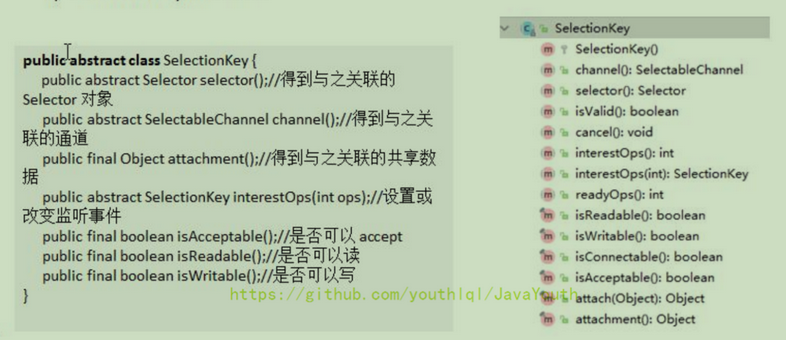


### ServerSocketChannel


+   ServerSocketChannel 在服务器端监听新的客户端 Socket 连接，负责监听，不负责实际的读写操作
+   相关方法如下

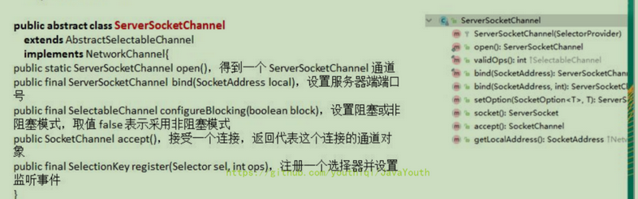

### SocketChannel

+   SocketChannel，网络 IO 通道，具体负责进行读写操作。NIO 把缓冲区的数据写入通道，或者把通道里的数据读到缓冲区。
+   相关方法如下

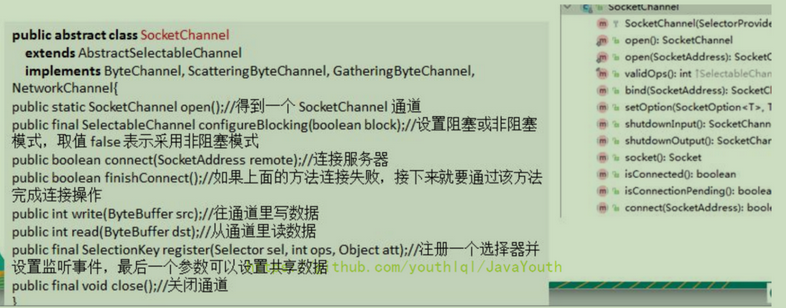

## NIO网络编程应用实例 - 群聊系统

实例要求：

+   编写一个 NIO 群聊系统，实现服务器端和客户端之间的数据简单通讯（非阻塞）
+   实现多人群聊
+   服务器端：可以监测用户上线，离线，并实现消息转发功能
+   客户端：通过 Channel 可以无阻塞发送消息给其它所有用户，同时可以接受其它用户发送的消息（有服务器转发得到）
+   目的：进一步理解 NIO 非阻塞网络编程机制
+   示意图分析和代码

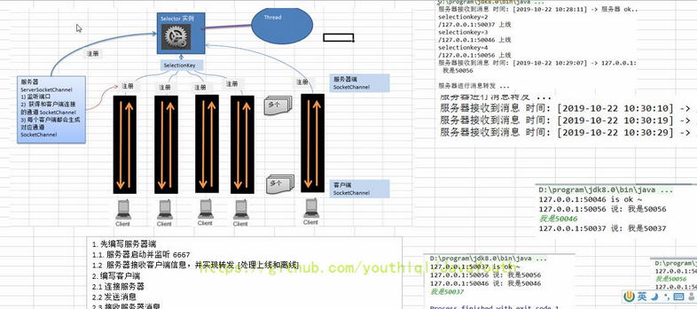

代码:

服务端:

```java
package com.atguigu.nio.groupchat;

package com.learn.nio;

import java.io.IOException;
import java.net.InetSocketAddress;
import java.nio.ByteBuffer;
import java.nio.channels.*;
import java.util.Iterator;

public class GroupChatServer {
    // 定义属性
    private Selector selector;
    private ServerSocketChannel listenChannel;

    private static final int PORT = 6667;

    // 构造器
    // 初始化工作
    public GroupChatServer() {
        try {
            // 服务端启动一个选择器对象
            selector = Selector.open();

            // 服务端启动一个 ServerSocketChannel 通道
            // -> 即服务器这边要先有一个监听通道,监听某个端口是否有客户端要建立连接
            listenChannel = ServerSocketChannel.open();
            // -> 绑定端口
            listenChannel.socket().bind(new InetSocketAddress(PORT));
            // -> 设置非阻塞模式
            listenChannel.configureBlocking(false);

            // 将该 listenChannel 注册到 selector,且设置 listenChannel 的事件状态为准备好接收一个连接
            listenChannel.register(selector, SelectionKey.OP_ACCEPT);


        } catch (IOException e) {
            e.printStackTrace();
        }
    }

    public void listen() {
        try {
            while (true) {
                // 监控所有注册的通道,当其中有IO操作时,将对应的 SelectionKey 加入到内部集合中并返回,参数用来设置超时时间
                int count = selector.select();
                System.out.println("count: " + count);
                if (count > 0) {    // 说明有事件处理
                    // SelectionKey 集合的迭代器
                    Iterator<SelectionKey> iterator = selector.selectedKeys().iterator();
                    while (iterator.hasNext()) {
                        // 取出 selectionKey
                        SelectionKey key = iterator.next();
                        // 判断是哪种类型的key
                        if (key.isAcceptable()) {   // 这个key对应的客户端"需要一个连接"
                            // 监听通道监听到有客户端要建立连接,所以创建一个和客户端真正通信的通道
                            // 所以,listenChannel 接受(.accept()) 这个连接,并为其创建通道
                            SocketChannel sc = listenChannel.accept();
                            // 设置这个新通道是非阻塞的
                            sc.configureBlocking(false);
                            // 将该 sc 注册到 selector,以读的方式
                            sc.register(selector, SelectionKey.OP_READ);
                            // 提示
                            System.out.println(sc.getRemoteAddress() + "上线");
                        }
                        if (key.isReadable()) {     // 这个key对应的客户端"可读"
                            // 处理读(专门写方法..)
                            readData(key);
                        }
                        // key处理完后要记得删除,防止重复处理
                        iterator.remove();
                    }
                }

            }
        } catch (IOException e) {
            e.printStackTrace();
        } finally {
            // 发生异常处理...
        }
    }

    /**
     * 读取客户端消息
     *
     * @param key 事件的key
     */
    public void readData(SelectionKey key) {
        SocketChannel channel = null;
        try {
            // 前面已经为该 key事件 创建了对应的channel
            // 根据 key 得到 channel
            channel = (SocketChannel) key.channel();
            // 创建 buffer
            ByteBuffer buffer = ByteBuffer.allocate(1024);
            // 从 buffer 中读取数据到 channel
            int count = channel.read(buffer);
            // 根据 count 的值做处理
            if (count > 0) {
                // 将缓存区的数据转成字符串
                String msg = new String(buffer.array());
                // 输出该消息
                System.out.println("from客户端: " + msg);
                // 向其他的客户端转发消息(去掉自己),专门写一个方法来处理
                sendInfoToOtherClients(msg, channel);
            }
        } catch (IOException e) {
            try {
                System.out.println(channel.getRemoteAddress() + "离线了");
                // 取消注册
                key.cancel();
                // 关闭通道
                channel.close();
            } catch (IOException e2) {
                e2.printStackTrace();
            }
        }
    }

    private void sendInfoToOtherClients(String msg, SocketChannel self) throws IOException {
        System.out.println("服务器转发消息中...");
        // 遍历所有注册到 selector 上的 SocketChannel,并排除 self
        for (SelectionKey key : selector.keys()) {
            // 通过 key 取出对应的 SocketChannel
            Channel targetChannel = key.channel();
            // 排除自己
            if (targetChannel instanceof SocketChannel && targetChannel != self) {
                // 转型
                SocketChannel dest = (SocketChannel) targetChannel;
                // 将 msg 存储到 buffer
                ByteBuffer buffer = ByteBuffer.wrap(msg.getBytes());
                // 将 buffer 的数据写入通道
                dest.write(buffer);
            }
        }
    }

    public static void main(String[] args) {
        // 创建服务器对象
        GroupChatServer groupChatServer = new GroupChatServer();
        groupChatServer.listen();
    }
}

```

客户端：

```java
package com.atguigu.nio.groupchat;

import java.io.IOException;
import java.net.InetSocketAddress;
import java.nio.ByteBuffer;
import java.nio.channels.SelectionKey;
import java.nio.channels.Selector;
import java.nio.channels.SocketChannel;
import java.util.Iterator;
import java.util.Scanner;

public class GroupChatClient {

    //定义相关的属性
    private final String HOST = "127.0.0.1";//服务器的ip
    private final int PORT = 6667;//服务器端口
    private Selector selector;
    private SocketChannel socketChannel;
    private String username;

    //构造器,完成初始化工作
    public GroupChatClient() throws IOException {

        selector = Selector.open();
        //连接服务器
        socketChannel = SocketChannel.open(new InetSocketAddress(HOST, PORT));
        //设置非阻塞
        socketChannel.configureBlocking(false);
        //将 channel 注册到selector
        socketChannel.register(selector, SelectionKey.OP_READ);
        //得到 username
        username = socketChannel.getLocalAddress().toString().substring(1);
        System.out.println(username + " is ok...");
    }

    //向服务器发送消息
    public void sendInfo(String info) {
        info = username + " 说：" + info;
        try {
            socketChannel.write(ByteBuffer.wrap(info.getBytes()));
        } catch (IOException e) {
            e.printStackTrace();
        }
    }

    //读取从服务器端回复的消息
    public void readInfo() {
        try {
            int readChannels = selector.select();
            if (readChannels > 0) {//有可以用的通道
                Iterator<SelectionKey> iterator = selector.selectedKeys().iterator();
                while (iterator.hasNext()) {
                    SelectionKey key = iterator.next();
                    if (key.isReadable()) {
                        //得到相关的通道
                        SocketChannel sc = (SocketChannel) key.channel();
                        //得到一个 Buffer
                        ByteBuffer buffer = ByteBuffer.allocate(1024);
                        //读取
                        sc.read(buffer);
                        //把读到的缓冲区的数据转成字符串
                        String msg = new String(buffer.array());
                        System.out.println(msg.trim());
                    }
                }
                iterator.remove(); //删除当前的 selectionKey,防止重复操作
            } else {
                //System.out.println("没有可以用的通道...");
            }
        } catch (Exception e) {
            e.printStackTrace();
        }
    }

    public static void main(String[] args) throws Exception {

        //启动我们客户端
        GroupChatClient chatClient = new GroupChatClient();
        //启动一个线程,每个 3 秒，读取从服务器发送数据
        new Thread() {
            public void run() {
                while (true) {
                    chatClient.readInfo();
                    try {
                        Thread.currentThread().sleep(3000);
                    } catch (InterruptedException e) {
                        e.printStackTrace();
                    }
                }
            }
        }.start();

        //发送数据给服务器端
        Scanner scanner = new Scanner(System.in);
        while (scanner.hasNextLine()) {
            String s = scanner.nextLine();
            chatClient.sendInfo(s);
        }
    }
}
```

## 参考

https://imlql.cn/post/3f9283e7.html