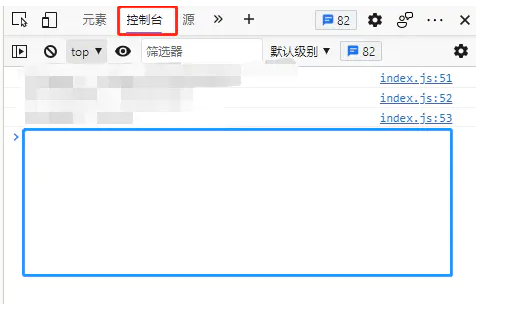

# 百度网盘限制转存500个文件自动选中脚本

----

今天朋友通过百度网盘分享了一些视频素材给我，想要通过浏览器保存到我本地的百度网盘，打开后发现文件没有进行压缩，足有上千个。

还好百度网盘提供了全选供能，但是全选后一保存，懵逼了。非会员只能同时选中500个文件，后面的500个难道要我一个一个点？

现在的社会，当然要自动执行了。按下键盘 F12 ，打开浏览器的控制台



在蓝色框处粘贴以下代码，回车，实现自动点击选中

`执行前，记得在左边文件列表，把滚动条拉到最下面，把所有文件都加载出来再执行`，不然只能选中已经加载的文件
start 就是选中的起始文件行，0 表示第一行，因为百度提供前500个文件的选中功能，所以这里一般从 500 开始
max 是最多选择多少个文件，百度的限制是最多500个所以这里一般不需要修改

```javascript
//设置起始的文件，如第1个就是0，第100个就是99
var start = 500
//一次最多选中500个
var max = 500
var dd = $("dd.g-clearfix.AuPKyz.open-enable");
$.each(dd,function(n,v){
    if ( start >= max ) return false;
    var position = $(v).attr("_position");
    if (position >= start) $(v).children("span.EOGexf").trigger("click");
    start ++
});
```

现在每次选中后，只需要点一直转存就可以啦~