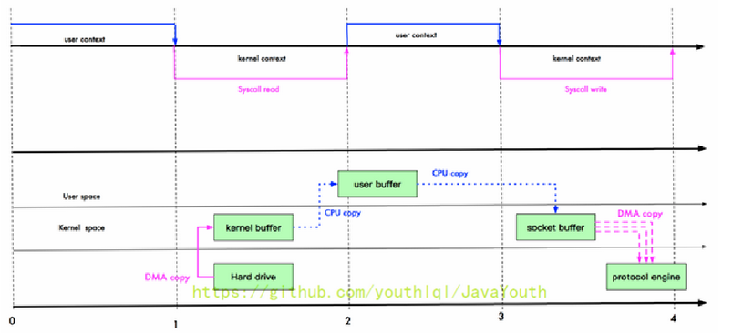
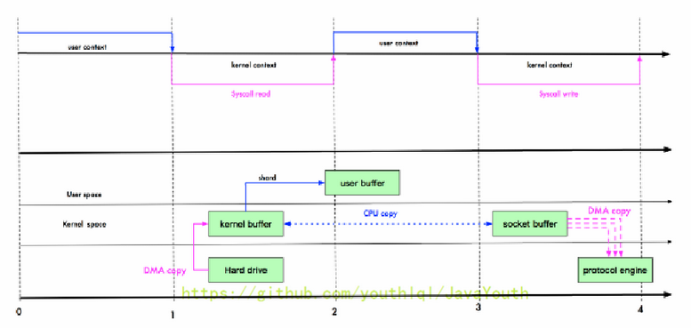
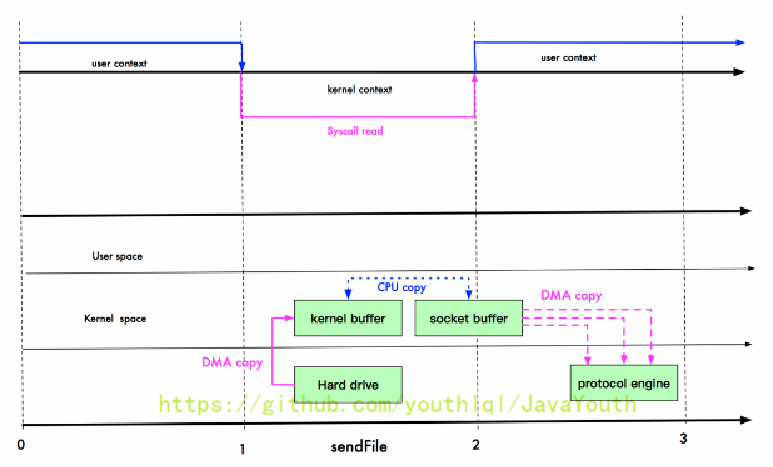
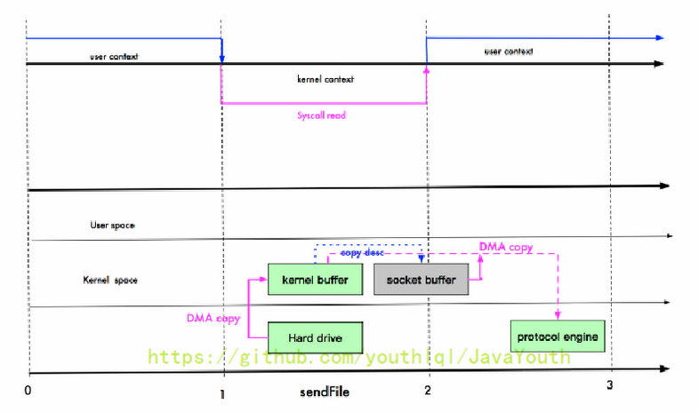

# Netty_NIO与零拷贝

----

## 零拷贝基本介绍

>   1、尚硅谷这里的零拷贝感觉讲的感觉有点问题，但是为了笔记的完整性，任然保留了这里的笔记。不过笔者考虑再写一篇零拷贝。
>
>   2、而且这里课件的图也看不太清
>
>   3、读者可以将我写的零拷贝和尚硅谷这里讲的零拷贝对照着看，取长补短


+   零拷贝是网络编程的关键，很多性能优化都离不开。
+   在 Java 程序中，常用的零拷贝有 mmap（内存映射）和 sendFile。那么，他们在 OS 里，到底是怎么样的一个的设计？我们分析 mmap 和 sendFile 这两个零拷贝
+   另外我们看下 NIO 中如何使用零拷贝

## 传统 IO 数据读写

Java 传统 IO 和网络编程的一段代码

```java
File file = new File("test.txt");
RandomAccessFile raf = new RandomAccessFile(file, "rw");

byte[] arr = new byte[(int) file.length()];
raf.read(arr);

Socket socket = new ServerSocket(8080).accept();
socket.getOutputStream().write(arr);
```



DMA：direct memory access 直接内存拷贝（不使用 CPU）

## mmap 优化

+   mmap 通过内存映射，将文件映射到内核缓冲区，同时，用户空间可以共享内核空间的数据。这样，在进行网络传输时，就可以减少内核空间到用户空间的拷贝次数。如下图
+   mmap 示意图



## sendFile 优化

+   Linux2.1 版本提供了 sendFile 函数，其基本原理如下：数据根本不经过用户态，直接从内核缓冲区进入到 SocketBuffer，同时，由于和用户态完全无关，就减少了一次上下文切换
+   示意图和小结



+   提示：零拷贝从操作系统角度，是没有 cpu 拷贝
+   Linux在2.4 版本中，做了一些修改，避免了从内核缓冲区拷贝到 Socketbuffer 的操作，直接拷贝到协议栈，从而再一次减少了数据拷贝。具体如下图和小结：



这里其实有一次 cpu 拷贝 kernel buffer -> socket buffer 但是，拷贝的信息很少，比如 lenght、offset 消耗低，可以忽略

## 零拷贝的再次理解

+   我们说零拷贝，是从操作系统的角度来说的。因为内核缓冲区之间，没有数据是重复的（只有 kernel buffer 有一份数据）。
+   零拷贝不仅仅带来更少的数据复制，还能带来其他的性能优势，例如更少的上下文切换，更少的 CPU 缓存伪共享以及无 CPU 校验和计算。

## mmap 和 sendFile 的区别

+   mmap 适合小数据量读写，sendFile 适合大文件传输。
+   mmap 需要 4 次上下文切换，3 次数据拷贝；sendFile 需要 3 次上下文切换，最少 2 次数据拷贝。
+   sendFile 可以利用 DMA 方式，减少 CPU 拷贝，mmap 则不能（必须从内核拷贝到 Socket缓冲区）。

## NIO 零拷贝案例

案例要求：

+   使用传统的 IO 方法传递一个大文件
+   使用 NIO 零拷贝方式传递（transferTo）一个大文件
+   看看两种传递方式耗时时间分别是多少

```java
NewIOServer.java

package com.atguigu.nio.zerocopy;

import java.net.InetSocketAddress;
import java.net.ServerSocket;
import java.nio.ByteBuffer;
import java.nio.channels.ServerSocketChannel;
import java.nio.channels.SocketChannel;

//服务器
public class NewIOServer {

    public static void main(String[] args) throws Exception {
        InetSocketAddress address = new InetSocketAddress(7001);
        ServerSocketChannel serverSocketChannel = ServerSocketChannel.open();
        ServerSocket serverSocket = serverSocketChannel.socket();
        serverSocket.bind(address);

        //创建buffer
        ByteBuffer byteBuffer = ByteBuffer.allocate(4096);

        while (true) {
            SocketChannel socketChannel = serverSocketChannel.accept();
            int readcount = 0;
            while (-1 != readcount) {
                try {
                    readcount = socketChannel.read(byteBuffer);
                } catch (Exception ex) {
                    // ex.printStackTrace();
                    break;
                }
                //
                byteBuffer.rewind(); //倒带 position = 0 mark 作废
            }
        }
    }
}

NewIOClient.java

package com.atguigu.nio.zerocopy;

import java.io.FileInputStream;
import java.net.InetSocketAddress;
import java.nio.channels.FileChannel;
import java.nio.channels.SocketChannel;

public class NewIOClient {

    public static void main(String[] args) throws Exception {
        SocketChannel socketChannel = SocketChannel.open();
        socketChannel.connect(new InetSocketAddress("localhost", 7001));
        String filename = "protoc-3.6.1-win32.zip";
        //得到一个文件channel
        FileChannel fileChannel = new FileInputStream(filename).getChannel();
        //准备发送
        long startTime = System.currentTimeMillis();
        //在 linux 下一个 transferTo 方法就可以完成传输
        //在 windows 下一次调用 transferTo 只能发送 8m, 就需要分段传输文件,而且要主要
        //传输时的位置=》课后思考...
        //transferTo 底层使用到零拷贝
        long transferCount = fileChannel.transferTo(0, fileChannel.size(), socketChannel);
        System.out.println("发送的总的字节数 = " + transferCount + " 耗时: " + (System.currentTimeMillis() - startTime));

        //关闭
        fileChannel.close();
    }
}
```