# Netty_高性能架构设计

----

## 线程模型基本介绍

+   不同的线程模式，对程序的性能有很大影响，为了搞清 Netty 线程模式，我们来系统的讲解下各个线程模式，最后看看 Netty 线程模型有什么优越性。
+   目前存在的线程模型有：传统阻塞 I/O 服务模型 和Reactor 模式
+   根据 Reactor 的数量和处理资源池线程的数量不同，有 3 种典型的实现
    *   单 Reactor 单线程；
    *   单 Reactor多线程；
    *   主从 Reactor多线程
+   Netty 线程模式（Netty 主要基于主从 Reactor 多线程模型做了一定的改进，其中主从 Reactor 多线程模型有多个 Reactor）

## 传统阻塞 I/O 服务模型

### 工作原理图

+   黄色的框表示对象，蓝色的框表示线程
+   白色的框表示方法（API）

### 模型特点

+   采用阻塞 IO 模式获取输入的数据
+   每个连接都需要独立的线程完成数据的输入，业务处理，数据返回

### 问题分析

+   当并发数很大，就会创建大量的线程，占用很大系统资源
+   连接创建后，如果当前线程暂时没有数据可读，该线程会阻塞在 Handler对象中的read 操作，导致上面的处理线程资源浪费

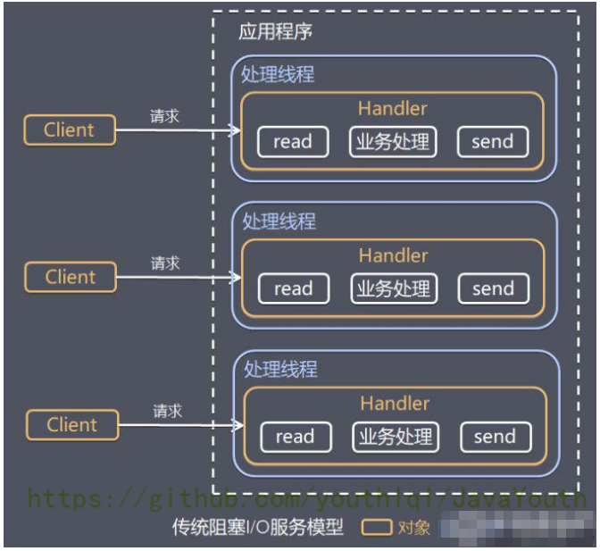

## Reactor 模式

### 针对传统阻塞 I/O 服务模型的 2 个缺点，解决方案：

基于 I/O 复用模型：多个连接共用一个阻塞对象ServiceHandler，应用程序只需要在一个阻塞对象等待，无需阻塞等待所有连接。当某个连接有新的数据可以处理时，操作系统通知应用程序，线程从阻塞状态返回，开始进行业务处理。

Reactor 在不同书中的叫法：

+   反应器模式
+   分发者模式（Dispatcher）
+   通知者模式（notifier）
+   基于线程池复用线程资源：不必再为每个连接创建线程，将连接完成后的业务处理任务分配给线程进行处理，一个线程可以处理多个连接的业务。（解决了当并发数很大时，会创建大量线程，占用很大系统资源）
+   基于 I/O 复用模型：多个客户端进行连接，先把连接请求给ServiceHandler。多个连接共用一个阻塞对象ServiceHandler。假设，当C1连接没有数据要处理时，C1客户端只需要阻塞于ServiceHandler，C1之前的处理线程便可以处理其他有数据的连接，不会造成线程资源的浪费。当C1连接再次有数据时，ServiceHandler根据线程池的空闲状态，将请求分发给空闲的线程来处理C1连接的任务。（解决了线程资源浪费的那个问题）

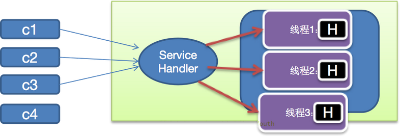

### I/O 复用结合线程池，就是 Reactor 模式基本设计思想，如图

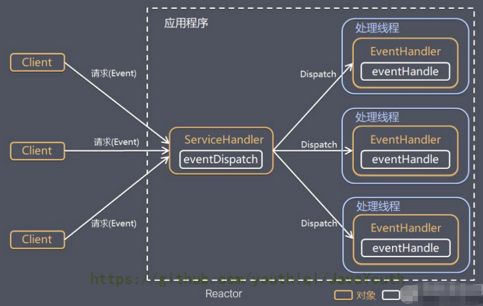

对上图说明：

+   Reactor 模式，通过一个或多个输入同时传递给服务处理器（ServiceHandler）的模式（基于事件驱动）
+   服务器端程序处理传入的多个请求,并将它们同步分派到相应的处理线程，因此 Reactor 模式也叫 Dispatcher 模式
+   Reactor 模式使用 IO 复用监听事件，收到事件后，分发给某个线程（进程），这点就是网络服务器高并发处理关键

`原先有多个Handler阻塞，现在只用一个ServiceHandler阻塞`

### Reactor 模式中核心组成

+   Reactor（也就是那个ServiceHandler）：Reactor 在一个单独的线程中运行，负责监听和分发事件，分发给适当的处理线程来对 IO 事件做出反应。它就像公司的电话接线员，它接听来自客户的电话并将线路转移到适当的联系人；
+   Handlers（处理线程EventHandler）：处理线程执行 I/O 事件要完成的实际事件，类似于客户想要与之交谈的公司中的实际官员。Reactor 通过调度适当的处理线程来响应 I/O 事件，处理程序执行非阻塞操作。

### Reactor 模式分类

根据 Reactor 的数量和处理资源池线程的数量不同，有 3 种典型的实现

+   单 Reactor 单线程
+   单 Reactor 多线程
+   主从 Reactor 多线程

## 单 Reactor 单线程

?>  使用场景：客户端的数量有限，业务处理非常快速

原理图，并使用 NIO 群聊系统验证

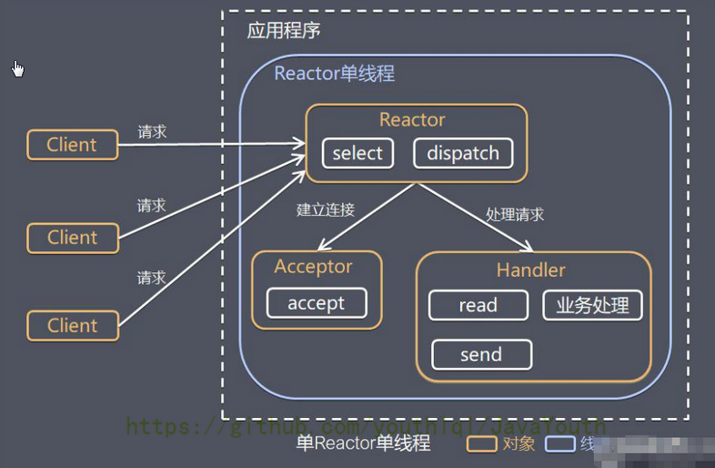

### 方案说明

+   Select 是前面 I/O 复用模型介绍的标准网络编程 API，可以实现应用程序通过一个阻塞对象监听多路连接请求
+   Reactor 对象通过 Select 监控客户端请求事件，收到事件后通过 Dispatch 进行分发
+   如果是建立连接请求事件，则由 Acceptor 通过 Accept 处理连接请求，然后创建一个 Handler 对象处理连接完成后的后续业务处理
+   如果不是建立连接事件，则 Reactor 会分发调用连接对应的 Handler 来响应
+   Handler 会完成 Read → 业务处理 → Send 的完整业务流程

结合实例：服务器端用一个线程通过多路复用搞定所有的 IO 操作（包括连接，读、写等），编码简单，清晰明了，但是如果客户端连接数量较多，将无法支撑，前面的 NIO 案例就属于这种模型。

### 方案优缺点分析

+   优点：模型简单，没有多线程、进程通信、竞争的问题，全部都在一个线程中完成
+   缺点：性能问题，只有一个线程，无法完全发挥多核 CPU 的性能。Handler在处理某个连接上的业务时，整个进程无法处理其他连接事件，很容易导致性能瓶颈
+   缺点：可靠性问题，线程意外终止，或者进入死循环，会导致整个系统通信模块不可用，不能接收和处理外部消息，造成节点故障
+   `使用场景：客户端的数量有限，业务处理非常快速`，比如 Redis 在业务处理的时间复杂度 O(1) 的情况

## 单 Reactor 多线程

### 方案说明

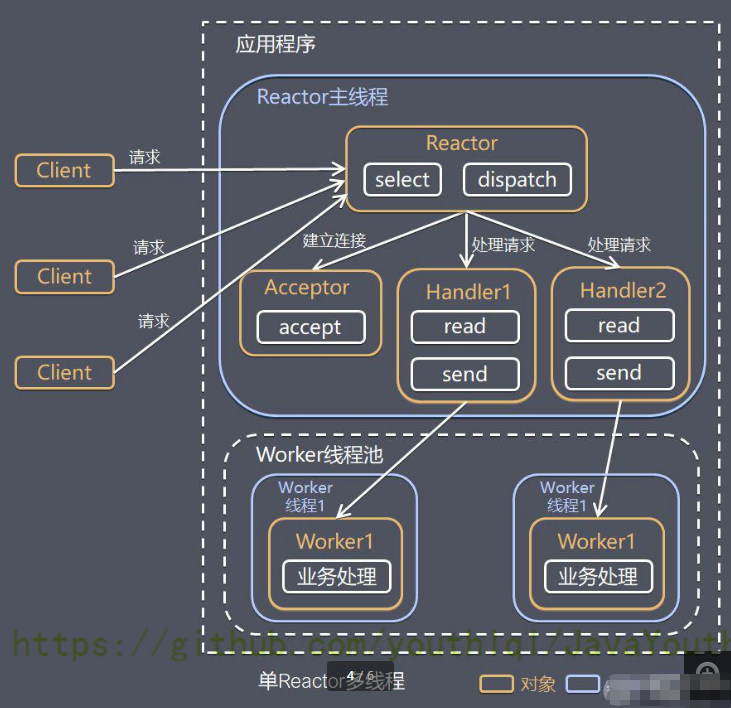

+   Reactor 对象通过 Select 监控客户端请求事件，收到事件后，通过 Dispatch 进行分发
+   如果是建立连接请求，则由 Acceptor 通过 accept 处理连接请求，然后创建一个 Handler 对象处理完成连接后的各种事件
+   如果不是连接请求，则由 Reactor 分发调用连接对应的 handler 来处理（也就是说连接已经建立，后续客户端再来请求，那基本就是数据请求了，直接调用之前为这个连接创建好的handler来处理）
+   handler 只负责响应事件，不做具体的业务处理（这样不会使handler阻塞太久），通过 read 读取数据后，会分发给后面的 worker 线程池的某个线程处理业务。【业务处理是最费时的，所以将业务处理交给线程池去执行】
+   worker 线程池会分配独立线程完成真正的业务，并将结果返回给 handler
+   handler 收到响应后，通过 send 将结果返回给 client

### 方案优缺点分析

+   优点：可以充分的利用多核 cpu 的处理能力
+   缺点：多线程数据共享和访问比较复杂。Reactor 承担所有的事件的监听和响应，它是单线程运行，在高并发场景容易出现性能瓶颈。也就是说Reactor主线程承担了过多的事

## 主从 Reactor 多线程

### 工作原理图

针对单 Reactor 多线程模型中，Reactor 在单线程中运行，高并发场景下容易成为性能瓶颈，可以让 Reactor 在多线程中运行

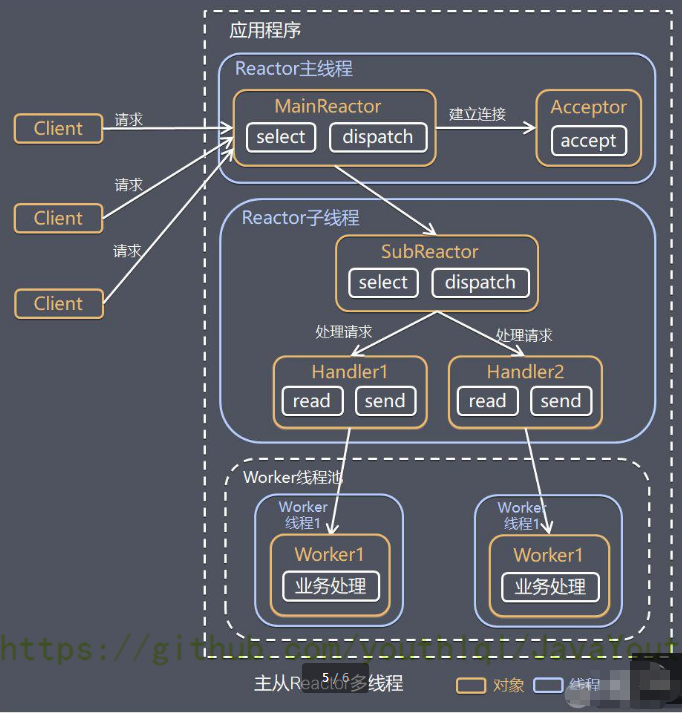

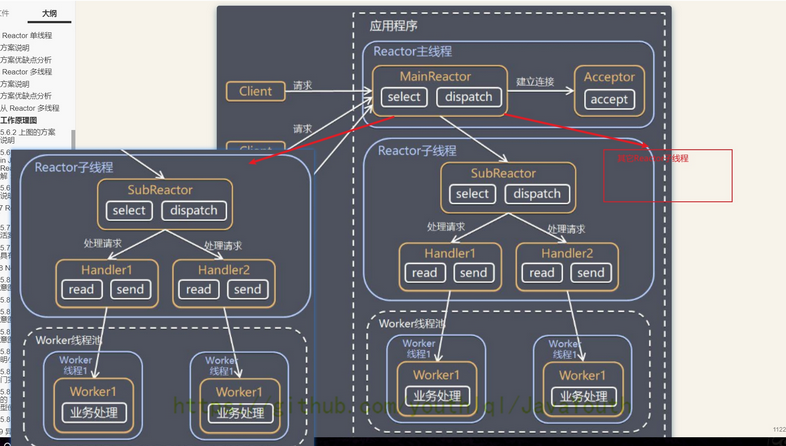

>   SubReactor是可以有多个的，如果只有一个SubReactor的话那和单 Reactor 多线程就没什么区别了。

+   Reactor 主线程 MainReactor 对象通过 select 监听连接事件，收到事件后，通过 Acceptor 处理连接事件
+   当 Acceptor 处理连接事件后，MainReactor 将连接分配给 SubReactor
+   subreactor 将连接加入到连接队列进行监听，并创建 handler 进行各种事件处理
+   当有新事件发生时，subreactor 就会调用对应的 handler 处理
+   handler 通过 read 读取数据，分发给后面的 worker 线程处理
+   worker 线程池分配独立的 worker 线程进行业务处理，并返回结果
+   handler 收到响应的结果后，再通过 send 将结果返回给 client
+   Reactor 主线程可以对应多个 Reactor 子线程，即 MainRecator 可以关联多个 SubReactor

### Scalable IO in Java 对 Multiple Reactors 的原理图解

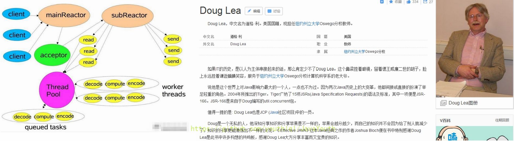

### 方案优缺点说明

+   优点：父线程与子线程的数据交互简单职责明确，父线程只需要接收新连接，子线程完成后续的业务处理。
+   优点：父线程与子线程的数据交互简单，Reactor 主线程只需要把新连接传给子线程，子线程无需返回数据。
+   缺点：编程复杂度较高

结合实例：这种模型在许多项目中广泛使用，包括 Nginx 主从 Reactor 多进程模型，Memcached 主从多线程，Netty 主从多线程模型的支持

## Reactor 模式小结

### 3 种模式用生活案例来理解

+   单 Reactor 单线程，前台接待员和服务员是同一个人，全程为顾客服
+   单 Reactor 多线程，1 个前台接待员，多个服务员，接待员只负责接待
+   主从 Reactor 多线程，多个前台接待员，多个服务生

### Reactor 模式具有如下的优点

+   响应快，不必为单个同步时间所阻塞，虽然 Reactor 本身依然是同步的（比如你第一个SubReactor阻塞了，我可以调下一个 SubReactor为客户端服务）
+   可以最大程度的避免复杂的多线程及同步问题，并且避免了多线程/进程的切换开销
+   扩展性好，可以方便的通过增加 Reactor 实例个数来充分利用 CPU 资源
+   复用性好，Reactor 模型本身与具体事件处理逻辑无关，具有很高的复用性

## Netty 模型

>   讲解netty的时候采用的是先写代码体验一下，再细讲里面的原理。前面看不懂的可以先不用纠结，先往后面看，后面基本都会讲清楚

### 工作原理示意图1 - 简单版

Netty 主要基于主从 Reactors 多线程模型（如图）做了一定的改进，其中主从 Reactor 多线程模型有多个 Reactor

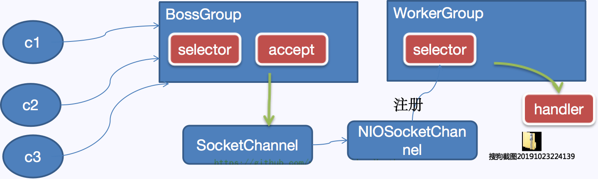

对上图说明

+   BossGroup 线程维护 Selector，只关注 Accecpt
+   当接收到 Accept 事件，获取到对应的 SocketChannel，封装成 NIOScoketChannel 并注册到 Worker 线程（事件循环），并进行维护
+   当 Worker 线程监听到 Selector 中通道发生自己感兴趣的事件后，就进行处理（就由 handler），注意 handler 已经加入到通道

### 工作原理示意图2 - 进阶版

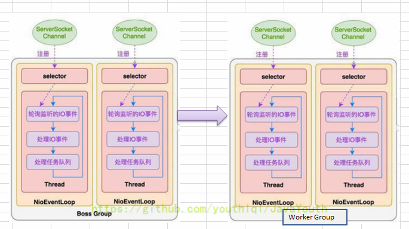

BossGroup有点像主Reactor 可以有多个，WorkerGroup则像SubReactor一样可以有多个。

### 工作原理示意图3 - 详细版

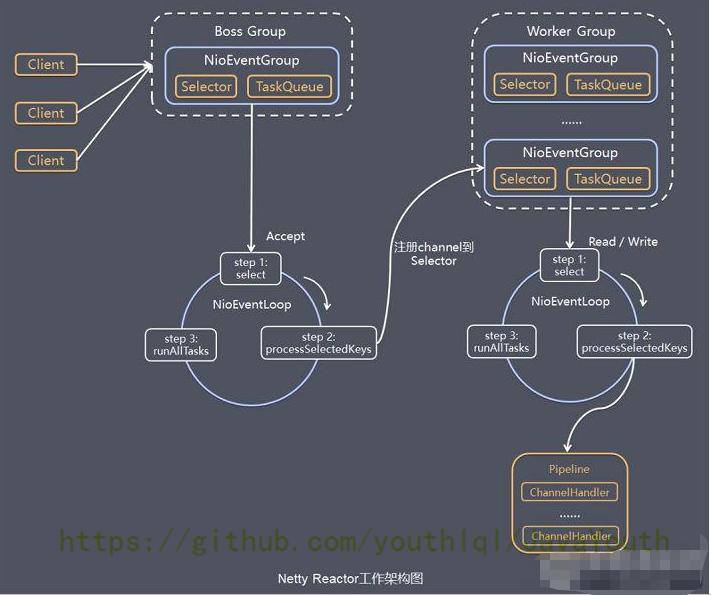

+   Netty 抽象出两组线程池 ，BossGroup 专门负责接收客户端的连接，WorkerGroup 专门负责网络的读写
+   BossGroup 和 WorkerGroup 类型都是 NioEventLoopGroup
+   NioEventLoopGroup 相当于一个事件循环组，这个组中含有多个事件循环，每一个事件循环是 NioEventLoop
+   NioEventLoop 表示一个不断循环的执行处理任务的线程，每个 NioEventLoop 都有一个 Selector，用于监听绑定在其上的 socket 的网络通讯
+   NioEventLoopGroup 可以有多个线程，即可以含有多个 NioEventLoop
+   每个 BossGroup下面的NioEventLoop 循环执行的步骤有 3 步
    *   轮询 accept 事件
    *   处理 accept 事件，与 client 建立连接，生成 NioScocketChannel，并将其注册到某个 workerGroup NIOEventLoop 上的 Selector
    *   继续处理任务队列的任务，即 runAllTasks
+   每个 WorkerGroup NIOEventLoop 循环执行的步骤
    *   轮询 read，write 事件
    *   处理 I/O 事件，即 read，write 事件，在对应 NioScocketChannel 处理
    *   处理任务队列的任务，即 runAllTasks
+   每个 Worker NIOEventLoop 处理业务时，会使用 pipeline（管道），pipeline 中包含了 channel（通道），即通过 pipeline 可以获取到对应通道，管道中维护了很多的处理器。（这个点目前只是简单的讲，后面重点说）

### Netty 快速入门实例 - TCP 服务

实例要求：使用 IDEA 创建 Netty 项目

+   Netty 服务器在 6668 端口监听，客户端能发送消息给服务器”hello,服务器~”
+   服务器可以回复消息给客户端”hello,客户端~”
+   目的：对 Netty 线程模型有一个初步认识，便于理解 Netty 模型理论
    *   编写服务端
    *   编写客户端
    *   对 netty 程序进行分析，看看 netty 模型特点
    *   说明：创建 Maven 项目，并引入 Netty 包
+   代码如下

#### NettyServer

```java
package com.atguigu.netty.simple;

import io.netty.bootstrap.ServerBootstrap;
import io.netty.channel.*;
import io.netty.channel.nio.NioEventLoopGroup;
import io.netty.channel.socket.SocketChannel;
import io.netty.channel.socket.nio.NioServerSocketChannel;
import io.netty.channel.socket.nio.NioSocketChannel;

public class NettyServer {
    public static void main(String[] args) throws Exception {


        //创建BossGroup 和 WorkerGroup
        //说明
        //1. 创建两个线程组 bossGroup 和 workerGroup
        //2. bossGroup 只是处理连接请求 , 真正的和客户端业务处理，会交给 workerGroup完成
        //3. 两个都是无限循环
        //4. bossGroup 和 workerGroup 含有的子线程(NioEventLoop)的个数
        //   默认实际 cpu核数 * 2
        EventLoopGroup bossGroup = new NioEventLoopGroup(1);
        EventLoopGroup workerGroup = new NioEventLoopGroup(); //8


        try {
            //创建服务器端的启动对象，配置参数
            ServerBootstrap bootstrap = new ServerBootstrap();

            //使用链式编程来进行设置
            bootstrap.group(bossGroup, workerGroup) //设置两个线程组
                    .channel(NioServerSocketChannel.class) //使用NioSocketChannel 作为服务器的通道实现
                    .option(ChannelOption.SO_BACKLOG, 128) // 设置线程队列等待连接个数
                    .childOption(ChannelOption.SO_KEEPALIVE, true) //设置保持活动连接状态
//                    .handler(null) // 该 handler对应 bossGroup , childHandler 对应 workerGroup
                    .childHandler(new ChannelInitializer<SocketChannel>() {//创建一个通道初始化对象(匿名对象)
                        //给pipeline 设置处理器
                        @Override
                        protected void initChannel(SocketChannel ch) throws Exception {
                            System.out.println("客户socketchannel hashcode=" + ch.hashCode()); //可以使用一个集合管理 SocketChannel， 再推送消息时，可以将业务加入到各个channel 对应的 NIOEventLoop 的 taskQueue 或者 scheduleTaskQueue
                            ch.pipeline().addLast(new NettyServerHandler());
                        }
                    }); // 给我们的workerGroup 的 EventLoop 对应的管道设置处理器

            System.out.println(".....服务器 is ready...");

            //绑定一个端口并且同步生成了一个 ChannelFuture 对象（也就是立马返回这样一个对象）
            //启动服务器(并绑定端口)
            ChannelFuture cf = bootstrap.bind(6668).sync();

            //给cf 注册监听器，监控我们关心的事件

            cf.addListener(new ChannelFutureListener() {
                @Override
                public void operationComplete(ChannelFuture future) throws Exception {
                    if (cf.isSuccess()) {
                        System.out.println("监听端口 6668 成功");
                    } else {
                        System.out.println("监听端口 6668 失败");
                    }
                }
            });


            //对关闭通道事件  进行监听
            cf.channel().closeFuture().sync();
        }finally {
            bossGroup.shutdownGracefully();
            workerGroup.shutdownGracefully();
        }

    }
}

```

#### NettyServerHandler

```java
package com.atguigu.netty.simple;

import io.netty.buffer.ByteBuf;
import io.netty.buffer.Unpooled;
import io.netty.channel.Channel;
import io.netty.channel.ChannelHandlerContext;
import io.netty.channel.ChannelInboundHandlerAdapter;
import io.netty.channel.ChannelPipeline;
import io.netty.util.CharsetUtil;

import java.util.concurrent.TimeUnit;

/*
说明
1. 我们自定义一个Handler 需要继承netty 规定好的某个HandlerAdapter(规范)
2. 这时我们自定义一个Handler , 才能称为一个handler
 */
public class NettyServerHandler extends ChannelInboundHandlerAdapter {

    //读取数据事件(这里我们可以读取客户端发送的消息)
    /*
    1. ChannelHandlerContext ctx:上下文对象, 含有 管道pipeline , 通道channel, 地址
    2. Object msg: 就是客户端发送的数据 默认Object
     */
    @Override
    public void channelRead(ChannelHandlerContext ctx, Object msg) throws Exception {
        System.out.println("服务器读取线程 " + Thread.currentThread().getName() + " channle =" + ctx.channel());
        System.out.println("server ctx =" + ctx);
        System.out.println("看看channel 和 pipeline的关系");
        Channel channel = ctx.channel();
        ChannelPipeline pipeline = ctx.pipeline(); //本质是一个双向链表


        //将 msg 转成一个 ByteBuf
        //ByteBuf 是 Netty 提供的，不是 NIO 的 ByteBuffer.
        ByteBuf buf = (ByteBuf) msg;
        System.out.println("客户端发送消息是:" + buf.toString(CharsetUtil.UTF_8));
        System.out.println("客户端地址:" + channel.remoteAddress());
    }

    //数据读取完毕
    @Override
    public void channelReadComplete(ChannelHandlerContext ctx) throws Exception {

        //writeAndFlush 是 write + flush
        //将数据写入到缓存，并刷新
        //一般讲，我们对这个发送的数据进行编码
        ctx.writeAndFlush(Unpooled.copiedBuffer("hello, 客户端~(>^ω^<)喵1", CharsetUtil.UTF_8));
    }

    //发生异常后, 一般是需要关闭通道

    @Override
    public void exceptionCaught(ChannelHandlerContext ctx, Throwable cause) throws Exception {
        ctx.close();
    }
}
```

#### NettyClient

```java
package com.atguigu.netty.simple;

import io.netty.bootstrap.Bootstrap;
import io.netty.channel.ChannelFuture;
import io.netty.channel.ChannelInitializer;
import io.netty.channel.EventLoopGroup;
import io.netty.channel.nio.NioEventLoopGroup;
import io.netty.channel.socket.SocketChannel;
import io.netty.channel.socket.nio.NioSocketChannel;

public class NettyClient {
    public static void main(String[] args) throws Exception {

        //客户端需要一个事件循环组
        EventLoopGroup group = new NioEventLoopGroup();


        try {
            //创建客户端启动对象
            //注意客户端使用的不是 ServerBootstrap 而是 Bootstrap
            Bootstrap bootstrap = new Bootstrap();

            //设置相关参数
            bootstrap.group(group) //设置线程组
                    .channel(NioSocketChannel.class) // 设置客户端通道的实现类(反射)
                    .handler(new ChannelInitializer<SocketChannel>() {
                        @Override
                        protected void initChannel(SocketChannel ch) throws Exception {
                            ch.pipeline().addLast(new NettyClientHandler()); //加入自己的处理器
                        }
                    });

            System.out.println("客户端 ok..");

            //启动客户端去连接服务器端
            //关于 ChannelFuture 要分析，涉及到netty的异步模型
            ChannelFuture channelFuture = bootstrap.connect("127.0.0.1", 6668).sync();
            //对关闭通道事件  进行监听
            channelFuture.channel().closeFuture().sync();
        }finally {

            group.shutdownGracefully();

        }
    }
}
```

#### NettyClientHandler

```java
package com.atguigu.netty.simple;

import io.netty.buffer.ByteBuf;
import io.netty.buffer.Unpooled;
import io.netty.channel.ChannelHandlerContext;
import io.netty.channel.ChannelInboundHandlerAdapter;
import io.netty.util.CharsetUtil;

public class NettyClientHandler extends ChannelInboundHandlerAdapter {

    //当通道就绪就会触发该方法
    @Override
    public void channelActive(ChannelHandlerContext ctx) throws Exception {
        System.out.println("client " + ctx);
        ctx.writeAndFlush(Unpooled.copiedBuffer("hello, server: (>^ω^<)喵", CharsetUtil.UTF_8));
    }

    //当通道有读取事件时，会触发
    @Override
    public void channelRead(ChannelHandlerContext ctx, Object msg) throws Exception {

        ByteBuf buf = (ByteBuf) msg;
        System.out.println("服务器回复的消息:" + buf.toString(CharsetUtil.UTF_8));
        System.out.println("服务器的地址： "+ ctx.channel().remoteAddress());
    }

    @Override
    public void exceptionCaught(ChannelHandlerContext ctx, Throwable cause) throws Exception {
        cause.printStackTrace();
        ctx.close();
    }
}
```

## 任务队列中的 Task 有 3 种典型使用场景

+   用户程序自定义的普通任务【举例说明】
+   用户自定义定时任务
+   非当前 Reactor 线程调用 Channel 的各种方法
+   例如在推送系统的业务线程里面，根据用户的标识，找到对应的 Channel 引用，然后调用 Write 类方法向该用户推送消息，就会进入到这种场景。最终的 Write 会提交到任务队列中后被异步消费

前两种的代码举例：

