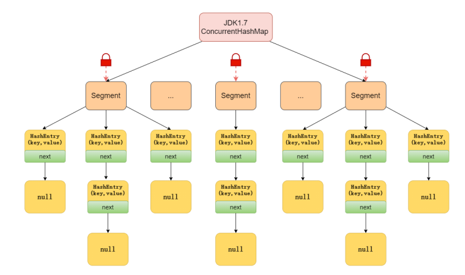
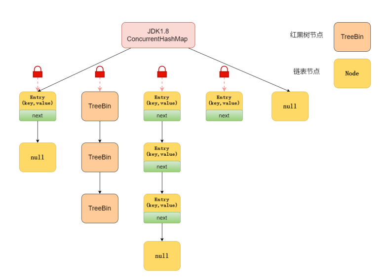

# ConcurrentHashMap说明

----

## ConcurrentHashMap的实现原理是什么?

ConcurrentHashMap在JDK1.7和JDK1.8的实现方式是不同的。

**JDK1.7**

JDK1.7中的ConcurrentHashMap是由Segment 数组结构和HashEntry数组结构组成，即ConcurrentHashMap把哈希桶切分成小数组(Segment )，每个小数组有n个HashEntry组成。其中，Segment 继承了ReentrantLock, 所以Segment是一种可重入锁， 扮演锁的角色; HashEntry用于存储键值对数据。



首先将数据分为一段一段的存储，然后给每一段数据配-把锁，当一个线程占用锁访问其中一个段数据时，其他段的数据也能被其他线程访问，能够实现真正的并发访问。

**JDK1.8**

在数据结构上，JDK1.8 中的ConcurrentHashMap选择了与HashMap相同的数组+链表+红黑树结构;
在锁的实现上，抛弃了原有的Segment分段锁，采用 `CAS + synchronized` 实现更加低粒度的锁。
将锁的级别控制在了更细粒度的哈希桶元素级别，也就是说只需要锁住这个链表头结点(红黑树的根节点)，就不会影响其他的哈希桶元素的读写，大大提高了并发度。



## ConcurrentHashMap的put方法执行逻辑是什么?

先来看JDK1.7

首先，会尝试获取锁，如果获取失败，利用自旋获取锁;如果自旋重试的次数超过64次，则改为阻塞获取锁。

获取到锁后:

1.  将当前Segment中的table通过key的hashcode定位到HashEntry。
2.  遍历该HashEntry,如果不为空则判断传入的key和当前遍历的key是否相等，相等则覆盖旧的
3.  不为空则需要新建一个HashEntry并加入到Segment中，同时会先判断是否需要扩容。
4.  释放Segment的锁。

再来看JDK1.8

大致可以分为以下步骤:

1.  根据key计算出hash值。
2.  判断是否需要进行初始化。
3.  定位到Node,拿到首节点f，判断首节点f:
    *   如果为null ，则通过cas的方式尝试添加。
    *   如果为f.hash = MOVED = -1，说明其他线程在扩容，参与-起扩容。
    *   如果都不满足，synchronized锁住f节点，判断是链表还是红黑树，遍历插入。
4.  当在链表长度达到8的时候，数组扩容或者将链表转换为红黑树。

源码分析可看这篇文章:[面试ConcurrentHashMap,看这一篇就够了!](https://mp.weixin.qq.com/s?__biz=MzkyMTI3Mjc2MQ==&mid=2247485909&idx=1&sn=d9c672eebb090866a72f99f3d8032e76&source=41#wechat_redirect)

## ConcurrentHashMap的get方法是否要加锁，为什么?

get方法`不需要加锁`。因为`Node的元素val和指针next是用volatile修饰的`，在多线程环境下线程A修改结点的val或者新增节点的时候是对线程B可见的。

这也是它比其他并发集合比如Hashtable、用Collections .synchronizedMap()包装的HashMap安全效率高的原因之一。

```java
static class Node<K ,V> implements Map. Entry<K,V> {
    final int hash;
    final K key;
    //可以看到这些都用了volatile修饰
    volatile V val;
    volatile Node<K,V> next;
}
```

## get方法不需要加锁与volatile修饰的哈希桶有关吗?

没有关系。哈希桶table用volatile修饰主要是保证在数组扩容的时候保证可见性。

```java
static fina1 class Segment<K,V> extends ReentrantLock implements Serializable {
    //存放数据的桶
    transi ent volatile HashEntry<K,V>[] table;
}
```

## ConcurrentHashMap不支持key或者value为null的原因?

我们先来说value为什么不能为null，因为ConcurrentHashMap是用于多线程的，`如果map. get(key)得到了null，无法判断，是映射的value是null，还是没有找到对应的key而为null`，这就有了二义性。

而用于单线程状态的HashMap却可以用containsKey(key)去判断到底是否包含了这个null。

我们用反证法来推理:

+   假设ConcurrentHashMap允许存放值为null 的value，这时有A、B两个线程，线程A调用ConcurrentHashMap .get(key)方法，返回为null，我们不知道这个null是没有映射的null，还是存的值就是null。
+   假设此时，返回为null的真实情况是没有找到对应的key。那么，我们可以用ConcurrentHashMap.containsKey(key)来验证我们的假设是否成立，我们期望的结果是返回false.
+   但是在我们调用ConcurrentHashMap .get(key)方法之后，containsKey方法之 前，线程B执行了ConcurrentHashMap .put(key, null )的操作。那么我们调用containsKey方法返回的就是true了，这就与我们的假设的真实情况不符合了，这就有了二义性。

至于ConcurrentHashMap中的key为什么也不能为null的问题，源码就是这样写的，哈哈。如果面试官不满意，就回答因为作者Doug不喜欢null，所以在设计之初就不允许了null的key存在。想要深入了
解的小伙伴，可以看这篇文章这道面试题[我真不知道面试官想要的回答是什么](https://mp.weixin.qq.com/s?__biz=Mzg3NjU3NTkwMQ==&mid=2247505071&idx=1&sn=5b9bbe01a71cbfae4d277dd21afd6714&source=41#wechat_redirect)

## ConcurrentHashMap的并发度是多少?

在JDK1.7中，并发度默认是16，这个值可以在构造函数中设置。如果自己设置了并发度,ConcurrentHashMap会使用大于等于该值的最小的2的幂指数作为实际并发度，也就是比如你设置的值是17，那么实际并发度是32。

## ConcurrentHashMap迭代器是强一致性还是弱一致性?

与HashMap迭代器是强一致性不同，ConcurrentHashMap 迭代器是弱一致性。

ConcurrentHashMap的迭代器创建后，就会按照哈希表结构遍历每个元素，但`在遍历过程中，内部元素可能会发生变化，如果变化发生在已遍历过的部分，迭代器就不会反映出来，而如果变化发生在未遍历过的部分，迭代器就会发现并反映出来，这就是弱一致性`。

这样迭代器线程可以使用原来老的数据，而写线程也可以并发的完成改变，更重要的，这保证了多个线程并发执行的连续性和扩展性，是性能提升的关键。

## JDK1.7与JDK1.8中ConcurrentHashMap的区别?

+   数据结构:取消了Segment分段锁的数据结构，取而代之的是数组+链表+红黑树的结构。
+   保证线程安全机制: JDK1.7采 用Segment的分段锁机制实现线程安全，其中segment继承自ReentrantLock. JDK1.8采用CAS+Synchronized保证线程安全。
+   锁的粒度:原来是对需要进行数据操作的Segment加锁，现调整为对每个数组元素加锁 (Node)。
+   链表转化为红黑树:定位结点的hash算法简化会带来弊端,Hash冲突加剧,因此在链表节点数量大于8 时，会将链表转化为红黑树进行存储。
+   查询时间复杂度:从原来的遍历链表0(n), 变成遍历红黑树O(logN)。

## ConcurrentHashMap和Hashtable的效率哪个更高?为什么?

`ConcurrentHashMap的效率要高于Hashtable`，因为Hashtable给整个哈希表加了一把大锁从而实现线程安全。而ConcurrentHashMap 的锁粒度更低，在JDK1.7中采用分 段锁实现线程安全，在JDK1.8 中采用CAS+Synchronized实现线程安全。
