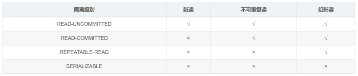
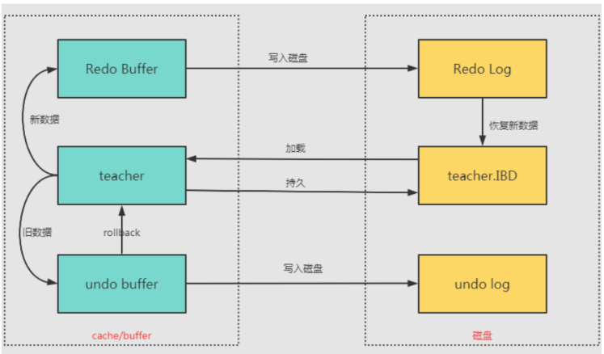
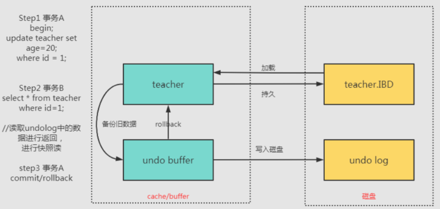
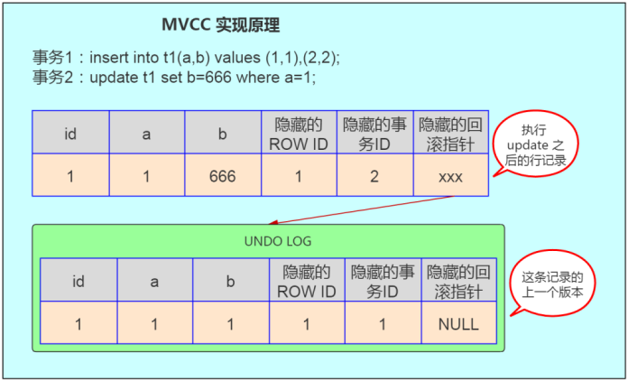

# MySQL事务

----

## 介绍一下事务具有的四个特征
事务就是一组原子性的操作，这些操作要么全部发生，要么全部不发生。事务把数据库从一种一致性状态转换成另一种一致性状态。

+   原子性。事务是数据库的逻辑工作单位，事务中包含的各操作要么都做，要么都不做
+   一致性。事务执行的结果必须是使数据库从一个一致性状态变到另一个一致性状态。因此当数据库只包含成功事务提交的结果时，就说数据库处于一致性状态。如果数据库系统运行中发生故障，有些事务尚未完成就被迫中断，这些未完成事务对数据库所做的修改有一部分己写入物理数据库，这时数据库就处于一种不正确的状态，或者说是不一致的状态。
+   隔离性。一个事务的执行不能其它事务干扰。即一个事务内部的//操作及使用的数据对其它并发事务是隔离的，并发执行的各个事务之间不能互相干扰。
+   持续性。也称永久性，指一个事务一旦提交，它对数据库中的数据的改变就应该是永久性的。接下来的其它操作或故障不应该对其执行结果有任何影响。

## 说一下MySQL的四种隔离级别

+   Read Uncommitted (读取未提交内容)
    *   在该隔离级别，所有事务都可以看到其他未提交事务的执行结果。本隔离级别很少用于实际应用，因为它的性能也不比其他级别好多少。读取未提交的数据，也被称之为脏读(Dirty Read)。
+   Read Committed (读取提交内容)
    *   这是大多数数据库系统的默认隔离级别(但不是MySQL默认的)。它满足了隔离的简单定义: 一个事务只能看见已经提交事务所做的改变。这种隔离级别也支持所谓的不可重复读(Nonrepeatable Read)，因为同一事务的其他实例在该实例处理其间可能会有新的commit,所以同一select可能返回不同结果。
+   Repeatable Read (可重读)
    *   这是MySQL的默认事务隔离级别，它确保同一事务的多个实例在并发读取数据时，会看到同样的数据行。不过理论上，这会导致另一个棘手的问题:幻读(Phantom Read)。
+   Serializable (可串行化)
    *   通过强制事务排序，使之不可能相互冲突，从而解决幻读问题。简言之，它是在每个读的数据行上加上共享锁。在这个级别，可能导致大量的超时现象和锁竞争。

MySQL默认采用的REPEATABLE_READ隔离级别Oracle默认采用的READ_COMMITTED隔离级别事务隔离机制的实现基于锁机制和并发调度。其中并发调度使用的是MWC(多版本并发控制)，通过保存修改的旧版本信息来支持并发一致性读和回滚等特性。

因为隔离级别越低，事务请求的锁越少，所以大部分数据库系统的隔离级别都是READ_COMMITTED(读取提交内容),但是你要知道的是`InnoDB存储引擎默认使用REPEATABLE_READ (可重读)`并不会有任何性能损失。

InnoDB存储引擎在`分布式事务的情况下一般会用到SERIALIZABLE(可串行化)隔离级别`。

## 什么是脏读?幻读?不可重复读?

+   脏读:事务A读取了事务B更新的数据，然后B回滚操作，那么A读取到的数据是脏数据
+   不可重复读:事务A多次读取同一数据，事务B在事务A多次读取的过程中，对数据作了更新并提交，导致事务A多次读取同一数据时，结果不一致。
+   幻读:系统管理员A将数据库中所有学生的成绩从具体分数改为ABCDE等级，但是系统管理员B就在这个时候插入了一条具体分数的记录，当系统管理员A改结束后发现还有一条记录没有改过来，就好像发生了幻觉一样，这就叫幻读。

不可重复读侧重于修改，幻读侧重于新增或删除(多了或少量行)，脏读是一个事务回滚影响另外一个事务。

## 事务的实现原理

事务是基于重做日志文件(redo log)和回滚日志(undo log)实现的。

每提交一个事务必须先将该事务的所有日志写入到重做日志文件进行持久化，数据库就可以通过重做日志来保证事务的原子性和持久性。

每当有修改事务时，还会产生undolog，如果需要回滚，则根据undolog的反向语句进行逻辑操作，比如insert一条记录就delete一条记录。undolog主要实现数据库的一致性。

## MySQL事务日志介绍下?

innodb事务日志包括redo log和undo log。

Redo与Undo并非是相互的逆操作，而是能配合起来使用的两种机制,说是两种机制，其实都是日志记录。

不同的是

+   redo log指事务中操作的任何数据，将最新的数据备份到一个地方。
    *   redo记录以顺序附加的形式记录新值，如某条记录`<T,X,V>`，表示事务T将新值V存储到数据库元素X，新值可以保证重做；
+   undo log指事务开始之前，在操作任何数据之前，首先将需操作的数据备份到一个地方。
    *   undo记录通常以随机操作的形式记录旧值，如某条记录`<T1,Y,9>`，表示事物T1对Y进行了修改，修改前Y的值是9，旧值能用于撤销，也能供其他事务读取。

Redo用来保证事务的原子性和持久性，Undo能保证事务的一致性，两者也是系统恢复的基础前提。

事务日志的目的:实例或者介质失败，事务日志文件就能派上用场。.

### redo log

redo log不是随着事务的提交才写入的，而是在事务的执行过程中，便开始写入redo中。具体的落盘策略可以进行配置。防止在发生故障的时间点，尚有脏页未写入磁盘，在重启MySQL服务的时候，根据redo log进行重做，从而达到事务的未入磁盘数据进行持久化这一特性。RedoLog 是为了实现事务的持久性而出现的产物。

### undo log

undolog用来回滚行记录到某个版本。事务未提交之前，Undo保存了未提交之前的版本数据，Undo中的数据可作为数据旧版本快照供其他并发事务进行快照读。是为了实现事务的原子性而出现的产物,在MySQLinnodb存储引擎中用来实现多版本并发控制。

## 在事务中可以混合使用存储引擎吗?

尽量不要在同一个事务中使用多种存储引擎，MySQL服务器层不管理事务，事务是由下层的存储引擎实现的。

如果在事务中混合使用了事务型和非事务型的表( 例如InnoDB和MyISAM表) ,在正常提交的情况下不会有什么问题。但如果该事务需要回滚，非事务型的表上的变更就无法撤销，这会导致数据库处于不一致的状态，这种情况很难修复，事务的最终结果将无法确定。所以，为每张表选择合适的存储引擎非常重要。

## MySQL中是如何实现事务隔离的?

读未提交和串行化基本上是不需要考虑的隔离级别，前者不加锁限制，后者相当于单线程执行，效率太差。

MySQL在可重复读级别解决了幻读问题，是通过行锁和间隙锁的组合Next-Key锁实现的。

详细原理看这篇[文章](https://haicoder.net/note/MySQL-interview/MySQL-interview-MySQL-trans-level.html)

## MVCC

### 什么是MVCC?

MVCC，即多版本并发控制。

MVCC的实现，是通过保存数据在某个时间点的快照来实现的。根据事务开始的时间不同，每个事务对同一张表，同一时刻看到的数据可能是不一样的。

### MVCC的实现原理

对于InnoDB，聚簇索引记录中包含3个隐藏的列:

+   ROWID: 隐藏的自增ID， 如果表没有主键，InnoDB会自动按ROW ID产生一个聚集索引树。
+   事务ID:记录最后一次修改该记录的事务ID。
+   回滚指针:指向这条记录的上一个版本。

我们拿上面的例子，对应解释下MVCC的实现原理，如下图:

如图，首先insert语句向表t1中插入了一条数据，a字段为1，b字段为1，ROWID 也为1，事务ID 假设为1，回滚指针假设为null。当执行update t1 set b=666 wherea=1时，大致步骤如下:

+   数据库会先对满足a=1的行加排他锁;
+   然后将原记录复制到undo表空间中:
+   修改b字段的值为666， 修改事务ID为2;
+   并通过隐藏的回滚指针指向undo log中的历史记录;
+   事务提交，释放前面对满足a=1的行所加的排他锁。

在前面实验的第6步中，session2 查询的结果是session1修改之前的记录，这个记录就是来自undolog中。

因此可以总结出MVCC实现的原理大致是:

InnoDB每一行数据都有一个隐藏的回滚指针，用于指向该行修改前的最后一个历史版本，这个历史版本存放在undo log中。如果要执行更新操作，会将原记录放入undo log中，并通过隐藏的回滚指针指向undolog中的原记录。其它事务此时需要查询时，就是查询undolog中这行数据的最后一个历史版本。

MVCC最大的好处是读不加锁，读写不冲突，极大地增加了MySQL的并发性。通过MVCC,保证了事务ACID中的I (隔离性)特性。