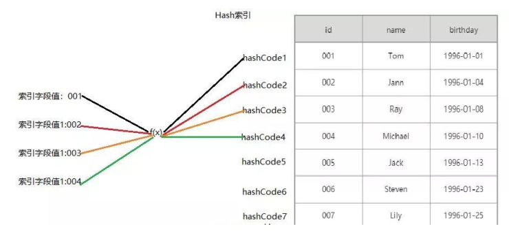
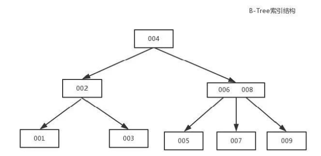
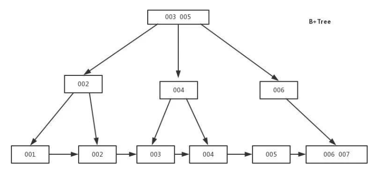
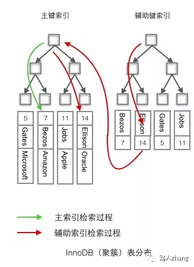
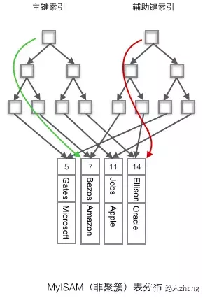
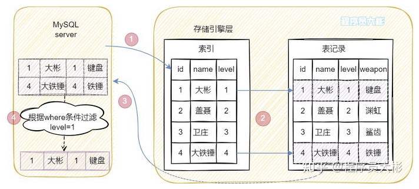
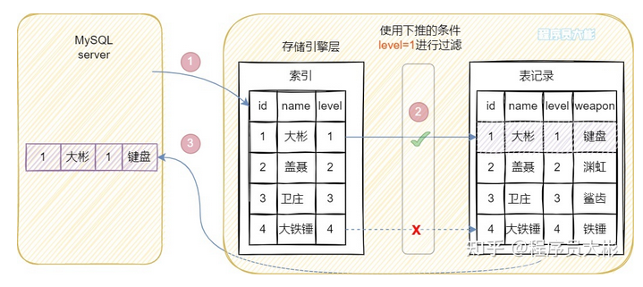

# MySQL索引

----

## MySQL有哪几种索引类型?

### 从存储结构上来划分

+   BTree索引(B-Tree或B+Tree索引)
+   Hash索引
+   full-index全文索引
+   R-Tree索引。

这里所描述的是索引存储时保存的形式，

### 从应用层次来分

普通索引，唯一索引，复合索引。

+   普通索引:即一个索引只包含单个列，一个表可以有多个单列索引
+   唯一索引:索引列的值必须唯一，但允许有空值
+   复合索引:多列值组成一个索引，专门用于组合搜索，其效率大于索引合并.

### 根据中数据的物理顺序与键值的逻辑(索引)顺序关系

+   聚集索引(聚簇索引)
    *   并不是一种单独的索引类型，而是一种数据存储方式。具体细节取决于不同的实现，InnoDB的聚簇索引其实就是在同一个结构中保存了B-Tree索引(技术上来说是B+Tree)和数据行。
+   非聚集索引(非聚簇索引)
    *   不是聚簇索引，就是非聚簇索引

## 说一说索引的底层实现?

### Hash索引

基于哈希表实现，只有精确匹配索引所有列的查询才有效，对于每一行数据，存储引擎都会对所有的索引列计算一个哈希码(hashcode)，并且Hash索引将所有的哈希码存储在索引中，同时在索引表中保存指向每个数据行的指针。



### B-Tree索引( MySQL使用B+Tree)

B-Tree能加快数据的访问速度，因为存储引擎不再需要进行全表扫描来获取数据，数据分布在各个节点之中。



### B+Tree索引
是B-Tree的改进版本，同时也是数据库索引索引所采用的存储结构。数据都在叶子节点上，并且增加了顺序访问指针，每个叶子节点都指向相邻的叶子节点的地址。

相比B-Tree来说，进行范围查找时只需要查找两个节点，进行遍历即可。而B-Tree需要获取所有节点，相比之下B+Tree效率更高。

B+tree性质:

+   n棵子tree的节点包含n个关键字，不用来保存数据而是保存数据的索引。
+   所有的叶子结点中包含了全部关键字的信息，及指向含这些关键字记录的指针，且叶子结点本身依关键字的大小自小而大顺序链接。
+   所有的非终端结点可以看成是索引部分，结点中仅含其子树中的最大(或最小)关键字。
+   B+树中，数据对象的插入和删除仅在叶节点上进行。
+   B+树有2个头指针，一个是树的根节点，一个是最小关键码的叶节点。



### 为什么索引结构默认使用B+Tree，而不是B-Tree, Hash,二叉树，红黑树?

+   B-tree:从两个方面来回答
    *   B+树的磁盘读写代价更低: B+树的内部节点并没有指向关键字具体信息的指针，因此其内部节点相对B(B-)树更小，如果把所有同一内部节点的关键字存放在同一盘块中，那么盘块所能容纳的关键字数量也越多，一次性读入内存的需要查找的关键字也就越多，相对I0读写次数就降低了。
    *   由于B+树的数据 都存储在叶子结点中，分支结点均为索引，方便扫库，只需要扫一遍叶子结点即可，但是B树因为其分支结点同样存储着数据，我们要找到具体的数据，需要进行一次中序遍历按序来扫，所以B+树更加适合在区间查询的情况，所以通常B+树用于数据库索引。

+   Hash
    *   虽然可以快速定位，但是没有顺序，I/O复杂度高;
    *   基于Hash表实现，只有Memory存储引擎显式支持哈希索引;
    *   适合等值查询，如=、in()、 <=>， 不支持范围查询;
    *   因为不是按照索引值顺序存储的，就不能像B+Tree索引一样利用索引完成排序;
    *   Hash索引在查询等值时非常快;
    *   因为Hash索引始终索引的所有列的全部内容，所以不支持部分索引列的匹配查找;
    *   如果有大量重复键值得情况下，哈希索引的效率会很低，因为存在哈希碰撞问题。

+   二叉树:树的高度不均匀，不能自平衡，查找效率跟数据有关(树的高度)，并且I0代价高。

+   红黑树:树的高度随着数据量增加而增加，IO代价高。

## 聚簇索引与非聚簇索引?

?>  聚簇索引和非聚簇索引最主要的区别是叶子节点的数据是整行数据还是指向数据的指针(InnoDB的非聚簇索引指向主键)

+   聚簇索引：将数据和索引放到一起存储，索引结构的叶子节点保留了数据行。
+   非聚簇索引：将数据进和索引分开存储，索引叶子节点存储的是指向数据行的地址。

在InnoDB存储引擎中，默认的索引为B+树索引，`利用主键创建的索引为主索引`，也是聚簇索引，在主索引之上创建的索引为辅助索引，也是非聚簇索引。为什么说辅助索引是在主索引之上创建的呢，因为`辅助索引中的叶子节点存储的是主键`。

在MyISAM存储引擎中，默认的索引也是B+树索引，但主索引和辅助索引都是非聚簇索引，也就是说索引结构的叶子节点存储的都是一个指向数据行的地址。并且使用辅助索引检索无需访问主键的索引。

可以从非常经典的两张图看看它们的区别(图片来源于网络)：





## 非聚簇索引一定会进行回表查询吗？

+   回表查询定义
    *   上面是说了非聚簇索引的叶子节点存储的是主键，也就是说要先通过非聚簇索引找到主键，再通过聚簇索引找到主键所对应的数据，后面这个再通过聚簇索引找到主键对应的数据的过程就是回表查询

+   那么非聚簇索引就一定会进行回表查询吗？
    *   答案是`不一定`的，这里涉及到一个索引覆盖的问题，如果`查询的数据在辅助索引上完全能获取到便不需要回表查询`。

例如有一张表存储着个人信息包括id、name、age等字段。假设聚簇索引是以ID为键值构建的索引，非聚簇索引是以name为键值构建的索引，select id,name from user where name = 'zhangsan';这个查询便不需要进行回表查询，因为，通过非聚簇索引已经能全部检索出数据，这就是索引覆盖的情况。如果查询语句是这样，select id,name,age from user where name = 'zhangsan';则需要进行回表查询，因为通过非聚簇索引不能检索出age的值。那应该如何解决那呢？只需要将索引覆盖即可，建立age和name的联合索引再使用select id,name,age from user where name = 'zhangsan';进行查询即可。

所以通过索引覆盖能解决非聚簇索引回表查询的问题。

## 讲一讲前缀索引?

因为可能我们索引的字段非常长，这既占内存空间，也不利于维护。所以我们就想，如果只把很长字段的前面的公共部分作为一个索引，就会产生超级加倍的效果。但是，我们需要注意，order by不支持前缀索引。

流程是:

+   先计算完整列的选择性: select count(distinct co1_ 1)/count(1) from table_ 1
+   再计算不同前缀长度的选择性: select count(distinct 1eft(co1_ 1,4))/count(1) from table_ 1
+   找到最优长度之后，创建前缀索引:create index idx_ front on table_ 1 (co1_ 1(4))

## 联合索引
### 联合索引是什么?

MySQL可以使用`多个字段同时建立一个索引`，叫做联合索引。

### 为什么需要注意联合索引中的顺序?

在联合索引中，如果想要命中索引，`需要按照建立索引时的字段顺序挨个使用`，否则无法命中索引。

具体原因为:
+   MySQL使用索引时需要索引有序，假设现在建立了"name, age， school"的联合索引，那么索引的排序为:先按照name排序，如果name相同，则按照age排序，如果age的值也相等，则按照school进行排序。
+   当进行查询时，此时索引仅仅按照name严格有序，因此必须首先使用name字段进行等值查询，之后对于匹配到的列而言，其按照age字段严格有序，此时可以使用age字段用做索引查找，以此类推。因此在 建立联合索引的时候应该注意索引列的顺序，一般情况下，将查询需求频繁或者字段选择性高的列放在前面。此外可以根据特例的查询或者表结构进行单独的调整。

### 最左前缀原则

最左匹配原则是`针对组合(联合)索引来说的`

最左匹配原则：从最左边为起点开始连续匹配，遇到范围查询（<、>、between、like）会停止匹配。

例如建立索引(a,b,c)，大家可以猜测以下几种情况是否用到了索引。

+   第一种

```sql
select * from table_name where a = 1 and b = 2 and c = 3
select * from table_name where b = 2 and a = 1 and c = 3
```

上面两次查询过程中所有值都用到了索引，where后面字段调换不会影响查询结果，因为MySQL中的优化器会自动优化查询顺序。

+   第二种

```sql
select * from table_name where a = 1
select * from table_name where a = 1 and b = 2
select * from table_name where a = 1 and b = 2 and c = 3
```

答案是三个查询语句都用到了索引，因为三个语句都是从最左开始匹配的。

+   第三种

```sql
select * from table_name where  b = 1
select * from table_name where  b = 1 and c = 2
```

答案是这两个查询语句都没有用到索引，因为不是从最左边开始匹配的

+   第四种

```sql
select * from table_name where a = 1 and c = 2
```

这个查询语句只有a列用到了索引，c列没有用到索引，因为中间跳过了b列，不是从最左开始连续匹配的。

+   第五种

```sql
select * from table_name where  a = 1 and b < 3 and c < 1
```

这个查询中只有a列和b列使用到了索引，而c列没有使用索引，因为根据最左匹配查询原则，遇到范围查询会停止。

+   第六种

```sql
select * from table_name where a like 'ab%';
select * from table_name where a like '%ab'
select * from table_name where a like '%ab%'
```

对于列为字符串的情况，只有前缀匹配可以使用索引，中缀匹配和后缀匹配只能进行全表扫描。


## 索引下推

来自[图解索引下推](https://zhuanlan.zhihu.com/p/475593343)

### 什么是索引下推

索引条件下推，也叫索引下推，英文全称Index Condition Pushdown，简称ICP。

索引下推是MySQL5.6新添加的特性，用于优化数据的查询。

在MySQL5.6之前，通过使用非主键索引进行查询的时候，存储引擎通过索引查询数据，然后将结果返回给MySQL server层，在server层判断是否符合条件。

在MySQL5.6及以上版本，可以使用索引下推的特性。当存在索引的列做为判断条件时，MySQL server将这一部分判断条件传递给存储引擎，然后存储引擎会筛选出符合MySQL server传递条件的索引项，即在存储引擎层根据索引条件过滤掉不符合条件的索引项，然后回表查询得到结果，将结果返回给MySQL server。

可以看到，有了索引下推的优化，在满足一定的条件下，存储引擎层会在回表查询之前对数据进行过滤，可以减少存储引擎回表查询的次数。

### 举个例子

假设有一张用户信息表user_info，有三个字段name, level, weapon（装备），建立联合索引(name, level)，user_info表初始数据如下：

| id |  name  | level | weapon |
|----|--------|-------|--------|
|  1 | 大彬   |     1 | 键盘   |
|  2 | 盖聂   |     2 | 渊虹   |
|  3 | 卫庄   |     3 | 鲨齿   |
|  4 | 大铁锤 |     4 | 铁锤   |

假如需要匹配姓名第一个字为"大"，并且level为1的用户，SQL语句如下：

```sql
SELECT * FROM user_info WHERE name LIKE "大%" AND level = 1;
```

那么这条SQL具体会怎么执行呢？

下面分情况进行分析。

先来看看MySQL5.6以前的版本。

前面提到MySQL5.6以前的版本没有索引下推，其执行过程如下：



查询条件name LIKE不是等值匹配，根据最左匹配原则，在(name, level)索引树上只用到name去匹配，查找到两条记录（id为1和4），拿到这两条记录的id分别回表查询，然后将结果返回给MySQL server，在MySQL server层进行level字段的判断。整个过程需要回表2次。

然后看看MySQL5.6及以上版本的执行过程，如下图。



相比5.6以前的版本，多了索引下推的优化，在索引遍历过程中，对索引中的字段先做判断，过滤掉不符合条件的索引项，也就是判断level是否等于1，level不为1则直接跳过。因此在(name, level)索引树只匹配一个记录，之后拿着此记录对应的id（id=1）回表查询全部数据，整个过程回表1次。

可以使用explain查看是否使用索引下推，当Extra列的值为Using index condition，则表示使用了索引下推。

从上面的例子可以看出，使用索引下推在某些场景下可以有效减少回表次数，从而提高查询效率。

## 怎么查看MySQL语句有没有用到索引?

通过explain，如以下例子:

```sql
EXPLAIN SELECT * FROM emp loyees.titles WHERE emp_no = '10001' AND title= 'Senior Engineer' AND from_date='1986-06-26';
```


+   id:在一个大的查询语句中每个SELECT关键字都对应- -个唯-的id ，如explain select * from s1 where id = (select id from s1 where name = 'egon1');第一个select的id是1，第二个select的id是 2。有时候会出现两个select,但是id却都是1，这是因为优化器把子查询变成了连接查询。
+   select_type: select关键字对应的那个查询的类型，如 SIMPLE,PRIMARY,SUBQUERY,DEPENDENT,SNION。
+   table:每个查询对应的表名。
+   type:type字段比较重要,它提供了判断查询是否高效的重要依据依据.通过type字段,我们判断此次查询是全表扫描还是索引扫描等。如const(主键索引或者唯一二级索引进行等值匹配的情况下),ref(普通的二级索引列与常量进行等值匹配),index(扫描全表索引的覆盖索引)。
    *   通常来说,不同的type类型的性能关系如下: ALL < index < range ~ index_ merge < ref < eq_ ref < const < system
    *   ALL类型因为是全表扫描,因此在相同的查询条件下,它是速度最慢的.
    *   而index类型的查询虽然不是全表扫描,但是它扫描了所有的索引,因此比ALL类型的稍快.
+   possible_key: 查询中可能用到的索引(可以把用不到的删掉，降低优化器的优化时间。
+   key:此字段是MySQL在当前查询时所真正使用到的索引。
+   filtered: 查询器预测满足下一-次查询条件的百分比。
+   rows也是-一个重要的字段.MySQL查询优化器根据统计信息,估算SQL要查找到结果集需要扫描读取的数据行数.
    *   `这个值非常直观显示SQL的效率好坏,原则上rows越少越好`。
+   extra: 表示额外信息，如Using where,Start temporary,End temporary,Using temporary等。

## 为什么官方建议使用自增长主键作为索引?

结合B+Tree的特点，自增主键是连续的，在插入过程中尽量减少页分裂，即使要进行页分裂，也只会分裂很少一部分。并且能减少数据的移动，每次插入都是插入到最后。总之就是减少分裂和移动的频率。

## 创建索引时需要注意什么?

+   非空字段:应该指定列为NOT NULL, 除非你想存储NULL。 在mysq|中，含有空值的列很难进行查询优化，因为它们使得索引、索引的统计信息以及比较运算更加复杂。你应该用0、一个特殊的值 或者一个空串代替空值;
+   取值离散大的字段: (变量各个取值之间的差异程度)的列放到联合索引的前面，可以通过count() 函数查看字段的差异值，返回值越大说明字段的唯一值越多字段的离散程度高;
    *   尽量选择区分度高的列作为索引，区分度的公式是`count(distinct col)/count(*)`,表示字段不重复的比例，比例越大我们扫描的记录数越少，唯一键的区分度是1，而一些状态、性别字段可能在大数据面前 区分度就是0，那可能有人会问，这个比例有什么经验值吗?使用场景不同，这个值也很难确定，一般需要join的字段我们都要求是0.1以上，即平均1条扫描10条记录。
+   索引字段越小越好:数据库的数据存储以页为单位,一页存储的数据越多一次IO操作获取的数据越大效率越高。
+   最左前缀匹配原则，非常重要的原则，mysq|会一直向右匹配直到遇到范围查询(>、<、between、 like)就停止匹配，比如a= 1 andb= 2andc> 3and d=4如果建立(a,b,c,d)顺序的索引，d是用不到索 引的，如果建立(a,b,d,c)的索引则都可以用到，a,b,d的顺序可以任意调整。
+   =和in可以乱序，比如a= 1 andb= 2 andc= 3建立(a,b,c)索引可以任意顺序，mysql的查询优化器会帮你优化成索引可以识别的形式。
+   索引列不能参与计算，保持列“干净"，比如from_ unixtime(create_ time) = '2014-05-29'就不能使用到索引，原因很简单，b+树中存的都是数据表中的字段值，但进行检索时，需要把所有元素都应用函数才能比较，显然成本太大。所以语句应该写成`create_time = unix_timestamp(2014-05-29)`。
+   尽量的扩展索引，不要新建索引。比如表中已经有a的索引，现在要加(a,b)的索引，那么只需要修改原来的索引即可。

## 使用索引查询一定能提高查询的性能吗?

通常通过索引查询数据比全表扫描要快。但是我们也必须注意到它的代价。

索引需要空间来存储，也需要定期维护，每当有记录在表中增减或索引列被修改时，索引本身也会被修改。这意味着每条记录的INSERT, DELETE，UPDATE将为此多付出4，5次的磁盘I/O。因为索引需要额外的存储空间和处理，那些不必要的索引反而会使查询反应时间变慢。

使用索引查询不一定能提高查询性能，索引范围查询(INDEX RANGE SCAN)适用于两种情况:
+   基于一个范围的检索，一般查询返回结果集小于表中记录数的30%。
+   基于非唯一性索引的检索。

## 什么情况下不走索引(索引失效)?

+   使用!=或者<>导致索引失效
+   类型不一致导致的索引失效
+   函数导致的索引失效
    *   如:SELECT * FROM user WHERE DATE(create_ time) = '2020-09-03';
    *   如果使用函数在索引列，这是不走索引的。.
+   运算符导致的索引失效
    *   SELECT * FROM user WHERE age-1 = 20;
    *   如果你对列进行了`(+,-,*,/,!)`,那么都将不会走索引。
+   OR引起的索引失效
    *   SELECT * FROM user WHERE name = '张三' OR height = '175' ;
    *   OR导致索引是在特定情况下的，并不是所有的OR都是使索引失效，如果OR连接的是同一个字段，那么索引不会失效，反之索引失效。


