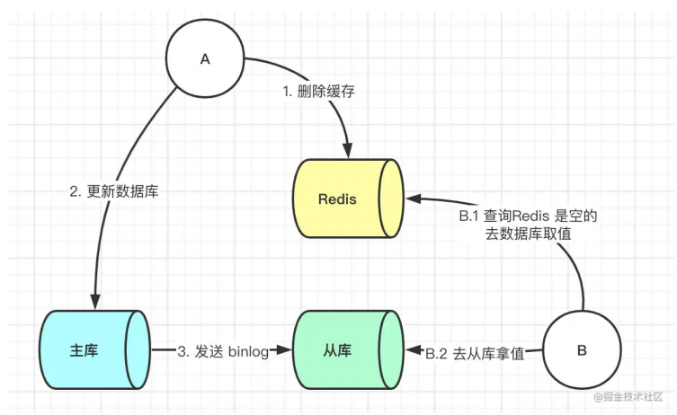
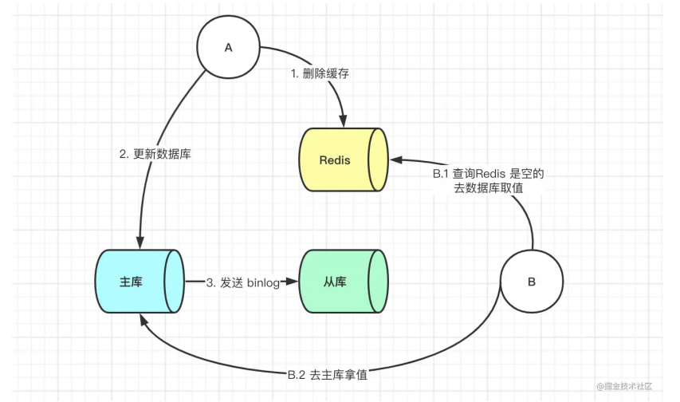
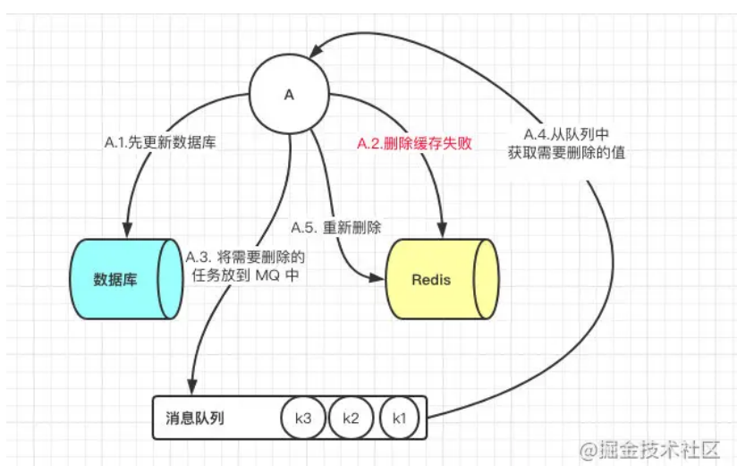
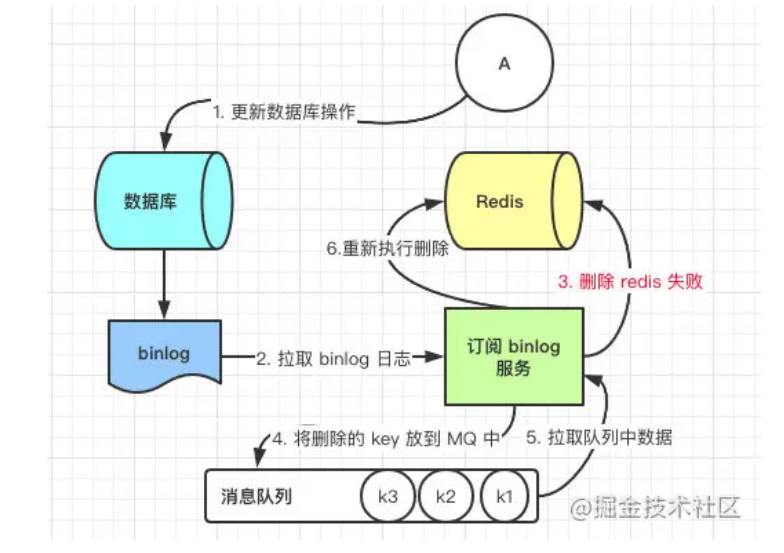

# Redis_如何保证数据库和缓存的数据一致性

----

## 共有四种方案

+	先更新数据库，后更新缓存
	*	没人用
	*	并发更新数据库场景下，会将脏数据刷到缓存
+	先更新缓存，后更新数据库
	*	没人用
	*	如果先更新缓存成功，但是数据库更新失败，则肯定会造成数据不一致
+	先删除缓存，后更新数据库
+	先更新数据库，后删除缓存

目前主要用第三和第四种方案。

## 先删除缓存，后更新数据库方案

### 问题
该方案也会出问题，此时来了两个请求，请求A (更新操作)和请求B (查询操作)

1.	请求A进行写操作，删除缓存
2.	请求B查询发现缓存不存在
3.	请求B去数据库查询得到旧值
4.	请求B将旧值写入缓存
5.	请求A将新值写入数据库

上述情况就会导致不一致的情形出现。而且，如果不采用给缓存设置过期时间策略，该数据永远都是脏数据。

### 答案一:延时双删

最简单的解决办法延时双删

使用伪代码如下:

```java
public void write(String key , object data){
	Redis.delkey(key);
	db.updateData(data);
	Thread.sleep(1000);
	Redis.delkey(key);
}
```

转化为中文描述就是

+	先淘汰缓存
+	再写数据库(这两步和原来一样)
+	休眠1秒，再次淘汰缓存，这么做，可以将1秒内所造成的缓存脏数据，再次删除。确保读请求结束，写请求可以删除读请求造成的缓存脏数据。自行评估自己的项目的读数据业务逻辑的耗时，写数据的休眠时间则在读数据业务逻辑的耗时基础上，加几百ms即可。

**延时双删在Mysql的读写分离的架构会出现如下问题**

如果使用的是Mysql的读写分离的架构的话，那么其实主从同步之间也会有时间差。



此时来了两个请求，请求A (更新操作)和请求B (查询操作)

+	请求A更新操作，删除了Redis
+	请求主库进行更新操作，主库与从库进行同步数据的操作
+	请B查询操作，发现Redis中没有数据
+	去从库中拿去数据
+	此时同步数据还未完成，拿到的数据是旧数据

此时的解决办法就是如果是对Redis进行填充数据的查询数据库操作，那么就强制将其指向主库进行查询。




### 答案二:更新与读取操作进行异步串行化

采用更新与读取操作进行异步串行化

**异步串行化**

我在系统内部维护n个内存队列，更新数据的时候，根据数据的唯一标识， 将该操作路由之后，发送到其中一个jvm内部的内存队列中(对同一数据的请求发送到同一个队列)。

读取数据的时候，如果发现数据不在缓存中，并且此时队列里有更新库存的操作，那么将重新读取数据+更新缓存的操作，根据唯一标识路由之后，也将发送到同一个jvm内部的内存队列中。然后每个队列对应一个工作线程，每个工作线程串行地拿到对应的操作，然后一条一条的执行。

这样的话，一个数据变更的操作，先执行删除缓存，然后再去更新数据库，但是还没完成更新的时候，如果此时一个读请求过来，读到了空的缓存，那么可以先将缓存更新的请求发送到队列中，此时会在队列中积压，排在刚才更新库的操作之后，然后同步等待缓存更新完成，再读库。

稍微整理一下如下
+	有一个队列池,同一个标识的数据只能再同一个队列
+	某个数据的缓存需要更新(即删除缓存,更新数据库,增加缓存),这是一个原子操作,所以要加一个锁,即发送一个更新消息到数据自己的队列中
+	另一个请求读取这个缓存,发现已经被删除(即删除缓存,更新数据库,增加缓存这三个动作未完成),那么就去看一下队列有没有锁
	*	有锁,就进入排队(即将重新读取数据 + 更新缓存的操作加入到同一个jvm内部的内存队列),等待前面更新缓存的锁释放(即队列被消费)
	*	无锁,就直接重新读取数据 + 更新缓存

**读操作去重**

`多个读库更新缓存的请求串在同一个队列中是没意义的，因此可以做过滤，如果发现队列中已经有了该数据的更新缓存的请求了，那么就不用再放进去了，直接等待前面的更新操作请求完成即可`，待那个队列对应的工作线程完成了上一个操作(数据库的修改)之后，才会去执行下一个操作(读库更新缓存)，此时会从数据库中读取最新的值，然后写入缓存中。

+	如果请求还在等待时间范围内，不断轮询发现可以取到值了，那么就直接返回;
+	如果请求等待的时间超过一定时长，那么这一次直接从数据库中读取当前的旧值。( 返回旧值不是又导致缓存和数据库不一致了么?那至少可以减少这个情况发生，因为等待超时也不是每次都是，几率很小吧。这里我想的是，如果超时了就直接读旧值，这时候仅仅是读库后返回而不放缓存)

## 先更新数据库，后删除缓存

这一种情况也会出现问题，比如更新数据库成功了，但是在删除缓存的阶段出错了没有删除成功，那么此时再读取缓存的时候每次都是错误的数据了。



此时解决方案就是利用消息队列进行删除的补偿。具体的业务逻辑用语言描述如下:

1. 请求A先对数据库进行更新操作
2. 在对Redis进行删除操作的时候发现报错，删除失败
3. 此时将Redis的key作为消息体发送到消息队列中
4. 系统接收到消息队列发送的消息后再次对Redis进行删除操作

但是这个方案会有一个缺点就是会对业务代码造成大量的侵入，深深的耦合在一起，所以这时会有一个优化的方案，我们知道对Mysql数据库更新操作后再binlog日志中我们都能够找到相应的操作，那么我们可以订阅Mysql数据库的binlog日志对缓存进行操作。




