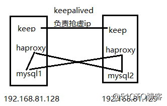

# MySQL_HAproxy_keepalived_mysql高可用

----

## 方案概述
keepalived + haproxy + mysql 构建高可用

1.  keepalived 的高可用是主备，有一台作为备用
2.  keepalived + haproxy 搭建的高可用是可以两台都会调度的高可用

拓扑图：

keepalived + haproxy + mysql 构建高可用数据库_linux
keepalived：负责抢占虚拟ip，使用vrrp协议
haproxy：负责做访问调度，减轻单点压力，单独监听一个端口，这里用23306

## 参考
+   [keepalived + haproxy + mysql 构建高可用数据库](https://blog.51cto.com/u_11962757/2084115)