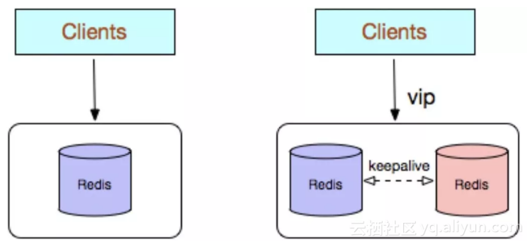
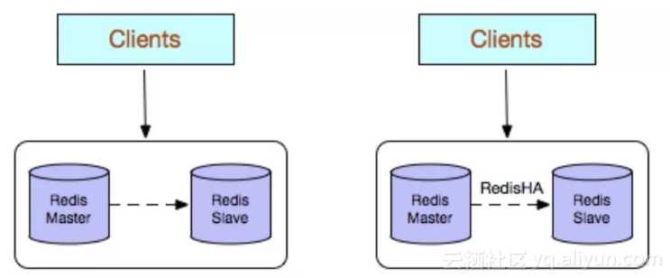
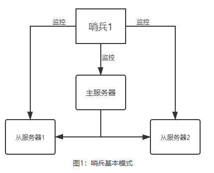
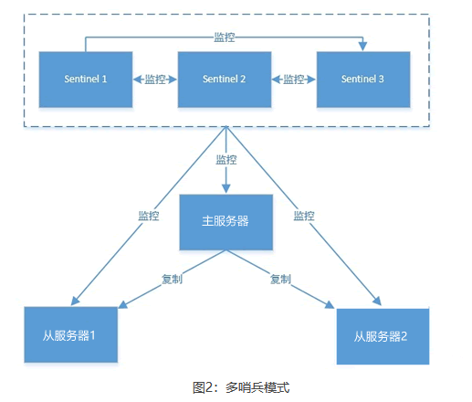
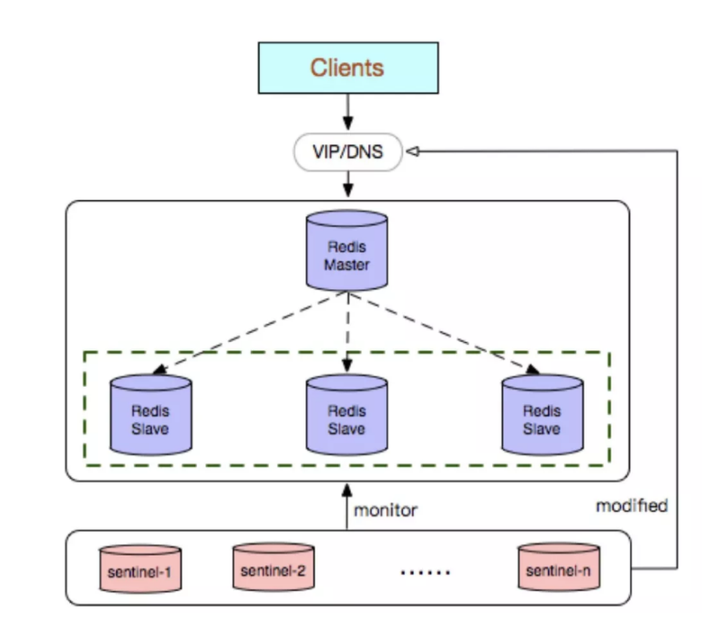
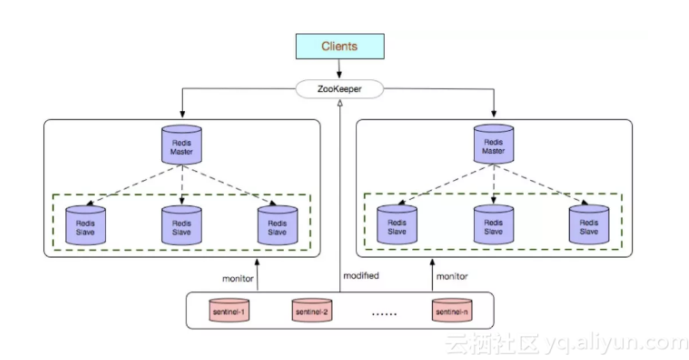
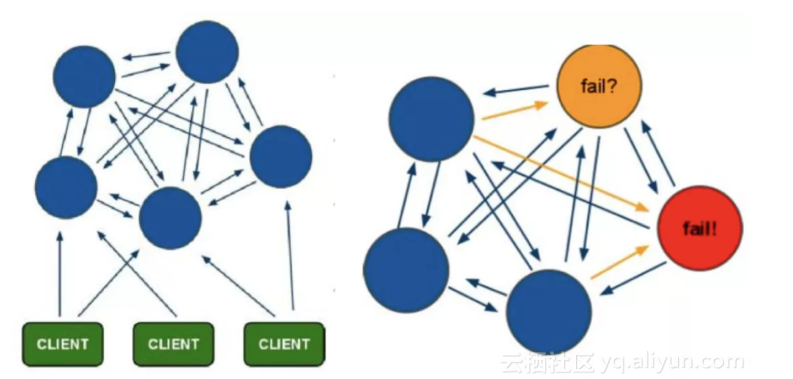
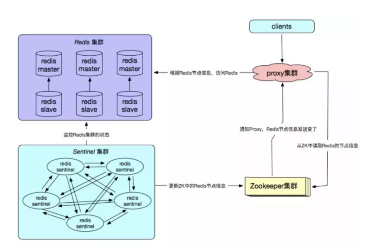
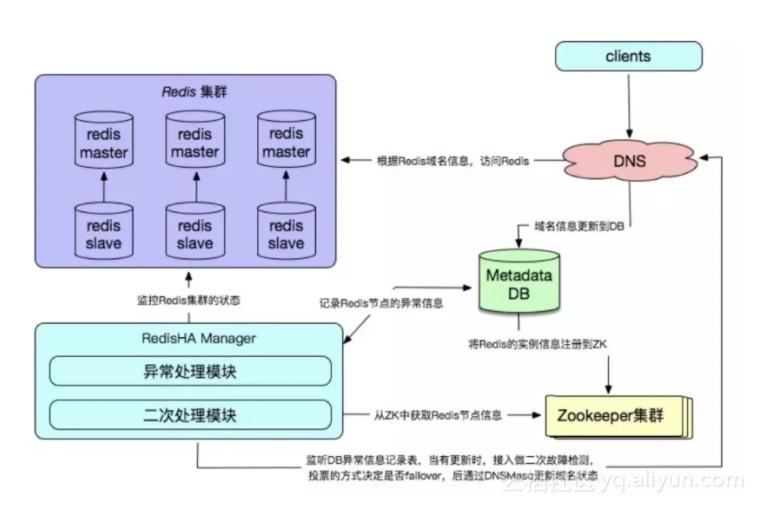

# Redis_主从哨兵集群

----

## Redis常见使用方式有哪些?

Redis的几种常见使用方式包括:

+   Redis单副本;
+   Redis多副本(主从) ;
+   Redis Sentinel (哨兵) ;
+   Redis Cluster;
+   Redis自研。

使用场景:

+   如果`数据量很少`，主要是承载高并发高性能的场景，比如缓存一般就几个G的话，单机足够了。
+   主从模式: master 节点挂掉后，需要手动指定新的master，可用性不高，`基本不用`。
+   哨兵模式: master 节点挂掉后，哨兵进程会`主动选举新的master`,可用性高，但是每个节点存储的数据是一样的，浪费内存空间。`数据量不是很多，集群规模不是很大，需要自动容错容灾的时候使用`。
+   Redis cluster主要是针对`海量数据 + 高并发 + 高可用`的场景，如果是海量数据，如果你的数据量很大，那么建议就用Redis cluster,所有master的容量总和就是Redis cluster可缓存的数据容量。

## Redis单副本

Redis单副本，采用单个Redis节点部署架构，没有备用节点实时同步数据，不提供数据持久化和备份策略，适用于数据可靠性要求不高的纯缓存业务场景。



+   优点:
    *   架构简单，部署方便;
    *   高性价比:缓存使用时无需备用节点(单实例可用性可以用supervisor或crontab保证) ，当然为了满足业务的高可用性，也可以牺牲一个 备用节点，但同时刻只有一个实例对外提供服务;
    *   高性能。
+   缺点:
    *   不保证数据的可靠性;
    *   在缓存使用，进程重启后，数据丢失，即使有备用的节点解决高可用性，但是仍然不能解决缓存预热问题，因此不适用于数据可靠性要求高的业务;
    *   高性能受限于单核CPU的处理能力( Redis是单线程机制)，CPU为主要瓶颈，所以适合操作命令简单，排序、计算较少的场景。也可以考虑用Memcached替代。

## Redis多副本(主从)

Redis多副本，采用主从(replication) 部署结构，相较于单副本而言最大的特点就是主从实例间数据实时同步，并且提供数据持久化和备份策略。主从实例部署在不同的物理服务器上，根据公司的基础环境配置，可以实现同时对外提供服务和读写分离策略。



+   优点
    *   高可靠性:一方面，采用双机主备架构，能够在主库出现故障时自动进行主备切换，从库提升为主库提供服务，保证服务平稳运行;另一方面，开启数据持久化功能和配置合理的备份策略，能有效的解决数据误操作和数据异常丢失的问题;
    *   读写分离策略:从节点可以扩展主库节点的读能力，有效应对大并发量的读操作。

+   缺点:
    *   故障恢复复杂，如果没有RedisHA系统 (需要开发)，当主库节点出现故障时，需要手动将一个从节点晋升为主节点，同时需要通知业务方变更配置，并且需要让其它从库节点去复制新主库节点，`整个过程需要人为干预`，比较繁琐;
    *   主库的写能力受到单机的限制，可以考虑分片;
    *   主库的存储能力受到单机的限制，可以考虑Pika;
    *   原生复制的弊端在早期的版本中也会比较突出，如: Redis复制中断后，Slave会发起psync， 此时如果同步不成功，则会进行全量同步，主库执行全量备份的同时可能会造成亳秒或秒级的卡顿:又由于COW机制，导致极端情况下的主库内存溢出，程序异常退出或宕机;主库节点生成备份文件导致服务器磁盘IO和CPU (压缩)资源消耗;发送数GB大小的备份文件导致服务器出口带宽暴增，阻塞请求，建议升级到最新版本。

## Redis Sentinel (哨兵)

>   主从模式下，当主服务器宕机后，需要手动把一台从服务器切换为主服务器，这就需要人工干预，费事费力，还会造成一-段时间内服务不可用。这种方式并不推荐，实际生产中，我们优先考虑哨兵模式。这种模式下，master宕机，哨兵会自动选举master并将其他的slave指向新的master。

Redis Sentinel是社区版本推出的原生高可用解决方案，其部署架构主要包括两部分: Redis Sentinel集群和Redis数据集群。其中Redis Sentinel集群是由若干Sentinel节点组成的分布式集群，可以实现故障发现、故障自动转移、
配置中心和客户端通知。Redis Sentinel的节点数量要满足2n+1 (n>=1)的奇数个。









+   优点:
    *   Redis Sentinel集群部署简单;
    *   能够解决Redis主从模式下的高可用切换问题;
    *   很方便实现Redis数据节点的线形扩展，轻松突破Redis自身单线程瓶颈，可极大满足Redis大容量或高性能的业务需求;
    *   可以实现一套Sentinel监控一组Redis数据节点或多组数据节点。

+   缺点:
    *   部署相对Redis主从模式要复杂一些， 原理理解更繁琐;
    *   资源浪费，Redis数据节点中slave节点作为备份节点不提供服务;
    *   Redis Sentinel主要是针对Redis数据节点中的主节点的高可用切换，对Redis的数据节点做失败判定分为主观下线和客观下线两种，对于Redis的从节点有对节点做主观下线操作，并不执行故障转移。
    *   不能解决读写分离问题，实现起来相对复杂。


## Redis Cluster

>   Redis的哨兵模式基本已经可以实现高可用，读写分离，但是在这种模式下每台Redis服务器都存储相同的数据，很浪费内存，所以在Redis3.0.上加入了Cluster集群模式，实现了Redis 的分布式存储，对数据进行分片，也就是说每台Redis节点上存储不同的内容。

Redis Cluster是社区版推出的Redis分布式集群解决方案，主要解决Redis分布式方面的需求，比如，当遇到单机内存，并发和流量等瓶颈的时候，Redis Cluster能起到很好的负载均衡的目的。

Redis Cluster集群节点最小配置6个节点以上(3主3从)，其中主节点提供读写操作，从节点作为备用节点，不提供请求，只作为故障转移使用。

Redis Cluster采用虚拟槽分区，所有的键根据哈希函数映射到0~16383个整数槽内，每个节点负责维护一部分槽以及槽所印映射的键值数据。



+   优点:
    *   无中心架构;
    *   数据按照slot存储分布在多个节点，节点间数据共享，可动态调整数据分布:
    *   可扩展性:可线性扩展到1000多个节点，节点可动态添加或删除;
    *   高可用性:部分节点不可用时，集群仍可用。通过增加Slave做standby数据副本， 能够实现故障自动failover，节点之间通过gossip协议交换状态信息，用投票机制完成Slave到Master的角色提升;
    *   降低运维成本，提高系统的扩展性和可用性。
+   缺点:
    *   Client实现复杂，驱动要求实现Smart Client,缓存slots mapping信息并及时更新，提高了开发难度，客户端的不成熟影响业务的稳定性。目前仅JedisCluster相对成熟，异常处理部分还不完善，比如常见的“max redirect exception"。
    *   节点会因为某些原因发生阻塞(阻塞时间大于clutser-node-timeout) ，被判断下线，这种failover是没有必要的。
    *   数据通过异步复制，不保证数据的强一致性。
    *   多个业务使用同一套集群时，无法根据统计区分冷热数据，资源隔离性较差，容易出现相互影响的情况。
    *   Slave在集群中充当“冷备"，不能缓解读压力，当然可以通过SDK的合理设计来提高Slave资源的利用率。
    *   Key批量操作限制，如使用mset、 mget目前只支持具有相同slot值的Key执行批量操作。对于映射为不同slot值的Key由于Keys不支持跨slot查询，所以执行mset、 mget、 sunion等 操作支持不友好。
    *   Key事务操作支持有限，只支持多key在同一节点上的事务操作，当多个Key分布于不同的节点上时无法使用事务功能。
    *   Key作为数据分区的最小粒度，不能将一 个很大的键值对象如hash、 list等映射到不同的节点。
    *   不支持多数据库空间，单机下的Redis可以支持到16个数据库，集群模式下只能使用1个数据库空间，即db 0。
    *   复制结构只支持一层，从节点只能复制主节点，不支持嵌套树状复制结构。
    *   避免产生hot-key， 导致主库节点成为系统的短板。
    *   避免产生big-key, 导致网卡撑爆、慢查询等。
    *   重试时间应该大于cluster-node-time时间。
    *   Redis Cluster不建议使用pipeline和multi-keys操作， 减少max redirect产生的场景。

## Redis自研
Redis自研的高可用解决方案，主要体现在配置中心、故障探测和failover的处理机制上，通常需要根据企业业务的实际线上环境来定制化。





+   优点:
    *   高可靠性、高可用性;
    *   自主可控性高;
    *   贴切业务实际需求，可缩性好，兼容性好。
+   缺点:
    *   实现复杂，开发成本高;
    *   需要建立配套的周边设施，如监控，域名服务，存储元数据信息的数据库等;
    *   维护成本高。

## Redis高可用方案具体怎么实施

使用官方推荐的哨兵(sentinel)机制就能实现，当主节点出现故障时，由Sentinel自动完成故障发现和转移，并通知应用方，实现高可用性。它有四个主要功能:

+   集群监控，负责监控Redis master和slave进程是否正常工作。
+   消息通知，如果某个Redis实例有故障，那么哨兵负责发送消息作为报警通知给管理员。
+   故障转移，如果master node挂掉了，会自动转移到slave node上。
+   配置中心，如果故障转移发生了，通知client客户端新的master地址。

## 主从复制的原理吗?

### 主从架构的核心原理

+   启动一个slave连接master,发送一个PSYNC命令给master node
+   如果slave是第一次连接master,会触发full resynchronization,分为两步
    *   master启动一个线程,对现有数据生成一个RDB文件(多个slave连接只会生成一份),发送给slave,然后slave先写磁盘再加载到内存中
    *   master在生成RDB文件时,从客户端收到新的命令,将其中所有写命令缓存在内存中,然后将这些命令发送给slave
+   如果slave不是第一次连接master
    *   仅仅会复制给slave部分缺少的数据

当启动一个slave node的时候，它会发送一个PSYNC命令给master node如果这是slave node重新连接master node，那么master node仅仅会复制给slave部分缺少的数据;否则如果是slave node第一次连接master node,那么会触发一次full resynchronization开始full resynchronization的时候，master 会启动一个后台线程，开始生成一份RDB快照文件，同时还会将从客户端收到的所有写命令缓存在内存中。RDB文件生成完毕之后，master会将这个RDB发送给slave，slave 会先写入本地磁盘，然后再从本地磁盘加载到内存中。然后master会将内存中缓存的写命令发送给slave，slave 也会同步这些数据。slave node如果跟master node有网络故障，断开了连接，会自动重连。

master如果 发现有`多个slavenode都来重新连接，仅仅会启动一个rdb save操作`，用一份数据服务所有slave node.


### 主从复制的断点续传
从Redis 2.8开始，就支持主从复制的断点续传，如果主从复制过程中，网络连接断掉了，那么可以接着上次复制的地方，继续复制下去，而不是从头开始复制一份

master node会在内存中常见一个backlog，master 和slave都会保存一个replica offset还有一个master id, offset就 是保存在backlog中的。如果master和slave网络连接断掉了，slave 会让master从上次的replica offset开始继续复制

但是如果没有找到对应的offset，那么就会执行一次resynchronization

### 无磁盘化复制
master在内存中直接创建rdb，然后发送给slave,不会在自己本地落地磁盘了

repl-diskless-sync repl-diskless-sync-delay，`等待一定时长再开始复制，因为要等更多slave重新连接过来`

### 过期key处理

`slave不会过期key,只会等待master过期key`。

如果master过期了一个key,或者通过LRU淘汰了一个key，那么会模拟一条del命令发送给slave。

## 由于主从延迟导致读取到过期数据怎么处理?

1. 通过scan命令扫库:当Redis 中的key被scan的时候，相当于访问了该key,同样也会做过期检测，充分发挥Redis惰性删除的策略。这个方法能大大降低了脏数据读取的概率，但缺点也比较明显，会造成一定的数据库压力，否则影响线上业务的效率。
2. Redis加入了一个新特性来解决主从不一致导致读取到过期数据问题，增加了key是否过期以及对主从库的判断，如果key已过期，当前访问的master则返回null;当前访问的是从库，且执行的是只读命令也返回null

## 主从复制的过程中如果因为网络原因停止复制了会怎么样?

(就是前面的主从复制原理)

如果出现网络故障断开连接了，会自动重连的，从Redis 2.8开始，就支持主从复制的断点续传，可以接着上次复制的地方，继续复制下去，而不是从头开始复制一份。

master如果发现有多个slave node都来重新连接，仅仅会启动一个rdb save操作，用一份数据服务所有slave node

master node会在内存中创建一个backlog，master和slave 都会保存一个replica offset， 还有一个master id, offset就 是保存在backlog中的。如果master和slave网络连接断掉了，slave会让master从上次的replica offset开始继续复制。

但是如果没有找到对应的offset,那么就会执行一次resynchronization全量复制。

## Redis主从架构数据会丢失吗，为什么?

有两种数据丢失的情况

1.  异步复制导致的数据丢失:因为master->slave的复制是异步的，所以可能有部分数据还没复制到slave，master就宕机了，此时这些部分数据就丢失了。
2.  脑裂导致的数据丢失:某个master所在机器突然脱离了正常的网络，跟其他slave机器不能连接，但是实际上master还运行着，此时哨兵可能就会认为master宕机了，然后开启选举，将其他slave 切换成了master。这个时候，集群里就会有两个master,也就是所谓的脑裂。此时`虽然某个 slave 被切换成了master，但是可能client还没来得及切换到新的master，还继续写向旧master的数据
可能也丢失了`。因此旧master再次恢复的时候，会被作为一个slave挂到新的master上去，自己的数据会清空，重新从新的master复制数据。


## 如何解决主从架构数据丢失的问题?

`数据丢失的问题是不可避免的，但是我们可以尽量减少`。

1.  在Redis的配置文件里设置参数

```bash
# min-slaves-to-write默认情况下是0，min-slaves-max-lag默认情况下是10。
min-slaves-to-write 1
min-slaves-max-lag 10
```

上面的配置的意思是要求至少有1个slave，数据复制和同步的延迟不能超过10秒。如果说一旦所有的slave，数据复制和同步的延迟都超过了10秒钟，那么这个时候，master就不会再接收任何请求了。

减小min-slaves-max-lag参数的值，这样就可以避免在发生故障时大量的数据丢失，一旦发现延迟超过了该值就不会往master中写入数据。

2.  那么对于client,我们可以采取降级措施,将数据暂时写入本地缓存和磁盘中，在一段时间后重新写入master来保证数据不丢失;
3.  也可以将数据写入kafka消息队列，隔一段时间去消费kafka中的数据。

## Redis哨兵是怎么工作的?

1.  每个Sentinel以`每秒钟一次`的频率向它所知的Master, Slave以及其他Sentinel实例发送一个PING命令。
2.  如果一个实例(instance) 距离最后一次有效回复PING命令的时间超过down-after-milliseconds选项所指定的值，则这个实例会被当前Sentinel标记为主观下线。
3.  如果一个Master被标记为主观下线，则正在监视这个Master的所有Sentinel要以每秒一次的频率确认Master的确进入了主观下线状态。
4.  当有足够数量的Sentinel(大于等于配置文件指定的值)在指定的时间范围内确认Master的确进入了主观下线状态，则Master 会被标记为客观下线。
5.  当Master被Sentinel标记为客观下线时，Sentinel 向下线的Master的所有Slave发送INFO命令的频率会从10秒一次改为每秒一次(在一般情况下，每个Sentinel会以每10秒一次的频率向它已知的所有Master, Slave发送INFO命令)。
6.  若没有足够数量的Sentinel同意Master已经下线，Master 的客观下线状态就会变成主观下线。若Master重新向Sentinel的PING命令返回有效回复，Master的主观下线状态就会被移除。
7.  sentinel节点会与其他sentinel节点进行“沟通”，投票选举一个sentinel节点进行故障处理，在从节点中选取一个主节点，其他从节点挂载到新的主节点上自动复制新主节点的数据。

## 故障转移时会从剩下的slave选举一个新的master,被选举为master的标准是什么?

如果一个master被认为odown了，而且majority哨兵都允许了主备切换，那么某个哨兵就会执行主备切换操作，此时首先要选举--个slave来，会考虑slave的--些信息。

+   跟master断开连接的时长。
    *   如果一个slave跟master断开连接已经超过了down-after-milliseconds的10倍，外加master宕机的时长，那么slave就 被认为不适合选举为master.
    *   ( down-after-milliseconds * 10) + milliseconds_since_master_is_in_SDOWN_state
+   slave优先级。
    *   按照slave优先级进行排序，`slave priority越低，优先级就越高`
+   复制offset。
    *   如果slave priority相同，那么看replica offset,`哪个slave复制了越多的数据，offset越靠后，优先级就越高`
+   run id
    *   如果上面两个条件都相同，那么`选择一个run id比较小的那个slave`。


