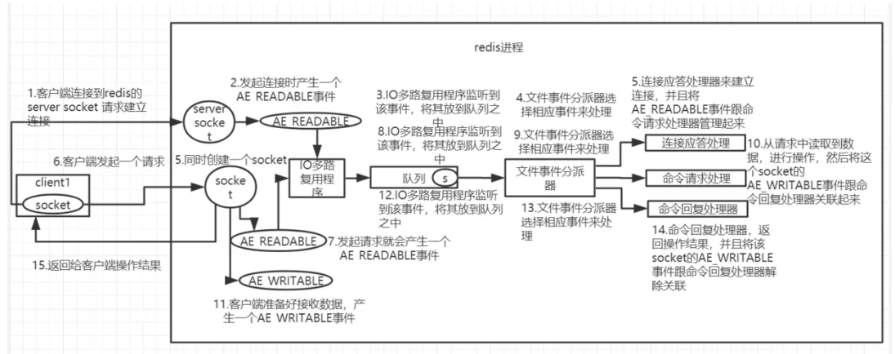

# Redis_线程模型

----

Redis的线程模型包括Redis 6.0之前和Redis 6.0。

下面介绍的是Redis 6.0之前。

Redis是基于reactor模式开发了网络事件处理器，这个处理器叫做文件事件处理器(file event handler)。由于这个文件事件处理器是单线程的，所以Redis才叫做单线程的模型。采用IO多路复用机制同时监听多个Socket,根据socket上的事件来选择对应的事件处理器来处理这个事件。

1.  Redis启动初始化的时候，Redis会将连接应答处理器与AE__READABLE事件关联起来。
2.  如果一个客户端跟Redis发起连接，此时Redis会产生-一个AE_ READABLE事件，由于开始之初AE_READABLE是与连接应答处理器关联，所以由连接应答处理器来处理该事件，这时连接应答处理器会与客户端建立连接，创建客户端响应的socket，同时将这个socket的AE_READABLE事件与命令请求处理器关联起来。
3.  如果这个时间客户端向Redis发送一个命令(setk1v1) ，这时socket会产生一个AE_READABLE事件，10多路复用程序会将该事件压入队列中，此时事件分派器从队列中取得该事件，由于该socket的AE_READABLE事件已经和命令请求处理器关联了，因此事件分派器会将该事件交给命令请求处理器处理，命令请求处理器读取事件中的命令并完成。操作完成后，Redis会将该socket的AE_WRITABLE事件与命令回复处理器关联。
4.  如果客户端已经准备好接受数据后，Redis 中的该socket会产生一个AE_WRITABLE事件，同样会压入队列然后被事件派发器取出交给相对应的命令回复处理器，由该命令回复处理器将准备好的响应数据写入socket中，供客户端读取。
5.  命令回复处理器写完后，就会删除该socket的AE_WRITABLE事件与命令回复处理器的关联关系。

