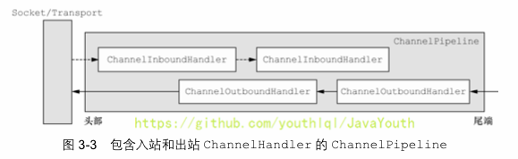

# Netty_编解码器和Handler调用机制

-----

## 基本说明

+   Netty 的组件设计：Netty 的主要组件有 Channel、EventLoop、ChannelFuture、ChannelHandler、ChannelPipe 等
+   ChannelHandler 充当了处理入站和出站数据的应用程序逻辑的容器。例如，实现 ChannelInboundHandler 接口（或 ChannelInboundHandlerAdapter），你就可以接收入站事件和数据，这些数据会被业务逻辑处理。当要给客户端发送响应时，也可以从 ChannelInboundHandler 冲刷数据。业务逻辑通常写在一个或者多个 ChannelInboundHandler 中。ChannelOutboundHandler 原理一样，只不过它是用来处理出站数据的
+   ChannelPipeline 提供了 ChannelHandler 链的容器。以客户端应用程序为例，如果事件的运动方向是从客户端到服务端的，那么我们称这些事件为出站的，即客户端发送给服务端的数据会通过 pipeline 中的一系列 ChannelOutboundHandler，并被这些 Handler 处理，反之则称为入站的




出站，入站如果搞不清楚，看下面的Netty的handler链的调用机制，通过一个例子和图讲清楚

## 编码解码器

+   当 Netty 发送或者接受一个消息的时候，就将会发生一次数据转换。入站消息会被解码：从字节转换为另一种格式（比如 java 对象）；如果是出站消息，它会被编码成字节。
+   Netty 提供一系列实用的编解码器，他们都实现了 ChannelInboundHadnler 或者 ChannelOutboundHandler 接口。在这些类中，channelRead 方法已经被重写了。以入站为例，对于每个从入站 Channel 读取的消息，这个方法会被调用。随后，它将调用由解码器所提供的 decode() 方法进行解码，并将已经解码的字节转发给 ChannelPipeline 中的下一个 ChannelInboundHandler。

## 解码器 - ByteToMessageDecoder

关系继承图


+   由于不可能知道远程节点是否会一次性发送一个完整的信息，tcp 有可能出现粘包拆包的问题，这个类会对入站数据进行缓冲，直到它准备好被处理.【后面有说TCP的粘包和拆包问题】
+   一个关于 ByteToMessageDecoder 实例分析


## Netty的handler链的调用机制

实例要求:

+   使用自定义的编码器和解码器来说明 Netty 的 handler 调用机制
+   客户端发送 long -> 服务器
+   服务端发送 long -> 客户端

读者可以看下这个图，带着这个图去看下面的例子。


### MyServer

```java
package com.atguigu.netty.inboundhandlerandoutboundhandler;

import io.netty.bootstrap.ServerBootstrap;
import io.netty.channel.ChannelFuture;
import io.netty.channel.EventLoopGroup;
import io.netty.channel.nio.NioEventLoopGroup;
import io.netty.channel.socket.nio.NioServerSocketChannel;

public class MyServer {
    public static void main(String[] args) throws Exception{

        EventLoopGroup bossGroup = new NioEventLoopGroup(1);
        EventLoopGroup workerGroup = new NioEventLoopGroup();

        try {

            ServerBootstrap serverBootstrap = new ServerBootstrap();
            serverBootstrap.group(bossGroup,workerGroup).channel(NioServerSocketChannel.class).childHandler(new MyServerInitializer()); //自定义一个初始化类


            ChannelFuture channelFuture = serverBootstrap.bind(7000).sync();
            channelFuture.channel().closeFuture().sync();

        }finally {
            bossGroup.shutdownGracefully();
            workerGroup.shutdownGracefully();
        }

    }
}
```

### MyServerInitializer

```java
package com.atguigu.netty.inboundhandlerandoutboundhandler;

import io.netty.channel.ChannelInitializer;
import io.netty.channel.ChannelPipeline;
import io.netty.channel.socket.SocketChannel;


public class MyServerInitializer extends ChannelInitializer<SocketChannel> {

    @Override
    protected void initChannel(SocketChannel ch) throws Exception {
        ChannelPipeline pipeline = ch.pipeline();//一会下断点

        //入站的handler进行解码 MyByteToLongDecoder
        pipeline.addLast(new MyByteToLongDecoder());
        //出站的handler进行编码
        pipeline.addLast(new MyLongToByteEncoder());
        //自定义的handler 处理业务逻辑
        pipeline.addLast(new MyServerHandler());
        System.out.println("xx");
    }
}
```

### MyServerHandler

```java
package com.atguigu.netty.inboundhandlerandoutboundhandler;

import io.netty.channel.ChannelHandlerContext;
import io.netty.channel.SimpleChannelInboundHandler;

public class MyServerHandler extends SimpleChannelInboundHandler<Long> {
    @Override
    protected void channelRead0(ChannelHandlerContext ctx, Long msg) throws Exception {

        System.out.println("从客户端" + ctx.channel().remoteAddress() + " 读取到long " + msg);

        //给客户端发送一个long
        ctx.writeAndFlush(98765L);
    }

    @Override
    public void exceptionCaught(ChannelHandlerContext ctx, Throwable cause) throws Exception {
        cause.printStackTrace();
        ctx.close();
    }
}
```

### MyClient

```java
package com.atguigu.netty.inboundhandlerandoutboundhandler;

import io.netty.bootstrap.Bootstrap;
import io.netty.channel.ChannelFuture;
import io.netty.channel.EventLoopGroup;
import io.netty.channel.nio.NioEventLoopGroup;
import io.netty.channel.socket.nio.NioSocketChannel;

public class MyClient {
    public static void main(String[] args)  throws  Exception{

        EventLoopGroup group = new NioEventLoopGroup();

        try {

            Bootstrap bootstrap = new Bootstrap();
            bootstrap.group(group).channel(NioSocketChannel.class)
                    .handler(new MyClientInitializer()); //自定义一个初始化类

            ChannelFuture channelFuture = bootstrap.connect("localhost", 7000).sync();

            channelFuture.channel().closeFuture().sync();

        }finally {
            group.shutdownGracefully();
        }
    }
}
```

### MyClientInitializer

```java
package com.atguigu.netty.inboundhandlerandoutboundhandler;

import io.netty.channel.ChannelInitializer;
import io.netty.channel.ChannelPipeline;
import io.netty.channel.socket.SocketChannel;


public class MyClientInitializer extends ChannelInitializer<SocketChannel> {
    @Override
    protected void initChannel(SocketChannel ch) throws Exception {

        ChannelPipeline pipeline = ch.pipeline();

        //加入一个出站的handler 对数据进行一个编码
        pipeline.addLast(new MyLongToByteEncoder());

        //这时一个入站的解码器(入站handler )
        pipeline.addLast(new MyByteToLongDecoder());
        //加入一个自定义的handler ， 处理业务
        pipeline.addLast(new MyClientHandler());


    }
}
```

### MyClientHandler

```java
package com.atguigu.netty.inboundhandlerandoutboundhandler;

import io.netty.buffer.Unpooled;
import io.netty.channel.ChannelHandlerContext;
import io.netty.channel.SimpleChannelInboundHandler;
import io.netty.util.CharsetUtil;

import java.nio.charset.Charset;

public class MyClientHandler  extends SimpleChannelInboundHandler<Long> {
    @Override
    protected void channelRead0(ChannelHandlerContext ctx, Long msg) throws Exception {

        System.out.println("服务器的ip=" + ctx.channel().remoteAddress());
        System.out.println("收到服务器消息=" + msg);

    }

    //重写channelActive 发送数据

    @Override
    public void channelActive(ChannelHandlerContext ctx) throws Exception {
        System.out.println("MyClientHandler 发送数据");
        //ctx.writeAndFlush(Unpooled.copiedBuffer(""))
        ctx.writeAndFlush(123456L); //发送的是一个long
    }
}
```

### MyByteToLongDecoder

```java
package com.atguigu.netty.inboundhandlerandoutboundhandler;

import io.netty.buffer.ByteBuf;
import io.netty.channel.ChannelHandlerContext;
import io.netty.handler.codec.ByteToMessageDecoder;

import java.util.List;

public class MyByteToLongDecoder extends ByteToMessageDecoder {
    /**
     *
     * decode 会根据接收的数据，被调用多次, 直到确定没有新的元素被添加到list
     * , 或者是ByteBuf 没有更多的可读字节为止
     * 如果list out 不为空，就会将list的内容传递给下一个 channelinboundhandler处理,
     * 该处理器的方法也会被调用多次
     *
     * @param ctx 上下文对象
     * @param in 入站的 ByteBuf
     * @param out List 集合，将解码后的数据传给下一个handler
     * @throws Exception
     */
    @Override
    protected void decode(ChannelHandlerContext ctx, ByteBuf in, List<Object> out) throws Exception {

        System.out.println("MyByteToLongDecoder 被调用");
        //因为 long 8个字节, 需要判断有8个字节，才能读取一个long
        if(in.readableBytes() >= 8) {
            out.add(in.readLong());
        }
    }
}
```

### MyLongToByteEncoder

```java
package com.atguigu.netty.inboundhandlerandoutboundhandler;

import io.netty.buffer.ByteBuf;
import io.netty.channel.ChannelHandlerContext;
import io.netty.handler.codec.MessageToByteEncoder;

public class MyLongToByteEncoder extends MessageToByteEncoder<Long> {
    //编码方法
    @Override
    protected void encode(ChannelHandlerContext ctx, Long msg, ByteBuf out) throws Exception {

        System.out.println("MyLongToByteEncoder encode 被调用");
        System.out.println("msg=" + msg);
        out.writeLong(msg);

    }
}
```

### 效果


### 出站入站

关于出站入站，很多人可能有点迷糊
+   客户端有出站入站，服务端也有出站入站
+   以客户端为例，如果有服务端传送的数据到达客户端，那么对于客户端来说就是入站；
    *   如果客户端传送数据到服务端，那么对于客户端来说就是出站；
    *   同理，对于服务端来说，也是一样的，有数据来就是入站，有数据输出就是出站
+   为什么服务端和客户端的Serverhandler都是继承SimpleChannelInboundHandler，而没有ChannelOutboundHandler出站类？
    *   实际上当我们在handler中调用ctx.writeAndFlush()方法后，就会将数据交给ChannelOutboundHandler进行出站处理，只是我们没有去定义出站类而已，若有需求可以自己去实现ChannelOutboundHandler出站类
+   总结就是客户端和服务端都有出站和入站的操作
    *   服务端发数据给客户端：服务端—>出站—>Socket通道—>入站—>客户端
    *   客户端发数据给服务端：客户端—>出站—>Socket通道—>入站—>服务端


## ByteToMessageDecoder的小细节

```java
package com.atguigu.netty.inboundhandlerandoutboundhandler;

import io.netty.buffer.Unpooled;
import io.netty.channel.ChannelHandlerContext;
import io.netty.channel.SimpleChannelInboundHandler;
import io.netty.util.CharsetUtil;

import java.nio.charset.Charset;

public class MyClientHandler  extends SimpleChannelInboundHandler<Long> {
    @Override
    protected void channelRead0(ChannelHandlerContext ctx, Long msg) throws Exception {

        System.out.println("服务器的ip=" + ctx.channel().remoteAddress());
        System.out.println("收到服务器消息=" + msg);

    }

    //重写channelActive 发送数据

    @Override
    public void channelActive(ChannelHandlerContext ctx) throws Exception {
        System.out.println("MyClientHandler 发送数据");

        //分析
        //1. "abcdabcdabcdabcd" 是 16个字节
        ctx.writeAndFlush(Unpooled.copiedBuffer("abcdabcdabcdabcd",CharsetUtil.UTF_8));

    }
}
```

```java
package com.atguigu.netty.inboundhandlerandoutboundhandler;

import io.netty.buffer.ByteBuf;
import io.netty.channel.ChannelHandlerContext;
import io.netty.handler.codec.ByteToMessageDecoder;

import java.util.List;

public class MyByteToLongDecoder extends ByteToMessageDecoder {
    /**
     *
     * decode 会根据接收的数据，被调用多次, 直到确定没有新的元素被添加到list
     * , 或者是ByteBuf 没有更多的可读字节为止
     * 如果list out 不为空，就会将list的内容传递给下一个 channelinboundhandler处理,
     * 该处理器的方法也会被调用多次
     *
     * @param ctx 上下文对象
     * @param in 入站的 ByteBuf
     * @param out List 集合，将解码后的数据传给下一个handler
     * @throws Exception
     */
    @Override
    protected void decode(ChannelHandlerContext ctx, ByteBuf in, List<Object> out) throws Exception {

        System.out.println("MyByteToLongDecoder 被调用");
        //因为 long 8个字节, 需要判断有8个字节，才能读取一个long
        if(in.readableBytes() >= 8) {
            out.add(in.readLong());
        }
    }
}
```


由于发送的字符串是16字节，根据上面注释说的内容，decode会被调用两次

如下图验证结果：


同时又引出了一个小问题


当我们MyClientHandler传一个Long时，会调用我们的MyLongToByteEncoder的编码器。那么控制台就会打印这样一句话：MyLongToByteEncoder encode 被调用。但是这里并没有调用编码器，这是为什么呢？

+   MyClientHandler这个处理器的后一个处理器是MyLongToByteEncoder
+   MyLongToByteEncoder的父类是MessageToByteEncoder，在MessageToByteEncoder中有下面的一个方法

```java
@Override
    public void write(ChannelHandlerContext ctx, Object msg, ChannelPromise promise) throws Exception {
        ByteBuf buf = null;
        try {
            //这里会判断当前msg 是不是应该处理的类型，如果是就处理，不是就跳过encode
            if (acceptOutboundMessage(msg)) {
                @SuppressWarnings("unchecked")
                I cast = (I) msg;
                buf = allocateBuffer(ctx, cast, preferDirect);
                try {
                    encode(ctx, cast, buf);
                } finally {
                    ReferenceCountUtil.release(cast);
                }

                if (buf.isReadable()) {
                    ctx.write(buf, promise);
                } else {
                    buf.release();
                    ctx.write(Unpooled.EMPTY_BUFFER, promise);
                }
                buf = null;
            } else {
                ctx.write(msg, promise);
            }
        } catch (EncoderException e) {
            throw e;
        } catch (Throwable e) {
            throw new EncoderException(e);
        } finally {
            if (buf != null) {
                buf.release();
            }
        }
    }
```

当我们以这样的形式发送数据

```java
ctx.writeAndFlush(Unpooled.copiedBuffer("abcdabcdabcdabcd",CharsetUtil.UTF_8));
```


这两个类型并不匹配，也就不会走编码器。因此我们编写 Encoder 是要注意传入的数据类型和处理的数据类型一致

结论：

+   不论解码器 handler 还是编码器 handler 即接收的消息类型必须与待处理的消息类型一致，否则该 handler 不会被执行
+   在解码器进行数据解码时，需要判断缓存区（ByteBuf）的数据是否足够，否则接收到的结果会期望结果可能不一致。

## 解码器 - ReplayingDecoder

+   public abstract class ReplayingDecoder<S> extends ByteToMessageDecoder
+   ReplayingDecoder 扩展了 ByteToMessageDecoder 类，使用这个类，我们不必调用 readableBytes() 方法，也就不用判断还有没有足够的数据来读取。参数 S 指定了用户状态管理的类型，其中 Void 代表不需要状态管理
+   应用实例：使用 ReplayingDecoder 编写解码器，对前面的案例进行简化[案例演示]

```java
package com.atguigu.netty.inboundhandlerandoutboundhandler;

import io.netty.buffer.ByteBuf;
import io.netty.channel.ChannelHandlerContext;
import io.netty.handler.codec.ReplayingDecoder;

import java.util.List;

public class MyByteToLongDecoder2 extends ReplayingDecoder<Void> {

    @Override
    protected void decode(ChannelHandlerContext ctx, ByteBuf in, List<Object> out) throws Exception {
        System.out.println("MyByteToLongDecoder2 被调用");
        //在 ReplayingDecoder 不需要判断数据是否足够读取，内部会进行处理判断
        out.add(in.readLong());
    }
}
```


+   ReplayingDecoder 使用方便，但它也有一些局限性：
    *   并不是所有的 ByteBuf 操作都被支持，如果调用了一个不被支持的方法，将会抛出一个 UnsupportedOperationException。
    *   ReplayingDecoder 在某些情况下可能稍慢于 ByteToMessageDecoder，例如网络缓慢并且消息格式复杂时，消息会被拆成了多个碎片，速度变慢

## 其它编解码器


+   LineBasedFrameDecoder：这个类在 Netty 内部也有使用，它使用行尾控制字符（\n或者\r\n）作为分隔符来解析数据。
+   DelimiterBasedFrameDecoder：使用自定义的特殊字符作为消息的分隔符。
+   HttpObjectDecoder：一个 HTTP 数据的解码器
+   LengthFieldBasedFrameDecoder：通过指定长度来标识整包消息，这样就可以自动的处理黏包和半包消息。

## Log4j 整合到 Netty

+   在 Maven 中添加对 Log4j 的依赖在 pom.xml

```xml
<dependency>
    <groupId>log4j</groupId>
    <artifactId>log4j</artifactId>
    <version>1.2.17</version>
</dependency>
<dependency>
    <groupId>org.slf4j</groupId>
    <artifactId>slf4j-api</artifactId>
    <version>1.7.25</version>
</dependency>
<dependency>
    <groupId>org.slf4j</groupId>
    <artifactId>slf4j-log4j12</artifactId>
    <version>1.7.25</version>
    <scope>test</scope>
</dependency>
<dependency>
    <groupId>org.slf4j</groupId>
    <artifactId>slf4j-simple</artifactId>
    <version>1.7.25</version>
    <scope>test</scope>
</dependency>
```

+   配置 Log4j，在 resources/log4j.properties

```
log4j.rootLogger=DEBUG,stdout
log4j.appender.stdout=org.apache.log4j.ConsoleAppender
log4j.appender.stdout.layout=org.apache.log4j.PatternLayout
log4j.appender.stdout.layout.ConversionPattern=[%p]%C{1}-%m%n
```

+   演示整合


## 参考

https://imlql.cn/post/429acc6d.html