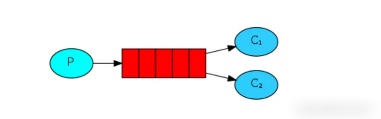

# RabbitMQ_六种工作模式

----

## simple简单模式


simple模式是一种简单的收发模式，如上图所示P代表消息生产者、红色部分为消息队列，C为消息消费者，到这里你会问，那交换机呢？在simple模式下我们无需指定交换机，RabbitMQ会通过默认的`default AMQP交换机`将我们的消息投递到指定的队列，它是一种Direct类型的交换机，队列与它绑定时的binding key其实就是队列的名称。更多的知识可以看我的另一篇文章，里面有详细介绍[RabbitMQ四种交换机类型](https://juejin.cn/post/6996134538887839780))


代码实现

+   首先，先定义一个队列queue5，无需定义交换机

```java
//simple模式
@Bean
public Queue queue5(){
    return new Queue("queue5");
}
```

+   生产者

```java
@Test
void contextLoads() {
    //无需指定交换机，传入空字符串
    //发送消息到队列queue5,这里的queue5其实就是routing key
    //和队列与默认交换机绑定时的binding key相同时消息才能被投递queue5
    rabbitTemplate.convertAndSend("","queue5","不喝奶茶的Programmer");
}
```

+   消费者

```java
@Component
public class Consumer1 {

    @RabbitListener(queues = "queue5")
    public void receiverMessage(Object msg, Channel channel,Message message) throws IOException {
        System.out.println("收到消息："+msg);
        channel.basicAck(message.getMessageProperties().getDeliveryTag(),false);

    }
}
```

+   程序输出

```
成功投递

收到消息：(Body:'不喝奶茶的Programmer' MessageProperties [headers={}, contentType=text/plain, contentEncoding=UTF-8, contentLength=0, receivedDeliveryMode=PERSISTENT, priority=0, redelivered=false, receivedExchange=, receivedRoutingKey=queue5, deliveryTag=1, consumerTag=amq.ctag-Kmxu_O-84ooZv_N2AjkkEg, consumerQueue=queue5])
```

从运行结果可以看出，我们在没有定义声明交换机的情况下，消息也是能够被成功投递到队列，且消费者能从中消费消息，从而也印证了我们上面所说的，simple模式下其实是采用默认的交换机来将消息投递到队列的，而不是说没有交换机。

## work模式




work模式采用的也是默认的default AMQP交换机。work模式下，多个消费者可以监听同一个队列，这时Queue中的消息会被平均分摊给多个消费者进行处理，而不是每个消费者都收到所有的消息并处理。当有多个消费者时，我们的消息会被哪一个消费者消费呢，应该如何均衡消费者消费信息的多少呢？

+   work主要有两种模式：
    *   `轮询分发`：一个消费者消费一条，按均分配，woek模式下默认是采用轮询分发方式。轮询分发就不写代码演示了，比较简单，比如生产费者发送了6条消息到队列中，如果有3个消费者同时监听着这一个队列，那么这3个消费者每人就会分得2条消息。下面主要介绍公平分发。
    *   `公平分发`：根据消费者的消费能力进行公平分发，处理得快的分得多，处理的慢的分得少，能者多劳。

### 公平分发模式

+   公平分发模式下我们需要修改RabbitMQ的配置，第一是将消息确认模式改为手动确认，第二是将预处理模式更改为每次读取1条消息，在消费者未返回确认之前，不再进行下一条消息的消费，修改后的配置文件如下：

```yaml
spring:
  #RabbitMq配置
  rabbitmq:
        host: 192.168.180.130
        port: 5672
        username: admin
        password: admin
        virtual-host: /
        #消息确认回调
        publisher-confirm-type: correlated
        #消息失败回调
        publisher-returns: true
        # 消费者监听
        listener:
             simple:
                     #消费者手动确认
                     acknowledge-mode: manual
                     #预处理模式，每次读取1条消息，在消费者未返回确认之前，不再处理下一条消息
                     prefetch: 1
```

+   接着我们让生产者投递4条消息到队列中，准备两个消费者来消费队列中的消息。

生产者

```java
@Test
void contextLoads() {
    //发送消息到队列queue5,这里的queue5其实就是routing key
    //和队列与默认交换机绑定时的binding key相同时消息才能被投递queue5
    for (int i = 1; i <5; i++) {
        rabbitTemplate.convertAndSend("","queue5","消息"+i+"不喝奶茶的Programmer",new CorrelationData(i+""));
    }
}
```

消费者1，消费能力差，消费过程中需要“睡觉”

```java
Component
@RabbitListener(queues = "queue5")
public class Consumer1 {
    @RabbitHandler
    public void receiverMessage(Object msg, Channel channel,Message message) throws IOException, InterruptedException {
        //睡会再消费吧
        Thread.sleep(1000);
        System.out.println("消费者1收到消息："+msg); channel.basicAck(message.getMessageProperties().getDeliveryTag(),false);
    }
}
```

消费者2，消费能力强

```java
@Component
@RabbitListener(queues = "queue5")
public class Consumer2 {
    @RabbitHandler
    public void receiverMessage(Object msg, Channel channel,Message message) throws IOException, InterruptedException {
        System.out.println("消费者2 收到消息："+msg); channel.basicAck(message.getMessageProperties().getDeliveryTag(),false);
    }
}
```

+   运行结果如下


由以上可以知道，在队列中有4条消息的情况下，消费能力强的消费者2消费了3条消息，而消费能力弱的消费者1只消费了1条消息，因此这种就是在公平分发模式下的能者多劳，消费者1不用睡觉，所以其消费能力强，一下子消费3条消息，而消费者2消费的时候还要睡一下懒觉消费能力差，因此只能消费1条消息。

### 应用场景

如在一个购物平台中，包含两个订单系统，当用户下后，将下单信息发送到RabbitMQ中，只需要任意一个订单系统从队列中获取订单信息，对用户订单进行处理。


## Publish/Subscribe发布订阅模式


在Publish/Subscribe发布订阅模式中，生产者将消息发送到Broker中，由交换机将消息投递到与之绑定的每一个队列中，每个消费者监听自己的队列，从队列中获取生产者发送的消息。其实这就是与我们之前讲的fanout类型的交换机一样，所有与一个fanout类型的交换机绑定的队列都会接收到其投递的消息，所有队列共享消息。

### 代码实现

+   首先我们需要定义一个fanout类型的交换机，以及两个队列queue6,、queue7，并将queue6、queue7绑定到交换机上，如下：

```java
//声明一个fanout类型的交换机
@Bean
public FanoutExchange fanoutExchange(){
    return new FanoutExchange("PS_fanoutExchange");
}

//声明两个队列，分别与上面声明的fanout交换机进行绑定
@Bean
public Queue queue6(){
    return new Queue("queue6");
}

@Bean
public Queue queue7(){
    return new Queue("queue7");
}

//绑定queue6
@Bean
public Binding binding6(){
    return BindingBuilder.bind(queue6()).to(fanoutExchange());
}

//绑定queue7
@Bean
public Binding binding7(){
    return BindingBuilder.bind(queue7()).to(fanoutExchange());
}
```

+   定义两个消费者，消费者1监听队列queue6，消费者2监听队列queue7

消费者1

```java
@Component
public class psConsumer1 {

    //监听队列queue6
    @RabbitListener(queues = "queue6")
    public void receiver(Object msg, Message message, Channel channel) throws IOException {
        System.out.println("监听队列queue6的消费者1收到消息："+ msg);
        //手动ACK
        channel.basicAck(message.getMessageProperties().getDeliveryTag(),false);
    }
}
```

消费者2

```java
@Component
public class psConsumer2 {

    //监听队列queue6
    @RabbitListener(queues = "queue7")
    public void receiver(Object msg, Message message, Channel channel) throws IOException {
        System.out.println("监听队列queue7的消费者2收到消息："+ msg);
        //手动ACK
        channel.basicAck(message.getMessageProperties().getDeliveryTag(),false);
    }
}
```

+   生产者发送一条消息，无需指定routing key路由键

```java
@Test
void PublicSubscribe(){
    rabbitTemplate.convertAndSend("PS_fanoutExchange","","发布订阅模式",new CorrelationData("不喝奶茶的Programmer"));
}
```

+   运行结果如下


从上面的运行结果可以看到，生产者只发送了一条消息，而两个消费者都收到了生产者发送的消息，这说明Publish/Subscribe发布订阅模式下，只要与交换机绑定的队列都可以接收到生产者发送的消息，从而监听对应队列的消费者就都可以获取交换机投递到队列中的消息。

### 应用场景

如在一个用户注册服务中，用户提交注册信息后，将信息发送到RabbitMQ中，由短信服务和邮件服务分别中队列中获取用户信息，完成用户注册后的短信和邮件发送。


## Routing路由模式


路由模式下，对应使用的交换机是Direct交换机，生产者发送消息时需要指定routing key，交换机会根据routing key将消息投递到指定的队列，关于Direct交换机的相关知识点及其消息的投递在上一篇文章中讲得很清楚了，下面直接上例子。

### 代码实现

声明一个Direct类型的交换机，名字为Routing_Direct声明两个队列queue8、queue9，将队列queue8绑定到交换器上并指定binding key为orange，将队列queue9绑定到交换器上，并指定binding key为green

```java
//声明一个Direct类型的交换机
@Bean
public DirectExchange directExchange(){
    return new DirectExchange("Routing_Direct");
}

//声明两个队列
@Bean
public Queue queue8(){
    return new Queue("queue8");
}

@Bean
public Queue queue9(){
    return new Queue("queue9");
}

//将队列queue8绑定到交换器上，并指定binding key为orange
@Bean
public Binding bindingQueue8(){
    return BindingBuilder.bind(queue8()).to(directExchange()).with("orange");
}

//将队列queue9绑定到交换器上，并指定binding key为green
@Bean
public Binding bindingQueue9(){
    return BindingBuilder.bind(queue9()).to(directExchange()).with("green");
}
```


+   准备两个消费者分别监听queue8和queue9

Consumer1

```java
@Component
public class R_Consumer1 {

    @RabbitListener(queues = "queue8")
    public void getMessage(Object msg, Message message, Channel channel) throws IOException {
        System.out.println("消费者1监听队列queue8获取到的消息是：" + msg);
        //手动确认
        channel.basicAck(message.getMessageProperties().getDeliveryTag(),false);
    }
}
```

Consumer2

```java
@Component
public class R_Consumer2 {

    @RabbitListener(queues = "queue9")
    public void getMessage(Object msg, Message message, Channel channel) throws IOException {
        System.out.println("消费者2监听队列queue9获取到的消息是：" + msg);
        //手动确认
        channel.basicAck(message.getMessageProperties().getDeliveryTag(),false);
    }
}
```

+   生产者发送消息，指定routing key为orange

```java
@Test
void RoutingModelTest(){
    rabbitTemplate.convertAndSend("Routing_Direct","orange","不喝奶茶的Programmer喜欢orange",new CorrelationData("orange"));
}
```

+   运行结果如下


很显然只有消费者1接收到消息，因为routing key和队列queue8与交换机绑定时的binding key相同，则消息只被投递到队列queue8,消费者监听队列queue8，因此只有它能接收到消息。

## Topic主题模式


Topic主题模式采用的是Topic类型的交换机，因此是支持模糊匹配，消息能被投递到一个或多个队列中。生产者发送消息时指定routing key，Topic类型的交换机会根据routing key找到所有符合队列与交换机绑定时指定的binding key规则的队列，并将消息投递到那些队列中。如上图，当发送消息时指定routing key为a.orange.b(符合binding key = *.orange.*的匹配规则)，则消息会被投递到Q1队列中，不会被投递到Q2队列中。下面通过代码演示：

### 代码实现

声明一个Topic类型的交换机，和两个队列queue10和queue11，//将队列queue10绑定到交换器上，并指定binding key为`*.orange.*`，将队列queue11绑定到交换器上，并指定binding key为`*.*.rabbit`。

```java
//声明一个Topic类型的交换机
@Bean
public TopicExchange directExchange(){
    return new TopicE@Bean
public TopicExchange directExchange(){
    return new TopicExchange("Exchange_Topic");
}

//声明两个队列
@Bean
public Queue queue10(){
    return new Queue("queue10");
}

@Bean
public Queue queue11(){
    return new Queue("queue11");
}

//将队列queue10绑定到交换器上，并指定binding key为*.orange.*
@Bean
public Binding bindingQueue8(){
    return BindingBuilder.bind(queue10()).to(directExchange()).with("*.orange.*");
}

//将队列queue11绑定到交换器上，并指定binding key为*.*.rabbit
@Bean
public Binding bindingQueue9(){
    return BindingBuilder.bind(queue11()).to(directExchange()).with("*.*.rabbit");
}
```

+   准备两个消费者分别监听queue10和queue11

Consumer1

```java
@Component
public class T_Consumer1 {

    @RabbitListener(queues = "queue10")
    public void getMessage(Object msg, Message message, Channel channel) throws IOException {
        System.out.println("消费者1监听队列queue10获取到的消息是：" + msg);
        //手动确认
        channel.basicAck(message.getMessageProperties().getDeliveryTag(),false);
    }
}
```

Consumer2

```java
@Component
public class T_Consumer2 {

    @RabbitListener(queues = "queue11")
    public void getMessage(Object msg, Message message, Channel channel) throws IOException {
        System.out.println("消费者2监听队列queue11获取到的消息是：" + msg);
        //手动确认
        channel.basicAck(message.getMessageProperties().getDeliveryTag(),false);
    }
}
```

+   生产者发送消息，指定routing key为`a.orange.b`

```java
@Test
void TopicModelTest(){
    rabbitTemplate.convertAndSend("Exchange_Topic","a.orange.b","不喝奶茶的Programmer喜欢a.orange.b",new CorrelationData(
            "a.orange.b"));
}
```

+   运行结果


消息被投递到了队列queue10，因为路由键a.orange.b符合queue10与交换机的binding key的匹配规则，因而消息能够被正确投递到queue10。

## RPC模式


RPC模式是一种远程过程调用模式，目前了解得还不多，认识不够深

## 总结

RabbitMq的工作模式其实大致都是基于四种类型的交换机来划分的，simple简单模式、work模式、Routing路由模式是基于Direct类型的交换机来实现(simple简单模式、work模式是基于default AMQP默认交换机也就是Direct类型的)；publish/Subscribe发布订阅模式是基于fanout类型的交换机来实现的。Routing路由模式是基于；Topic主题模式是基于Topic类型的交换机来实现的。在日常开发中会我们遇到各种各样的业务需求，因此，掌握好RabbitMQ这几种工作模式非常重要，有了这些基础，我们就可以根据业务需求及其系统的性能考虑，合理地使用RabbitMQ，将我们的技术更好地服务于业务

## 参考

+   [RabbitMQ六种工作模式](https://juejin.cn/post/6997217228743507981#heading-3)