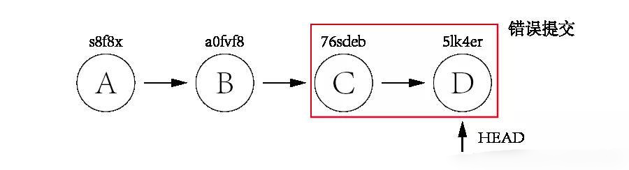
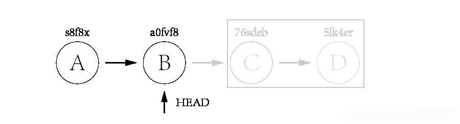
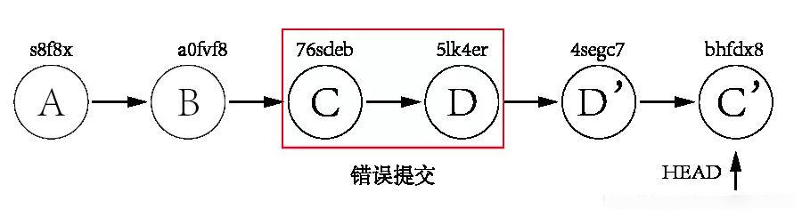
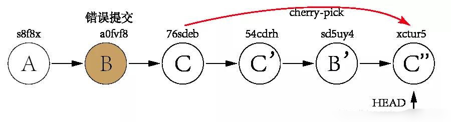

# Git版本回退

----

对于版本的回退，我们经常会用到两个命令：

```
git reset
git revert
```

# git reset

假如我们的系统现在有如下几个提交：



其中：A 和 B 是正常提交，而 C 和 D 是错误提交。现在，我们想把 C 和 D 回退掉。而此时，HEAD 指针指向 D 提交（5lk4er）。我们只需将 HEAD 指针移动到 B 提交（a0fvf8），就可以达到目的。

只要有 git 基础的朋友，一定会想到 git reset 命令。完整命令如下：

```bash
git reset --hard a0fvf8
```

命令运行之后，HEAD 指针就会移动到 B 提交下，如下图示：



而这个时候，远程仓库的 HEAD 指针依然不变，仍在 D 提交上。所以，如果直接使用 git push 命令的话，将无法将更改推到远程仓库。此时，只能使用 -f 选项将提交强制推到远程仓库：

```bash
git push -f
```

`采用这种方式回退代码的弊端显而易见，那就是会使 HEAD 指针往回移动，从而会失去之后的提交信息`。将来如果突然发现，C 和 D 是多么绝妙的想法，可它们已经早就消失在历史的长河里了。

而且，`有些公司（比如良许的公司）明令禁止使用 git reset 命令去回退代码，原因与上述一样`。所以，我们需要找到一个命令，既可以回退代码，又可以保存错误的提交。这时，git revert命令就派上用场了。

# git revert

git revert的作用通过反做创建一个新的版本，这个版本的内容与我们要回退到的目标版本一样，但是HEAD指针是指向这个新生成的版本，而不是目标版本。

使用 git revert 命令来实现上述例子的话，我们可以这样做：先 revert D，再 revert C （`有多个提交需要回退的话需要由新到旧进行 revert`）：

```bash
git revert 5lk4er
git revert 76sdeb
```

这里会生成两个新有提交：D' 和 C'，如下图示：



这里只有两个提交需要 revert，我们可以一个个回退。但如果有几十个呢？一个个回退肯定效率太低而且容易出错。我们可以使用以下方法进行批量回退：

```bash
git revert OLDER_COMMIT^..NEWER_COMMIT
```

这时，错误的提交 C 和 D 依然保留，将来进行甩锅的时候也有依可循。而且，这样操作的话 HEAD 指针是往后移动的，可以直接使用 git push 命令推送到远程仓库里。而这种做法，正是企业所鼓励的。

# 举个更难一点的例子

假如现在有三个提交，但很不巧的是，那个错误的提交刚好位于中间。如下图示：


这时，直接使用 git reset 命令将 HEAD 指针重置到 A 提交显然是不行的，因为 C 提交是正确的，需要保留的。先把 C 提交 及 B 提交全部回退，再使用 cherry-pick 命令将 C 提交重新再生成一个新的提交 C''，这样就实现了将 B提交回退的需求。完整的过程如下：



通过以上对比可以发现，git reset 与 git revert 最大的差别就在于，git reset 会失去后面的提交，而 git revert 是通过反做的方式重新创建一个新的提交，而保留原有的提交。在企业里，应尽量使用 git revert 命令，能不用 git reset 命令尽量不用。

# 来源

+   [Git如何优雅的进行版本回退：git reset 和 git revert区别](https://blog.csdn.net/fly910905/article/details/88635673)