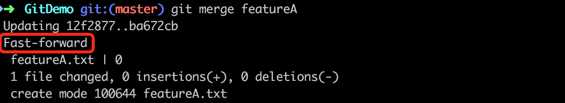

# Git的Branch说明

----

# Branch 的概念

分支的概念，在我看来，分两个版本：

从使用场景上解释，是这么个概念

Git 的分支，就是开发过程中，要选择的一条路，你可以选择和其他小伙伴一起走同一条路，也可以自己走一条路，路与路之间相互没有影响，作为路的主人，你也随时可以让两条路合并。


深入一点的话，是这么个概念：

Git 的分支，其实本质上仅仅是指向提交对象的可变指针，这个可变指针，指向路的终点。同时，还有一个比较特别的 HEAD 指针，用于记录当前工作的位置，借用上面的例子，这个 HEAD 指针等于在路上走的你自己，你在哪，指针就在哪，你在哪个分支，HEAD 指针就指向哪个分支的指针。


实际上，当我们使用 Git 的时候，我们就使用了分支，因为 Git 的默认分支名字是 master，如果你有心的话，会发现执行 git init后，命令行的输出头部已经默认在 master 分支了。 但是这个时候，还并未创建 master 分支，只有当有一个提交的时候，才会创建 master 分支。


# 玩转 Branch 必备技能

## 创建分支

```bash
git branch <name>
```

这个命令看起来，似乎简单到你只需要想个分支的名字就好了。
但是在创建分支的时候，要想下，是否要从当前分支的内容基础上去开辟一条新分支。

## 查看分支

三个命令，让你想看什么分支就看什么分支，就是这么方便

```bash
 git branch //查看本地分支
 git branch -r //查看远程分支
 git branch -a //查看本地和远程的所有分支
```

## 删除分支

当本地分支删除后，推动到远程仓库后，远程仓库并不能自动删除远程分支（原因，下回分解）。所以，分支的完全删除是分两个部分的，一个是本地，一个是远程。

本地删除操作需要加上 -d或者 -D 参数，参数的名称来自英语 delete的缩写，Remember it so easy!

两者的区别在于-D比-d要粗暴一点。当被删除分支有新内容没有被合并的时候，使用-D，会直接删除， 使用-d，会提示该分支有新内容没有被合并，不执行删除。删除需谨慎，建议非特殊情况下，使用温柔的-d要好一点，以免小手一抖，眼泪长流。

```bash
 git branch -d <name>
 git branch -D <name> //强制删除
```

删除远程分支需要 push 操作。

```bash
git push origin :<name>
```

## 重命名分支

其实，这是个伪命题。

但是有很多人，包括我，都有过对分支名称不满意想该修改一下的想法，所以，就有了这个伪命题的存在。

事实上，分支不存在重命名，没有 rename 的这个命令。如果你起的名字不满意，想重新起的话，那只要创建一个和要修改分支内容一样的分支，起上你喜欢的名字，然后再把之前的给删掉。

## 检出分支

这个检出分支的“检出”二字，算是个关于 Git 分支的专业术语了,你可以理解为切换当前分支。
本质上， checkout 操作是移动 HEAD 指针，将 HEAD 指针指向要切换的分支的指针处。

使用场景有两个：

1.  已经存在的分支，现在要切换过去。

```bash
 git checkout <name>
```

2.  创建一个新分支，并切换到新分支，这个一步到位的话需要 -b 参数。

```bash
# 以当前分支为基础，创建一个新分支
git checkout -b <branch name>

# 以指定的某一个提交，创建一个新分支
git checkout -b <branch name> <SHA1>
```

## 合并分支

以上，是分支的增删改查独立操作，但是 Git 创造这个分支，并不只是为了让它们自个儿和自个儿玩的，还需要它们之间的相互协作和配合。 就像写项目的时候，分好开发任务，你和你的小伙伴新建了两个分支，你写你的 Anglela，他写他的 baby,到开发完成之后，肯定要合在一起，才能成就 Anglelababy。合的这个动作，就涉及到了分支合并的概念。

分支合并使用到的命令是

```bash
git merge <branch name>
```

# Branch 合并是大事

git 的两种合并模式

分支的合并是非常智能的，目前有两种模式，两种模式的选择，不需要我们参与，而是 Git 根据分支情况不同，自行判断选择的。在我使用 Git 的过程中，执行分支合并，有时需要输入提交信息，有时不需要，作为小白的我懵的不知所以然，后来才知道是因为合并模式的问题。

两种模式是：

+   Fast-Forward（快进式）（PS:这个名字是官方的）
+   Recursive Strategy Merge（策略合并式）（PS:这个名字非官方，我自己起的，有时也叫三方合并式）
    *   三方合并我在其它文章有详细说明

## Fast-Forward（快进式）


如图，有两个分支，master 分支和 feature 分支。当这两个分支处于上面的关系时，当进行合并操作时，就会出现 fast-forward。

原因是；由于当前 master 分支所指向的提交是 feature 分支的直接上游，所以 Git 只是简单的将指针向前移动。 换句话说，当你试图合并两个分支时，如果顺着一个分支走下去能够到达另一个分支，那么 Git 在合并两者的时候，只会简单的将指针向前推进（指针右移），因为这种情况下的合并操作没有需要解决的分歧——这就叫做 “快进（fast-forward）”。

合并后的分支指针位置如下：


## Recursive Strategy Merge（策略合并式）

这个合并方式，是为补充 fast-forward 而出现的，因为你知道，在项目开发过程中，很多人开发的情况下，出现 fast-forward 的情况并不是很多，很多是类似下面这种。提交历史是分叉的，无法满足执行 fast-forward 的条件：


因为，master 分支所在提交并不是 feature 分支所在提交的直接祖先，Git 不得不做一些额外的工作。 出现这种情况的时候，Git 会使用两个分支的末端所指的快照（C4 和 C5）以及这两个分支的工作祖先（C3），做一个简单的三方合并,生成一个新的提交（C6）。


# 实战演练一下

```bash
# 创建一个文件夹，并初始化 Git
mkdir GitDemo
git init

# 初次提交，创建 master 分支
touch master.txt
git add.
git commit -m '添加master文件'

# 从master分支末尾，创建并切换 featureA 分支，并创建一个提交
git checkout -b featureA
touch A.txt
git add.
git commit -m '添加A文件'

# 从master分支末尾，创建并切换 featureB 分支，并创建一个提交
git checkout master
git checkout -b featureB
touch B.txt
git add.
git commit -m '添加B文件'

# 切换 master 分支
git checkout master

# master 合并 featureA 分支
git merge featureA

# master 合并featureA 后再合并 featureB 分支
git merge featureB
```

master 分支合并 featureA 时，是快进式合并：



master 分支合并 featureA 后， 再合并 featureB 时，已经不满足快进式条件了，此时合并会触发一个三方合并，产生一个新的提交。所以，执行合并命令，会跳到下面的页面，让我们编辑这个新提交的提交信息，默认提交信息是“Merge branch ‘branch name’”. 按 i编辑提交信息, :wq!保存并退出页面。


合并成功后的提示信息：


画出上面小例子的分支合并，示意图，如下：


# 和平解决 Branch 合并冲突


有时候合并操作不会如此顺利。 如果你在两个不同的分支中，对同一个文件的同一个部分进行了不同的修改，Git 就没法干净的合并它们，于是就会发生冲突。

如下，分别在 master 和 featureA ，在master.txt 文件第一行添加一句话，然后两个分支合并，就会发生冲突。


