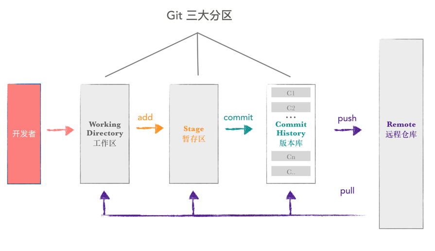
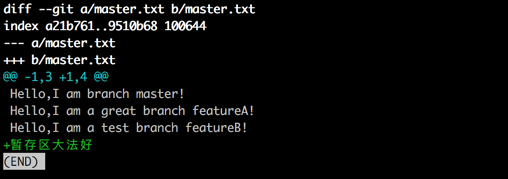
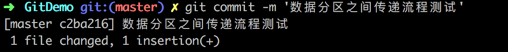

# Git的Stage说明

----

# Git 可以大概分为三个区

Git 本地数据管理，大概可以分为三个区，工作区,暂存区和版本库。

+   工作区（Working Directory）
    *   是我们直接编辑的地方，例如 Android Studio 打开的项目，记事本打开的文本等，肉眼可见，直接操作。
+   暂存区（Stage 或 Index）
    *   数据暂时存放的区域，可在工作区和版本库之间进行数据的友好交流。
+   版本库（commit History）
    *   存放已经提交的数据，push 的时候，就是把这个区的数据 push 到远程仓库了。

下面是，当开发者通过 git 修改数据时，各区之间的数据传递流程示意图。

# 流程验证

为了验证以上流程的正确性，我们可以自己动手实验一下，为了对比三个区之间的数据差别，过程中，可以借助神奇的 diff 命令。

|        命令       |       作用       |
|-------------------|------------------|
| git diff          | 工作区 vs 暂存区 |
| git diff head     | 工作区 vs 版本库 |
| git diff --cached | 暂存区 vs 版本库 |

现在三个区的数据是一致的，执行 git diff 命令都为空

|                  命令                 |                    结果                   |
|---------------------------------------|-------------------------------------------|
| （工作区 vs 暂存区）git diff          |  |
| （工作区 vs 版本库）git diff head     |  |
| （暂存区 vs 版本库）git diff --cached |  |

然后给 master.txt 添加一行内容后，现在工作区内容发生变化，暂存区和版本库内容不变。

|                  命令                 |                    结果                   |
|---------------------------------------|-------------------------------------------|
| （工作区 vs 暂存区）git diff          |  |
| （工作区 vs 版本库）git diff head     |  |
| （暂存区 vs 版本库）git diff --cached |  |

执行git add 操作后，修改同步到暂存区，现在工作区和暂存区数据一致。

|                  命令                 |        接果        |
|---------------------------------------|--------------------|
| （工作区 vs 暂存区）git diff          |  |
| （工作区 vs 版本库）git diff head     |  |
| （暂存区 vs 版本库）git diff --cached |  |

执行 git commit 操作后，修改已经同步到版本库，三区数据再次保持一致。

|                  命令                 |                    结果                   |
|---------------------------------------|-------------------------------------------|
| （工作区 vs 暂存区）git diff          |  |
| （工作区 vs 版本库）git diff head     |  |
| （暂存区 vs 版本库）git diff --cached |  |

# Stage 赋予 Git 更多灵活性

以下看起来比较束手无策的场景，只要理解 stage,用好相应命令，都能轻易解决：

+   修改了4个文件，在不放弃任何修改的情况下，其中一个文件不想提交，如何操作？（没add : git add 已经add: git reset --soft ）
+   修改到一半的文件，突然间不需要或者放弃修改了，怎么恢复未修改前文件？ (git checkout)
+   代码写一半，被打断去做其他功能开发，未完成代码保存？(git stash)
+   代码写一半，发现忘记切换分支了？(git stash & git checkout)
+   代码需要回滚了？（git reset）
+   等等

上面提到的 checkout & stash & reset 等命令，通过不同的参数搭配使用，可以在工作区，暂存区和版本库之间，轻松进行数据的来回切换。

例如前篇 Branch 文章用到的 git reset 回滚命令，带上不同参数就有不同的作用，如下：

|        命令       |          作用          |
|-------------------|------------------------|
| git reset --soft  | 暂存区->工作区         |
| git reset --mixed | 版本库->暂存区         |
| git reset --hard  | 版本库->暂存区->工作区 |
