#	MyBatisPlus

----

#	特性

+	无侵入：只做增强不做改变，引入它不会对现有工程产生影响，如丝般顺滑
+	损耗小：启动即会自动注入基本 CURD，性能基本无损耗，直接面向对象操作，BaseMapper
+	强大的 CRUD 操作：内置通用 Mapper、通用 Service，仅仅通过少量配置即可实现单表大部分 CRUD 操作，更有强大的条件构造器，满足各类使用需求，以后简单的CRUD操作，不用自己编写了 ！
+	支持 Lambda 形式调用：通过 Lambda 表达式，方便的编写各类查询条件，无需再担心字段写错
+	支持主键自动生成：支持多达 4 种主键策略（内含分布式唯一 ID 生成器 - Sequence），可自由配置，完美解决主键问题
+	支持 ActiveRecord 模式：支持 ActiveRecord 形式调用，实体类只需继承 Model 类即可进行强大的 CRUD 操作
+	支持自定义全局通用操作：支持全局通用方法注入（ Write once, use anywhere ）
+	内置代码生成器：采用代码或者 Maven 插件可快速生成 Mapper 、 Model 、 Service 、 Controller 层代码，支持模板引擎，更有超多自定义配置等您来使用（自动帮你生成代码）
+	内置分页插件：基于 MyBatis 物理分页，开发者无需关心具体操作，配置好插件之后，写分页等同于普通 List 查询
+	分页插件支持多种数据库：支持 MySQL、MariaDB、Oracle、DB2、H2、HSQL、SQLite、Postgre、SQLServer 等多种数据库
+	内置性能分析插件：可输出 Sql 语句以及其执行时间，建议开发测试时启用该功能，能快速揪出慢查询
+	内置全局拦截插件：提供全表 delete 、 update 操作智能分析阻断，也可自定义拦截规则，预防误操作

#	快速入门

+	官方链接：https://baomidou.com/guide/

##	导入Pom配置文件

```xml
 <dependencies>
        <!--1.数据库驱动-->
        <dependency>
            <groupId>mysql</groupId>
            <artifactId>mysql-connector-java</artifactId>
            <scope>runtime</scope>
        </dependency>
        <!--2.lombok-->
        <dependency>
            <groupId>org.projectlombok</groupId>
            <artifactId>lombok</artifactId>
        </dependency>
        <!--3.mybatis-plus  版本很重要3.0.5-->
        <dependency>
            <groupId>com.baomidou</groupId>
            <artifactId>mybatis-plus-boot-starter</artifactId>
            <version>3.0.5</version>
        </dependency>
        <!--4.h2-->
        <dependency>
            <groupId>com.h2database</groupId>
            <artifactId>h2</artifactId>
            <scope>runtime</scope>
        </dependency>
        <dependency>
            <groupId>org.springframework.boot</groupId>
            <artifactId>spring-boot-starter-web</artifactId>
        </dependency>
        <dependency>
            <groupId>org.springframework.boot</groupId>
            <artifactId>spring-boot-starter-test</artifactId>
            <scope>test</scope>
        </dependency>
    </dependencies>
 ```

##	连接数据库配置

```
#数据库连接配置
spring.datasource.username=root
spring.datasource.password=root
#mysql5~8 驱动不同driver-class-name     8需要增加时区的配置serverTimezone=UTC
#useSSL=false 安全连接
spring.datasource.url=jdbc:mysql://localhost:3306/mybatis_plus?serverTimezone=UTC&useUnicode=true&characterEncoding=utf-8
spring.datasource.driver-class-name=com.mysql.cj.jdbc.Driver
````

##	编写实体类

```java
package com.wsk.pojo;
import lombok.AllArgsConstructor;
import lombok.Data;
import lombok.NoArgsConstructor;
@Data
@AllArgsConstructor
@NoArgsConstructor
public class User {
    private Long id;
    private String name;
    private Integer age;
    private String email;
}
```

##	编写实体类对应的mapper接口

```java
package com.wsk.mapper;
import com.baomidou.mybatisplus.mapper.BaseMapper;
import com.wsk.pojo.User;
import org.springframework.stereotype.Repository;
//在对应的接口上面继承一个基本的接口 BaseMapper
@Repository//代表持久层
public interface UserMapper extends BaseMapper<User> {
    //所有CRUD操作都编写完成了，不用像以前一样配置一大堆文件
}
```

##	在主启动类添加@MapperScan注解

```java
package com.wsk;
import org.mybatis.spring.annotation.MapperScan;
import org.springframework.boot.SpringApplication;
import org.springframework.boot.autoconfigure.SpringBootApplication;
//扫描mapper包下的所有接口
@MapperScan("com.wsk.mapper")
@SpringBootApplication
public class MybatisPlusApplication {
    public static void main(String[] args) {
        SpringApplication.run(MybatisPlusApplication.class, args);
    }
}
```

##	进行Test测试

```java
package com.wsk;
import com.wsk.mapper.UserMapper;
import com.wsk.pojo.User;
import org.junit.jupiter.api.Test;
import org.springframework.beans.factory.annotation.Autowired;
import org.springframework.boot.test.context.SpringBootTest;
import java.util.List;
@SpringBootTest
class MybatisPlusApplicationTests {
    //继承了BaseMapper，所有的方法都来自父类，我们也可以编写自己的扩展方法！
    @Autowired
    private UserMapper userMapper;
    @Test
    void contextLoads() {
        //参数是一个wrapper ，条件构造器，这里我们先不用 null
        List<User> userList = userMapper.selectList(null);//查询全部的用户
        userList.forEach(System.out::println);
    }
}
```

##	结果

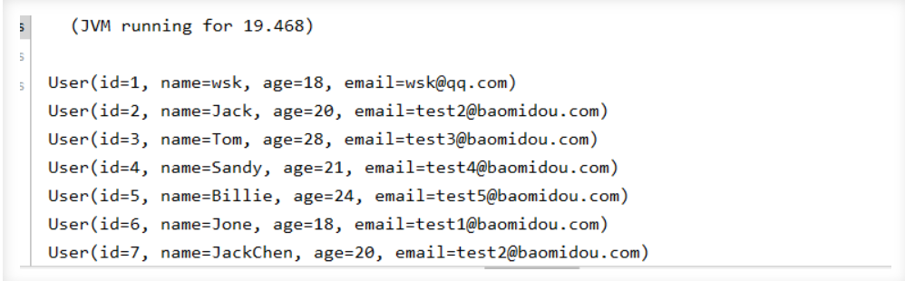


>	思考问题

+	SQL谁帮我们写的? MyBatis-Plus都写好了
+	方法哪里来的? MyBatis-Plus都写好了

#	配置日志
我们所有的sql是不可见的，我们希望知道他们是怎么执行的，所以要配置日志知道

```
#配置日志  log-impl:日志实现
mybatis-plus.configuration.log-impl=org.apache.ibatis.logging.stdout.StdOutImpl
```

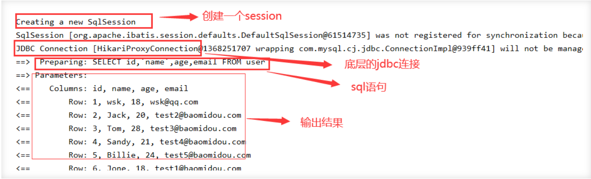

#	CURD扩展

##	插入Insert

```
@Test//测试插入
public void insertTest(){
    User user = new User();
    user.setName("wsk");
    user.setAge(18);
    user.setEmail("2803708553@qq.com");
    Integer result = userMapper.insert(user); //会帮我们自动生成id
    System.out.println(result); //受影响的行数
    System.out.println(user); //通过日志发现id会自动回填
}
```


###	插入数据时生成ID的策略

```java
public enum IdType {
    AUTO, 		//数据库id自增
    INPUT, 		//手动输入
    ID_WORKER, 	//默认的全局唯一id
    UUID, 		//全局唯一id  uuid
    NONE;		//未设置主键
    **
}
```

###	更换策略

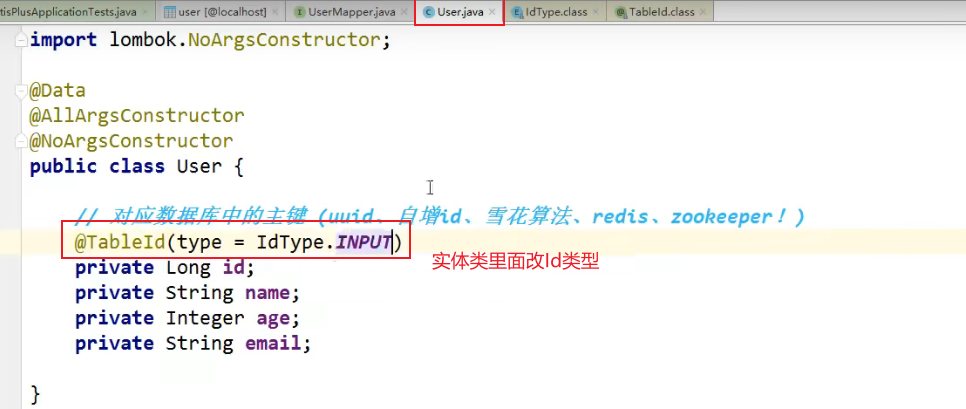

###	不同策略说明

####	雪花算法-默认-ID_WORKER

默认 : ID_WORKER 全局唯一Id

分布式系统唯一Id生成：https://www.cnblogs.com/haoxinyue/p/5208136.html

Twitter的snowflake算法
snowflake是Twitter开源的分布式ID生成算法，结果是一个long型的ID。其核心思想是：使用41bit作为毫秒数，10bit作为机器的ID（5个bit是数据中心（北京、香港···），5个bit的机器ID），12bit作为毫秒内的流水号（意味着每个节点在每毫秒可以产生 4096 个 ID），最后还有一个符号位，永远是0。

具体实现的代码可以参看https://github.com/twitter/snowflake。

####	主键自增-AUTO

+	在实体类字段上配置`@TableId(type = IdType.AUTO)`
+	数据库主键要勾选是自增

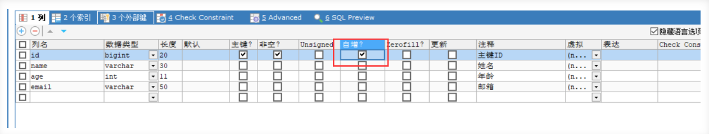

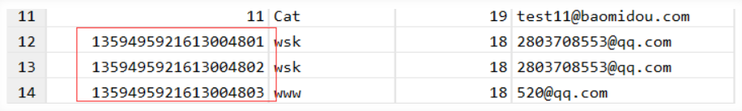

####	手动输入-INPUT-需要自己写id

在实体类字段上配置`@TableId(type = IdType.INPUT)`

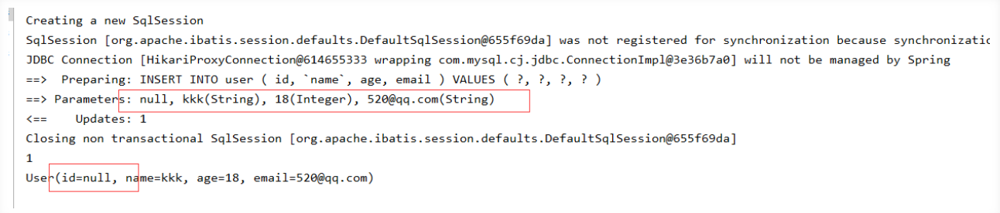

####	其他

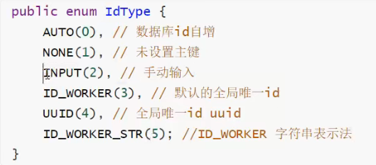

##	更新Update

```java
@Test//测试更新
public void updateTest(){
    User user = new User();
    user.setId(2L);//怎么改id？？
    //通过条件自动拼接动态Sql
    user.setName("root");
    user.setAge(12);
    user.setEmail("root@qq.com");
    int i = userMapper.updateById(user);//updateById，但是参数是个user
    System.out.println(i);
}
```

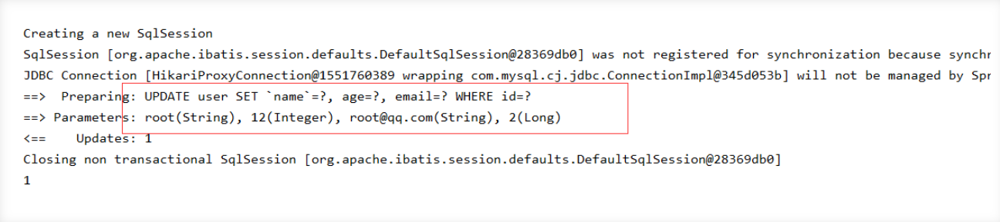


##	自动填充

创建时间、更改时间！ 这些操作一般都是自动化完成，我们不希望手动更新

阿里巴巴开发手册︰几乎所有的表都要配置 gmt_create、gmt_modified ！而且需要自动化

###	方式一：数据库级别（工作中不允许修改数据库级别）

1.	在表中增加字段：create_time,update_time

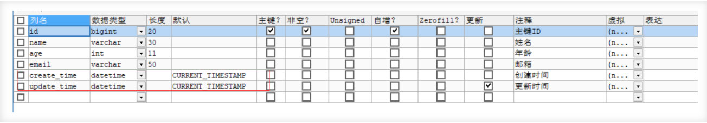

2.	再次测试插入或更新方法，我们需要在实体类中同步！

```
private Date createTime;//驼峰命名
private Date updateTime;
```

3.	查看结果

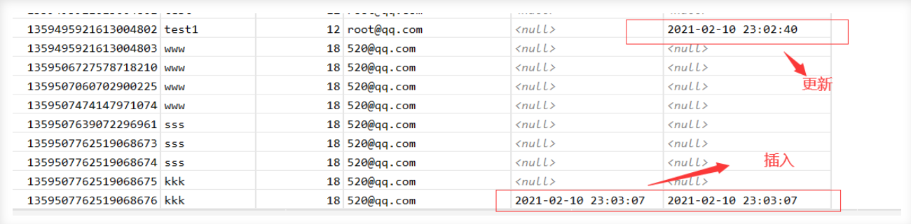


###	方式二：代码级别

1.	删除数据库的默认值，更新操作！

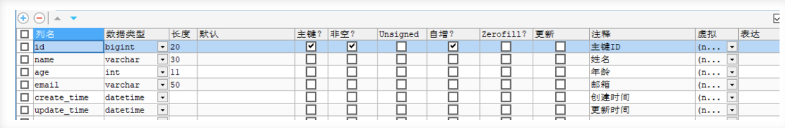

2.	实体类字段属性上需要增加注解

```
//字段  字段添加填充内容
@TableField(fill = FieldFill.INSERT)//value = ("create_time"),
private Date createTime;
@TableField(fill = FieldFill.INSERT_UPDATE)
private Date updateTime;
```

3、编写处理器来处理这个注解即可！

```java
@Slf4j//日志
@Component//丢到springboot里   一定不要忘记把处理器加到Ioc容器中!
public class MyMetaObjectHandler extends MetaObjectHandler {//extends??
    @Override//插入时的填充策略
    public void insertFill(MetaObject metaObject) {
        log.info("==start insert ······==");
        //setFieldValByName(java.lang.String fieldName, java.lang.Object fieldVal, org.apache.ibatis.reflection.MetaObject metaObject)
        this.setFieldValByName("createTIme",new Date(),metaObject);
        this.setFieldValByName("updateTime",new Date(),metaObject);
    }
    @Override//更新时的填充策略
    public void updateFill(MetaObject metaObject) {
        log.info("==start update ······==");
        this.setFieldValByName("updateTime",new Date(),metaObject);
    }
}
```

4.	测试插入/更新，观察时间

```java
@Test//测试插入
public void insertTest(){
    User user = new User();
    user.setName("live");
    user.setAge(22);
    user.setEmail("1314@qq.com");
    Integer result = userMapper.insert(user); //会帮我们自动生成id
    System.out.println(result); //受影响的行数
    System.out.println(user); //通过日志发现id会自动回填
}
@Test//测试更新
public void updateTest(){
    User user = new User();
    user.setId(1359495921613004803L);
    user.setName("test3");
    user.setAge(18); //通过条件自动拼接动态Sql
    user.setEmail("test3@qq.com");
    int i = userMapper.updateById(user);//updateById，但是参数是个user
    System.out.println(i);
}
```

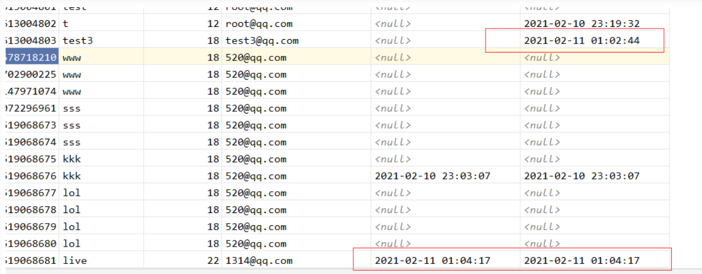

##	乐观锁&悲观锁

在面试过程中经常被问到乐观锁/悲观锁，这个其实很简单

+	乐观锁：顾名思义十分乐观,他总是认为不会出现问题,无论干什么都不上锁!如果出现了问题,再次更新值测试
+	悲观锁：顾名思义十分悲观,他总是认为出现问题,无论干什么都会上锁!再去操作!

我们这里主要讲解 乐观锁机制!

乐观锁实现方式:

```
取出记录时,获取当前version
更新时,带上这个version
执行更新时,set version = newVersion where version = oldVersion
如果version不对,就更新失败
乐观锁：先查询，获得版本号
-- A
update user set name = "wsk",version = version+1 
where id = 1 and version = 1
-- B  （B线程抢先完成，此时version=2，会导致A线程修改失败！）
update user set name = "wsk",version = version+1 
where id = 1 and version = 1
```

测试一下Mybatis-Plus乐观锁插件

1.	给数据库中增加version字段


2.	实体类加对应的字段

```
@Version//乐观锁version注解
private Integer version;
```

3.	注册组件

```java
//扫描mapper文件夹
@MapperScan("com.wsk.mapper")//交给mybatis做的，可以让这个配置类做扫描
@EnableTransactionManagement//自动管理事务
@Configuration//配置类
public class MyBatisPlusConfig {
    //注册乐观锁插件
    @Bean
    public OptimisticLockerInterceptor optimisticLockerInterceptor(){
        return new OptimisticLockerInterceptor();
    }
}
```

4.	测试一下

+	成功

```java
@Test//测试乐观锁成功
public void testOptimisticLocker1(){
    //1、查询用户信息
    User user = userMapper.selectById(1L);
    //2、修改用户信息
    user.setAge(18);
    user.setEmail("2803708553@qq.com");
    //3、执行更新操作
    userMapper.updateById(user);
}
```

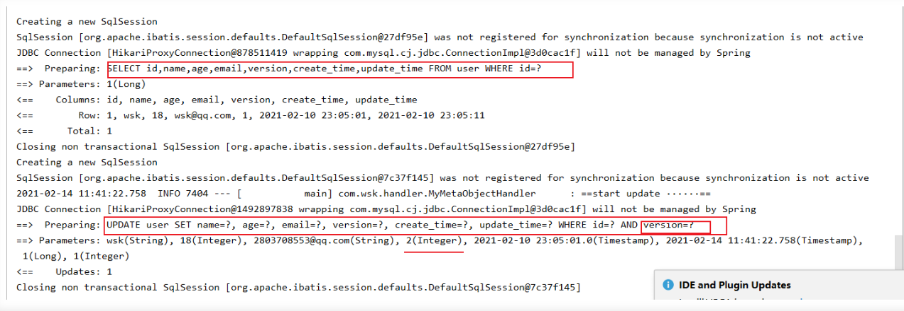

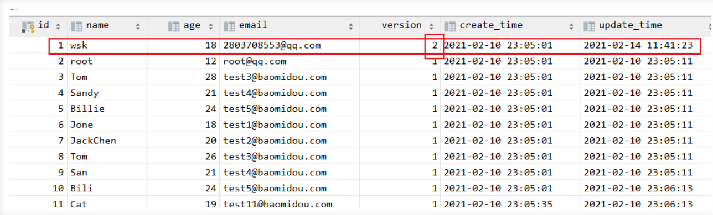

+	失败

```java
@Test//测试乐观锁失败  多线程下
public void testOptimisticLocker2(){
    //线程1
    User user1 = userMapper.selectById(1L);
    user1.setAge(1);
    user1.setEmail("2803708553@qq.com");
    //模拟另外一个线程执行了插队操作
    User user2 = userMapper.selectById(1L);
    user2.setAge(2);
    user2.setEmail("2803708553@qq.com");
    userMapper.updateById(user2);
    //自旋锁来多次尝试提交！
    userMapper.updateById(user1);//如果没有乐观锁就会覆盖插队线程的值
}
```

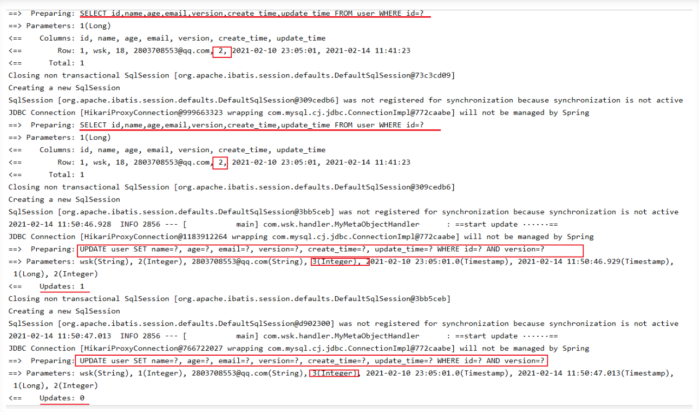

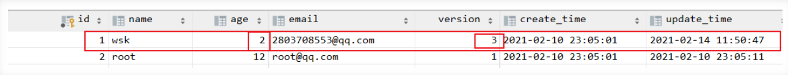


##	查询Select

###	通过id查询单个用户

```java
@Test//通过id查询单个用户
public void testSelectById(){
    User user = userMapper.selectById(1L);
    System.out.println(user);
}
```

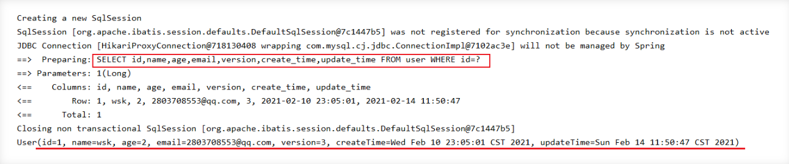

###	通过id查询多个用户

```java
@Test//通过id查询多个用户
public void testSelectBatchIds(){
    List<User> users = userMapper.selectBatchIds(Arrays.asList(1L, 2L, 3L));
    users.forEach(System.out::println);
    //System.out.println(users);
}
```

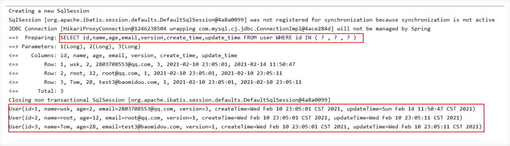

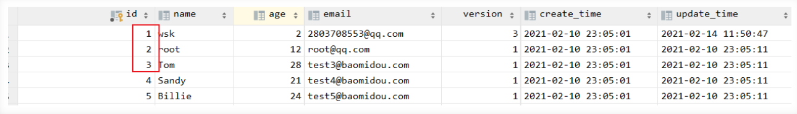

###	条件查询 通过map封装

```java
@Test//通过条件查询之一  map
public void testMap(){
    HashMap<String, Object> map = new HashMap<>();
    //自定义要查询的
    map.put("name","www");
    map.put("age",18);
    List<User> users = userMapper.selectByMap(map);
    users.forEach(System.out::println);
}
```

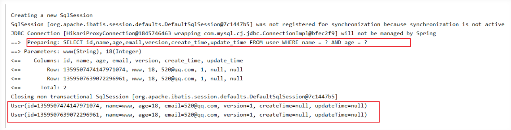


###	分页查询

分页在网站的使用十分之多！

1.	原始的limit分页
2.	pageHelper第三方插件
3.	MybatisPlus其实也内置了分页插件！

如何使用：

1.	配置拦截器组件

```java
//分页插件
@Bean
public PaginationInterceptor paginationInterceptor() {
    return new PaginationInterceptor();
}
```

2.	直接使用page对象即可

```java
@Test//测试分页查询
public void testPage(){
    //参数一current：当前页   参数二size：页面大小
    //使用了分页插件之后，所有的分页操作都变得简单了
    Page<User> page = new Page<>(2,5);
    userMapper.selectPage(page,null);
    page.getRecords().forEach(System.out::println);
    System.out.println("总页数==>"+page.getTotal());
}
```

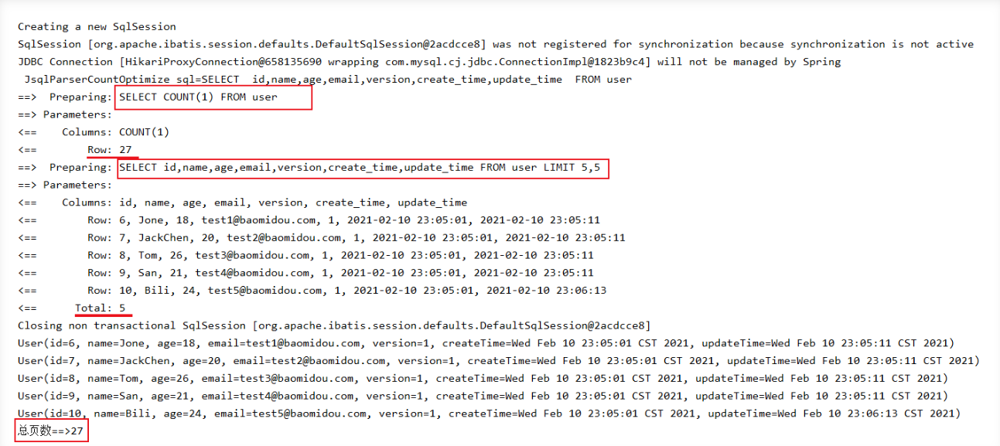


##	删除Delete

###	直接删除

基本的删除任务：

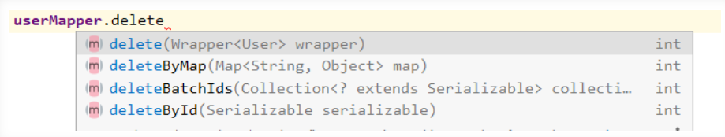

```java
@Test
public void testDeleteById(){
    userMapper.deleteById(1359507762519068681L);
}
@Test
public void testDeleteBatchIds(){
  userMapper.deleteBatchIds(Arrays.asList(1359507762519068675L,1359507762519068676L));
}
@Test
public void testD(){
    HashMap<String, Object> map = new HashMap<>();
    map.put("age","18");
    map.put("name","lol");
    userMapper.deleteByMap(map);
}
```

我们在工作中会遇到一些问题：逻辑删除！

###	逻辑删除

+	物理删除：从数据库中直接删除
+	逻辑删除：在数据库中没有被删除，而是通过一个变量来使他失效！ deleted=0 ==> deleted=1

管理员可以查看被删除的记录！防止数据的丢失，类似于回收站！

测试一下：

1.	在数据表中增加一个deleted字段

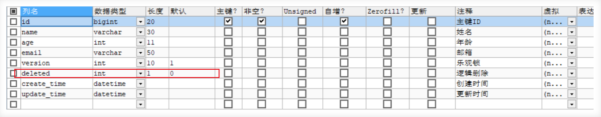

2.	实体类中添加对应属性

```
@TableLogic//逻辑删除注解
private Integer deleted;
```

3.	配置

```java
//逻辑删除组件
@Bean
public ISqlInjector sqlInjector(){
    return new LogicSqlInjector();
}
```

```
###################
##配置文件
###################

#配置逻辑删除  没删除的为0 删除的为1
mybatis-plus.global-config.db-config.logic-delete-value=1
mybatis-plus.global-config.db-config.logic-not-delete-value=0
```

4.	测试一下删除

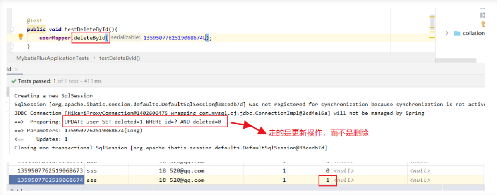

发现： 记录还在，deleted变为1

再次测试查询被删除的用户，发现查询为空

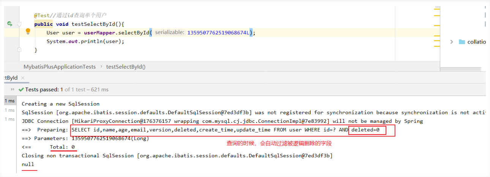

以上所有的CRUD及其扩展操作，我们都必须精通掌握！会大大提高工作写项目的效率！


#	性能分析插件

我们在平时的开发中，会遇到一些满Sql。测试、druid···

MybatisPlus也提供了性能分析插件，如果超过这个时间就停止运行！

性能分析拦截器作用：用于输出每条sql语句及其执行时间

1.	导入插件

```java
 //性能分析插件
@Bean
@Profile({"dev","test"})//设置dev开发、test测试 环境开启  保证我们的效率
public PerformanceInterceptor performanceInterceptor(){
    PerformanceInterceptor performanceInterceptor = new PerformanceInterceptor();
    performanceInterceptor.setMaxTime(100);//设置sql最大执行时间*ms，如果超过了则不执行
    performanceInterceptor.setFormat(true);//开启sql格式化
    return performanceInterceptor;
}
```

!>	注意： 要在SpringBoot中配置环境为dev或test环境！

```
#设置开发环境
spring.profiles.active=dev
```

2.	测试使用

```java
@Test
void contextLoads() {
    //参数是一个wrapper ，条件构造器，这里我们先不用 null
    //查询全部的用户
    List<User> userList = userMapper.selectList(null);
    userList.forEach(System.out::println);
}
```

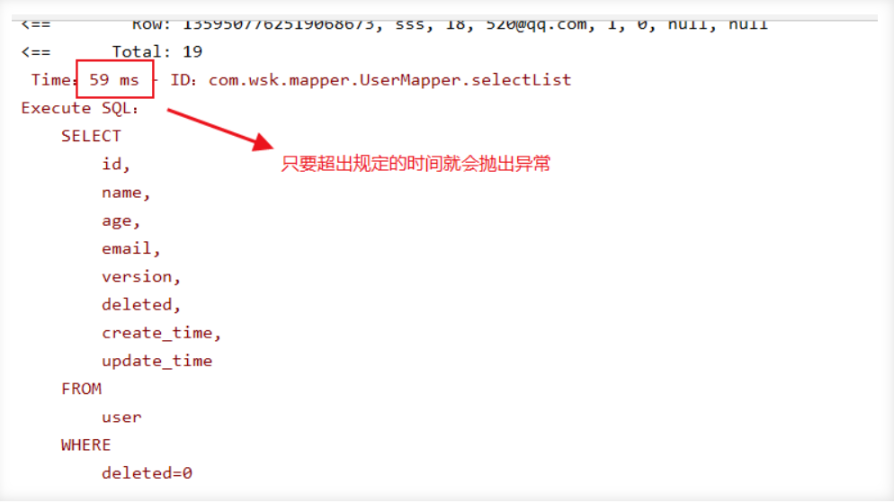

使用性能分析插件，可以帮助我们提高效率！

#	条件构造器

十分重要：Wrapper 记住查看输出的SQL进行分析

测试一

```java
@Test
public void testWrapper1() {
    //参数是一个wrapper ，条件构造器，和刚才的map对比学习！
    //查询name不为空，email不为空，age大于18的用户
    QueryWrapper<User> wrapper = new QueryWrapper<>();
    wrapper
        .isNotNull("name")
        .isNotNull("email")
        .ge("age",18);
    List<User> userList = userMapper.selectList(wrapper);
    userList.forEach(System.out::println);
}
```

测试二

```java
@Test
public void testWrapper2() {
    //查询name=wsk的用户
    QueryWrapper<User> wrapper = new QueryWrapper<>();
    wrapper.eq("name","wsk");
    //查询一个数据selectOne，若查询出多个会报错
    //Expected one result (or null) to be returned by selectOne(), but found: *
    //若出现多个结果使用list或map
    User user = userMapper.selectOne(wrapper);//查询一个数据，若出现多个结果使用list或map
    System.out.println(user);
}
```

测试三

```java
@Test
public void testWrapper3() {
    //查询age在10-20之间的用户
    QueryWrapper<User> wrapper = new QueryWrapper<>();
    wrapper.between("age", 10, 20);//区间
    Integer count = userMapper.selectCount(wrapper);//输出查询的数量selectCount
    System.out.println(count);
}
```

测试四

```java
@Test
public void testWrapper4() {
    //模糊查询
    QueryWrapper<User> wrapper = new QueryWrapper<>();
    wrapper
        .notLike("name","s")
        .likeRight("email","t");//qq%  左和右？
    List<Map<String, Object>> maps = userMapper.selectMaps(wrapper);
    maps.forEach(System.out::println);
}
```

测试五

```java
@Test
public void testWrapper5() {
    //模糊查询
    // SELECT id,name,age,email,version,deleted,create_time,update_time 
    //FROM user 
    //WHERE deleted=0 AND id IN 
    //(select id from user where id<5)
    QueryWrapper<User> wrapper = new QueryWrapper<>();
    //id 在子查询中查出来
    wrapper.inSql("id","select id from user where id<5");
    List<Object> objects = userMapper.selectObjs(wrapper);
    objects.forEach(System.out::println);
}
```

测试六

```java
@Test
public void testWrapper6() {
    QueryWrapper<User> wrapper = new QueryWrapper<>();
    //通过id进行降序排序
    wrapper.orderByDesc("id");
    List<User> userList = userMapper.selectList(wrapper);
    userList.forEach(System.out::println);
}
```

Mysql => JDBC => Mybatis => MybatisPlus

#	代码自动生成器

AutoGenerator 是 MyBatis-Plus 的代码生成器，通过 AutoGenerator 可以快速生成 Entity、Mapper、Mapper XML、Service、Controller 等各个模块的代码，极大的提升了开发效率。

```java
package com.wsk;
import com.baomidou.mybatisplus.annotation.DbType;
import com.baomidou.mybatisplus.annotation.FieldFill;
import com.baomidou.mybatisplus.annotation.IdType;
import com.baomidou.mybatisplus.generator.AutoGenerator;
import com.baomidou.mybatisplus.generator.config.DataSourceConfig;
import com.baomidou.mybatisplus.generator.config.GlobalConfig;
import com.baomidou.mybatisplus.generator.config.PackageConfig;
import com.baomidou.mybatisplus.generator.config.StrategyConfig;
import com.baomidou.mybatisplus.generator.config.po.TableFill;
import com.baomidou.mybatisplus.generator.config.rules.DateType;
import com.baomidou.mybatisplus.generator.config.rules.NamingStrategy;
import java.util.ArrayList;
//代码自动生成器
public class WskCode {
    public static void main(String[] args) {
        //我们需要构建一个代码生成器对象
        AutoGenerator mpg = new AutoGenerator();
        //怎么样去执行，配置策略
        //1、全局配置
        GlobalConfig gc = new GlobalConfig();
        String projectPath = System.getProperty("user.dir");//获取当前目录
        gc.setOutputDir(projectPath+"/src/main/java");//输出到哪个目录
        gc.setAuthor("wsk");
        gc.setOpen(false);
        gc.setFileOverride(false);//是否覆盖
        gc.setServiceName("%sService");//去Service的I前缀
        gc.setIdType(IdType.ID_WORKER);
        gc.setDateType(DateType.ONLY_DATE);
        gc.setSwagger2(true);
        mpg.setGlobalConfig(gc);
        //2、设置数据源
        DataSourceConfig dsc = new DataSourceConfig();
        dsc.setUsername("root");
        dsc.setPassword("root");
        dsc.setUrl("jdbc:mysql://localhost:3306/wuye?useSSL=false&serverTimezone=GMT%2B8&useUnicode=true&characterEncoding=utf-8");
        dsc.setDriverName("com.mysql.cj.jdbc.Driver");
        dsc.setDbType(DbType.MYSQL);
        mpg.setDataSource(dsc);
        //3、包的配置
        PackageConfig pc = new PackageConfig();
        pc.setModuleName("study");
        pc.setParent("com.wsk");
        pc.setEntity("pojo");
        pc.setMapper("mapper");
        pc.setService("service");
        pc.setController("controller");
        mpg.setPackageInfo(pc);
        //4、策略配置
        StrategyConfig strategy = new StrategyConfig();
        strategy.setInclude("admin","danyuan","building","room");//设置要映射的表名,只需改这里即可
        strategy.setNaming(NamingStrategy.underline_to_camel);
        strategy.setColumnNaming(NamingStrategy.underline_to_camel);
        strategy.setEntityLombokModel(true);//是否使用lombok开启注解
        strategy.setLogicDeleteFieldName("deleted");
        //自动填充配置
        TableFill gmtCreate = new TableFill("gmt_create", FieldFill.INSERT);
        TableFill gmtUpdate = new TableFill("gmt_update", FieldFill.INSERT_UPDATE);
        ArrayList<TableFill> tableFills = new ArrayList<>();
        tableFills.add(gmtCreate);
        tableFills.add(gmtUpdate);
        strategy.setTableFillList(tableFills);
        //乐观锁配置
        strategy.setVersionFieldName("version");
        strategy.setRestControllerStyle(true);//开启驼峰命名
        strategy.setControllerMappingHyphenStyle(true);//localhost:8080/hello_id_2
        mpg.setStrategy(strategy);
        mpg.execute();//执行
    }
}
```

```xml
<!--模板引擎 依赖:mybatis-plus代码生成的时候报异常-->
<dependency>
    <groupId>org.apache.velocity</groupId>
    <artifactId>velocity-engine-core</artifactId>
    <version>2.0</version>
</dependency>
<!--配置ApiModel在实体类中不生效-->
<dependency>
    <groupId>com.spring4all</groupId>
    <artifactId>spring-boot-starter-swagger</artifactId>
    <version>1.5.1.RELEASE</version>
</dependency>
<!--freemarker-->
<dependency>
    <groupId>org.freemarker</groupId>
    <artifactId>freemarker</artifactId>
    <version>2.3.30</version>
</dependency>
<!--beetl-->
<dependency>
    <groupId>com.ibeetl</groupId>
    <artifactId>beetl</artifactId>
    <version>3.3.2.RELEASE</version>
</dependency>
```