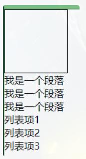

# CSS_06_盒模型

----

# 文档流（normalflow）

网页是一个多层的结构，一层摁着一层

通过CSS可以分别为每一层来设置样式，作为用户来讲只能看到最顶上一层

这些层中，最底下的一层称为文档流

文档流是网页的基础我们所创建的元素默认都是在文档流中进行排列

对于我们来元素主要有两个状态

+	在文档流中
+	不在文档流中（脱离文档流）

那么元素在文档流中有什么特点，我们接着往下看

# 块元素

+	块元素会在页面中独占一行
+	默认宽度是父元素的全部（会把父元素撑满）
+	默认高度是被内容撑开（子元素）

# 行内元素

+	行内元素不会独占页面的一行，只占自身的大小
+	行内元素在页面中左向右水平排列（书写习惯一致）
+	如果一行之中不能容纳下所有的行内元素，则元素会换到第二行继续自左向右排列
+	行内元素的默认宽度和高度都是被内容撑开

# 盒子模型

网页设计中常听的属性名：内容(content)、内边距(padding)、边框(border)、外边距(margin)， CSS盒子模型都具备这些属性。
 
这些属性我们可以用日常生活中的常见事物——盒子作一个比喻来理解，所以叫它盒子模型。
 
CSS盒子模型就是在网页设计中经常用到的CSS技术所使用的一种思维模型。

## 盒模型、盒子模型、框模型（box model）

CSS将页面中的所有元素都设置为了一个矩形的盒子

将元素设置为矩形的盒子后，对页面的布局就变成将不同的盒子摆放到不同的位置

每一个盒子都由一下几个部分组成：

+	内容区（content）
+	内边距（padding）
+	边框（border）
+	外边距（margin）


## 内容区（content）

内容区是盒子模型的中心，它呈现了盒子的主要信息内容，这些内容可以是文本、图片等多种类型


元素中的所有的子元素和文本内容都在内容区中

+	width和height 设置排列内容区的大小
+	width 设置内容区的宽度
+	height 设置内容区的高度

示例

```css
.box1{
    width: 200px; 
    height: 200px; 
    background-color: #bfa;
}
```

效果


## 边框（border）

边框属于盒子边缘，边框里边属于盒子内部，出了边框都是盒子的外部

注意：边框的大小会影响到整个盒子的大小

+	border-width 边框的宽度：默认3px 
	*	border-top-width 上边框的宽度
	*	border-right-width 右边框的宽度
	*	border-bottom-width 下边框的宽度
	*	border-left-width 左边框的宽度
+	border-color 边框的颜色：默认使用color的颜色值
	*	border-top-color 上边框的颜色
	*	border-right-color 右边框的颜色
	*	border-bottom-color 下边框的颜色
	*	border-left-color 左边框的颜色
+	border-style 边框的样式：没有默认值，必须指定 
	*	border-top-style 上边框的样式
	*	border-right-style 右边框的样式
	*	border-bottom-style 下边框的样式
	*	border-left-style 左边框的样式
	
示例

```css
.box1{
    border-width: 10px;
    border-color: red;
    /* 
    	solid  实线 
    	dotted 点状虚线 
    	dashed 虚线 
    	double 双线 
    */
    border-style: solid;
}
```

效果(solid)


效果(dotted)


效果(dashed)


效果(double)


不论是border-width 、 border-color 、border-style 还是其衍生出来的属性写法，都可以指定每个方向的边框情况

设定几个值就决定了对应方向的宽度、颜色或样式

+	四个值：上 右 下 左
+	三个值：上 左右 下
+	两个值：上下 左右
+	一个值：上下左右

其实不管设置几个值，只要记住：`其顺序是按顺时针方向设置的，剩下的可以由矩形的对称性推导出来`

+	border：简写属性，通过该属性可以同时设置边框所有的相关样式，并且没有顺序要求
	*	border-top 上边框的宽度、颜色和样式
	*	border-right 右边框的宽度、颜色和样式
	*	border-bottom 下边框的宽度、颜色和样式
	*	border-left 左边框的宽度、颜色和样式

```css
.box1 {
  border: 10px red solid;
}
```

## 内边距(padding）

内边距，也叫填充，是内容区和边框之间的空间

+	padding-top 上内边距
+	padding-right 右内边距
+	padding-bottom 下内边距
+	padding-left 左内边距

padding 内边距的简写属性，可以同时指定四个方向的内边距，规则和边框中属性值设置一样

注意：`内边距的设置会影响到盒子的大小，背景颜色会延伸到内边距上`

示例

```css
<style>
  .outer {
    width: 200px;
    height: 200px;
    border: 10px orange solid;
    padding-right: 100px;
    padding-bottom: 100px;
    padding-left: 100px;
  }

  .inner {
    width: 200px;
    height: 200px;
    background-color: greenyellow;
  }
</style>

<div class="outer">
  <div class="inner"></div>
</div>
```

效果


可以看出，当内外 div 宽度和高度一样时，由于 outer 设置了一个 padding 属性，其盒子大小被“撑大了”

盒子可见框的大小，由内容区、内边距和边框共同决定，所以在计算盒子大小时，需要将这三个区域加到一起计算


## 外边距（margin）
外边距，也叫空白边，位于盒子的最外围，是添加在边框外周围的空间。空白边使盒子之间不会紧凑地连接在一起，是 CSS 布局的一个重要手段

注意：外边距不会影响盒子可见框的大小，但是外边距会影响盒子的位置和占用空间

一共有四个方向的外边距：

+	margin-top 上外边距
	*	设置正值，元素自身向下移动
	*	设置负值，元素自身向上移动
+	margin-right 右外边距
	*	设置正值，其右边的元素向右移动
	*	设置负值，其右边的元素向左移动
	*	上述说法并不准确，对于块元素，设置margin-right不会产生任何效果
+	margin-bottom 下外边距
	*	设置正值，其下边的元素向下移动
	*	设置负值，其下边的元素向上移动
	*	上述说法并不准确，对于块元素，会有垂直方向上的边距重叠问题（后面会细说）
+	margin-left 左外边距
	*	设置正值，元素自身向右移动
	*	设置负值，元素自身向左移动
+	元素在页面中是按照自左向右的顺序排列的，所以默认情况下
	*	如果我们设置的左和上外边距则会移动元素自身
	*	而设置下和右外边距会移动其他元素

示例1

```css
.box1 {
  width: 200px;
  height: 200px;
  background-color: #bfa;
  border: 10px orange solid;

  margin-top: 100px;
  margin-right: 100px;
  margin-bottom: 100px;
  margin-left: 100px;
}
```	

效果


示例 2

```css
.box1 {
  width: 200px;
  height: 200px;
  background-color: #bfa;
  border: 10px orange solid;
  margin-bottom: 100px;
}

.box2 {
  width: 200px;
  height: 200px;
  background-color: #bfa;
  border: 10px red solid;
  margin-top: 100px;
}
```

效果


# 水平方向布局

元素在其父元素中水平方向的位置由以下几个属性共同决定

+	margin-left
+	border-left
+	padding-left
+	width
+	padding-right
+	border-right
+	margin-right

一个元素在其父元素中，水平布局必须要满足以下的等式

`margin-left + border-left + padding-left + width + padding-right + border-right + margin-right = 其父元素的宽度`

以上等式必须满足，如果相加结果使等式不成立，则称为`过渡约束`

等式会自动调整调整的情况：

+	如果这七个值中没有auto的情况，则浏览器会自动调整margin-right值以使等式满足
	*	100 + 0 + 0 + 200 + 0 + 0 + 0 = 800 ==> 100 + 0 + 0 + 200 + 0 + 0 + 500 = 800
+	如果这七个值中有auto的情况，则会自动调整auto值以使等式成立
	*	这七个值中有三个值可以设置为auto ：width、margin-left、maring-right
+	如果某个值为 auto，则会自动调整auto的那个值以使等式成立
	*	200 + 0 + 0 + auto + 0 + 0 + 200 = 600 ==> 200 + 0 + 0 + 400 + 0 + 0 + 200 = 800
	*	auto + 0 + 0 + 200 + 0 + 0 + 200 = 600 ==> 400 + 0 + 0 + 200 + 0 + 0 + 200 = 800
	*	200 + 0 + 0 + 200 + 0 + 0 + auto = 600 ==> 200 + 0 + 0 + 200 + 0 + 0 + 400 = 800
+	如果宽度为auto，则宽度会调整到最大，其他auto的外边距会自动设置为 0
	*	auto + 0 + 0 + auto + 0 + 0 + 200 = 600 ==> 0 + 0 + 0 + 600 + 0 + 0 + 200 = 800
	*	200 + 0 + 0 + auto + 0 + 0 + auto = 600 ==> 200 + 0 + 0 + 600 + 0 + 0 + 0 = 800
	*	auto + 0 + 0 + auto + 0 + 0 + auto = 600 ==> 0 + 0 + 0 + 800 + 0 + 0 + 0 = 800
+	如果外边距都为auto，则auto的外边距会自动均分以使等式成立
	*	auto + 0 + 0 + 200 + 0 + 0 + auto = 600 ==> 300 + 0 + 0 + 200 + 0 + 0 + 300 = 800
+	还有一种特殊情况，父元素宽度为800，但子元素的宽度设置为1000，那么此时右外边距会自动设置为-200

示例

```css
<style>
  .box1 {
    width: 200px;
    height: 200px;
    background-color: #bfa;
    border: 10px orange solid;
    /* 下列条件等价于 margin: 0 auto */
    margin-left: auto;
    margin-right: auto;
  }
</style>
<div class="box1"></div>
```

效果


# 垂直方向布局

margin在最后不会撑开父元素，体现不出来

## 元素溢出-overflow

子元素是在父元素的内容区中排列的，如果子元素的大小超过了父元素，则子元素会从父元素中溢出

使用`overflow/overflow-x/overflow-y`属性来设置父元素如何处理溢出的子元素

可选值：`visible/hidden/scroll/auto`

### visible-溢出部分显示

溢出内容会在父元素外部位置显示，默认值

```html
<style>
  .box1 {
    width: 200px;
    height: 200px;
    background-color: #bfa;
    border: 10px orange solid;
    overflow: visible; /* 默认值 */
  }
</style>
<div class="box1">
  Lorem ipsum dolor sit amet consectetur adipisicing elit. Asperiores aspernatur
  illo inventore deleniti laudantium quaerat excepturi sed quidem tempore?
  Eaque, cumque porro. Fuga quam error cupiditate quasi eveniet in numquam!
</div>
```

效果


### hidden-溢出部分剪裁

溢出内容会被裁剪，不会显示

示例

```html
<style>
  .box1 {
    width: 200px;
    height: 200px;
    background-color: #bfa;
    overflow: hidden; /* 隐藏溢出内容 */
  }
</style>
<div class="box1">
  Lorem ipsum dolor sit amet consectetur adipisicing elit. Asperiores aspernatur
  illo inventore deleniti laudantium quaerat excepturi sed quidem tempore?
  Eaque, cumque porro. Fuga quam error cupiditate quasi eveniet in numquam!
</div>
```

效果


### scroll-生成滚动条

生成两个滚动条，通过滚动条来查看完整的内容

示例

```html
<style>
  .box1 {
    width: 200px;
    height: 200px;
    background-color: #bfa;
    overflow: scroll;
  }
</style>
<div class="box1">
  Lorem ipsum dolor sit amet consectetur adipisicing elit. Asperiores aspernatur
  illo inventore deleniti laudantium quaerat excepturi sed quidem tempore?
  Eaque, cumque porro. Fuga quam error cupiditate quasi eveniet in numquam!
</div>
```

效果


### auto-按需生成滚动条

根据需要生成滚动条

示例

```html
<style>
  .box1 {
    width: 200px;
    height: 200px;
    background-color: #bfa;
    overflow: auto;
  }
</style>
<div class="box1">
  Lorem ipsum dolor sit amet consectetur adipisicing elit. Asperiores aspernatur
  illo inventore deleniti laudantium quaerat excepturi sed quidem tempore?
  Eaque, cumque porro. Fuga quam error cupiditate quasi eveniet in numquam!
</div>
```

效果


## 边距折叠

垂直外边距的重叠（折叠）：相邻的垂直方向外边距会发生重叠现象

## 兄弟元素

兄弟元素间的相邻，垂直外边距会取两者之间的较大值（两者都是正值）

特殊情况：

+	如果相邻的外边距一正一负，则取两者的和
+	如果相邻的外边距都是负值，则取两者中绝对值较大的

示例

```css
.box1,
.box2 {
  width: 200px;
  height: 200px;
  font-size: 100px;
}

.boxl {
  background-color: #bfa;
  /*设置一个下外边距*/
  margin-bottom: 100px;
}

.box2 {
  background-color: orange;
  /*设置一个上外边距*/
  margin-top: 100px;
}
```

效果


疑问

当浏览器缩放比例是 100%时，我们使用FastStone Capture工具自带的刻度尺测量，发现“兄弟”之间似乎没有我们想象的那么“亲近”

两者的垂直方向间距是 125px，我们明明上下元素设置的都是 100px 啊，这是为什么呢？

在网页布局中，通过谷歌浏览器或火狐浏览器预览时，发现我们定义的盒模型 width，height，margin，padding 值都是不准确的

谷歌、火狐浏览器 缩放为 80% 时，margin 值才正确[2]

总结

兄弟元素之间的外边距的重叠，对于开发是有利的，所以我们不需要进行处理

## 父子元素

父子元素间相邻外边距，子元素会传递给父元素（上外边距）

示例

```css
.box3{
width：200px;
    height:200px;
    background-color: #bfa;
}

.box4{
    width: 100px;
    height: 100px;
    background-color: orange;
    /* margin-top: 100px; */
}
```

效果

不加 margin-top


加 margin-top


`父子外边距的折叠会影响到页面的布局，必须要进行处理`

**处理方式 1**

1、我们转换思路，将对子元素的调整转为对父元素的调整

```css
.box3 {
  width: 200px;
  height: 200px;
  background-color: #bfa;
  padding-top: 100px; /* 不调整子元素的margin，而是转而调整父元素的padding */
}

.box4 {
  width: 100px;
  height: 100px;
  background-color: orange;
  /* margin-top: 100px; */
}
```

效果


可以看到父元素位置虽然正确了，但是高度却被“撑大了”。我们之前说过，padding 属性会影响元素的大小

2、这里我们还需要计算并手动调整下父元素的高度

```css
.box3 {
  width: 200px;
  height: 100px; /* height: 200px; */
  background-color: #bfa;
  padding-top: 100px;
}

.box4 {
  width: 100px;
  height: 100px;
  background-color: orange;
}
```

效果


**处理方式 2**

1、我们仍然保留子元素的margin-top属性，但是给父元素加一个上边框

```css
.box3 {
  width: 200px;
  height: 200px;
  background-color: #bfa;
  border-top: 1px rebeccapurple solid; /* 在父元素上加一个border-top（上边框） */
}

.box4 {
  width: 100px;
  height: 100px;
  background-color: orange;
  margin-top: 100px; /* 不删除，保留 */
}
```

效果


2、但是因为加了 1px 的边框，所以父元素盒子的高度也增加了 1px。那我们就需要手动调整父元素的高度，同时让边框颜色与父元素盒子颜色保持一致

```css
.box3 {
  width: 200px;
  height: 199px; /* height: 200px; */
  background-color: #bfa;
  border-top: 1px #bfa solid;
}

.box4 {
  width: 100px;
  height: 100px;
  background-color: orange;
  margin-top: 100px;
}
```


但是我们没有发现一个问题不难发现一个问题，子元素也往下移动了 1px 的距离

因为父元素高度少了 1px，而子元素的 margin-top 是从边框下面开始算的

所以，凭借大家朴素的情感，哪个应该怎么判？ 应该怎么改？

改法也很简单，margin-top 减去一个像素即可

```css
.box3 {
  width: 200px;
  height: 199px;
  background-color: #bfa;
  border-top: 1px #bfa solid;
}

.box4 {
  width: 100px;
  height: 100px;
  background-color: orange;
  margin-top: 99px; /* margin-top: 100px; */
}
```

效果


同时，我们用刻度尺测量，父子元素底部是在一条水平线上的


上述示例 2 中，使用了 border 属性，就让子元素的外边距不去传递给父元素了，这是为什么呢？

margin (子元素远离父元素边框)

如果父盒子没有设置 border 框着，那么他的子元素无法利用 margin-top 来远离父元素的上边框

如果使用了 margin-top 会使子元素和父元素一起往下移

（子想离，父不设置 border 边框 则离得是流 不是父盒子）

应该是 border 让元素脱离了文档流（margin 塌陷）

至于什么是 margin 塌陷，我也是问了度娘，有兴趣的可以自行百度，这里就不再赘述了

# 行内元素对布局的影响

+ 行内元素不支持设置宽度和高度

```css
.s1 {
  /* 行内元素设置了宽高也没用，不会生效 */
  width: 100px;
  height: 100px;
  background-color: yellow;
}
```


+ 行内元素可以设置padding，但是垂直方向padding不会影响页面的布局

```css
.s1 {
  /* 下方的div元素并没有因span设置了padding属性，而受到位置上的影响 */
  padding: 100px;
  background-color: yellow;
}

.box1 {
  width: 200px;
  height: 200px;
  background-color: #bfa;
}
```


+ 行内元素可以设置border，垂直方向的border不会影响页面的布局

```css
.s1 {
  border: 10px orange solid;
  background-color: yellow;
}

.box1 {
  width: 200px;
  height: 200px;
  background-color: #bfa;
}
```


+ 行内元素可以设置margin，垂直方向的margin不会影响页面的布局

```css
.s1 {
  margin: 100px;
  background-color: yellow;
}

.box1 {
  width: 200px;
  height: 200px;
  background-color: #bfa;
}
```


# 改变元素显示方式-display

想要行内元素对页面布局产生影响如何处理

那也是有办法的！

+ display用来设置元素显示的类型
  * inline将元素设置为行内元素
  * block 将元素设置为块元素
  * inline-block 将元素设置为行内块元素行内块，既可以设置宽度和高度又不会独占一行
  * table将元素设置为一个表格
  * none元素不在页面中显示,且元素不占位置(不占位置隐藏元素)

+ 例1:block 将元素设置为块元素

```css
.s1 {
  margin: 100px;
  background-color: yellow;
  /* 将行内元素设置为块元素 */
  display: block;
}
```


+ 例2:inline-block 将元素设置为行内块元素行内块，既可以设置宽度和高度又不会独占一行

```css
.s1 {
  margin: 100px;
  background-color: yellow;
  /* 将行内元素设置为行内块元素，兼顾行内元素和块元素的特点 */
  display: inline-block;
}
```


+ 例三:none元素不在页面中显示

```css
.s1 {
  margin: 100px;
  background-color: yellow;
  /* 将行内元素设置为none：不显示 */
  display: none;
}
```


# 占位置隐藏元素-visibility

+ visibility用来设置元素的显示状态
  * visible默认值，元素在页面中正常显示
  * hidden元素在页面中隐藏不显示，但是依然占据页面的位置

```css
.s1 {
  margin: 100px;
  background-color: yellow;
  display: block;
  visibility: hidden;
}
```


# 浏览器的默认样式

## 浏览器的默认样式说明

通常情况，浏览器都会为元素设置一些默认样式

`默认样式的存在会影响到页面的布局，通常情况下编写网页时必须要去除浏览器的默认样式（PC 端的页面）`

我们可以尝试编写 css 样式，以去除浏览器的默认样式

示例

html 代码
  
```html
<div class="box1"></div>
<p>我是一个段落</p>
<p>我是一个段落</p>
<p>我是一个段落</p>
<ul>
<1i>列表项1</1i>
<1i>列表项2</1i>
<1i>列表项3</1i>
</ul>

```

css 代码

```css
.box1 {
  width: 100px;
  height: 100px;
  border: 1px solid black;
}

```

效果


F12 看盒子默认样式


段落之间有 16px 的默认行距


列表外有 16px 的上下外边距和 40px 的左内边距，而且每项列表前有一个小黑点

## 手动去除默认样式

去除与浏览器的边缘间距

```css
body {
  margin: 0;
}
```


去除段落之间行距

```css
p {
  margin: 0;
}
```


去除列表的上下外边距和左内边距

```css
ul {
  margin: 0;
  padding: 0;
}
```



我们只是去除了列表的内外边距，但是发现前面的黑点也消失了，真的如此吗？

我们先给ul加上一个margin-left

```css
ul {
  margin: 0;
  padding: 0;
  margin-left: 16px;
}
```


看来黑点并没有自动清除，而只是“缩进”了浏览器的左侧

去除列表前的黑点

```css
ul {
  margin: 0;
  padding: 0;
  margin-left: 16px;
  list-style: none;
}
```


再将之前加的 16px 的margin-left样式去除

```css
ul {
  margin: 0;
  padding: 0;
  /* margin-left: 16px; */
  list-style: none;
}
```


到这里似乎就大功告成了，但是我们会发现写法似乎~~很完美~~有点麻烦

```css
body {
  margin: 0;
}

p {
  margin: 0;
}

ul {
  margin: 0;
  padding: 0;
  list-style: none;
}
```

有没有简化空间了呢？

答案是肯定的，我们前面介绍过通配选择器的概念，可以直接简化成一个

## 简化写法

```css
* {
  margin: 0;
  padding: 0;
  list-style: none;
}
```

效果是一样的

## 常用去除默认样式方案

去除浏览器的默认样式的需求是非常普遍的，我们难道每次都需要手动去除浏览器的默认样式？

这样岂不是很麻烦，难道官方就没有想到解决方案吗？

答案也是肯定的，有！

下方两种 css 样式，我们引入其中一个即可

### reset 样式

这个常用样式是将所有默认样式清空

https://meyerweb.com/eric/tools/css/reset/

```html
<link rel="stylesheet" href="assets/reset.css" />
```

### normalize 样式

这个常用样式是指定一个固定的默认样式(不同浏览器相同)

https://necolas.github.io/normalize.css/8.0.1/normalize.css

```html
<link rel="stylesheet" href="assets/normalize.css">
```
