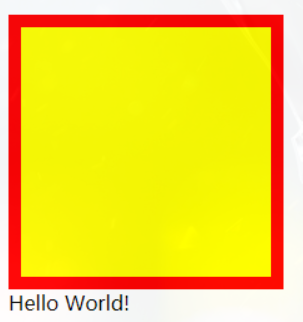
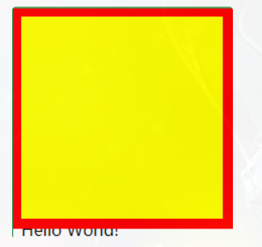
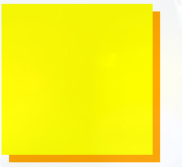
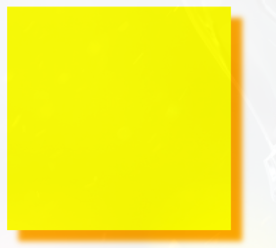
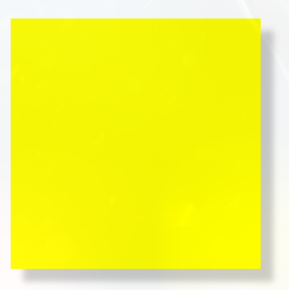
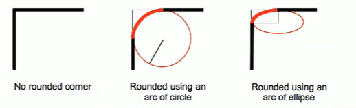

# CSS_08_盒模型补充

----

# 盒子大小

默认情况下，盒子可见框的大小由内容区、内边距和边框共同决定

box-sizing用来设置盒子尺寸的计算方式（设置 width 和 height 的作用）

+	可选值：
	*	content-box 默认值，宽度和高度用来设置内容区的大小
	*	border-box 宽度和高度用来设置整个盒子可见框的大小
		-	width和height指的是内容区、内边距和边框的总大小

```css
.box {
  width: 200px;
  height: 200px;
  background-color: yellow;
  border: 10px red solid;
  /* box-sizing: content-box; */
  box-sizing: border-box;
}
```

# 轮廓

outline用来设置元素的轮廓线，用法和border一模一样

轮廓和边框不同点是，轮廓不会影响到可见框的大小

+	边框

```css
.box {
  width: 200px;
  height: 200px;
  background-color: yellow;
  border: 10px red solid;
}
```



+	轮廓

```css
.box {
  width: 200px;
  height: 200px;
  background-color: yellow;
  outline: 10px red solid;
}
```



可以很明显看到outline与border的区别

我们一般不会直接这么设置轮廓，而是下面这种场景

```css
.box:hover {
  outline: 10px red solid;
}
```


从上面的动态图也可以很清晰地看出，outline属性并没有改变盒子的布局

# 阴影

>	box-shadow属性用于在一个元素的框架周围添加阴影效果
>	
>	你可以设置多个由逗号分隔的效果
>	
>	一个盒状阴影由相对于元素的 X 和 Y 的偏移量、模糊和扩散半径以及颜色来描述

box-shadow用来设置元素的阴影效果，阴影不会影响页面布局

+	第一个值-水平偏移量：设置阴影的水平位置
	*	正值向右移动
	*	负值向左移动
+	第二个值-垂直偏移量：设置阴影的垂直位置
	*	正值向下移动
	*	负值向上移动
+	第三个值-阴影的模糊半径
+	第四个值-阴影的颜色

```css
.box {
  width: 200px;
  height: 200px;
  background-color: yellow;
  box-shadow: 10px 10px orange;
}
```



```css
box-shadow: 10px 10px 5px orange;
```



```
box-shadow: 10px 10px 5px rgba(0, 0, 0, 0.2);
```



# 圆角

border-radius属性使一个元素的外边框边缘的角变圆

你可以设置一个半径来做圆角，或者设置两个半径来做椭圆角

+	border-radius 用来设置圆角，圆角设置的是圆的半径大小,可以分别指定四个角的圆角
	*	四个值：左上 右上 右下 左下
	*	三个值：左上 右上/左下 右下
	*	两个值：左上/右下 右上/左下
	*	一个值：左上/右上/右下/左下
+	border-top-left-radius
+	border-top-right-radius
+	border-bottom-left-radius
+	border-bottom-right-radius

这里同样不需要死记硬背，只要记住遵循顺时针方向和矩形中心点对称原则

与border不同的是，border是从上开始顺时针设置，而圆角是从左上开始

圆角怎么做出来



# 圆

原理很简单，就是绘制正方形，并将四个圆角半径设置为正方形的一半

```css
.box {
  width: 200px;
  height: 200px;
  background-color: yellow;
  border-radius: 50%;
}
```

# 椭圆

只需要对上述样式对一点点的改动，设置width和height属性不相等即可

```css
.box {
  width: 300px;
  height: 200px;
  background-color: yellow;
  border-radius: 50%;
}
```
