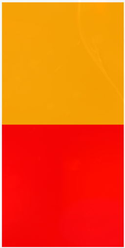
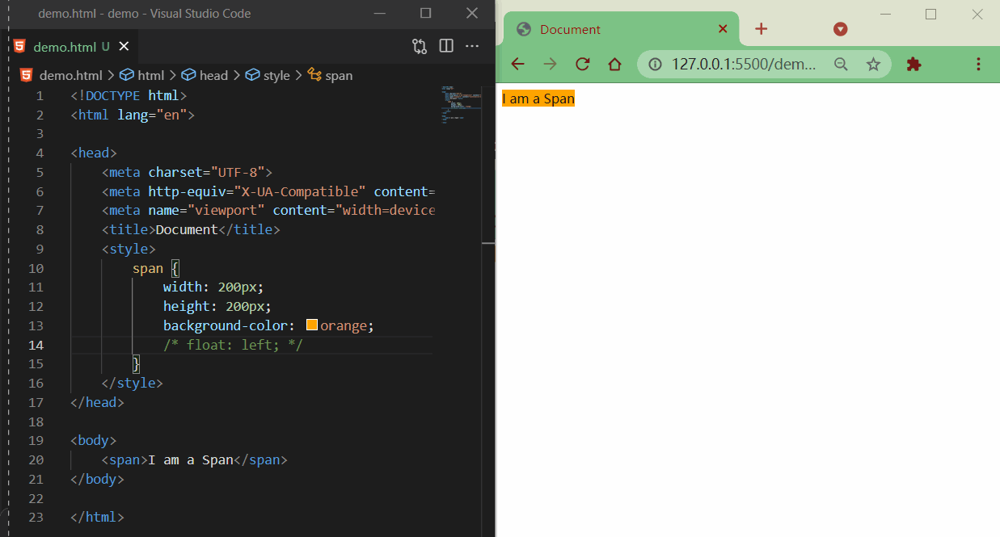

# CSS_09_浮动

----

# 浮动的简介

通过浮动可以使一个元素向其父元素的左侧或右侧移动

使用float属性来设置于元素的浮动

+	none 默认值，元素不浮动
+	left 元素向左浮动
+	right 元素向右浮动

注意

+	元素设置浮动以后，水平布局的等式便不需要强制成立
+	元素设置浮动以后，会完全从文档流中脱离，不再占用文档流的位置，所以元素下边的还在文档流中的元素会自动向上移动

# 浮动的特点


浮动元素会完全脱离文档流，不再占据文档流中的位置

+	设置浮动以后
	*	元素会向父元素的左侧或右侧移动
	*	浮动元素默认不会从父元素中移出
	*	浮动元素向左或向右移动时，不会超过前边的浮动元素（先来后到的顺序）
	*	浮动元素不会超过上边的浮动的兄弟元素，最多就是和它一样高
	*	如果浮动元素的上边是一个没有浮动的块元素，则浮动元素无法上移
	*	浮动元素不会盖住文字，文字会自动环绕在浮动元素的周围，所以我们可以利用浮动来设置文字环绕图片的效果

举例:

```html
<style>
  .box1 {
    width: 100px;
    height: 100px;
    background-color: orange;
    float: left;
  }

  .box2 {
    width: 200px;
    height: 200px;
    background-color: red;
  }
</style>

<div class="box1"></div>
<div class="box2"></div>
```


+	浮动元素向左或向右移动时，不会超过前边的浮动元素（先来后到的顺序）

```html
<style>
  .box1 {
    width: 200px;
    height: 200px;
    background-color: orange;
    float: left;
  }

  .box2 {
    width: 200px;
    height: 200px;
    background-color: red;
    float: left;
  }

  .box3 {
    width: 200px;
    height: 200px;
    background-color: yellow;
    float: left;
  }
</style>

<div class="box1"></div>
<div class="box2"></div>
<div class="box3"></div>
```


+	浮动元素不会超过上边的浮动的兄弟元素，最多就是和它一样高

```html
<style>
  .box1 {
    width: 300px;
    height: 300px;
    background-color: orange;
    float: left;
  }

  .box2 {
    width: 400px;
    height: 400px;
    background-color: red;
    float: left;
  }

  .box3 {
    width: 300px;
    height: 300px;
    background-color: yellow;
    float: right;
  }
</style>

<div class="box1"></div>
<div class="box2"></div>
<div class="box3"></div>
```


+	如果浮动元素的上边是一个没有浮动的块元素，则浮动元素无法上移

```html
<style>
  .box1 {
    width: 200px;
    height: 200px;
    background-color: orange;
  }

  .box2 {
    width: 200px;
    height: 200px;
    background-color: red;
    float: left;
  }
</style>

<div class="box1"></div>
<div class="box2"></div>
```



+	浮动元素不会盖住文字，文字会自动环绕在浮动元素的周围，所以我们可以利用浮动来设置文字环绕图片的效果


简单总结：

浮动目前来讲它的主要作用就是让页面中的元素可以水平排列，通过浮动可以制作一些水平方向的布局
元素设置浮动以后，将会从文档流中脱离，从文档流中脱离后，元素的一些特点也会发生变化


# 脱离文档流的特点

## 块元素

+	块元素不再独占页面的一行
+	脱离文档流以后，块元素的宽度和高度默认都被内容撑开

```html
<style>
  .box1 {
    background-color: orange;
    /* float: left; */
  }
</style>

<div class="box1">hello</div>
```


## 行内元素

行内元素脱离文档流以后会，特点和块元素一样

```html
<style>
  span {
    width: 200px;
    height: 200px;
    background-color: orange;
    float: left;
  }
</style>

<span>I am a Span</span>
```



脱离文档流之后的特点很像行内块元素，不过存在一些差异

```html
<style>
  span {
    width: 200px;
    height: 200px;
    background-color: orange;
    /* display: inline-block; */
    float: left;
  }
</style>

<span>I am a Span</span>
<span>I am a Span</span>
```


# 简单布局

整体样式


目的

+	熟悉布局（块元素、浮动）
+	公共 css 部分复用
+	复习语义标签

代码

html 代码

```html
<!-- 页眉 -->
<header></header>
<!-- 主体 -->
<main>
  <!-- 左边栏 -->
  <nav></nav>
  <!-- 中心 -->
  <article>
    <!-- 内容上 -->
    <div class="top"></div>
    <!-- 内容下 -->
    <div class="bottom">
      <!-- 内容左 -->
      <div class="left"></div>
      <!-- 内容中 -->
      <div class="middle"></div>
      <!-- 内容右 -->
      <div class="right"></div>
    </div>
  </article>
  <!-- 右边栏 -->
  <aside></aside>
</main>
<!-- 页脚 -->
<footer></footer>
```

css 代码

```css
/* 公共部分 */
header,
main,
footer {
  width: 1000px;
  margin: 10px auto;
}

main nav,
main article,
main aside {
  float: left;
  /* 虽然设置浮动了，但整体大小是被内容撑开的，所以设置一个高度 */
  height: 100%;
}

.bottom .left,
.bottom .middle,
.bottom .right {
  float: left;
  width: 220px;
  height: 100%;
}

/* ==========整体布局-上========== */
header {
  height: 100px;
  background-color: silver;
}

/* ==========整体布局-中========== */
main {
  height: 400px;
  background-color: #bfa;
}

/* ------左边栏------ */
main nav {
  width: 150px;
  background-color: red;
}

/* ------中心------ */
main article {
  width: 680px;
  background-color: green;
  margin: 0 10px;
}

/* ---上--- */
article .top {
  height: 190px;
  background-color: yellow;
  margin-bottom: 10px;
}

/* ---下--- */
article .bottom {
  height: 200px;
  background-color: orange;
}

/* 左 */
.bottom .left {
  background-color: lightblue;
}

/* 中 */
.bottom .middle {
  background-color: gray;
  margin: 0 10px;
}

/* 右 */
.bottom .right {
  background-color: wheat;
}

/* ------右边栏------ */
main aside {
  width: 150px;
  background-color: blue;
}

/* ==========整体布局-下========== */
footer {
  height: 100px;
  background-color: tomato;
}
```

效果


# 练习：w3school 导航条


去除默认样式，引入 reset.css

```css
<link rel="stylesheet" href="css/reset.css" />
```

css样式

```css
/* 去除默认样式 */
a {
  text-decoration: none;
}

/* ul整体布局 */
.menu {
  width: 1211px;
  height: 48px;
  background-color: #e8e7e3;
  margin: 100px auto;
}

/* li整体布局 */
.nav {
  /* 浮动li元素 */
  float: left;
  width: 173px;
  line-height: 48px;
}

.nav a {
  /* 注意点：升级为块元素，使之继承父类宽高
    否则鼠标悬浮在li元素上时，鼠标“箭头”不会进入a元素变成“小手” */
  display: block;
  /* 内容水平居中 */
  text-align: center;
  /* 字体样式 */
  font-size: 14px;
  color: #777777;
  font-family: Verdana, Arial, "微软雅黑", "宋体";
}

/* 超链接悬浮效果 */
.nav a:hover {
  background-color: #3f3f3f;
  color: #e8e7e3;
}
```

html 代码

```html
<ul class="menu">
  <li class="nav"><a href="#">HTML/CSS</a></li>
  <li class="nav"><a href="#">Browser Side</a></li>
  <li class="nav"><a href="#">Server Side</a></li>
  <li class="nav"><a href="#">Programming</a></li>
  <li class="nav"><a href="#">XML</a></li>
  <li class="nav"><a href="#">Web Building</a></li>
  <li class="nav"><a href="#">Reference</a></li>
</ul>
```

效果


