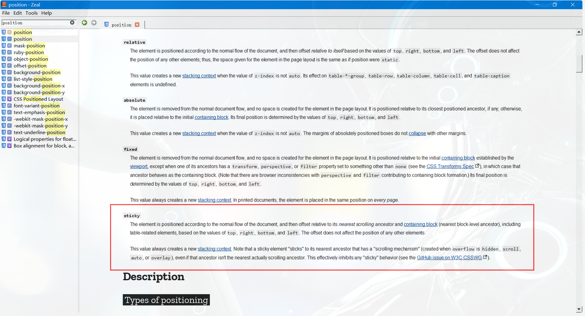
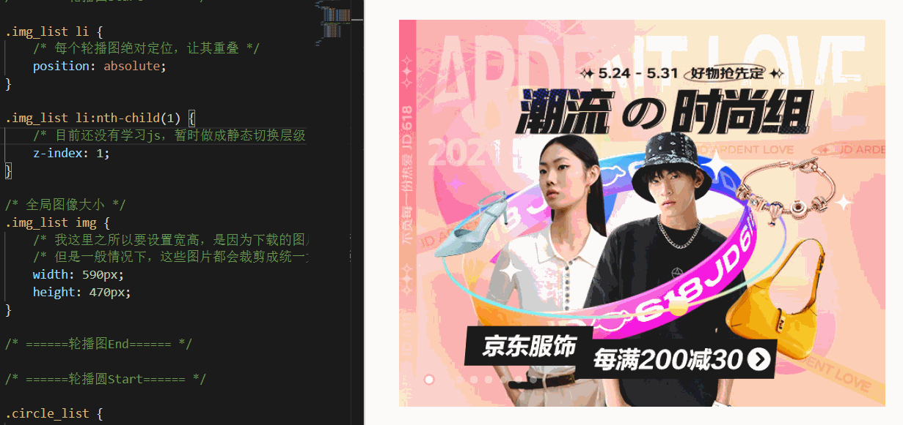

# CSS_11_定位

----

# 相对定位

当元素的 position 属性值设置为relative时，则开启了元素的相对定位

偏移量（offset）

当元素开启相对定位以后，可以通过偏移量来设置元素的位置

| offset属性 |             含义             |
|------------|------------------------------|
| top        | 定位元素和定位位置的上边距离 |
| bottom     | 定位元素和定位位置的下边距离 |
| left       | 定位元素和定位位置的左侧距离 |
| right      | 定位元素和定位位置的右侧距离 |


定位元素垂直方向的位置由top和bottom两个属性控制，通常情况下只会使用其中之一

+	top值越大，定位元素越靠下
+	bottom值越大，定位元素靠上

定位元素水平方向的位置由left和right两个属性控制，通常情况下只会使用其中之一

+	left越大，定位元素越靠右
+	right越大，定位元素越靠左

```css
.box2 {
  width: 200px;
  height: 200px;
  background-color: yellow;
  /* 开启相对定位 */
  position: relative;
  top: -200px;
  left: 200px;
}
```

我们给 box2 设置相对定位，就得到了我们想要的页面效果


可以看出，使用了相对定位后，只会移动自身的布局位置，而不会对已存在的其他元素产生任何影响

## 相对定位的特点

+	当元素开启相对定位以后，如果不设置偏移量元素，则元素不会发生任何变化（这里注意，不仅仅是位置）
+	`相对定位是参照于元素在文档流中的位置进行定位的（可以理解为相对于自身原始位置）`
+	相对定位会提升元素的层级（表现为可以覆盖其他元素）
+	相对定位不会改变元素的性质：块还是块，行内还是行内


Q1：如果给上述三个 div 都设置相对定位，那么它们的层级关系会是什么样的呢？或者说谁会被谁覆盖呢？

A：百闻不如一见，光说不练假把式，我们直接进行测试验证


可以看到覆盖关系是：box3 >> box2 >> box1

我们再稍微调整下 box3 和 box2 的前后位置


会发现覆盖关系变成了：box2 >> box3 >> box1

可以大概猜测：在页面文档流中，越靠下的元素开启相对定位后，其层级越高 （这里也只是我个人的揣测，待后续学习中验证）（在后续学习中已得到验证：`没有设置层级或层级z-index设置相同值时，优先显示靠下的元素`）

Q2：相对定位的第三个特点相对定位会提升元素的层级，是不是就类似于浮动一样脱离了文档流？

A：我们可以对比下，浮动和相对定位的区别

+	参考系不同：浮动的参考系是其父元素；相对定位是相对于自身
+	可移动方向不同：浮动只能左右移动；相对定位是上下左右移动
+	影响不同：浮动会影响页面布局（包括下方元素位置影响和高度塌陷问题）；相对定位不对影响页面布局
+	性质不同：浮动会改变元素的性质（不再独占一行，其宽高都会被内容撑开）；相对定位不会改变元素的性质
+	文字环绕：浮动不会覆盖文字；相对定位可以覆盖文字（这个可以自行验证，不再赘述）

当然，浮动和相对定位也有其相似之处

+	浮动和相对定位都是移动位置（貌似是废话）
+	浮动和相对定位不会从父元素中移出

可以看出，浮动和相对定位的区别是更多的

最后回答一点：浮动脱离了文档流，不再占据页面位置；相对定位仍然占据页面位置（所以怎么能够叫 脱离文档流 呢？）

Q3：相对定位的第四个特点相对定位不会改变元素的性质：块还是块，行内还是行内，但是上述例子中元素开启相对定位后好像就不再独占一行了，这个怎么理解？

A：相比于浮动元素的特点，相对定位不会改变元素的性质其实是一个相对不容易理解的问题。但其实也不难，可以把相对定位认为是元素的灵魂出窍。其位置发生改变以后，布局并没有产生影响，因为它的肉体（结构）仍然占据着原来的那个位置。只是其灵魂（内容）发生了移动。

Q4：相对定位的第四个特点中块还是块，行内还是行内，意味着行内元素也可以使用相对定位是吗？

A：眼见为实，耳听为虚，直接看示例效果


# 绝对定位

当元素的position属性值设置为absolute时，则开启了元素的绝对定位

## 绝对定位的特点

+	开启绝对定位后，如果不设置偏移量，元素的位置不会发生变化
+	开启绝对定位后，`元素会从文档流中脱离`
+	绝对定位会改变元素的性质：行内变成块，块的宽高被内容撑开（与相对定位相反）
+	绝对定位会使元素提升一个层级
+	`绝对定位元素是相对于其包含块进行定位的`（与相对定位不同）


## 包含块（containing block）

+ 包含块定义
  * 包含块就是离当前元素`最近的开启了定位的祖先块元素`
  * 如果所有的祖先元素都没有开启定位，则html（根元素、初始包含块）就是它的包含块

```html
<body>
  <!-- 如果box1开启定位，则box2的包含块是box1，否则就是body -->
  <div class="box1">
    <div class="box2"></div>
  </div>

  <!-- 如果box3开启定位，则em的包含块是box3，否则就是body -->
  <div class="box3">
    <span>
      <em>hello</em>
    </span>
  </div>
</body>
```

示例

```html
<div class="box2">
  2
  <div class="box3">
    3
    <div class="box4">4</div>
  </div>
</div>
```


+	不给 box2、box3 开起定位，box4 的包含块是html
+	只给 box3 开启定位之后，box4 的包含块是 box3
+	只给 box2 开启定位之后，box4 的包含块是 box2
+	给 box2、box3 都开起定位之后，box4 的包含块是 box3

注意：这里上述的条件是开启定位，也就是说只要position不是static（默认值），那么就满足了其成为包含块的必要条件

上述示例中，我们给其祖先元素都设置了相对定位。其实改成其他几种定位方式也是可行的，我们可以看下面示例


这里就不一一举例了，大家可以对另外几种定位方式进行验证

## 水平方向的布局

我们之前说过，水平方向的布局等式：

margin-left + border-left + padding-left + width + padding-right + border-right + margin-right = 其父元素的宽度

当使用绝对定位时，需要添加left和right两个值（此时规则和之前一样，只是多添加了两个值）

`left` + margin-left + border-left + padding-left + width + padding-right + border-right + margin-right + `right` = 其父元素的宽度

当发生过度约束时

+	如果 9 个值中没有auto，则自动调整right值以使等式满足（之前 7 个值是margin-right）
+	如果 9 个值中有auto，则自动调整auto的值以使等式满足

可设置auto的值：margin-left/margin-right /width /left /right

`因为left和right的值默认是auto，所以如果没有设置left和right，当等式不满足时，则会自动调整这两个值`

## 水平居中

```html
<style>
  .box1 {
    width: 500px;
    height: 500px;
    background-color: #bfa;
    position: relative;
  }

  .box2 {
    width: 100px;
    height: 100px;
    background-color: orange;
    /* 左右外边距设置为auto */
    margin-left: auto;
    margin-right: auto;
    /* 绝对定位 */
    position: absolute;
    left: 0;
    right: 0;
  }
</style>

<div class="box1">
  <div class="box2"></div>
</div>
```


## 垂直方向的布局

垂直方向布局的等式的也必须要满足

top + margin-top + border-top + padding-top + height + padding-bottom + border-bottom + margin-bottom + top = 其父元素的高度

## 垂直居中

```css
.box2 {
  width: 100px;
  height: 100px;
  background-color: orange;
  /* 左右外边距设置为auto */
  margin-top: auto;
  margin-bottom: auto;
  /* 绝对定位 */
  position: absolute;
  top: 0;
  bottom: 0;
}
```


## 水平垂直居中

目前，我们可以根据绝对定位进行元素的水平垂直双方向居中，所以这个方法只是其中之一

```css
.box2 {
  width: 100px;
  height: 100px;
  background-color: orange;
  /* 左右外边距设置为auto */
  margin: auto;
  /* 绝对定位 */
  position: absolute;
  top: 0;
  bottom: 0;
  left: 0;
  right: 0;
}
```


## 小结

+	水平布局等式：left + margin-left + border-left + padding-left + width + padding-right + border-right + margin-right + right = 其父元素的宽度
+	垂直布局等式：top + margin-top + border-top + padding-top + height + padding-bottom + border-bottom + margin-bottom + top = 其父元素的高度

上述等式的过度约束规则与《06-盒模型》中介绍的规则基本一致

只是在没有auto时，会自动调整top/bottom/left/right


# 固定定位的特点

固定定位也是一种绝对定位，所以固定定位的大部分特点都和绝对定位一样

+ 唯一不同的是，固定定位永远参照于浏览器的`视口`（viewport，可视窗口）进行定位，不会随网页的滚动条滚动
  * 视口定义:浏览器的可视窗口

示例


我们再给body设置一个较大的高度，让浏览器滚动起来，看下效果


会发现，box4 并没有因为滚动而发生未知的变化，这也验证了上述知识，同时也应该明白了"视口"的概念

我们再对比下绝对定位


相信到这里，大家应该又进一步地理解了固定定位与绝对定位的区别

因为固定定位跟绝对定位除了具有上述差别之后，其他的特点跟绝对定位是一样的，所以这里便不再赘述了


# 粘滞定位

将元素的position属性设置为sticky，则开启了元素的固定定位

这次，我们换个方式，直接来看粘滞定位的效果


大家可以看到，右侧边栏部分在一定的情况下是固定的，滚动到上方一定位置开始发生变动

我们先带着这个疑问，打开Zeal官方手册，找到position中sticky的相关描述



> The element is positioned according to the normal flow of the document, and then offset relative to its nearest scrolling ancestor and containing block (nearest block-level ancestor), including table-related elements, based on the values of top, right, bottom, and left. The offset does not affect the position of any other elements.
>
> This value always creates a new stacking context. Note that a sticky element "sticks" to its nearest ancestor that has a "scrolling mechanism" (created when overflow is hidden, scroll, auto, or overlay), even if that ancestor isn't the nearest actually scrolling ancestor. This effectively inhibits any "sticky" behavior (see the GitHub issue on W3C CSSWG).

这里大概翻译一下（我这里稍微进行了下省略精简和整理总结）

+ 该元素是根据文档流进行定位的，即相对于包含块进行偏移
+ 偏移量不会影响任何其他元素的位置
+ 粘性元素总是“粘”到其最近的具有“滚动机制”的祖先元素（当overflow为hidden、scroll、auto、overlay时创建），即使该祖先不是最近的实际滚动祖先

这里可能最后一点比较难理解，别着急，我们接着往下看

示例

我们拿之前的w3cschool顶部导航栏进行下魔改

```css
/* 设置一个高度 */
body {
  height: 3000px;
}

.menu {
  width: 1211px;
  height: 48px;
  background-color: #e8e7e3;
  margin: 100px auto;
  /* 开启粘滞定位 */
  position: sticky;
  top: 10px;
}
```


## 粘滞定位的特点

+ 粘滞定位和相对定位的特点基本一致（视频中说是和相对定位一致，不过我对比了一下，很多特点是不同的，感觉倒是和固定定位更相似，这里存疑）
+ 不同的是粘滞定位可以在元素到达某个位置时将其固定

需要注意的是，sticky属性并不兼容 IE


# 几种定位的对比

我们通过上面的学习，知道position属性有五个可选值

但static是默认值，即不开启定位，所以我们只需要对比 4 种定位方式即可


# 补充：元素层级

对于开启了定位元素，可以通过z-index属性来指定元素的层级

+ z-index需要一个整数作为参数，值越大元素的层级越高，元素的层级越高越优先显示
+ 如果元素的层级一样，则优先显示靠下的元素
+ 祖先的元素的层级再高，也不会盖住后代元素

示例

```html
<style>
  div {
    font-size: 40px;
  }

  .box1 {
    width: 200px;
    height: 200px;
    background-color: #bfa;
    position: absolute;
    top: 0;
    left: 0;
  }

  .box2 {
    width: 200px;
    height: 200px;
    background-color: orange;
    position: absolute;
    top: 50px;
    left: 50px;
  }

  .box3 {
    width: 200px;
    height: 200px;
    background-color: salmon;
    position: absolute;
    top: 100px;
    left: 100px;
  }

  .box4 {
    width: 100px;
    height: 100px;
    background-color: skyblue;
    position: absolute;
    bottom: 0;
    left: 0;
  }
</style>

<div class="box1">1</div>
<div class="box2">2</div>
<div class="box3">
  3
  <div class="box4">4</div>
</div>
```


存疑问题

Q：浮动也有层级概念吗？如果有，浮动和定位的层级关系是什么样的？

A：~~null / none / undefined~~ 调了一下，出现几种现象

+ 给float设置z-index多大都没用，还是会被覆盖
+ 默认情况，没有设置z-index或设置z-index大小 ≥0 时，浮动层级没有定位的层级高
+ 设置z-index<0 时，浮动层级可以定位的层级高

浮动层级（不知道有没有这个概念，本身就是存疑问题，现在这种情况看起来应该是没有这个概念了）


# 总结

一般情况下

+ 页面的整体结构大多采用浮动、块进行布局
+ 页面某些模块结构一般采用定位进行微调

# 练习：京东轮播图

css 代码

```css
/* 整体居中 */
.box {
  width: 590px;
  height: 470px;
  /* 水平垂直双方向居中 */
  margin: auto;
  position: absolute;
  top: 0;
  bottom: 0;
  left: 0;
  right: 0;
}

/* ======轮播图Start====== */

.img_list li {
  /* 每个轮播图绝对定位，让其重叠 */
  position: absolute;
}

.img_list li:nth-child(1) {
  /* 目前还没有学习js，暂时做成静态切换层级 */
  z-index: 1;
}

/* 全局图像大小 */
.img_list img {
  /* 我这里之所以要设置宽高，是因为下载的图片大小不全是一样大的 */
  /* 但是一般情况下，这些图片都会裁剪成统一大小，所以可以不用设置 */
  width: 590px;
  height: 470px;
}

/* ======轮播图End====== */

/* ======轮播圆Start====== */

.circle_list {
  height: 20px;
  /* 开启绝对定位 */
  position: absolute;
  bottom: 20px;
  left: 30px;
  z-index: 2;
  /* 参考京东原网页，整体字体设置样式，这种设置方式还不太懂 */
  /* 其实也可以不设置，不过每个轮播圆之间的间距跟原来就不太一样了 */
  font-size: 0;
  text-align: center;
}

/* 轮播圆细节 */
.circle_list .circle {
  /* 这里设置display: inline-block; 也是一样的 */
  float: left;
  height: 8px;
  width: 8px;
  background-color: rgba(255, 255, 255, 0.4);
  margin-right: 4px;
  /* 画圆，这个按照课程中的画法，按照网页源代码调出来的有点问题 */
  background-clip: content-box;
  border: 3px transparent solid;
  border-radius: 50%;
}

/* 轮播圆悬浮效果 */
.circle_list .circle:hover,
.circle_list .circle:nth-child(1) {
  background-color: #fff;
  border: 3px rgba(0, 0, 0, 0.1) solid;
}

/* ======轮播圆End====== */
```

html

```html
<div class="box">
  <ul class="img_list">
    <li>
      <a href="#"></a>
    </li>
    <li>
      <a href="#"></a>
    </li>
    <li>
      <a href="#"></a>
    </li>
    <li>
      <a href="#"></a>
    </li>
    <li>
      <a href="#"></a>
    </li>
    <li>
      <a href="#"></a>
    </li>
    <li>
      <a href="#"></a>
    </li>
    <li>
      <a href="#"></a>
    </li>
  </ul>
  <!-- 我这里结构并没有完全按照课程中的结构来，但实现效果是一样的 -->
  <ul class="circle_list">
    <li class="circle"></li>
    <li class="circle"></li>
    <li class="circle"></li>
    <li class="circle"></li>
    <li class="circle"></li>
    <li class="circle"></li>
    <li class="circle"></li>
    <li class="circle"></li>
  </ul>
</div>
```

别忘了，引入reset样式

效果



等到后面学习了 js，就可以实现自动轮播了，到时候再补充完善

主要运用

+ 水平垂直双方向居中（水平垂直方向等式）
+ absolute开启绝对定位，使其重叠，达到隐藏效果
+ z-index设置层级，实现图片轮播
+ border-radius画圆，transparent边框透明，background-clip:content-box隐藏边框


