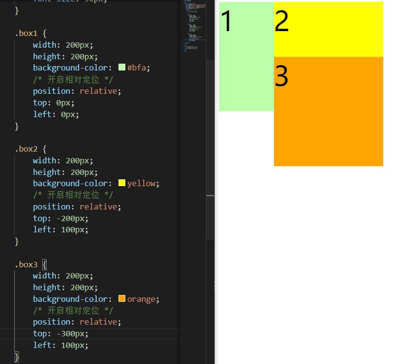
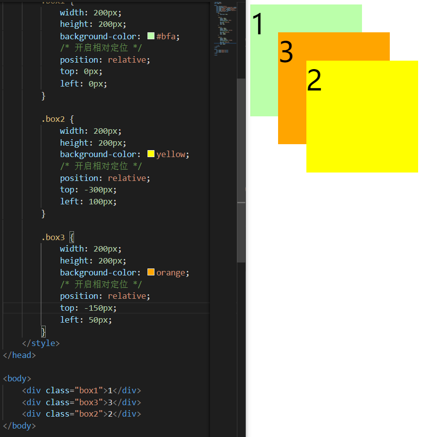
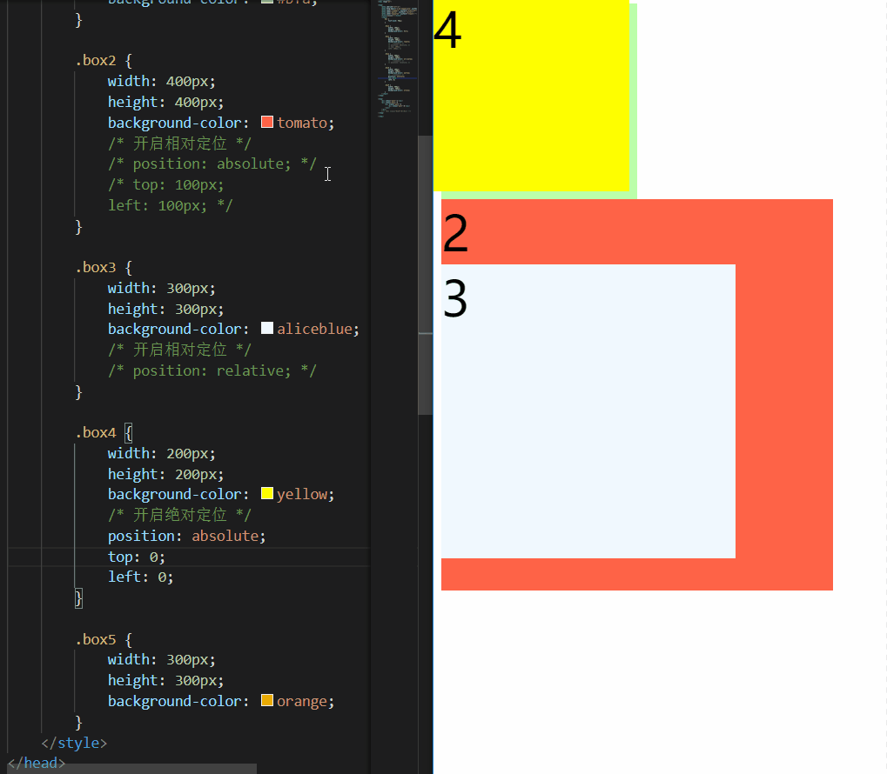
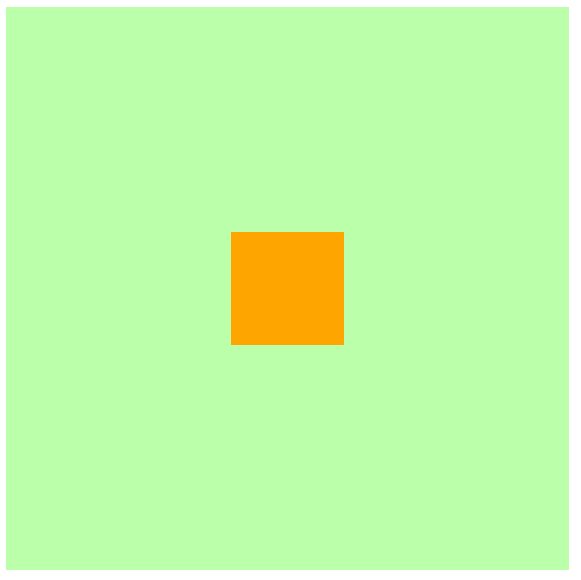

# CSS_11_定位的简介

----

# 相对定位

当元素的 position 属性值设置为relative时，则开启了元素的相对定位

偏移量（offset）

当元素开启相对定位以后，可以通过偏移量来设置元素的位置

| offset属性 |             含义             |
|------------|------------------------------|
| top        | 定位元素和定位位置的上边距离 |
| bottom     | 定位元素和定位位置的下边距离 |
| left       | 定位元素和定位位置的左侧距离 |
| right      | 定位元素和定位位置的右侧距离 |


定位元素垂直方向的位置由top和bottom两个属性控制，通常情况下只会使用其中之一

+	top值越大，定位元素越靠下
+	bottom值越大，定位元素靠上

定位元素水平方向的位置由left和right两个属性控制，通常情况下只会使用其中之一

+	left越大，定位元素越靠右
+	right越大，定位元素越靠左

```css
.box2 {
  width: 200px;
  height: 200px;
  background-color: yellow;
  /* 开启相对定位 */
  position: relative;
  top: -200px;
  left: 200px;
}
```

我们给 box2 设置相对定位，就得到了我们想要的页面效果


可以看出，使用了相对定位后，只会移动自身的布局位置，而不会对已存在的其他元素产生任何影响

## 相对定位的特点

+	当元素开启相对定位以后，如果不设置偏移量元素，则元素不会发生任何变化（这里注意，不仅仅是位置）
+	相对定位是参照于元素在文档流中的位置进行定位的（可以理解为相对于自身原始位置）
+	相对定位会提升元素的层级（表现为可以覆盖其他元素）
+	相对定位不会改变元素的性质：块还是块，行内还是行内


Q1：如果给上述三个 div 都设置相对定位，那么它们的层级关系会是什么样的呢？或者说谁会被谁覆盖呢？

A：百闻不如一见，光说不练假把式，我们直接进行测试验证



可以看到覆盖关系是：box3 >> box2 >> box1

我们再稍微调整下 box3 和 box2 的前后位置



会发现覆盖关系变成了：box2 >> box3 >> box1

可以大概猜测：在页面文档流中，越靠下的元素开启相对定位后，其层级越高 （这里也只是我个人的揣测，待后续学习中验证）（在后续学习中已得到验证：`没有设置层级或层级z-index设置相同值时，优先显示靠下的元素`）

Q2：相对定位的第三个特点相对定位会提升元素的层级，是不是就类似于浮动一样脱离了文档流？

A：我们可以对比下，浮动和相对定位的区别

+	参考系不同：浮动的参考系是其父元素；相对定位是相对于自身
+	可移动方向不同：浮动只能左右移动；相对定位是上下左右移动
+	影响不同：浮动会影响页面布局（包括下方元素位置影响和高度塌陷问题）；相对定位不对影响页面布局
+	性质不同：浮动会改变元素的性质（不再独占一行，其宽高都会被内容撑开）；相对定位不会改变元素的性质
+	文字环绕：浮动不会覆盖文字；相对定位可以覆盖文字（这个可以自行验证，不再赘述）

当然，浮动和相对定位也有其相似之处

+	浮动和相对定位都是移动位置（貌似是废话）
+	浮动和相对定位不会从父元素中移出

可以看出，浮动和相对定位的区别是更多的

最后回答一点：浮动脱离了文档流，不再占据页面位置；相对定位仍然占据页面位置（所以怎么能够叫 脱离文档流 呢？）

Q3：相对定位的第四个特点相对定位不会改变元素的性质：块还是块，行内还是行内，但是上述例子中元素开启相对定位后好像就不再独占一行了，这个怎么理解？

A：相比于浮动元素的特点，相对定位不会改变元素的性质其实是一个相对不容易理解的问题。但其实也不难，可以把相对定位认为是元素的灵魂出窍。其位置发生改变以后，布局并没有产生影响，因为它的肉体（结构）仍然占据着原来的那个位置。只是其灵魂（内容）发生了移动。

Q4：相对定位的第四个特点中块还是块，行内还是行内，意味着行内元素也可以使用相对定位是吗？

A：眼见为实，耳听为虚，直接看示例效果


# 绝对定位

当元素的position属性值设置为absolute时，则开启了元素的绝对定位

## 绝对定位的特点

+	开启绝对定位后，如果不设置偏移量，元素的位置不会发生变化
+	开启绝对定位后，元素会从文档流中脱离
+	绝对定位会改变元素的性质：行内变成块，块的宽高被内容撑开（与相对定位相反）
+	绝对定位会使元素提升一个层级
+	绝对定位元素是相对于其包含块进行定位的（与相对定位不同）


## 包含块（containing block）

正常情况下：

包含块就是离当前元素最近的开启了定位的祖先块元素
如果所有的祖先元素都没有开启定位，则html（根元素、初始包含块）就是它的包含块

```html
<body>
  <!-- 如果box1开启定位，则box2的包含块是box1，否则就是body -->
  <div class="box1">
    <div class="box2"></div>
  </div>

  <!-- 如果box3开启定位，则em的包含块是box3，否则就是body -->
  <div class="box3">
    <span>
      <em>hello</em>
    </span>
  </div>
</body>
```

示例

```html
<div class="box2">
  2
  <div class="box3">
    3
    <div class="box4">4</div>
  </div>
</div>
```


+	不给 box2、box3 开起定位，box4 的包含块是html
+	只给 box3 开启定位之后，box4 的包含块是 box3
+	只给 box2 开启定位之后，box4 的包含块是 box2
+	给 box2、box3 都开起定位之后，box4 的包含块是 box3

注意：这里上述的条件是开启定位，也就是说只要position不是static（默认值），那么就满足了其成为包含块的必要条件

上述示例中，我们给其祖先元素都设置了相对定位。其实改成其他几种定位方式也是可行的，我们可以看下面示例



这里就不一一举例了，大家可以对另外几种定位方式进行验证

## 水平方向的布局

我们之前说过，水平方向的布局等式：

margin-left + border-left + padding-left + width + padding-right + border-right + margin-right = 其父元素的宽度

当使用绝对定位时，需要添加left和right两个值（此时规则和之前一样，只是多添加了两个值）

left + margin-left + border-left + padding-left + width + padding-right + border-right + margin-right + right = 其父元素的宽度

当发生过度约束时

+	如果 9 个值中没有auto，则自动调整right值以使等式满足（之前 7 个值是margin-right）
+	如果 9 个值中有auto，则自动调整auto的值以使等式满足

可设置auto的值：margin-left/margin-right /width /left /right

因为left和right的值默认是auto，所以如果没有设置left和right，当等式不满足时，则会自动调整这两个值

## 水平居中

```html
<style>
  .box1 {
    width: 500px;
    height: 500px;
    background-color: #bfa;
    position: relative;
  }

  .box2 {
    width: 100px;
    height: 100px;
    background-color: orange;
    /* 左右外边距设置为auto */
    margin-left: auto;
    margin-right: auto;
    /* 绝对定位 */
    position: absolute;
    left: 0;
    right: 0;
  }
</style>

<div class="box1">
  <div class="box2"></div>
</div>
```


## 垂直方向的布局

垂直方向布局的等式的也必须要满足

top + margin-top + border-top + padding-top + height + padding-bottom + border-bottom + margin-bottom + top = 其父元素的高度

## 垂直居中

```css
.box2 {
  width: 100px;
  height: 100px;
  background-color: orange;
  /* 左右外边距设置为auto */
  margin-top: auto;
  margin-bottom: auto;
  /* 绝对定位 */
  position: absolute;
  top: 0;
  bottom: 0;
}
```


## 水平垂直居中

目前，我们可以根据绝对定位进行元素的水平垂直双方向居中，所以这个方法只是其中之一

```css
.box2 {
  width: 100px;
  height: 100px;
  background-color: orange;
  /* 左右外边距设置为auto */
  margin: auto;
  /* 绝对定位 */
  position: absolute;
  top: 0;
  bottom: 0;
  left: 0;
  right: 0;
}
```



## 小结

+	水平布局等式：left + margin-left + border-left + padding-left + width + padding-right + border-right + margin-right + right = 其父元素的宽度
+	垂直布局等式：top + margin-top + border-top + padding-top + height + padding-bottom + border-bottom + margin-bottom + top = 其父元素的高度

上述等式的过度约束规则与《06-盒模型》中介绍的规则基本一致

只是在没有auto时，会自动调整top/bottom/left/right


