# CSS_12_字体

----

# 字体相关的样式

我们前面讲过字体的两个属性

+	color用来设置字体颜色
+	font-size字体的大小
	*	em 相当于当前元素的一个font-size
	*	rem 相对于根元素的一个font-size
	
当然，字体的属性并不止这些

# font-family

font-family 字体族（字体的格式）

+	serif 衬线字体

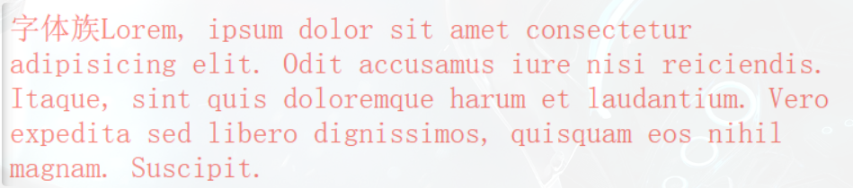

+	sans-serif 非衬线字体

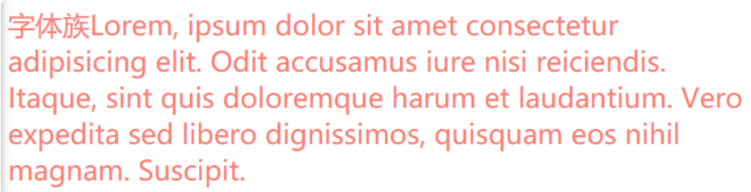

+	monospace 等宽字体

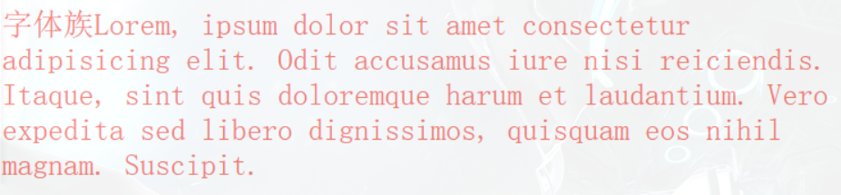

+	cursive 手写体

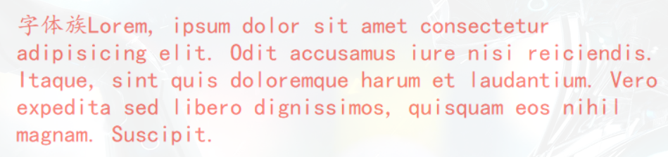

+	fantasy 梦幻字体

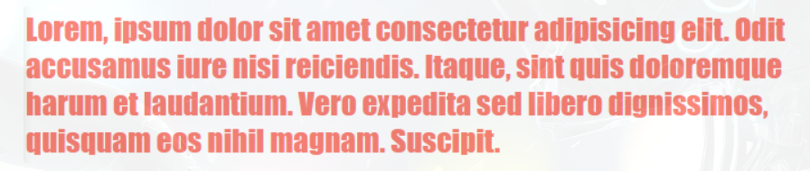

`上述字体均不表示具体的某种字体，而是字体的分类`

我们经常使用的一些字体，如微软雅黑、黑体、楷体、宋体、Consolas等，才是具体的某种字体

也就是说，`font-family 指定字体的类别，浏览器会自动使用该类别下的字体`

font-family可以同时指定多个字体，多个字体间使用，隔开

字体生效时优先使用第一个，第一个无法使用则使用第二个，以此类推


```css
font-family: "Courier New", Courier, monospace;
```

# 几种字体

我是乱分类的，随便看看就好

## 手写体

Indie Flower

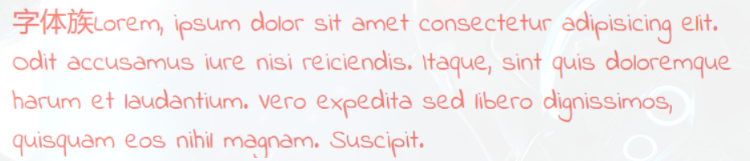

Ink Free

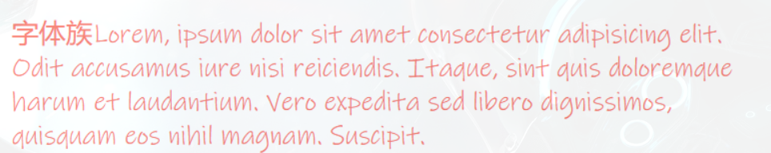

Nanum Pen

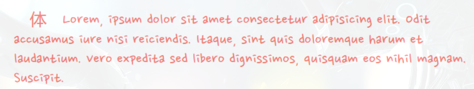

MV Boli

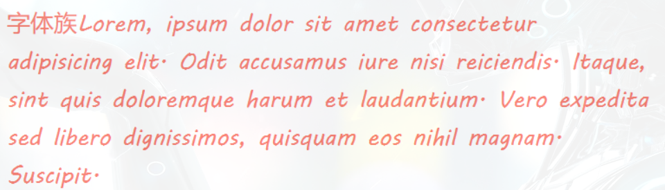

Segoe Print

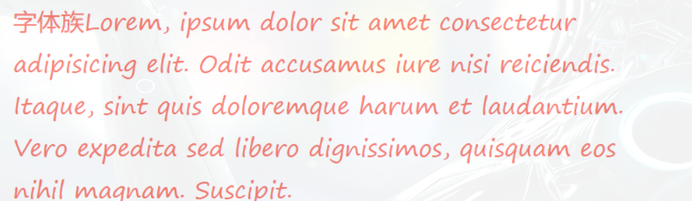

Shadows Into

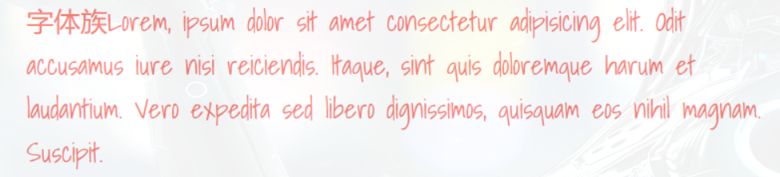

## 艺术体

Barrio

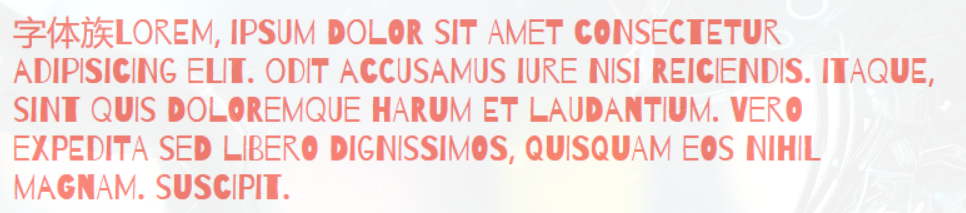

Julius Sans One

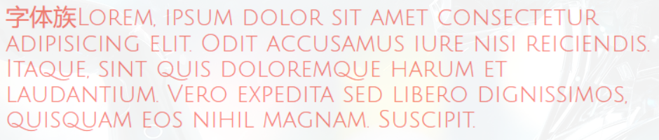

Lobster

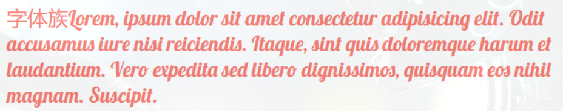

Monoton

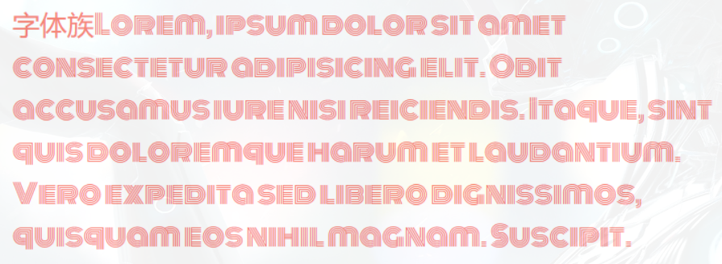

Poiret One

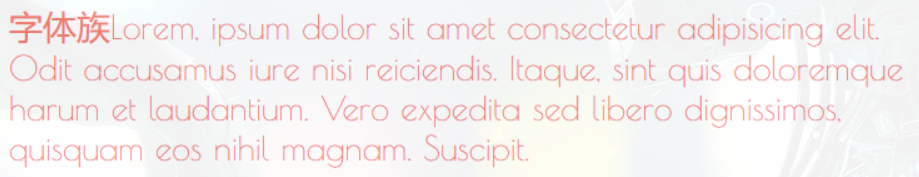

## 乱码字体

MT Extra

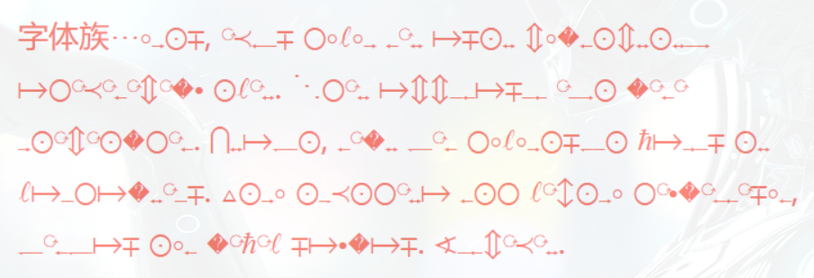

Symbol

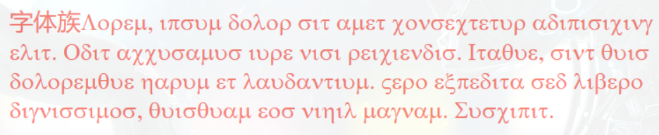

Webdings

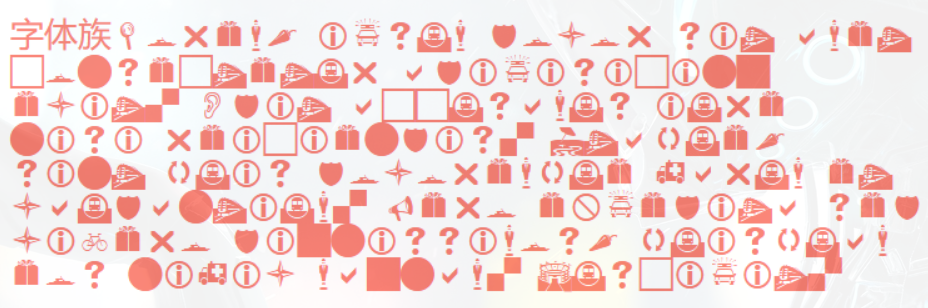

Wingdings

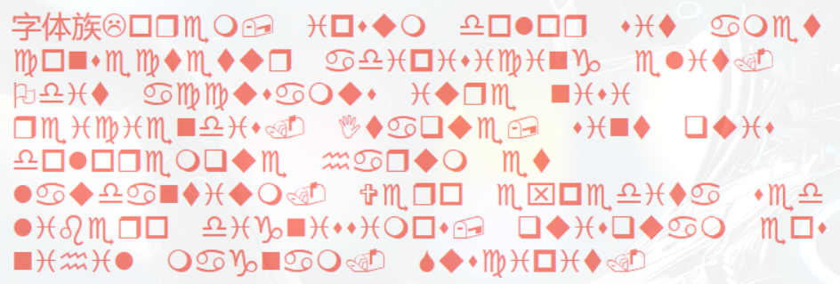

# 中文字体

## 方正粗黑宋简体

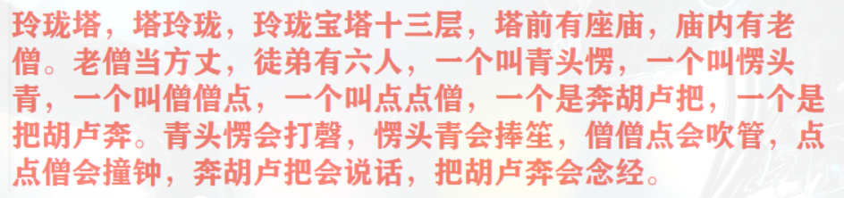

## 微软雅黑

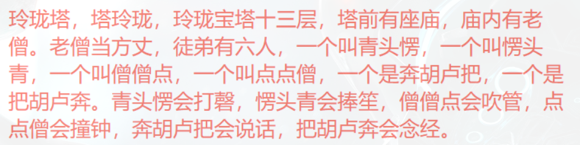

## 黑体

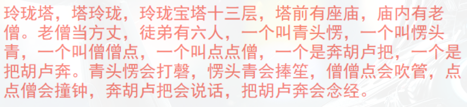

## 楷体

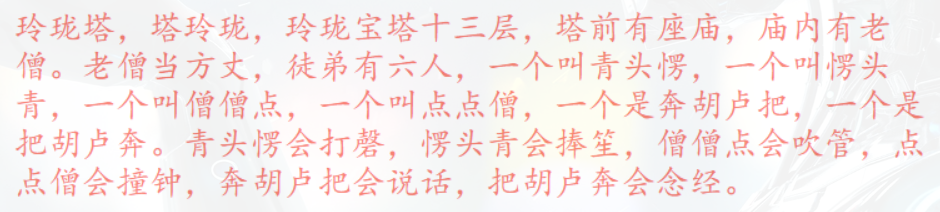

## 宋体

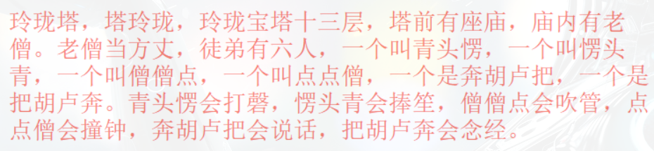

## 仿宋

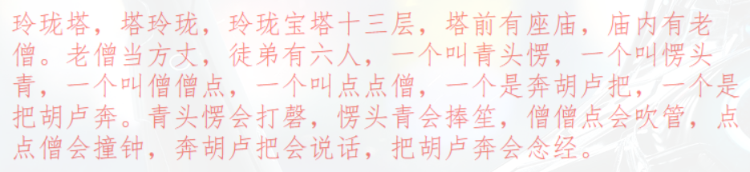

# @font-face

我们除了可以使用系统自带的字体样式外，还可以在服务器端自定义字体位置

@font-face可以将服务器中的字体直接提供给用户去使用

```css
@font-face {
  /* 指定字体名字 */
  font-family: "myFont1";
  /* 服务器中字体路径 */
  src: url("/font/ZCOOLKuaiLe-Regular.woff"),
    url("/font/ZCOOLKuaiLe-Regular.otf"),
    url("/font/ZCOOLKuaiLe-Regular.ttf") format("truetype"); /* 指定字体格式，一般不写 */
}

p {
  font-size: 30px;
  color: salmon;
  font-family: myFont1;
}
```

问题

+	加载速度：受网络速度影响，可能会出现字体闪烁一下变成最终的字体
+	版权：有些字体是商用收费的，需要注意
+	字体格式：字体格式也有很多种（woff、otf、ttf），未必兼容，可能需要指定多个

# 图标字体（iconfont）

## 图标字体简介

在网页中经常需要使用一些图标，可以通过图片来引入图标但是图片大小本身比较大，并且非常的不灵活

所以在使用图标时，我们还可以将图标直接设置为字体，然后通过@font-face的形式来对字体进行引入

这样我们就可以通过使用字体的形式来使用图标

## fontawesome

官方网站：https://fontawesome.com/

下载解压完毕之后，直接将 css 和 webfonts 移动到项目中即可使用

示例

```html
<link rel="stylesheet" href="/font/fontawesome/css/all.css" />
<style>
  i {
    color: green;
  }

  .fa-venus-mars,
  .fa-mars-double {
    color: red;
  }

  .fa-html5 {
    color: #e34d22;
  }

  .fa-css3 {
    color: blue;
  }

  .fa-js {
    color: #d1b514;
  }
</style>

<!-- 大小 -->
<i class="fab fa-weixin fa-lg"></i>
<i class="fab fa-weixin fa-2x"></i>
<i class="fab fa-weixin fa-3x"></i>
<br />

<!-- 边框 -->
<i class="fab fa-weixin fa-2x fa-border"></i>
<br />

<!-- 旋转 -->
<i class="fab fa-weixin fa-2x  fa-rotate-90 "></i>
<!-- 水平对称 -->
<i class="fab fa-weixin fa-2x fa-flip-horizontal "></i>
<!-- 垂直对称 -->
<i class="fab fa-weixin fa-2x fa-flip-vertical "></i>
<br />

<!-- 动画 -->
<i class="fa fa-venus-mars fa-3x fa-spin"></i>
<i class="fa fa-mars-double  fa-3x fa-pulse"></i>
<br />

<!-- 列表 -->
<ul class="fa-ul">
  <li><i class="fa-li fa fa-check-square"></i>can be used</li>
  <li><i class="fa-li fa fa-spinner fa-spin"></i>as bullets</li>
  <li><i class="fa-li fa fa-square"></i>in lists</li>
</ul>
<br /><br /><br />

<!-- 组合 -->
<span class="fa-stack fa-lg">
  <i class="fab fa-html5 fa-stack-1x fa-10x"></i>
  <i class="fab fa-css3 fa-stack-1x fa-4x"></i>
  <i class="fab fa-js fa-stack-1x fa-2x"></i>
</span>
```

效果


其中`fas/fab`是免费的，其他是收费的

## 图标字体其他使用方式

### 通过伪元素设置

+	找到要设置图标的元素通过::before或::after选中
+	在content中设置字体的编码
+	设置字体的样式
	*	fab：font-family: 'Font Awesome 5 Brands';
	*	fas：font-family: 'Font Awesome 5 Free'; font-weight：900;
	
示例

```html
<style>
  .poem {
    width: 200px;
    height: 300px;
    margin: auto;
  }

  li {
    list-style: none;
    margin-left: -40px;
  }

  li::before {
    content: "\f130";
    /* font-family: 'Font Awesome 5 Brands'; */
    font-family: "Font Awesome 5 Free";
    font-weight: 900;
    margin-right: 10px;
    color: gray;
  }
</style>

<div class="poem">
  <h1>武陵春·春晚</h1>
  <p>[宋] 李清照</p>
  <ul>
    <li>风住尘香花已尽，</li>
    <li>日晚倦梳头。</li>
    <li>物是人非事事休，</li>
    <li>欲语泪先流。</li>
    <li>闻说双溪春尚好，</li>
    <li>也拟泛轻舟。</li>
    <li>只恐双溪舴艋舟，</li>
    <li>载不动、许多愁。</li>
  </ul>
</div>
```

效果

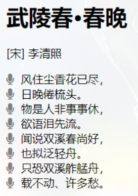

### 通过实体设置

通过实体来使用图标字体：&#x图标编码;

示例

```css
<i class="fas">&#xf025;</i>
```

效果

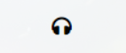

## iconfont

官方网站：https://www.iconfont.cn/

iconfont 是阿里的一个图标字体库，海量图标库，图标字体非常丰富

但是版权有点模横两可，如果需要商用，最好联系作者

不过一般情况下，公司企业都会有自己的 UI 设计团队，会自己去进行设计

这里使用方式大同小异，不过

+	iconfont 需要添加购物车后再添加至项目然后下载，下载包中有 demo.html，详细介绍了使用方式
+	iconfont 也提供了一种在线方式，直接在我的项目中选择在线链接可以复制出一份@font-face的 css 代码

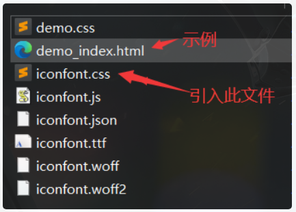

后续步骤与前面介绍的一致

示例

```html
<!-- <link rel="stylesheet" href="/font/iconfont/iconfont.css"> -->
<style>
  i.iconfont {
    font-size: 100px;
  }

  p::before {
    content: "\e811";
    font-family: "iconfont";
    font-size: 50px;
  }

  /* 3、通过在线连接：这里link和@font-face择其一即可  */
  @font-face {
    font-family: "iconfont";
    /* Project id 2580407 */
    src: url("//at.alicdn.com/t/font_2580407_c0kpuhebb7r.woff2?t=1622373966454")
        format("woff2"), url("//at.alicdn.com/t/font_2580407_c0kpuhebb7r.woff?t=1622373966454")
        format("woff"),
      url("//at.alicdn.com/t/font_2580407_c0kpuhebb7r.ttf?t=1622373966454")
        format("truetype");
  }
</style>

<!-- 1、通过字符实体设置 -->
<i class="iconfont">&#xe810;</i>
<i class="iconfont">&#xe811;</i>
<i class="iconfont">&#xe812;</i>
<i class="iconfont">&#xe813;</i>

<!-- 2、通过伪元素设置 -->
<p>
  Lorem ipsum, dolor sit amet consectetur adipisicing elit. Totam deserunt
  tempore fugit quos eaque, ipsa rerum suscipit iure cumque aspernatur esse
  cupiditate nihil quas nulla odit? Sequi accusantium labore maiores.
</p>
```

效果

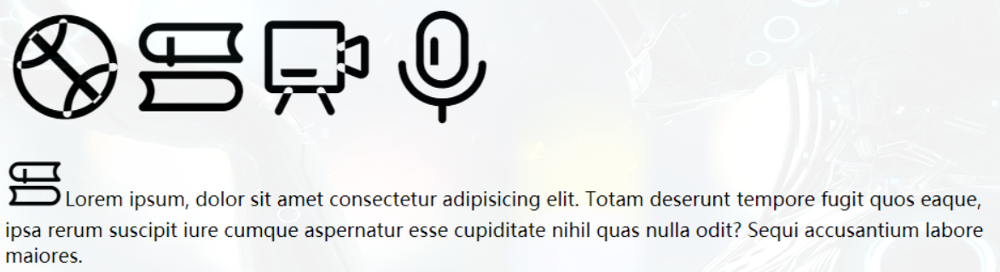

# 行高

## 行高line height

文字占有的实际高度，可以通过line-height来设置行高

+	可以直接指定一个大小 px/em
+	也可以直接为行高设置一个小数（字体大小的倍数）

行高经常还用来设置文字的行间距：`行间距 = 行高 - 字体大小`

## 字体框

字体框就是字体存在的格子，设置font-size实际上就是在设置字体框的高度

行高会在字体框的上下平均分配

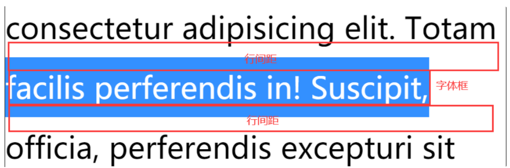

示例

```css
border: 1px black solid;
font-size: 100px;
/* line-height: 100px; */
```

不指定行高时，content高度131.556px：说明line-height默认值大约是1.31 ~ 1.32(倍数)

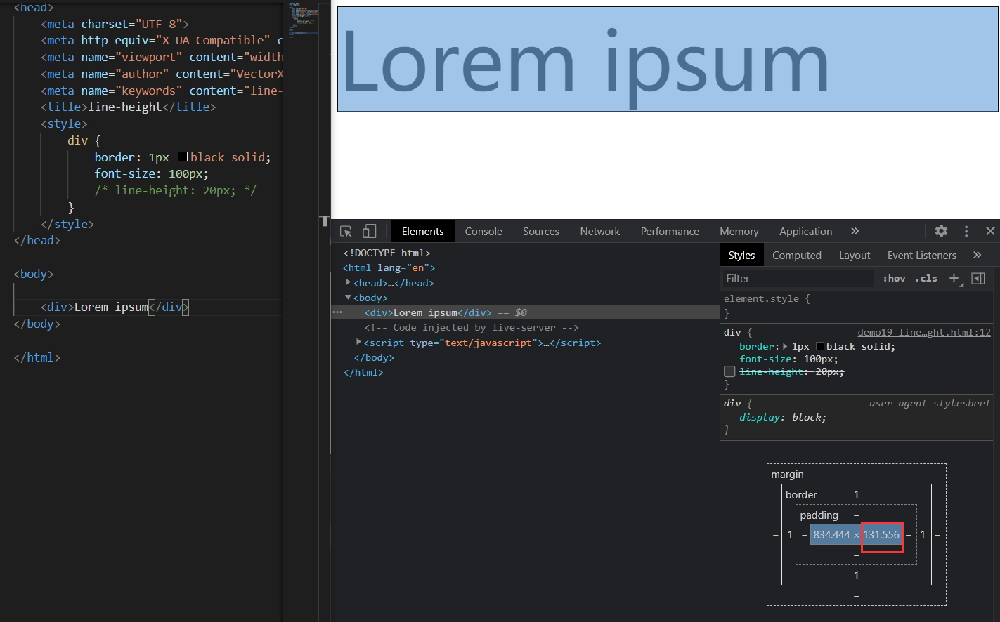

指定行高时，content高度99.556px：少了0.444px，并且字母p下面溢出


存疑问题

经测试，line-height大约比100.444px略大一点时，content高度才会大于100px，暂未知原因

## 字体的简写属性

font 可以设置字体相关的所有属性：

`font: font-style font-variant font-weight font-size/line-height font-family`

其中某些值可以不写，会用默认值

默认值

|     属性     |    默认值    |  其他常用值  |
|--------------|--------------|--------------|
| font-style   | normal       | italic       |
| font-variant | normal       | small-caps   |
| font-weight  | normal       | bold         |
| font-size    | medium       | small、large |
| line-height  | normal       |              |
| font-family  | 取决于浏览器 |              |

示例 1

```css
/* font-size: 50px;
font-family: 'Courier New', Courier, monospace; */
font: 50px "Courier New", Courier, monospace;
```

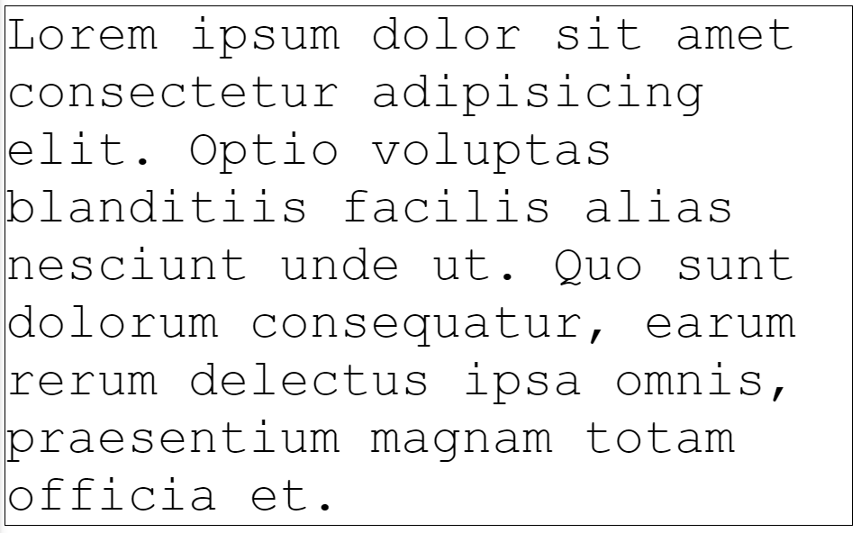

示例 2

```css
/* small-caps值设置小型大写字母字体，所有小写变大写，同时字体尺寸更小（了解即可） */
font: bold small-caps italic 50px "Courier New", Courier, monospace;
```


注意 Pay Attention：简写属性省略的值会使用默认值，所以会覆盖前面的非简写属性（不仅仅对于字体而言）

# 文本对齐方式

## 水平对齐

text-align 文本的水平对齐

| text-align属性值 | 对齐方式说明 |
|------------------|--------------|
| left             | 左侧对齐     |
| right            | 右侧对齐     |
| center           | 居中对齐     |
| justify          | 两端对齐     |
| left             | 左侧对齐     |

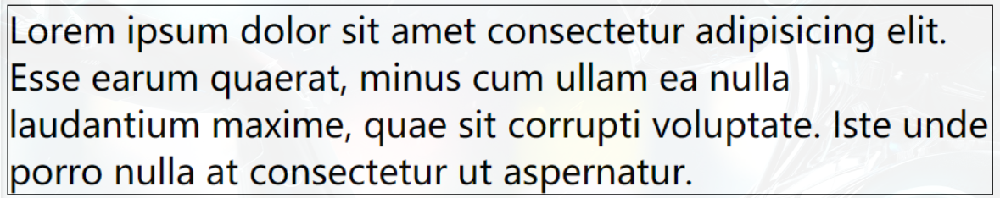

right 右侧对齐

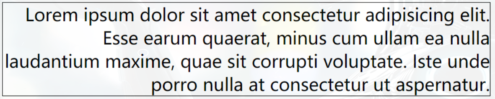

center 居中对齐

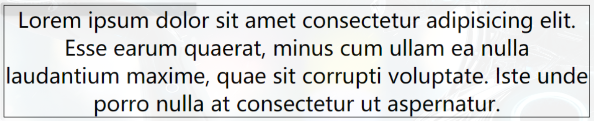

justify 两端对齐

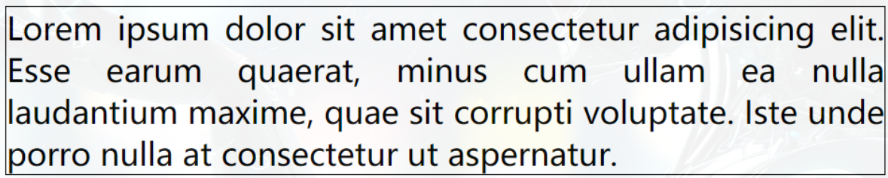

## 垂直对齐

vertical-align 设置元素垂直对齐的方式

| vertical-align 属性值 | 对齐方式说明 |
|-----------------------|--------------|
| baseline              | 基线对齐     |
| top                   | 顶部对齐     |
| bottom                | 底部对齐     |
| middle                | 居中对齐     |
| baseline              | 基线对齐     |

baseline 基线对齐

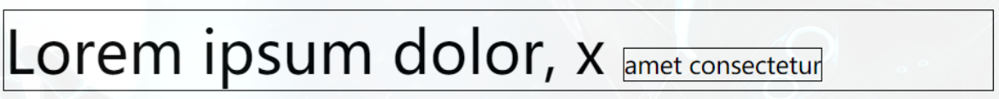

top 顶部对齐

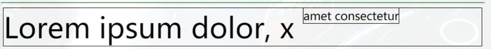

bottom 底部对齐

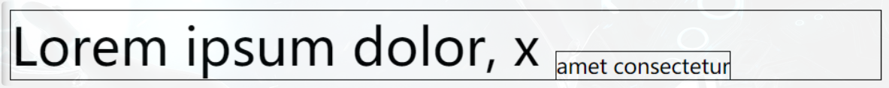

middle 居中对齐

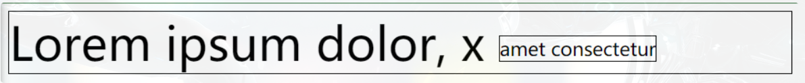

这里的居中对齐高度 = 基线高度 + x 的高度 / 2

这种居中对齐并非实际上的居中对齐，一般也不会用这种方式对文字进行垂直方向的对齐

vertical-align 还可以设置 px 值设置垂直对齐方式

```css
vertical-align: 10px;
```

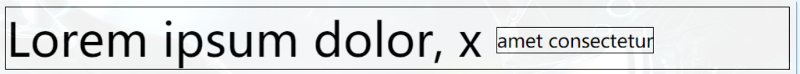


图片的垂直对齐问题

```html
<style>
  .imgDiv {
    border: 5px seagreen solid;
  }

  .imgDiv img {
    width: 400px;
    height: 300px;
  }
</style>

<div class="imgDiv">
  
</div>
```


明显默认情况下，图片底部有一定缝隙，我们稍作修改，给 img 元素添加vertical-align属性值

```css
/* 只要不是基线对齐，就能消除底部缝隙 */
vertical-align: top;
vertical-align: bottom;
vertical-align: middle;
```


Q：为什么图片会有缝隙？

A：图片属于替换元素，特点与文本一致，也有自己的基线，默认也是基线对齐。而基线位置不在最底部，所以会出现缝隙

