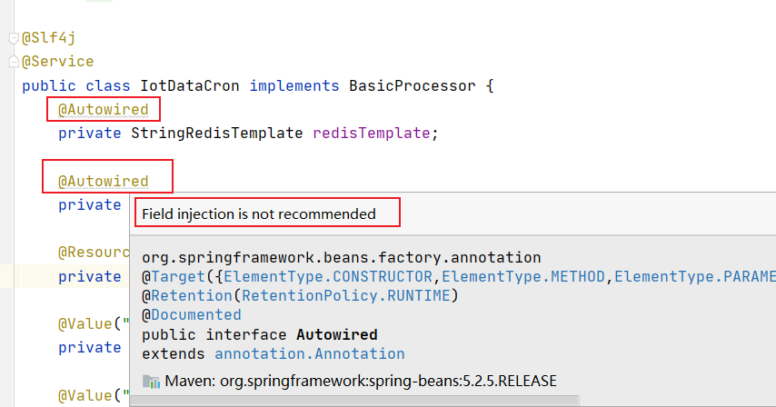

# Spring中为什么不建议使用字段注入

----

在使用Idea中通过注解注入字段时是否遇见过这样一个提示：

Field injection is not recommended（不推荐使用字段注入）



# 什么是字段注入，Spring中依赖注入的方式有哪些？
在Spring中依赖注入有三大类：字段注入、构造器注入、Setter方法注入。

字段注入是将Bean作为字段注入到类中，也是最方便，用的最多的注入方式。

# 官方为什么不推荐使用字段注入

## 首先来看字段注入

```java
@RestController
public class TestHandleController {

    @Autowired
    TestHandleService testHandleService;

    public void helloTestService(){
        testHandleService.hello();
    }
}
```
字段注入的非常的简便，通过以上代码我们就可以轻松的使用TestHandleService类，但是如果变成下面这样呢：

```java
TestHandleController testHandle = new TestHandleController();
testHandle.helloTestService();
```

这样执行结果为空指针异常，`这就是字段注入的第一个问题：对象的外部可见性，无法在容器外部实例化TestHandleService`（例如在测试类中无法注入该组件），类和容器的耦合度过高，无法脱离容器访问目标对象。

## 接下来看第二段代码

```java
public class TestA(){

    @Autowired
    private TestB testB;

}

public class TestB(){

    @Autowired
    private TestA testA;

}
```

这段代码在idea中不会报任何错误，但是当你启动项目时会发现报错，大致意思是：创建Bean失败，原因是当前Bean已经作为循环引用的一部分注入到了其他Bean中。

`这就是字段注入的第二个问题：可能导致循环依赖`

字段注入还有`第三个问题：无法设置注入的对象为final，也无法注入静态变量，原因是变量必须在类实例化进行初始化`。

整理一下，字段注入可能引起的三个问题：

1. 对象的外部可见性
2. 可能导致循环依赖
3. 无法设置注入的对象为final，也无法注入静态变量

# 接下来看构造器注入--官方推荐的注入方式

使用形式也很简单：

```java
private TestHandleService testHandleService;

@Autowired
public TestHandleController(TestHandleService testHandleService){
    this.testHandleService = testHandleService;
}
```

通过构造器的方式将Bean注入到字段中。

构造器注入能够保证注入的组件不可变，并且确保需要的依赖不为空。

这样就可以将变量设置为final，并且传递的肯定是一个对象，避免出现空指针异常。

若是出现字段注入中循环依赖的问题，在项目启动时Spring会非常形象的将错误抛出来：

```
Description:

The dependencies of some of the beans in the application context form a cycle:

testContrtoller (field private com.example.designstudy.service.TestService com.example.designstudy.controller.TestContrtoller.testService)
┌─────┐
| testService defined in file [D:\design-study\target\classes\com\example\designstudy\service\TestService.class]
↑ ↓
| testHandleServiceImpl defined in file [D:\design-study\target\classes\com\example\designstudy\service\impl\TestHandleServiceImpl.class]
└─────┘
```

显而易见的发现错误的地方。

由此可见，字段注入的三大问题都能解决，但是构造器注入就没有其他问题了吗？

答案是否定的，当依赖的对象很多时，需要严格按照构造器的顺序去填写依赖的对象，这将导致代码可读性和可维护性变得很差。

这时候可以引入Setter方法进行注入，Setter方法和构造器注入很像，不过Setter更具有可读性。

```java
private TestHandleService testHandleService;

@Autowired
public void setTestHandleService(TestHandleService testHandleService) {
    this.testHandleService = testHandleService;
}
```

并且使用Setter方法注入可以实现按需注入，不使用的对象不需要想构造器注入一样强制注入。

# 总结一下三种注入方式：

+	构造器注入适用于强制对象注入 
+	Setter注入适合可选对象注入
+	字段注入方式应该尽量避免，因为对象无法脱离容器独立运行

# 参考
[Spring中为什么不建议使用字段注入](https://www.cnblogs.com/lvdeyinBlog/p/15178226.html)