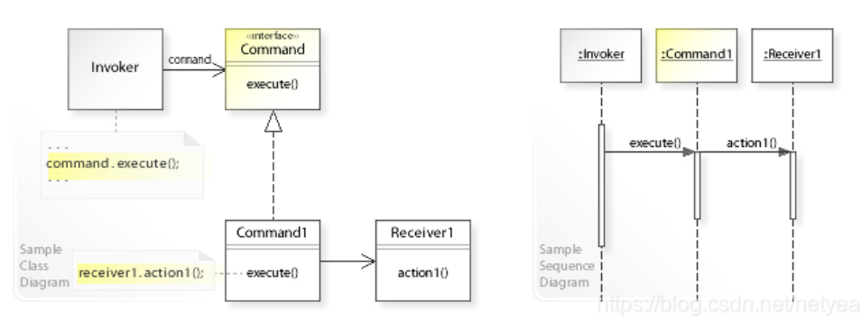
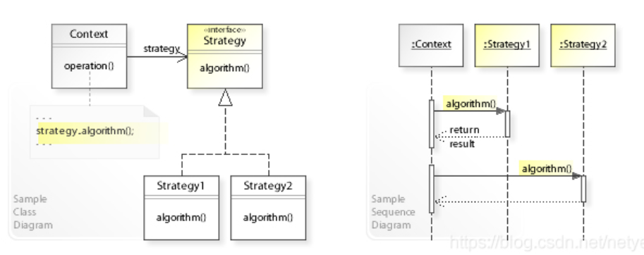
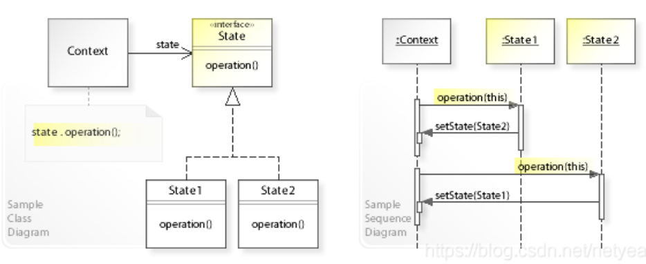

# 命令模式_策略模式_状态模式的区别

----

从UML类图上看，Command, Strategy, State三种模式非常像。如下为它们的UML类图：

命令模式：

策略模式：

状态模式：

下面主要讲一讲区别和运用的场景：

1.命令模式中的Invoker可以包含一个或多个Command实例，Invoker一般会提供方法给外部传入Command，command.execute()一般由Invoker外部触发。

2.策略模式中的Strategy实例一般随Context创建时传入或构建，Context创建完成后一般不可替换成其它Strategy实例，strategy.algorithm()一般是由Context外部触发。

3.状态模式中Context的State实例是会改变的，state.operation()既可只从Context内部触发，也可由Context外部触发。