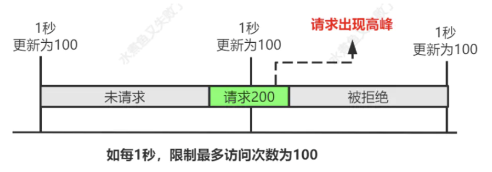
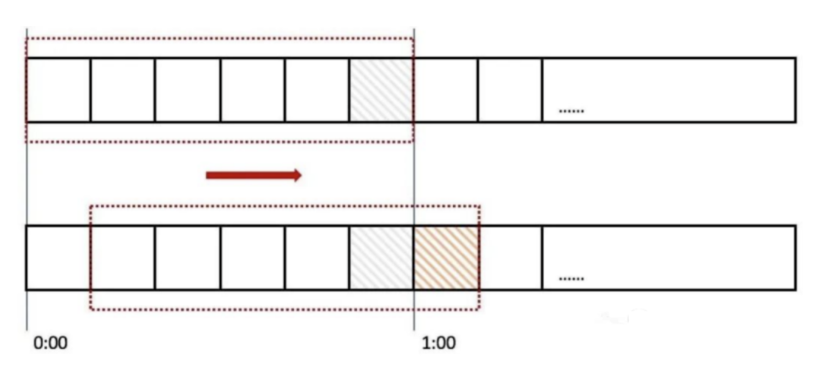
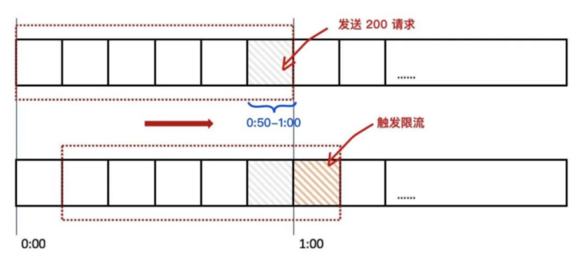
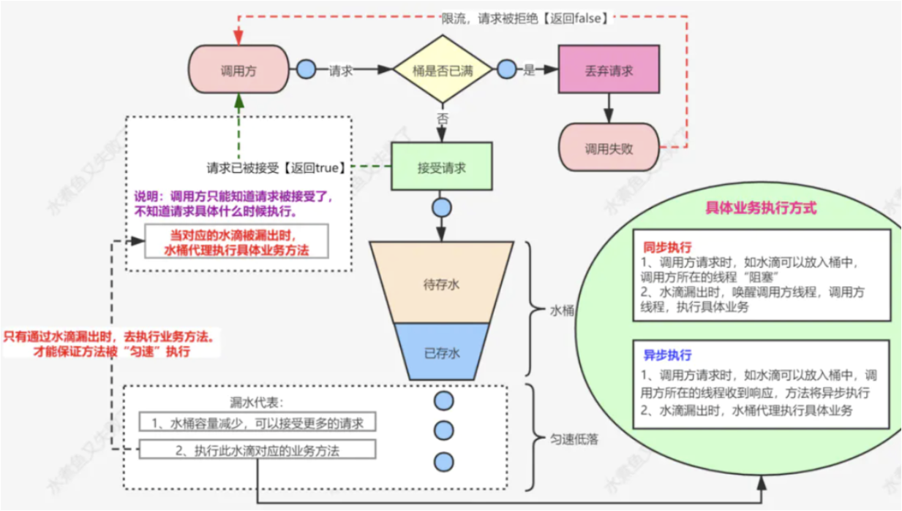
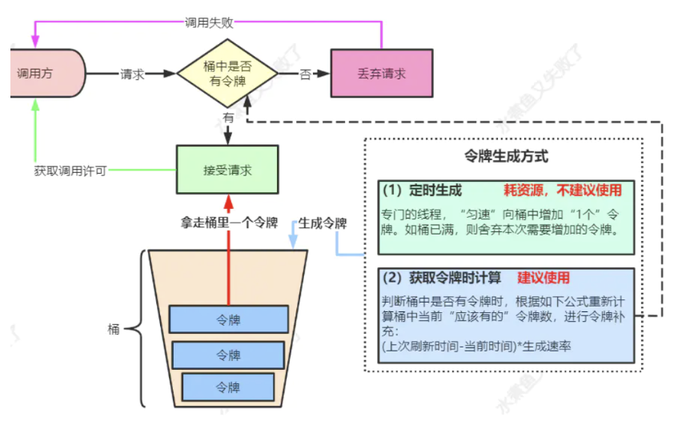

# 限流

----

在电商高并发场景下，我们经常会使用一些常用方法，去应对流量高峰，比如限流、熔断、降级，今天我们聊聊限流。

什么是限流呢？限流是限制到达系统的并发请求数量，保证系统能够正常响应部分用户请求，而对于超过限制的流量，则通过拒绝服务的方式保证整体系统的可用性。

根据限流作用范围，可以分为单机限流和分布式限流；根据限流方式，又分为计数器、滑动窗口、漏桶和令牌桶限流，下面我们对这块详细进行讲解。

# 常用限流方式

## 计数器

计数器是一种最简单限流算法，其原理就是：在一段时间间隔内，对请求进行计数，与阀值进行比较判断是否需要限流，一旦到了时间临界点，将计数器清零。

这个就像你去坐车一样，车厢规定了多少个位置，满了就不让上车了，不然就是超载了，被交警叔叔抓到了就要罚款的，如果我们的系统那就不是罚款的事情了，可能直接崩掉了。

程序执行逻辑：

+	可以在程序中设置一个变量 count，当过来一个请求我就将这个数 +1，同时记录请求时间。
+	当下一个请求来的时候判断 count 的计数值是否超过设定的频次，以及当前请求的时间和第一次请求时间是否在 1 分钟内。
+	如果在 1 分钟内并且超过设定的频次则证明请求过多，后面的请求就拒绝掉。
+	如果该请求与第一个请求的间隔时间大于计数周期，且 count 值还在限流范围内，就重置 count。
+	那么问题来了，如果有个需求对于某个接口 /query 每分钟最多允许访问 200 次，假设有个用户在第 59 秒的最后几毫秒瞬间发送 200 个请求，当 59 秒结束后 Counter 清零了，他在下一秒的时候又发送 200 个请求。

那么在 1 秒钟内这个用户发送了 2 倍的请求，这个是符合我们的设计逻辑的，这也是计数器方法的设计缺陷，系统可能会承受恶意用户的大量请求，甚至击穿系统。这种方法虽然简单，但也有个大问题就是`没有很好的处理单位时间的边界`。



不过说实话，这个计数引用了锁，在高并发场景，这个方式可能不太实用，我建议将锁去掉，然后将 l.count++ 的逻辑通过原子计数处理，这样就可以保证 l.count 自增时不会被多个线程同时执行，即通过原子计数的方式实现限流。

## 滑动窗口

?>	就是计算最近一分钟有多少请求

滑动窗口是针对计数器存在的临界点缺陷，所谓滑动窗口（Sliding window）是一种流量控制技术，这个词出现在 TCP 协议中。滑动窗口把固定时间片进行划分，并且随着时间的流逝，进行移动，固定数量的可以移动的格子，进行计数并判断阀值。



上图中我们用红色的虚线代表一个时间窗口（一分钟），每个时间窗口有 6 个格子，每个格子是 10 秒钟。每过 10 秒钟时间窗口向右移动一格，可以看红色箭头的方向。我们为每个格子都设置一个独立的计数器 Counter，假如一个请求在 0:45 访问了那么我们将第五个格子的计数器 +1（也是就是 0:40~0:50），在判断限流的时候需要把所有格子的计数加起来和设定的频次进行比较即可。

那么滑动窗口如何解决我们上面遇到的问题呢？来看下面的图：



## 漏桶

漏桶算法（Leaky Bucket），原理就是一个固定容量的漏桶，按照固定速率流出水滴。

用过水龙头都知道，打开龙头开关水就会流下滴到水桶里，而漏桶指的是水桶下面有个漏洞可以出水,如果水龙头开的特别大那么水流速就会过大，这样就可能导致水桶的水满了然后溢出。



一个固定容量的桶，有水流进来，也有水流出去。对于流进来的水来说，我们无法预计一共有多少水会流进来，也无法预计水流的速度。但是对于流出去的水来说，这个桶可以固定水流出的速率（处理速度），从而达到流量整形和流量控制的效果。

漏桶算法有以下特点：

+	漏桶具有固定容量，出水速率是固定常量（流出请求）
+	如果桶是空的，则不需流出水滴
+	可以以任意速率流入水滴到漏桶（流入请求）
+	如果流入水滴超出了桶的容量，则流入的水滴溢出（新请求被拒绝）

漏桶限制的是常量流出速率（即流出速率是一个固定常量值），所以最大的速率就是出水的速率，不能出现突发流量。

## 令牌桶

令牌桶算法（Token Bucket）是网络流量整形（Traffic Shaping）和速率限制（Rate Limiting）中最常使用的一种算法。典型情况下，令牌桶算法用来控制发送到网络上的数据的数目，并允许突发数据的发送。



我们有一个固定的桶，桶里存放着令牌（token）。一开始桶是空的，系统按固定的时间（rate）往桶里添加令牌，直到桶里的令牌数满，多余的请求会被丢弃。当请求来的时候，从桶里移除一个令牌，如果桶是空的则拒绝请求或者阻塞。

令牌桶有以下特点：

+	令牌按固定的速率被放入令牌桶中
+	桶中最多存放 B 个令牌，当桶满时，新添加的令牌被丢弃或拒绝
+	如果桶中的令牌不足 N 个，则不会删除令牌，且请求将被限流（丢弃或阻塞等待）

令牌桶限制的是平均流入速率（允许突发请求，只要有令牌就可以处理，支持一次拿3个令牌，4个令牌...），并允许一定程度突发流量，所以也是非常常用的限流算法。

## Redis + Lua 分布式限流

单机版限流仅能保护自身节点，但无法保护应用依赖的各种服务，并且在进行节点扩容、缩容时也无法准确控制整个服务的请求限制。

而分布式限流，以集群为维度，可以方便的控制这个集群的请求限制，从而保护下游依赖的各种服务资源。

分布式限流最关键的是要将限流服务做成原子化，我们可以借助 Redis 的计数器，Lua 执行的原子性，进行分布式限流，大致的 Lua 脚本代码如下：

```lua
local key = "rate.limit:" .. KEYS[1] --限流KEY
local limit = tonumber(ARGV[1])        --限流大小
local current = tonumber(redis.call('get', key) or "0")
if current + 1 > limit then --如果超出限流大小
  return 0
else  --请求数+1，并设置1秒过期
  redis.call("INCRBY", key,"1")
   redis.call("expire", key,"1")
   return current + 1
end
```

限流逻辑（Java 语言）：

```java
public static boolean accquire() throws IOException, URISyntaxException {
    Jedis jedis = new Jedis("127.0.0.1");
    File luaFile = new File(RedisLimitRateWithLUA.class.getResource("/").toURI().getPath() + "limit.lua");
    String luaScript = FileUtils.readFileToString(luaFile);

    String key = "ip:" + System.currentTimeMillis()/1000; // 当前秒
    String limit = "5"; // 最大限制
    List<String> keys = new ArrayList<String>();
    keys.add(key);
    List<String> args = new ArrayList<String>();
    args.add(limit);
    Long result = (Long)(jedis.eval(luaScript, keys, args)); // 执行lua脚本，传入参数
    return result == 1;
}
```

## 聊聊其它

上面的限流方式，主要是针对服务器进行限流，我们也可以对容器进行限流，比如 Tomcat、Nginx 等限流手段。

Tomcat 可以设置最大线程数（maxThreads），当并发超过最大线程数会排队等待执行；而 Nginx 提供了两种限流手段：一是控制速率，二是控制并发连接数。

对于 Java 语言，我们其实有相关的限流组件，比如大家常用的 RateLimiter，其实就是基于令牌桶算法，大家知道为什么唯独选用令牌桶么？

对于 Go 语言，也有该语言特定的限流方式，比如可以通过 channel 实现并发控制限流，也支持第三方库 httpserver 实现限流，详见这篇 《Go 限流的常见方法》。

在实际的限流场景中，我们也可以控制单个 IP、城市、渠道、设备 id、用户 id 等在一定时间内发送的请求数；如果是开放平台，需要为每个 appkey 设置独立的访问速率规则。

# 限流对比

下面我们就对常用的线程策略，总结它们的优缺点，便于以后选型。

+	计数器：
	*	优点：固定时间段计数，实现简单，适用不太精准的场景；
	*	缺点：对边界没有很好处理，导致限流不能精准控制。
+	滑动窗口：
	*	优点：将固定时间段分块，时间比“计数器”复杂，适用于稍微精准的场景；
	*	缺点：实现稍微复杂，还是不能彻底解决“计数器”存在的边界问题。
+	漏桶：
	*	优点：可以很好的控制消费频率；
	*	缺点：实现稍微复杂，单位时间内，不能多消费，感觉不太灵活。
+	令牌桶：
	*	优点：可以解决“漏桶”不能灵活消费的问题，又能避免过渡消费，强烈推荐；
	*	缺点：实现稍微复杂，其它缺点没有想到。
+	Redis + Lua 分布式限流：
	*	优点：支持分布式限流，有效保护下游依赖的服务资源；
	*	缺点：依赖 Redis，对边界没有很好处理，导致限流不能精准控制。

# 来源

[聊聊限流](https://mp.weixin.qq.com/s/xWtXsB0B9DQpRroaB3XO2w)

