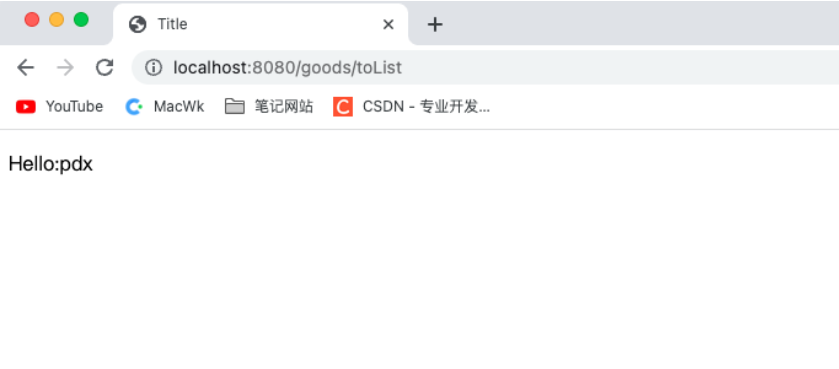

# 分布式Session

-----

# 解决方案列举

## Session复制

+	优点
	*	无需修改代码，只需要修改Tomcat配置
+	缺点
	*	Session同步传输占用内网宽带
	*	多台Tomcat同步性能指数级下降
	*	Session占用内存，无法有效水平扩展

## 前端存储

+	优点
	*	不占用服务器内存
+	缺点
	*	存在安全风险
	*	数据大小受cookie限制
	*	占用外网宽带

## Session粘滞

+	优点
	*	无需修改代码
	*	服务端可以水平扩展
+	缺点
	*	增加新机器，会重新Hash，导致重新登录
	*	应用重新启动后，需要重新登录

## 后端集中存储

+	优点：
	*	安全
	*	容易水平扩展
+	缺点
	*	增加复杂度
	*	需要修改代码
	
# Java代码实现解决分布式Session

## SpringSession - Redis解决分布式Session

添加依赖

```xml
<!--Redis-->
<dependency>
  <groupId>org.springframework.boot</groupId>
  <artifactId>spring-boot-starter-data-redis</artifactId>
</dependency>
<!--commons-pools2 对象池依赖-->
<dependency>
  <groupId>org.apache.commons</groupId>
  <artifactId>commons-pool2</artifactId>
</dependency>
<!--spring session-->
<dependency>
  <groupId>org.springframework.session</groupId>
  <artifactId>spring-session-data-redis</artifactId>
</dependency>
```

添加Redis配置

```yaml
## Redis配置
spring:
  redis:
    # 服务器地址
    host: localhost
    # 端口
    port: 6379
    # 数据库
    database: 0
    # 超时时间
    connect-timeout: 10000ms
    lettuce:
      pool:
        # 最大连接数
        max-active: 8
        # 最大连接阻塞等待时间 默认 -1
        max-wait: 10000ms
        # 最大空闲时间 默认8
        max-idle: 200
        # 最小空闲连接 默认8
        min-idle: 5
```

业务逻辑实现

```java
/**
 * 登录功能
 * @param loginVo
 * @return
 */
@Override
public RespBean doLogin(LoginVo loginVo, HttpServletRequest request, HttpServletResponse response) {

    String username = loginVo.getUserName();
    String password = loginVo.getPassword();

    User user = userMapper.selectByUserName(username);
    if (user == null){
        throw new GlobalException(RespBeanEnum.LOGIN_ERROR);
    }
    //判断密码是否正确
    if (!MDUtils.formPassToDBPass(password,user.getSalt()).equals(user.getPassword())){
        throw new GlobalException(RespBeanEnum.LOGIN_ERROR);
    }
    //使用UUID生成字符串代替Cookie
    String ticket = UUIDUtil.uuid();
    request.getSession().setAttribute(ticket,user);
    CookieUtil.setCookie(request,response,"userTicket",ticket);
    return RespBean.success();
}
```

视图控制层

```java
/**
 * 跳转商品列表
 * @param session
 * @param model
 * @return
 */
@RequestMapping("/toList")
public String toList(HttpSession session, Model model,@CookieValue("userTicket")String ticket){
    if (StringUtils.isEmpty(ticket)){
        return "login";
    }
    User user = (User) session.getAttribute(ticket);
    if (user == null){
        return "login";
    }
    model.addAttribute("user",user);
    return "goodsList";
}
```

登录测试


打开Redis管理软件发现Session信息已经添加到Redis中了


## Redis解决分布式Session

导入依赖

```xml
<!--Redis-->
<dependency>
  <groupId>org.springframework.boot</groupId>
  <artifactId>spring-boot-starter-data-redis</artifactId>
</dependency>
<!--commons-pools2 对象池依赖-->
<dependency>
  <groupId>org.apache.commons</groupId>
  <artifactId>commons-pool2</artifactId>
</dependency>
```

>	Redis配置参考 【SpringSession - Redis解决分布式Session】

业务逻辑层

```java
@Override
public RespBean doLogin(LoginVo loginVo, HttpServletRequest request, HttpServletResponse response) {

    String username = loginVo.getUserName();
    String password = loginVo.getPassword();

    User user = userMapper.selectByUserName(username);
    if (user == null){
        throw new GlobalException(RespBeanEnum.LOGIN_ERROR);
    }
    //判断密码是否正确
    if (!MDUtils.formPassToDBPass(password,user.getSalt()).equals(user.getPassword())){
        throw new GlobalException(RespBeanEnum.LOGIN_ERROR);
    }
    //成功Cookie
    String ticket = UUIDUtil.uuid();
    //将用户信息存入到redis中
    redisTemplate.opsForValue().set("userTicket",ticket);
    redisTemplate.opsForValue().set("user:"+ticket,user);
    //request.getSession().setAttribute(ticket,user);
    CookieUtil.setCookie(request,response,"userTicket",ticket);
    return RespBean.success();
}

/**
 * 根据cookie获取cookie
 * @param ticket
 * @return
 */
@Override
public User getUserByByCookie(String ticket,HttpServletRequest request,HttpServletResponse response) {
    if (StringUtils.isEmpty(ticket)){
        return null;
    }
    User user = (User) redisTemplate.opsForValue().get("user:" + ticket);
    if (user == null){
        CookieUtil.setCookie(request,response,"userTicket",ticket);
    }
    return user;
}
```

视图控制层

```java
/**
 * 跳转商品列表
 * @param session
 * @param model
 * @return
 */
@RequestMapping("/toList")
public String toList(HttpSession session, Model model,HttpServletRequest request,HttpServletResponse response){
    String ticket = (String) redisTemplate.opsForValue().get("userTicket");
    if (StringUtils.isEmpty(ticket)){
        return "login";
    }
    //User user = (User) session.getAttribute(ticket);
    User user = userService.getUserByByCookie(ticket, request, response);
    if (user == null){
        return "login";
    }
    model.addAttribute("user",user);
    return "goodsList";
}
```

测试成功



查看Redis管理工具

