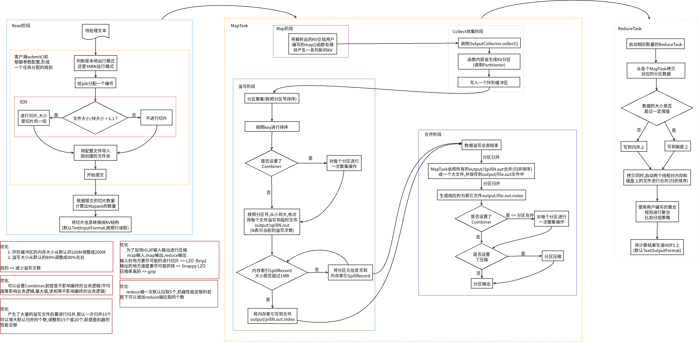

# MapReduce的shuffle过程详解

----

# shuffle是什么

shuffle的本意是洗牌、混洗的意思，在MapReduce中，shuffle指的是将map端的无规则输出按指定的规则“打乱”成具有一定规则的数据，以便reduce端接收处理

即shuffle在MapReduce中所处的工作阶段是map输出后到reduce接收前，具体可以分为map端和reduce端前后两个部分。

那么map阶段需要做什么？
+	首先要处理的数据进行分片（split）操作，为每一个分片分配一个MapTask任务。
+	接下来map()函数会对每一个分片中的每一行数据进行处理得到键值对（key,value），其中key为偏移量，value为一行的内容

reduce阶段有需要做什么？

# 文件划分大小

文件划分大小分两种情况
+	物理划分
	*	由配置文件决定，就是HDFS存储的基本单位是块（block），一个文件固定割成几块固定大小存储到HDFS中。
+	逻辑划分
	*	由客户端决定，就是上传的时候，我要将自己的文件分成几块上传（一块一个maptask处理），这里分成多少块和最终存储到磁盘上由多少块没有任何关系
	*	当然，如果不设置，对于FileInputFormat来说，默认和物理划分大小相等，但即使这样，物理划分和逻辑划分依旧没有任何关系
		-	这里说的没有任何关系是指这两个概念没有关系，但针对FileInputFormat来说，split分片时会用到配置文件配置的block的大小的值，从这个角度来讲不能说完全没有关系

## block块（物理划分）

block是HDFS中的基本存储单位，hadoop1.x默认大小为64M而hadoop2.x默认块大小为128M。

文件上传到HDFS，就要划分数据成块，这里的划分属于物理的划分（实现机制也就是设置一个read方法，每次限制最多读128M的数据后调用write进行写入到hdfs），块的大小可通过 dfs.block.size配置。block采用冗余机制保证数据的安全：默认为3份，可通过dfs.replication配置。

注意：`当更改块大小的配置后（老人老办法，新人新办法），新上传的文件的块大小为新配置的值，以前上传的文件的块大小为以前的配置值`。

## split分片（逻辑划分）

一个MapReducejob的map阶段并行度由客户端在提交job时决定，即客户端提交job之前会对待处理数据进行逻辑切片split。

Hadoop中split划分属于逻辑上的划分，决定了maptask的并行度，有几个split分片就会启动几个maptask。

逻辑切片机制由FileInputFormat实现类的getSplits()方法完成。

## FileInputFormat中默认的切片机制

+	简单地按照文件的内容长度进行切片
+	切片大小，默认等于block大小
+	切片时不考虑数据集整体，而是逐个针对每一个文件单独切片

那么，split的大小具体怎么得到呢？

首先介绍几个参数：

+	maxSize：split的最大值，默认是Long.MAX_VALUE。可以通过mapreduce.input.fileinputformat.split.maxsize进行设置。
+	minSize：split的最小值，该值可由两个途径设置：
	*	通过子类重写方法protected void setMinSplitSize(long minSplitSize)进行设置。一般情况为1，特殊情况除外
	*	通过配置文件中的mapreduce.input.fileinputformat.split.minsize进行设置
	*	最终取两者中的最大值！

+	split计算公式：`finalSplitSize=max(minSize,min(maxSize,blockSize))`
	*	由公式可知，默认的split大小就是blockSize=128M。
	*	maxsize（切片最大值）：参数如果调得比blocksize小，则会让切片变小，而且就等于配置的这个参数的。
	*	minsize （切片最小值）：参数调的比blockSize大，则可以让切片变得比blocksize还大。
	
但是，不论怎么调参数，都不能让多个小文件“划入”一个split。

还有个细节就是：

当bytesRemaining/splitSize > 1.1不满足的话，那么最后所有剩余的会作为一个切片。从而不会形成例如129M文件规划成两个切片的局面

### split示例：

比如待处理数据有两个文件：

file1.txt 320M

file2.txt 10M  

经过FileInputFormat的切片机制运算后，形成的切片信息如下：

file1.txt.split1—0M~128M

file1.txt.split2—128M~256M

file1.txt.split3—256M~320M

file2.txt.split1—0M~10M

# shuffle流程概括

+	如何进入map阶段
	*	进入map之前，如果是TextInputFormat，会按行读取，形成一个所有的(k,v)结构
+	经过map阶段
	*	数据经过map后，通过我们自己写的map函数，会形成一些新的(k,v)结构的数据
+	接下去要进入shuffle流程
	*	因为频繁的磁盘I/O操作会严重的降低效率，因此“中间结果”不会立马写入磁盘，而是优先存储到map节点的“环形内存缓冲区(Kvbuffer)”
	*	当写入的数据量达到预先设置的阙值后（mapreduce.map.io.sort.spill.percent,默认0.80，或者80%）便会启动溢写出线程将缓冲区中的那部分数据溢出写（spill）到磁盘的临时文件中
		-	这个溢写是由单独线程来完成(干活的叫SortAndSpill)，不影响往缓冲区写map结果的线程。
		-	溢写线程启动时不应该阻止map的结果输出，所以整个缓冲区有个溢写的比例spill.percent。这个比例默认是0.8，也就是当缓冲区的数据已经达到阈值（buffer size * spill percent = 100MB * 0.8 = 80MB），溢写线程启动，锁定这80MB的内存，执行溢写过程。Map task的输出结果还可以往剩下的20MB内存中写，互不影响。 
	*	溢写前，会为(k,v)数据添加一个分区(partition)
		-	也就是对于每个键值对来说，都增加了一个partition属性值，然后连同键值对一起序列化成字节数组写入到缓冲区（缓冲区采用的就是字节数组，默认大小为100M）。
	*	在写入前对要写入的数据根据key进行排序（sort）
		-	当溢写线程启动后，需要对这80MB空间内的key做排序(Sort)。排序是MapReduce模型默认的行为，这里的排序也是对序列化的字节做的排序。
		-	先把Kvbuffer中的数据按照partition值和key两个关键字升序排序，移动的只是索引数据，排序结果是Kvmeta中数据按照partition为单位聚集在一起，同一partition内的按照key有序。
	*	判断是否设置了合并（combine，可选操作）
		-	是：
	*	溢出写过程按轮询方式将缓冲区中的内容写到mapreduce.cluster.local.dir属性指定的目录中。
	*	当整个map任务完成溢出写后，会对磁盘中这个map任务产生的所有临时文件（spill文件）进行归并（merge）操作生成最终的正式输出文件，此时的归并是将所有spill文件中的相同partition合并到一起，并对各个partition中的数据再进行一次排序（sort），生成key和对应的value-list，文件归并时，如果溢写文件数量超过参数min.num.spills.for.combine的值（默认为3）时，可以再次进行合并。至此，map端shuffle过程结束，接下来等待reduce task来拉取数据。对于reduce端的shuffle过程来说，reduce task在执行之前的工作就是不断地拉取当前job里每个map task的最终结果，然后对从不同地方拉取过来的数据不断地做merge最后合并成一个分区相同的大文件，然后对这个文件中的键值对按照key进行sort排序，排好序之后紧接着进行分组，分组完成后才将整个文件交给reduce task处理。

纠正：分区好像是发生在溢出写过程之前，也就是当满足溢出写条件时，首先进行分区，然后分区内排序，并且选择性的combine，最后写出到磁盘。

