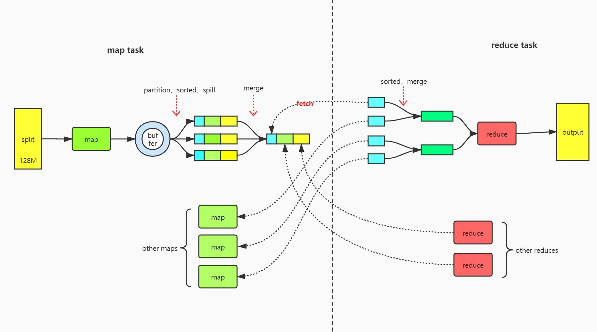

# Hadoop面试题

##  HDFS读写流程
### HDFS写流程

+   客户端问服务器我能不能上传xxx文件
+   服务器看一下这个客户端有没有上传权限,并且看一下已有文件会不会和xxx文件名冲突
+   如果如果权限验证没有问题
    *   客户端将文件切割成128m一个block,然后首先告诉NameNode要上传第一块block
    *   客户端第一个block
        -   NameNode返回三个可用的DataNode节点,D1,D2,D3给客户端(默认一个block存三份,所以返回三个DataNode)
        -   客户端收到DataNode地址后,跟其中一个节点建立pipeline,假设和D1进行通信
        -   建立成功后,D1会和D2建立pipeline,D2会和D3建立pipeline,然后逐级返回给client,这样通道就建好了
        -   从本地磁盘拿出来放到本地内存
        -   虽然我们最终上传的是128m的block,但这个过程中是以packet(64k)的形式上传
        -   D1收到pocket后会向D2发送,同时会在应答队列中增加一条等待应答的消息
        -   同理,D2会向D3发送pocket,等待应答
        -   D3收到packet后,将D3确认收到packet的应答返回给D2,D2确认应答后将D2,D3收到packet的应答返回给D1,D1则返回给客户端
        -   客户端收到应答,则一个packet上传成功
        -   其他packet同理
        -   所有packet上传成功后,则第一个block上传成功
    *   客户端上传第二个block
        -   重复第一个的流程

### HDFS读流程

+   客户端请求下载文件
+   NameNode确认客户端是否有下载权限,若有
    *   返回部分或全部block地址(一个文件block太多的话是分批返回的)
    *   返回这些block在哪个DataNode节点,其中每一个block的DataNode是有排序的,靠近客户端的排在前,心跳超时的排在后
+   客户端拿到block和每一个block所在的DataNode排序地址后,开始下载
+   下载第一个block
    *   如果客户端本身就是DataNode,直接从本地获取数据
    *   否则,和排序靠前的DataNode建立pipeline,下载数据
    *   下载完之后,进行checksum验证,如果下错下漏了,会通知NameNode,然后从下一个DataNode进行下载
+   下载第二个block
    *   重复下载第一个block的步骤
    *   下载block是并行的
+   合并block成为文件

## HDFS在读取文件的时候，如果其中一个块突然损坏了怎么办

块下载完后,会进行checksum,如果验证失败,那么会通知NameNode,然后从第二个DataNode进行下载

## HDFS在上传文件的时候，如果其中一个DataNode突然挂掉了怎么办

[在向 HDFS 中写数据的时候，当写某一副本时出错怎么处理？](https://my.oschina.net/134596/blog/1647115)
[hdfs的写流程以及namenode,datanode挂掉后处理](https://blog.csdn.net/bitbitbyte/article/details/107329688)

+   其中一个DataNode挂掉了,则客户端会收不到packet的ack消息
+   此时,关闭通道,根据ack队列,将已经发送但没有收到应答的packet重新加入packet发送队列
+   同时,客户端会向NameNode报告这件事
+   NameNode会检查有关的DataNode
    *   将不正常的下线
    *   给正常的DataNode赋予一个新的版本号,这样不正常的节点节点恢复后,由于版本号不对,会当前数据块对应的数据
    *   在正常的DataNode中,选择一个为主DataNode,其他的正常的DataNode与它通信
    *   获取所有DataNode当前数据块的数据,选择最小的一块,将每个正常的DataNode同步到该大小
+   重新建立管道
+   客户端发送剩下的数据
+   当文件关闭后,NameNode发现副本数量不对,会在其它节点上补足副本

## NameNode在启动的时候会做哪些操作

NameNode简单来说就是处理fsimage镜像文件和edit编辑文件

+   第一次启动
    *   进行格式化,创建fsimage文件
    *   启动NameNode
        -   读取fsimage文件,将内容加载进内存
        -   等待DataNode注册,发送block report
    *   启动DataNode
        -   向NameNode注册
        -   发送block report
        -   检查fsimage中记录的block数量和发送的block report的数量是否相同
    *   对文件系统进行操作
        -   文件系统的元数据信息会先写入fsimage,然后会将这些元数据信息修改定期写入edit文件
+   第二次启动
    *   读取fsimage和edit文件
    *   将fsimage和edit合并成新的fsimage文件
    *   创建新的edit文件
    *   启动DataNode

## Secondary NameNode了解吗，它的工作机制是怎样的

+   2NN询问NN是否需要checkpoint
    *   checkpoint触发条件
        -   edit中的数据满了
        -   定时时间到了
+   NN中,创建一个新的edit空文件
+   2NN从NN中拷贝两个文件
    *   旧的edit文件
    *   fsimage文件
+   在2NN中,将这两个文件读到内存中,然后进行合并,合并完成之后得到一个新的fsimage文件,名叫fsimage.checkpoint
+   将这个新的fsimage.checkpoint文件拷贝回NN,然后重命名为fsimage

由上述过程可以看出,如果NN的元数据丢失,是可以从2NN中恢复一部分数据的,但是还未合并的edit文件数据就会完全丢失

## Secondary NameNode不能恢复NameNode的全部数据，那如何保证NameNode数据存储安全

+   HA机制
    *   有两个NameNode,假定为NN1和NN2,其中NN1为主节点,NN2为备份节点
+   如何同步两个NN节点
    *   有一个共享存储
    *   NN1的元数据改变时,会将改变写入本地edit,同时也写一份到共享存储的edit,只有写入共享存储才能认定写入edit成功
    *   NN2定期从共享存储获取edit文件,以便进行主备切换
+   主NN挂了,如何切换
    *   首先zookeeper中存放这两台NN的状态
    *   其次zookeeper中有zkfc(zookeeperFailoverController)监控两台NN的状态
    *   如果standby节点的zkfc发现主节点挂了,那么就会发送隔离(fencing)命令给原本的Active NameNode,之后将standby节点设为active
        -   在进行fencing时,会执行以下的操作
        -   首先尝试调用这个旧的Active NameNode的HAServiceProtocol RPC接口的transitionToStandby方法,尝试将NN转为Standby状态
        -   如果失败,会执行Hadoop中预定义的隔离措施
            +   sshfence:通过ssh登录到目标机器上,执行命令 fuser 将对应的进程杀死
            +   shellfence：执行一个用户自定义的 shell 脚本来将对应的进程隔离
    
## 在NameNode HA中，会出现脑裂问题吗？怎么解决脑裂

分情况讨论

+   主NN挂了
    *   主NN挂了,不会出现脑裂
+   监控主NN的zkfc进程挂了
    *   在zookeeper中,根据存的面包屑进行fencing
+   主NN的网断了
    *   不会脑裂,但更严重,集群会挂
    *   因为为了防止脑裂,Standby节点变为Active之前,要先杀死旧的Active NameNode
    *   但是由于网断了,则永远无法杀死旧的Active,那么Standby就无法变为Active,所以集群会挂
    
## 小文件过多会有什么危害，如何避免

+   小文件过多,则对应的元数据也会很多,要很多内存(每个大概150byte),也会造成寻址太慢
+   如何解决小文件过多
    *   根本方法,就是不要产生小文件
    *   将多个小文件压缩成一个文件
        -   在hadoop中可以将多个小文件压缩成一个har文件
        -   这个压缩在逻辑上我们仍然能透明的使用这些小文件,但对于存储来讲,这些小文件只有一个元数据
        
## MapReduce

### MapReduce过程

一个MapTask
+   进入map之前，如果是TextInputFormat，会按行读取，形成一个所有的(k,v)结构
+   数据经过map后，通过我们自己写的map函数，会形成一些新的(k,v)结构的数据
+   map结束时
    *   调用context.write进行collect收集的时候,会为(k,v)添加partition,默认使用HashPartitioner
    *   将key和alue序列化成字节数组
+   数据进入环形缓冲区(100M,80%触发溢写)
    *   溢写前,会对80M的数据进行排序
+   溢写
    *   会有多次溢写,会有多个溢写文件,每个文件的内容都有分区1,分区2,...,分区n
        -   可选步骤:每次溢写前,为了减少IO,可以进行combiner(合成器)
    *   多个文件合并成一个文件,合并时会进行归并排序
        -   多个文件合并成的大文件写磁盘前也有可选步骤combiner(合成器)
    *   注意区分
        -   多个文件合并,是将多个文件的内容按照排序弄到一个文件中
        -   而合成器,更多的是经过计算,比如每个文件都是保存平均值,那么我没有必要等到reduce时,才计算多个文件的平均值,而是可以在combiner的时候就算一次,减少传输的数据量

一个ReduceTask
+   每个MapTask结束后都有一个文件,每个文件都有不同分区的内容
+   要将不同文件的不同分区内容合并成"一个"文件
+   一个ReduceTask处理一个分区就好,假设这里需要分区1的内容
    *   从第一个MapTask的文件获取分区1的内容,写到ReduceTask的内存缓冲中,不够写就溢写到磁盘
    *   从第二个MapTask的文件获取分区1的内容,写到ReduceTask的内存缓冲中,不够写就溢写到磁盘
    *   ....
    *   从第N个MapTask的文件获取分区1的内容,写到ReduceTask的内存缓冲中,不够写就溢写到磁盘
    *   分区1的数据进行归并排序后,将分区1的数据写入一个文件
    
### Shuffle阶段的数据压缩机制了解吗

前提
+   IO密集的多用压缩
+   计算密集的少用压缩

在shuffle过程中,有大量的网络IO,如果数据能够进行压缩,那么数据量就会少得多

hadoop当中支持的压缩算法：

gzip、bzip2、LZO、LZ4、Snappy，这几种压缩算法综合压缩和解压缩的速率，谷歌的Snappy是最优的，`一般都选择Snappy压缩`。谷歌出品，必属精品。

### 在写MR时，什么情况下可以使用规约

规约（combiner）是不能够影响任务的运行结果的局部汇总，适用于求和类，不适用于求平均值，如果reduce的输入参数类型和输出参数的类型是一样的，则规约的类可以使用reduce类，只需要在驱动类中指明规约的类即可。

## YARN

### YARN集群的架构和工作原理知道多少

+   ResourceManager
    *   负责整个系统资源的管理和调度
    *   由调度器(scheduler)和应用程序管理器(Application Manager)组成
+   NodeManager
    *   管理本节点的资源
    *   定期向RM报告自己节点的资源情况
    *   处理ApplicationMaster的Container的启动停止请求
+   ApplicationMaster
    *   用户提交一个任务对应一个ApplicationMaster
    *   与RM调度器协商以获取资源
    *   与NM协商以启动停止任务
+   Container
    *   Yarn中的资源抽象
    
### YARN的任务提交流程是怎样的

+   用户向Yarn提交一个任务
+   

