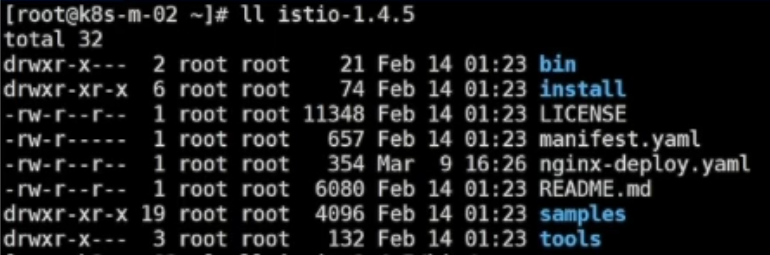

# Istio

----

# Istio安装和卸载



+	install目录->可以支持的底层的东西
+	tools -> 一些工具,最重要的是自动补全的一些工具
+	samples -> 示例

```
istio profile list
```

```
istioctl manifest apply --set profile=demo
```

istio的安装本质上是将一些东西部署到k8s上

+	Tracing:全链路监控
+	Pilot:服务发现和服务配置
+	Kiali:相当于Istio的一个dashboard
+	Prometheus:监控
+	Telemetry:遥测
+	Galley:整个Istio的配置中心
+	IngressGateway:入口网关
+	Citadel:流量加密和身份认证,理解成校验S证书的东西
+	EgressGateway:出口网关
+	Injector:注入
+	Policy:策略
+	Grafana
