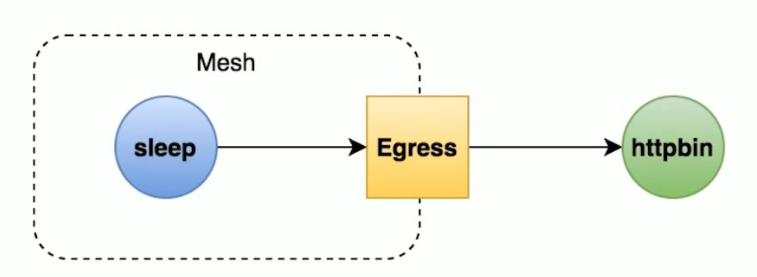
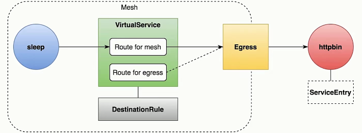
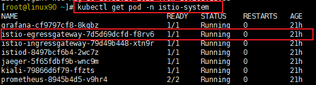
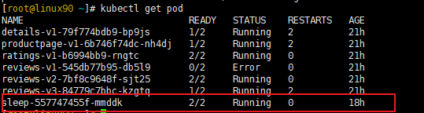
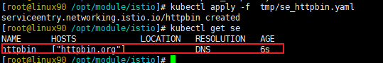
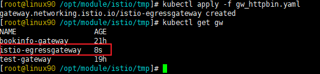
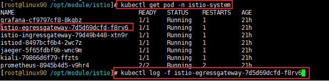

# Istio_Egress实现访问外部服务

----

## 访问外部服务的方法

+	配置`global.outboundTrafficPolicy.mode = ALLOW_ANY`
	*	不推荐,不太安全
	*	建议线上环境改成 `REGISTRY_ONLY`,只有注册的才能访问外部服务
+	使用服务入口(ServiceEntry)
	*	通过ServiceEntry将你的外部服务与它做一个映射,模拟成网格内部的服务
+	配置sidecar让流量绕过代理
	*	直接通过配置,让你跳过sidecar的管控,直接去访问外部服务
	*	不推荐,等于没用istio
+	配置Egress网关

## Egress概念

+	Egress网关:
	*	定义了网格的出口点，允许你将监控、路由等功能应用于离开网格的流量。
+	应用场景
	*	所有出口流量必须流经一组专用节点(安全因素)
	*	为无法访问公网的内部服务做代理


## 任务:创建Egress网关




+	任务说明
	*	创建一个egress网关，让内部服务通过它访问外部服务
+	任务目标
	*	学会使用egress网关
	*	理解egress的存在意义


## 示例

配置分析



具体步骤如下

+	查看egressgateway组件是否存在





如果没有sleep服务,要去sample中安装

```
kubectl apply -f samples/sleep/sleep.yaml
```

+	为外部服务定义ServiceEntry

```yaml
# 文件名se_httpbin.yaml
apiVersion: networking.istio.io/v1alpha3
kind: ServiceEntry 
metadata:
  name: httpbin
spec:
  hosts:
  - httpbin.org
  ports:
  - number: 80 
    name: http-port
    protocol: HTTP
  resolution: DNS
```



+	定义egress gateway

```yaml
# 文件名gw_httpbin.yaml
apiVersion: networking.istio.io/v1alpha3
kind: Gateway
metadata:
  name: istio-egressgateway
spec:
  selector:
    istio: egressgateway 	# 选择istio默认的出口网关
  servers:
  - port:
      number: 80
      name: http
      protocol: HTTP 
    hosts:
    - httpbin.org
```



+	定义路由，将流量引导到egressgateway

```yaml
apiVersion: networking.istio.io/v1alpha3
kind: Destination
metadata:
  name: dr-for-egressgateway
spec:
  host: istio-egressgateway.istio-system.svc.cluster.local  # 配置的是egress网关的DNS名称
  subsets:
  - name: httpbin
```

```yaml
apiVersion: networking.istio.io/v1alpha3
kind: VirtualService
metadata:
  name: vs-for-egressgateway
spec:
  hosts:
  - httpbin.org
  gateways:					# 配置两个字段
  - istio-egressgateway		# 针对egress网关的
  - mesh 					# 针对内部网格的
  http:
  - match:
  	# 针对内部网格的路由格则
  	# 会把请求路由到egress网关这个对应的DNS名称上
    # 也就是说,通过mesh,会将所有内部的请求全部指向网关这个节点
  	- gateway:
  	  - mesh
  	  port: 80
  	route:
  	- destination:
  	    host: istio-egressgateway.istio-system.svc.cluster.local
  	    subset: httpbin
  	    port:
  	  	  number: 80
      weight: 100
  - match:
    # 针对网关的路由规则
    # 它会把网关的请求指向最终我们外部的服务地址
  	- gateway:
  	  - istio-egressgateway
  	  port: 80
  	route:
  	- destination:
  		host: httpbin.org
  		port:
  		  number: 80
      weight: 100
```

+	查看日志验证



