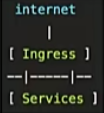

# Istio_Ingress_控制进入网络的请求

---

+	服务的访问入口，接收外部请求并转发到后端服务
+	Istio 的Ingress gateway和Kubernetes Ingress的区别
	*	Kubernetes: 针对L7协议(资源受限) ，可定义路由规则
	*	Istio:针对L4-6协议，只定义接入点,复用Virtual Service的L7路由定义
		-	解耦了和路由规则的绑定:在这里只定义接入点,而把所有的路由规则全部交给Virtual Service
		-	复用:虚拟服务本身就可以重复利用

## 任务:创建Ingress网关

+	任务说明
	*	为httpbin服务配置Ingress网关
+	任务目标
	*	理解Istio实现自己的Ingress的意义
	*	复习Gateway 的配置方法
	*	复习Virtual Service的配置方法

