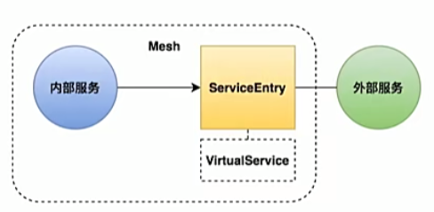

# Istio_服务入口

----

## 基本说明

+	添加外部服务到网格内
	*	网关:将内部服务暴露给外部使用
	*	服务入口:将外部服务添加到网格内
+	管理到外部服务的请求
+	扩展网络



## 任务:注册外部服务

+	任务说明
	*	将httpbin注册为网格内部的服务,并配置流控策略
+	任务目标
	*	学会通过ServiceEntry扩展网格
	*	掌握ServiceEntry的配置方法


## 演示

1. 添加sleep服务

```
$ kubectl apply -f samples/sleep/sleep.yaml
```


2. 默认情况下可以访问外部服务

```
kubectl exec -it sleep-557747455f-mmddk -c sleep curl http://httpbin.org/headers
```


发现可以访问外部服务

默认情况下,网格内部服务是能够访问网格外部服务的

3. 关闭出流量可访问权限

需要设置outboundTrafficPolicy = REGISTRY_ONLY,默认是ALLOW_ANY

```
# 这里要点时间
$ kubectl get configmap istio -n istio-system -o yaml | sed 's/mode: ALLOW_ANY/mode:REGISTRY_ONLY/g' | kubectl replace -n istio-system -f -
```

4. 为外部服务(httpbin) 配置ServiceEntry

```yaml
apiVersion: networking.istio.io/v1alpha3
kind: ServiceEntry
metadata:
  name: httpbin-ext
spec:
  hosts:
  - httpbin.org		# 外部服务的域名
  ports:
  - number: 80 		# 访问这个服务的端口
    name: http
    protocol: HTTP 	# 访问这个服务的协议
  resolution: DNS 	# 服务发现的机制
  location: MESH_EXTERNAL 	# 有两种,一种是网格外的,一种是网格内的
```

执行之后可以查看是否被定义

```bash
kubectl get se
```

测试

## 配置选项


## 参考

[访问外部服务](https://istio.io/latest/zh/docs/tasks/traffic-management/egress/egress-control/)


