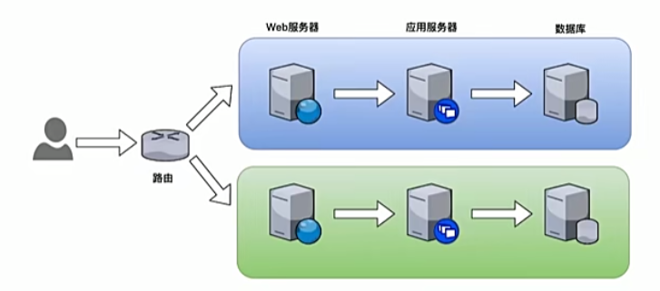
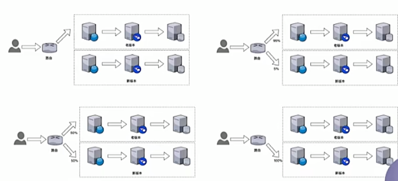

# 流量转移_灰度发布是如何实现的

---

## 基于权重的路由

+	任务说明
	*	将请求按比例路由到对应的服务版本
+	任务目标
	*	学会设置路由的权重
	*	理解灰度发布、蓝绿部署、A/B测试的概念
	*	理解与Kubernetes基于部署的版本迁移的区别
	
## 蓝绿部署



## 灰度发布(金丝雀发布)

>	为什么叫金丝雀发布呢，是因为金丝雀对矿场中的毒气比较敏感，所以在矿场开工前工人们会放一只金丝雀进去，以验证矿场是否存在毒气，这便是金丝雀发布名称的由来。

小范围测试小范围发布的模式




## A/B测试


本质上和灰度是一样的,但侧重点不一样

+	灰度发布:最终将所有流量导向新版本
+	A/B测试:比较两个版本在某个功能上的谁有谁劣

## 示例

```
kubectl apply -f samples/bookinfo/networking/virtual-service-reviews-50-v3.yaml
```

文件内容

```yaml
apiVersion: networking.istio.io/v1alpha3
kind: VirtualService
metadata:
  name: reviews
spec:
  hosts:
    - reviews
  http:
  - route:
    - destination:
        host: reviews
        subset: v1
      weight: 50 	# 添加了weight这个权重的标识,灰度发布只要不断的调整这两个权重
    - destination:
        host: reviews
        subset: v3
      weight: 50
```
