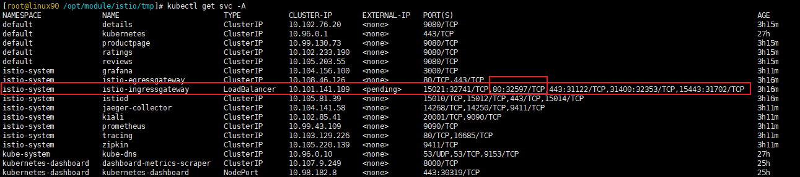

# Istio_网关

----

## 创建

### 创建GateWay

```yaml
apiVersion: networking.istio.io/v1alpha3
kind: Gateway
metadata:
  name: test-gateway
spec:
  selector:
    istio: ingressgateway # use Istio default gateway implementation
  servers:
  - port:
      number: 80
      name: http
      protocol: HTTP
    hosts:
    - "*"
```

### 创建VirtualService
对入口流量也做一些路由配置,可以配置 VirtualService

比如如下示例

```yaml
apiVersion: networking.istio.io/v1alpha3
kind: VirtualService
metadata:
  name: test-gateway
spec:
  hosts:
  - "*"
  gateways:
  - test-gateway	# 设置好前面配置好的网关
  http:
  - match:
    - uri:
        prefix: /details
    - uri:
        prefix: /health
    route:
    - destination:
        port:
          number: 9080
        host: details
```

### 配置选项说明

+ servers 定义入口点
	* port
		- number 端口
		- protocol 协议
		- name 名称
	* hosts
	* tls
	* defaultEndpoint
+ selector 简单理解为选择现有网关的标签


设置完成后进行访问



所以访问地址为

http://服务器IP:32597/details/0

## 应用场景

+	暴露网络内服务给外界访问
+	访问安全(HTTPS, mTLS等)
+	统一应用入口

## 参考

[Ingress Gateway](https://istio.io/latest/zh/docs/tasks/traffic-management/ingress/ingress-control/)