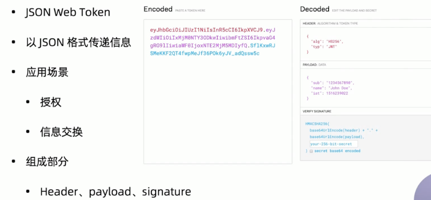
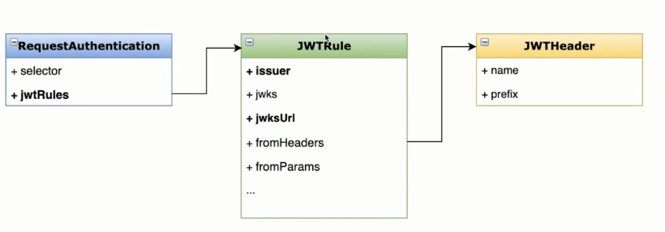
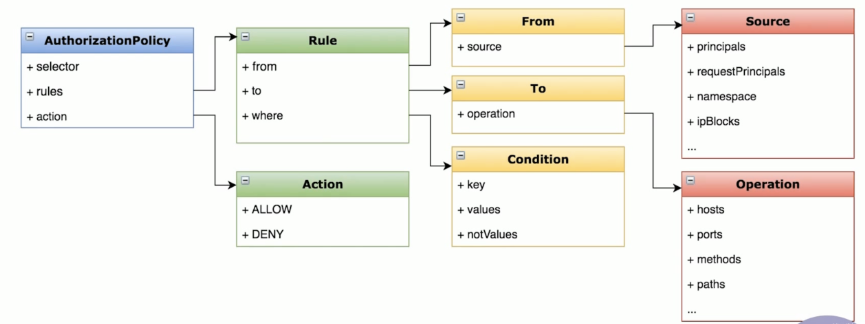

# Istio_JWT认证授权

---

# 理解JWT

JWT（Json Web Token）是一种多方传递可信JSON数据的方案，一个JWT token由.分隔的三部分组成：{Header}.{Payload}.{Signature}，其中Header是Base64编码的JSON数据，包含令牌类型typ、签名算法alg以及密钥ID kid等信息；Payload是需要传递的claims数据，也是Base64编码的JSON数据，其中有些字段是JWT标准已经有了的字段，如：exp、iat、iss、sub和aud等等，也可以根据需求添加自定义字段；Signature是对前两部分的签名，防止数据被篡改，以此确保token信息是可信的，Istio中验签所需的公钥由RequestAuthentication资源的JWKS配置提供。

JWT授权则是对终端用户的访问控制，试想某个内部服务需要管理员才能访问，这时候就需要验证终端用户的角色是否为管理员，可以在JWT claims中带有管理员角色信息，然后在授权策略中对该角色授权。不同的协议的流量在操作to方面有比较多的示范，这里主要在来源from和自定义条件when做示范。



# 配置JWT

1. 请求认证配置



2. 授权策略配置



# 示例

1）创建测试服务

```bash
➜  ~  kubectl create ns testjwt 
namespace/testjwt created

➜  ~  kubectl apply -f <(istioctl kube-inject -f samples/httpbin/httpbin.yaml) -n testjwt  
serviceaccount/httpbin created
service/httpbin created
deployment.apps/httpbin created

➜  ~  kubectl get pods -n testjwt  
NAME                       READY   STATUS    RESTARTS   AGE
httpbin-5cd8878b49-hzwnp   2/2     Running   0          21s

➜  ~  kubectl apply -f <(istioctl kube-inject -f samples/sleep/sleep.yaml) -n testjwt  
serviceaccount/sleep created
service/sleep created
deployment.apps/sleep created

➜  ~  kubectl exec $(kubectl get pod -l app=sleep -n testjwt -o jsonpath={.items..metadata.name}) -c sleep -n testjwt -- curl http://httpbin.testjwt:8000/ip -s -o /dev/null -w "%{http_code}\n"
200
```

2）配置基于JWT的认证策略

```bash
➜  ~  cat demo/jwt/request-authentication.yaml 
apiVersion: "security.istio.io/v1beta1"
kind: "RequestAuthentication"
metadata:
  name: "jwt-example"
  namespace: testjwt
spec:
  selector:
    matchLabels:
      app: httpbin
  jwtRules:
  - issuer: "testing@secure.istio.io"
    jwksUri: "https://raw.githubusercontent.com/malphi/geektime-servicemeth/master/c3-19/jwks.json"

➜  ~  kubectl apply -f demo/jwt/request-authentication.yaml 
requestauthentication.security.istio.io/jwt-example created
```

访问验证，带header访问会返回401，不带返回成功

```bash
kubectl exec $(kubectl get pod -l app=sleep -n testjwt -o jsonpath={.items..metadata.name}) -c sleep -n testjwt -- curl http://httpbin.testjwt:8000/headers  -H "Authorization: Bearer invalidToken" -s -o /dev/null -w "%{http_code}\n" 
401

➜  ~  kubectl exec $(kubectl get pod -l app=sleep -n testjwt -o jsonpath={.items..metadata.name}) -c sleep -n testjwt -- curl http://httpbin.testjwt:8000/headers  -s -o /dev/null -w "%{http_code}\n"   
200
```

3）配置JWT的授权策略

```bash
➜  ~  cat demo/jwt/authorization-policy.yaml  
apiVersion: security.istio.io/v1beta1
kind: AuthorizationPolicy
metadata:
  name: require-jwt
  namespace: testjwt
spec:
  selector:
    matchLabels:
      app: httpbin
  action: ALLOW
  rules:
  - from:
    - source:
        requestPrincipals: ["testing@secure.istio.io/testing@secure.istio.io"]

➜  ~  kubectl apply -f demo/jwt/authorization-policy.yaml   
authorizationpolicy.security.istio.io/require-jwt created
```

4）验证

```bash
➜  ~  TOKEN=$(curl https://raw.githubusercontent.com/malphi/geektime-servicemesh/master/c3-19/demo.jwt) && echo $TOKEN | cut -d '.' -f 2 - | base64 --decode -
  % Total    % Received % Xferd  Average Speed   Time    Time     Time  Current
                                 Dload  Upload   Total   Spent    Left  Speed
100   599  100   599    0     0   1018      0 --:--:-- --:--:-- --:--:--  1020
{"exp":4685989700,"foo":"bar","iat":1532389700,"iss":"testing@secure.istio.io","sub":"testing@secure.istio.io"}%  

 ➜  ~ kubectl exec $(kubectl get pod -l app=sleep -n testjwt -o jsonpath={.items..metadata.name}) -c sleep -n testjwt -- curl "http://httpbin.foo:8000/headers" -s -o /dev/null -H "Authorization: Bearer $TOKEN" -w "%{http_code}\n"
 200
```

# 参考

[Istio的JWT认证授权](https://blog.csdn.net/Micky_Yang/article/details/119713765)