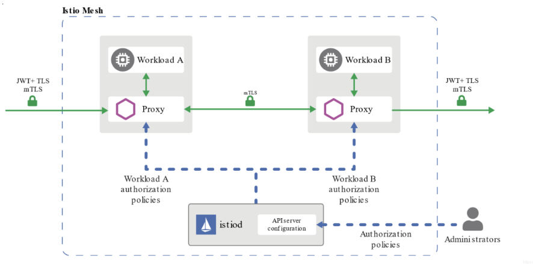
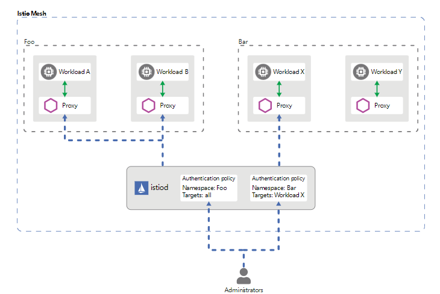
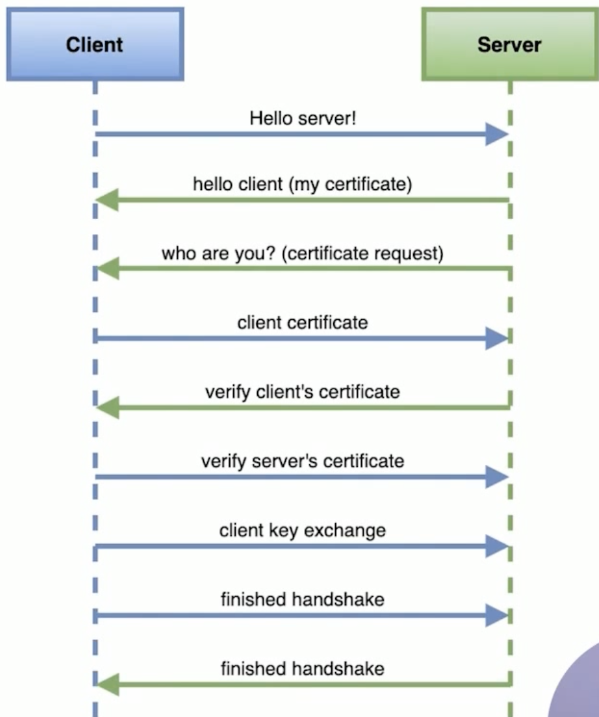

# Istio_mTLS认证

----

# 理解mTLS

TLS在web端使用的非常广泛，针对传输的内容进行加密，能够有效的防止中间人攻击。

双向TLS（Two way TLS/Mutual TLS，简称mTLS）的主要使用场景是在B2B和Server-to-Server的场景中，以支持服务与服务之间的身份认证与授权。

## 认证策略

+	认证策略的分类
	*	对等认证(PeerAuthentication)
	*	请求认证(RequestAuthentication)
+	认证策略范围
	*	网格
	*	命名空间
	*	特定服务
+	优先级:最窄原则



mTLS主要负责服务与服务之间传输层面的认证，具体实现在sidecar中，在具体进行请求时，将经历如下过程：

+	客户端发出的请求将被发送到客户端sidecar
+	客户端sidecar与服务端sidecar开始mTLS握手，在握手的同时，客户端sidecar将进行secure naming check的额外操作，对服务端中的server identity（存储在证书中的SAN）进行检查，以确保其能够运行服务，该操作能够防止一些常见HTTP/TCP的流量劫持攻击。
+	在完成身份认证以及授权之后，客户端和服务端开始建立连接进行通信

## 认证

+	认证方式
+	策略存储
+	支持兼容模式



Istio提供如下几种mTLS身份认证模式，在不同的场景下进行使用：

+	PERMISSIVE：同时支持密文传输和明文传输，则不管是在Istio管理下的Pod还是在Istio管理外的Pod，相互之间的通信畅通无阻。PERMISSIVE模式的主要用途是在用户迁移的过程中，服务与服务之间也仍然能够通信，例如部分workload并未注入sidecar。对于刚接触Istio的人来说是非常友好的，官方也建议在完成迁移之后调整为STRICT模式
+	STRICT：workload只支持密文传输
+	DISABLE：关闭Mutual TLS，从安全的角度而言，官方不建议在没有其他安全措施的情况下使用该模式
+	UNSET：具体的策略将从父级配置中继承（命名空间或网络层面），如果父级没有进行相应的配置，则使用PERMISSIVE模式。

## mTLS工作原理

+	TLS:客户端根据服务端证书验证其身份
+	mTLS:客户端、服务端彼此都验证对方身份




# 配置TLS

1. 查看curl是否支持LibreSSL

```bash
➜  ~ curl --version | grep LibreSSL
curl 7.64.1 (x86_64-apple-darwin20.0) libcurl/7.64.1 (SecureTransport) LibreSSL/2.8.3 zlib/1.2.11 nghttp2/1.41.0
```

2.	生成证书和密钥

```bash
➜  ~ openssl req -x509 -sha256 -nodes -days 365 -newkey rsa:2048 -subj '/O=example Inc./CN=example.com' -keyout example.com.key -out example.com.crt
Generating a 2048 bit RSA private key
............................................................................................................................................................+++
..............+++
writing new private key to 'example.com.key'
-----
➜  ~ ls -lh example.com.crt 
-rw-r--r--  1 jyy  staff   1.0K  8 14 15:41 example.com.crt
➜  ~ ls -lh example.com.key 
-rw-r--r--  1 jyy  staff   1.7K  8 14 15:41 example.com.key
```

```bash
➜  ~ openssl req -out httpbin.example.com.csr -newkey rsa:2048 -nodes -keyout httpbin.example.com.key -subj "/CN=httpbin.example.com/O=httpbin organization"
Generating a 2048 bit RSA private key
...........................................+++
........+++
writing new private key to 'httpbin.example.com.key'
-----
➜  ~ 
➜  ~ ls -lh httpbin.example.com.key 
-rw-r--r--  1 jyy  staff   1.7K  8 14 15:43 httpbin.example.com.key
➜  ~ ls -lh httpbin.example.com.csr 
-rw-r--r--  1 jyy  staff   948B  8 14 15:43 httpbin.example.com.csr
```

```bash
➜  ~ openssl x509 -req -days 365 -CA example.com.crt -CAkey example.com.key -set_serial 0 -in httpbin.example.com.csr -out httpbin.example.com.crt
Signature ok
subject=/CN=httpbin.example.com/O=httpbin organization
Getting CA Private Key

➜  ~ ls -l httpbin.example.com.crt 
-rw-r--r--  1 jyy  staff  1054  8 14 15:43 httpbin.example.com.crt
```

3. 创建httpbin服务的Deployment和Service、Gateway

```bash
➜  ~ cat httpbin-service.yaml      
apiVersion: v1
kind: Service
metadata:
  name: httpbin
  labels:
    app: httpbin
spec:
  ports:
  - name: http
    port: 8000
  selector:
    app: httpbin
➜  ~ kubectl apply -f httpbin-service.yaml 
service/httpbin configured
```


```bash
➜  ~ cat httpbin-deployment.yaml 
apiVersion: apps/v1
kind: Deployment
metadata:
  name: httpbin
spec:
  replicas: 1
  selector: 
    matchLabels:
      app: httpbin
      version: v1
  template:
    metadata:
      labels:
        app: httpbin
        version: v1
    spec:
      containers:
      - image: docker.io/citizenstig/httpbin
        imagePullPolicy: IfNotPresent
        name: httpbin
        ports:
        - containerPort: 8000
➜  ~  kubectl apply -f httpbin-deployment.yaml 
deployment.apps/httpbin configured
```

4. 创建证书secret

```bash
➜  ~  kubectl create  -n istio-system secret generic httpbin-credential --from-file=key=httpbin.example.com.key --from-file=cert=httpbin.example.com.crt
secret/httpbin-credential created
➜  ~ kubectl describe secret httpbin-credential -n istio-system
Name:         httpbin-credential
Namespace:    istio-system
Labels:       <none>
Annotations:  <none>

Type:  Opaque

Data
====
cert:  1054 bytes
key:   1704 bytes
```

5. 创建挂载了证书的gateway

```bash
cat httpbin-gateway.yaml                       
apiVersion: networking.istio.io/v1alpha3
kind: Gateway
metadata:
  name: mygateway
spec:
  selector:
    istio: ingressgateway
  servers:
  - port:
      number: 443
      name: https
      protocol: HTTPS
    tls:
      mode: SIMPLE
      credentialName: httpbin-credential
    hosts:
    - httpbin.example.com
➜  ~  kubectl apply -f httpbin-gateway.yaml    
gateway.networking.istio.io/mygateway created
```

6. 创建虚拟服务

```bash
➜  ~  cat httpbin-vs.yaml 
apiVersion: networking.istio.io/v1alpha3
kind: VirtualService
metadata: 
  name: httpbin
spec: 
  hosts:
  - "httpbin.example.com"
  gateways:
  - mygateway
  http:
  - match:
    - uri:
        prefix: /status
    - uri:
        prefix: /delay
    route:
    - destination:
        port:
          number: 8000
        host: httpbin
➜  ~  kubectl apply -f httpbin-vs.yaml      
virtualservice.networking.istio.io/httpbin created
```

7. 访问测试

```bash
➜  ~  curl -v -HHost:httpbin.example.com --resolve httpbin.example.com:443:127.0.0.1 --cacert example.com.crt https://httpbin.example.com:443/status/418
* Added httpbin.example.com:443:127.0.0.1 to DNS cache
* Hostname httpbin.example.com was found in DNS cache
*   Trying 127.0.0.1...
* TCP_NODELAY set
* Connected to httpbin.example.com (127.0.0.1) port 443 (#0)
* ALPN, offering h2
* ALPN, offering http/1.1
* successfully set certificate verify locations:
*   CAfile: example.com.crt
  CApath: none
* TLSv1.2 (OUT), TLS handshake, Client hello (1):
* TLSv1.2 (IN), TLS handshake, Server hello (2):
* TLSv1.2 (IN), TLS handshake, Certificate (11):
* TLSv1.2 (IN), TLS handshake, Server key exchange (12):
* TLSv1.2 (IN), TLS handshake, Server finished (14):
* TLSv1.2 (OUT), TLS handshake, Client key exchange (16):
* TLSv1.2 (OUT), TLS change cipher, Change cipher spec (1):
* TLSv1.2 (OUT), TLS handshake, Finished (20):
* TLSv1.2 (IN), TLS change cipher, Change cipher spec (1):
* TLSv1.2 (IN), TLS handshake, Finished (20):
* SSL connection using TLSv1.2 / ECDHE-RSA-CHACHA20-POLY1305
* ALPN, server accepted to use h2
* Server certificate:
*  subject: CN=httpbin.example.com; O=httpbin organization
*  start date: Jun 29 01:48:32 2021 GMT
*  expire date: Jun 29 01:48:32 2022 GMT
*  common name: httpbin.example.com (matched)
*  issuer: O=example Inc.; CN=example.com
*  SSL certificate verify ok.
* Using HTTP2, server supports multi-use
* Connection state changed (HTTP/2 confirmed)
* Copying HTTP/2 data in stream buffer to connection buffer after upgrade: len=0
* Using Stream ID: 1 (easy handle 0x7fe86c00c800)
> GET /status/418 HTTP/2
> Host:httpbin.example.com
> User-Agent: curl/7.64.1
> Accept: */*
> 
* Connection state changed (MAX_CONCURRENT_STREAMS == 2147483647)!
< HTTP/2 418 
< server: istio-envoy
< date: Sat, 14 Aug 2021 07:52:11 GMT
< access-control-allow-credentials: true
< x-more-info: http://tools.ietf.org/html/rfc2324
< access-control-allow-origin: *
< content-length: 135
< x-envoy-upstream-service-time: 104
< 

    -=[ teapot ]=-

       _...._
     .'  _ _ `.
    | ."` ^ `". _,
    \_;`"---"`|//
      |       ;/
      \_     _/
        `"""`
* Connection #0 to host httpbin.example.com left intact
* Closing connection 0
```

# 配置mTLS

1. 创建testauth名称空间，并创建sleep服务

```bash
➜  ~  kubectl create ns testauth 
namespace/testauth created
➜  ~  kubectl apply -f ../../samples/sleep/sleep.yaml -n testauth            
serviceaccount/sleep created
service/sleep created
deployment.apps/sleep created
➜  ~  kubectl get pods -n testauth 
NAME                     READY   STATUS    RESTARTS   AGE
sleep-557747455f-47zh7   1/1     Running   0          21s
➜  ~  kubectl exec -it sleep-557747455f-47zh7 -n testauth -c sleep -- curl http://httpbin.default:8000/ip 
{
  "origin": "127.0.0.6"
}
```

2. 添加对等认证策略

```bash
➜  ~  cat peerauth.yaml  
apiVersion: "security.istio.io/v1beta1"
kind: "PeerAuthentication"
metadata:
  name: "default"
  namespace: "default"
spec:
  mtls:
    mode: PERMISSIVE

➜  ~  kubectl apply -f peerauth.yaml                                                                     
peerauthentication.security.istio.io/default created
➜  ~ kubectl exec -it sleep-557747455f-47zh7 -n testauth -c sleep -- curl http://httpbin.default:8000/ip
{
  "origin": "127.0.0.6"
}
```

```bash
➜  ~  cat peerauth-strict.yaml                                                                           
apiVersion: "security.istio.io/v1beta1"
kind: "PeerAuthentication"
metadata:
  name: "default"
  namespace: "default"
spec:
  mtls:
    mode: STRICT 
➜  ~  kubectl exec -it sleep-557747455f-47zh7 -n testauth -c sleep -- curl http://httpbin.default:8000/ip
{
  "origin": "127.0.0.6"
}
```

3. 添加注入功能，并再次访问测试

```bash
➜  ~  kubectl apply -f <(/Users/jyy/istio-1.10.1/bin/istioctl kube-inject -f ../../samples/sleep/sleep.yaml) -n testauth 
serviceaccount/sleep unchanged
service/sleep unchanged
deployment.apps/sleep configured

➜  ~  kubectl exec -it sleep-557747455f-47zh7 -n testauth -c sleep -- curl http://httpbin.default:8000/ip
{
  "origin": "127.0.0.6"
}
```

4. 上面的实验仅仅是针对的default名称空间的认证策略，针对全局的需要执行以下文件

```bash
➜  ~  cat peerauth-strict-global.yaml 
apiVersion: "security.istio.io/v1beta1"
kind: "PeerAuthentication"
metadata:
  name: "default"
spec:
  mtls:
    mode: STRICT 
```

