# Istio_分布式追踪Jaeger

----

# 认识分布式追踪

相比传统的"巨石"应用，微服务的一个主要变化是将应用中的不同模块拆分为了独立的进程。在微服务架构下，原来进程内的方法调用成为了跨进程的远程方法调用。相对于单一进程内的方法调用而言，跨进程调用的调试和故障分析是非常困难的，难以适应传统的代码调试程序或者日志打印来对分布式的调用过程进行查看和分析。

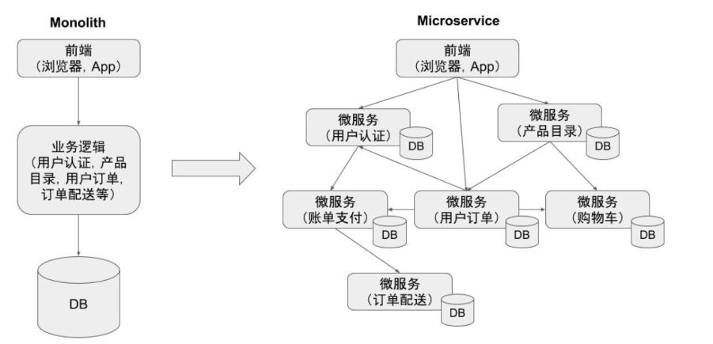

如上图右边所示，微服务架构中系统各个微服务之间存在复杂的调用关系。一个来自客户端的请求在其业务处理中经过了多个微服务进程。我们如果想要对该请求的端到端调用过程进行完整的分析，则必须将该请求经过的所有进程的相关信息都收集起来并关联在一起，这就是"分布式追踪"。

# 认识Jaeger

Jaeger是由Uber开源的分布式追踪系统，它采用Go语言编写，主要借鉴了Google Dapper论文和Zipkin的设计，兼容OpenTracing以及Zipkin追踪格式，目前已经成为CNCF基金会的开源项目。

Jaeger的相关术语：

Span：是Jaeger的逻辑工作单元，具有请求名称、请求开始时间、请求持续时间。Span会被嵌套并排序以展示服务间的关系

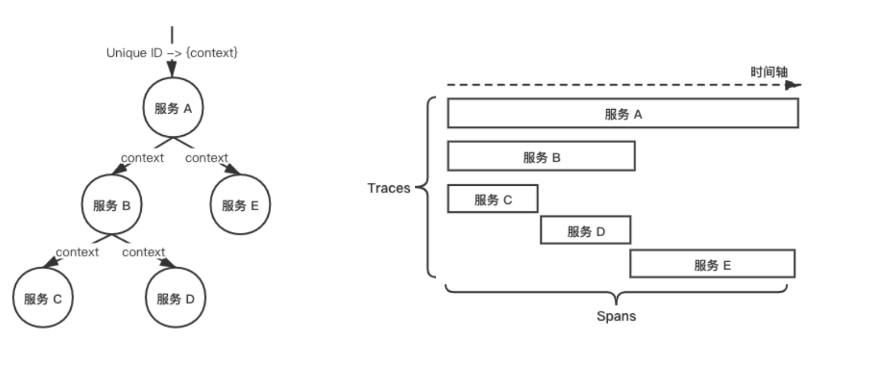

Trace：是Jaeger在微服务系统中记录的完整的请求执行过程，并显示为Trace，Trace是系统的数据/执行路径，一个端到端的Trace由一个或者多个Span组成。

Envoy原生支持Jaeger，追踪所需x-b3开头的Header和x-request-id在不同的服务之间由业务逻辑进行传递，并由Envoy上报给Jaeger，最终Jaeger生成完整的追踪信息。
　　
在Istio中，Envoy和Jaeger的关系如下：

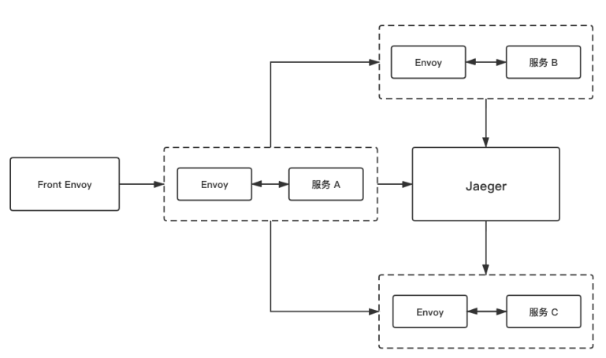

图中Front Envoy是指第一个接收到请求的Envoy Sidecar，它会负责创建Root Span并追加到请求Header内，请求到达不同的服务时，Envoy Sidecar会将追踪信息进行上报处理。

Jaeger的内部组件与ELK日志系统架构有一定的相似性：

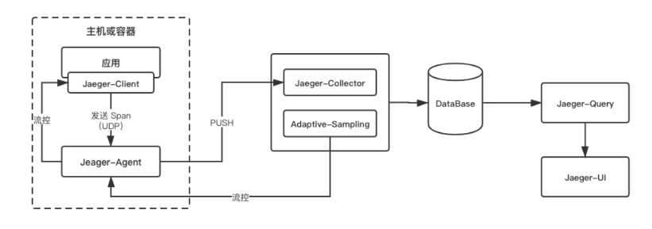

Jaeger主要由以下几个组件构成：

+	Client：Jaeger客户端，是OpenTracing API的具体语言实现，可以为各种开源框架提供分布式追踪工具。
+	Agent：监听在UDP端口的守护进程，以DaemonSet的方式部署在宿主机或以Sidecar方式注入容器内，屏蔽了Client和Collector之间的细节以及服务发现。用于接收Client发送过来的追踪数据，并将数据批量发送至Collector。
+	Collector：用来接收Agent发送的数据，验证追踪数据，并建立索引，最后异步地写入到后端存储，Collector是无状态的。
+	DataBase：后端存储组件，支持内存、Cassandra、Elasticsearch、Kafka的存储方式
+	Query：用于接收查询请求，从数据库检索并通过UI展示
+	UI：使用React编写，用于UI界面展示

# 运行Jaeger

1）运行Jaeger

```
$ istioctl dashboard jaeger       
http://localhost:16686
```

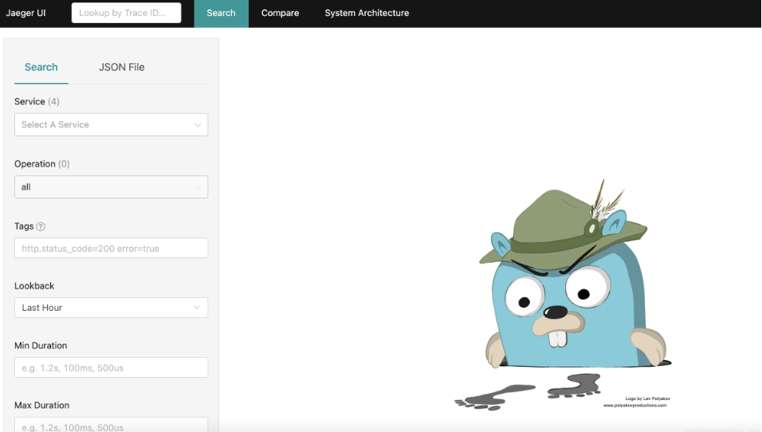

2）查看链路跟踪数据

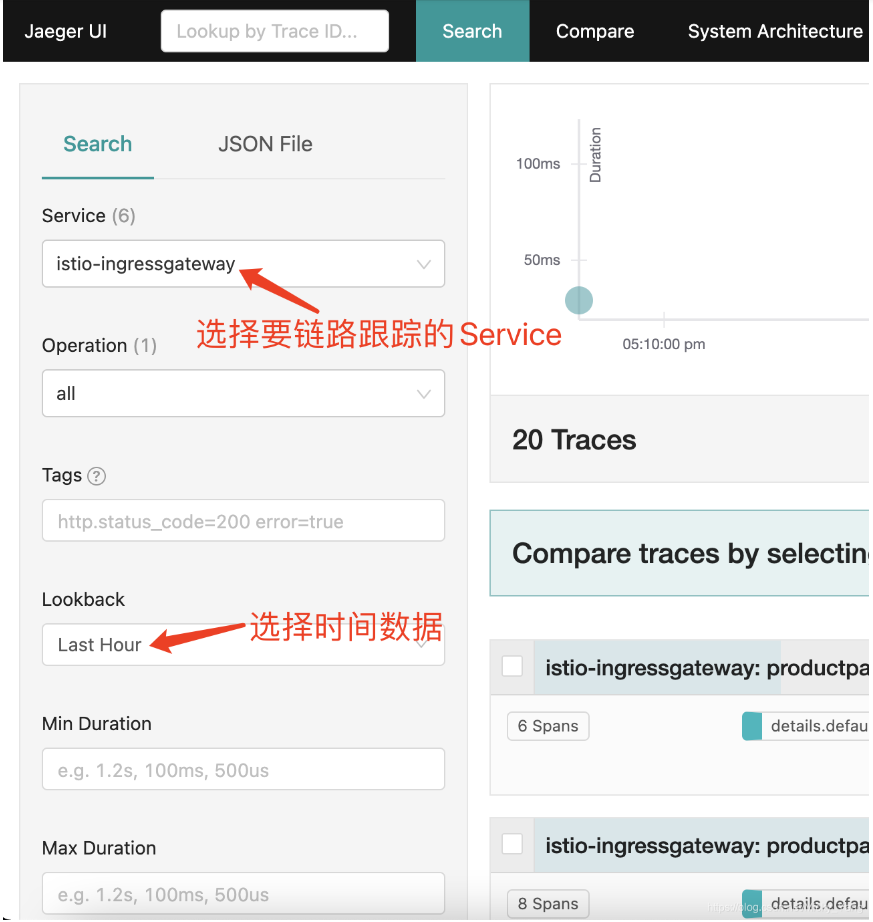

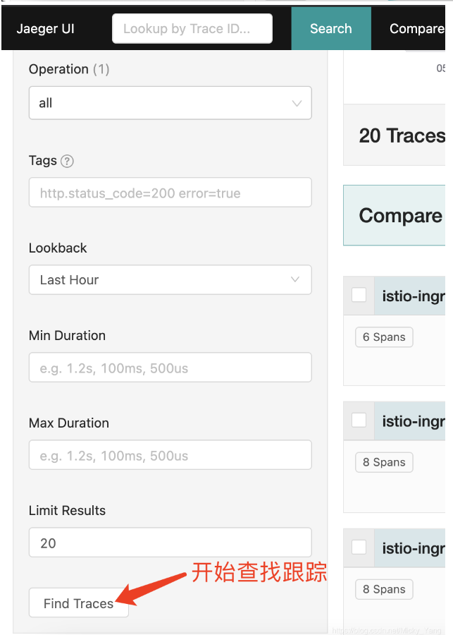

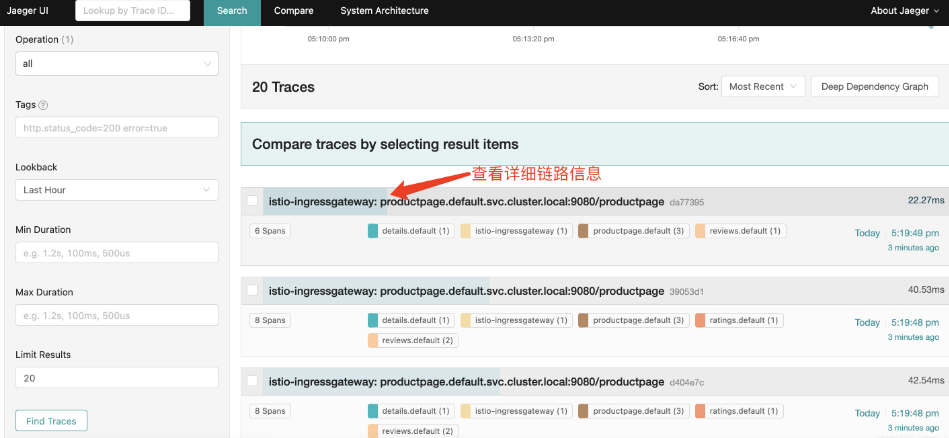

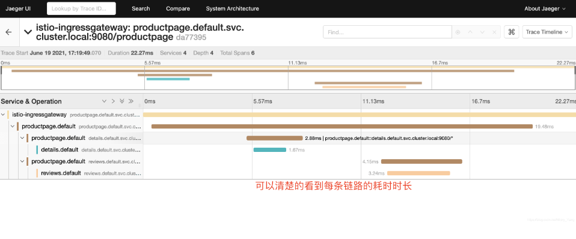

3）查看服务依赖

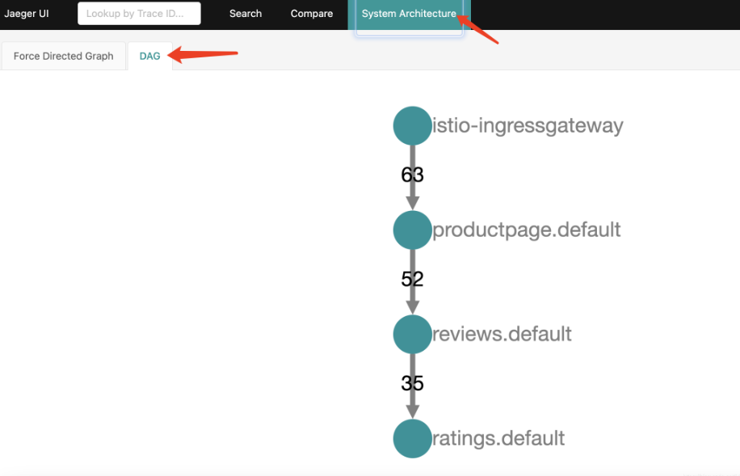

4）对比不同请求的差异

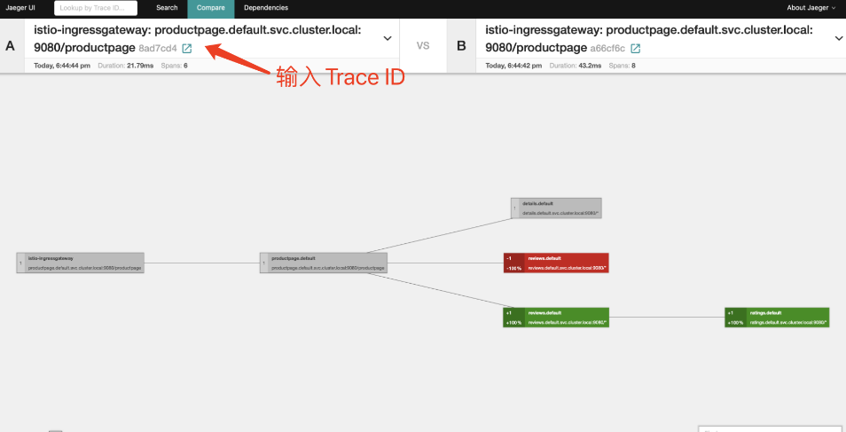